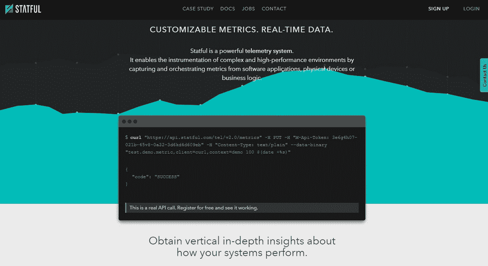
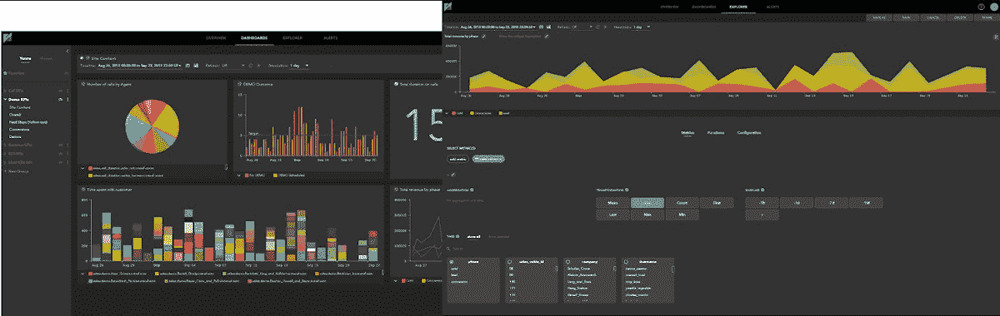
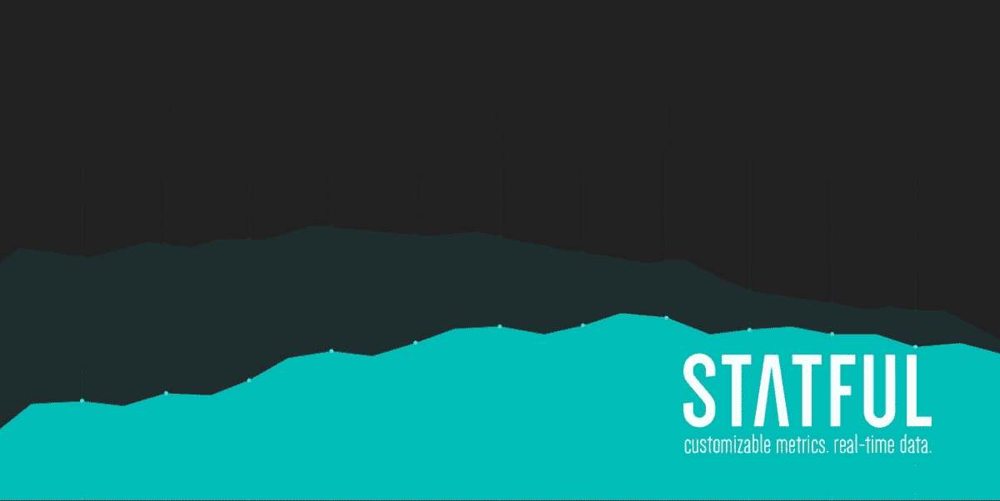

# 我们如何通过为自己制造产品从问题走向产品

> 原文：<https://www.indiehackers.com/interview/how-we-went-from-problem-to-product-by-building-for-ourselves-c4947e4c43>

## 你好！你的背景是什么，你在做什么？

嘿！我叫 Hugo Valente，自 2017 年 12 月以来，我一直是一家名为 [Statful](https://statful.com/) 的初创公司的产品负责人+。我开玩笑地加上了“+”，因为任何在小型创业团队工作过的人都知道，你的职责总是在头衔之外(管理日常运营、协调营销、售前和销售等任务)。在我所做的一切中，我的目标是提高品牌知名度，将那些不监控指标的人与我们独特的工具联系起来。

我的专业背景与创业生态系统没有直接联系。在加入 Statful 之前，我曾在两家为零售商实施 Oracle 企业级解决方案的公司工作。在这条道路上，我从一名初级开发人员/分析师做起，在 10 多年的时间里，我最终在大型项目的解决方案架构/项目管理中担任了一个角色。这些经历让我获得了对我的工作至关重要的技术和软技能。

Statful 是一个定制的监控平台，用于跟踪任何类型的指标。它从一个集中的角度为您提供业务、应用和系统指标的实时数据。它赋予你工具，无论你想要什么。它是为那些希望以简单的方式灵活和强大地装备他们的系统的开发人员、操作人员和业务团队准备的。

在没有对营销或销售进行任何实际投资的情况下，在没有外部资金的情况下，我们成功地让四个客户——来自完全不同的业务领域——达到了大约 22k 美元的 MRR。

 

## 是什么促使你开始使用 Statful？

当建立 Statful 的想法出现时，我不在。Statful 是在 [Mindera 的生态系统](http://www.mindera.com)(一家位于葡萄牙波尔图的技术服务公司)中诞生的产品，他们的目标是冒险创造产品，并且需要一个监控工具来为开发团队提供可见性。本质上，它可以向开发者和企业传达他们正在开发的应用程序背后发生的事情。

我们对自己构建这个解决方案有些犹豫:既然市场上已经有一些工具了，为什么还要创建一个工具呢？我们发现，可用的工具要么太贵，而且充满了预先构建的自动化指标收集器/代理(这可能是好的，也可能是坏的)，要么是开源的，这将需要专门的工作来部署、维护和扩展。我们希望有一种工具，它能给我们带来灵活性和强大的功能，以简单的方式检测我们真正想要监控的内容。

开发一个你喜欢的产品需要很长时间，但是它有助于了解你的受众。

TweetShare

该产品于 2015 年 8 月推出，当时，除了 Mindera 的内部开发团队需要之外，已经有一个对该工具感兴趣的客户。第一个 MVP 并不吸引人，它是通过将一些开源组件与一些已开发的组件“粘合”起来以验证它的想法和价值而构建的。

该产品是由一个不到 10 人的团队在葡萄牙波尔图租来的办公室里开发和维护的。

 

我们的核心开发团队都“遭受”了同样的问题，我们试图围绕这个问题开发一个产品，这在开发过程中非常有帮助。有了基本上是我们的目标人口统计构建，MVP 就知道应该包括哪些重要的特性。

## 构建最初的产品需要什么？

我们想为大众市场制造产品，而不是单一客户的特定产品。自我们首次部署以来，我们一直在关注竞争对手并探索利基市场，以保持我们产品的吸引力，并确保我们不会落后于大多数竞争对手。在我们发布 MVP 一年后，我们推出了测试版。自从测试版发布以来，我们已经增加了三个客户，并通过免费计划开放了我们的产品，目前已有 10 多个注册用户。

我们的致命弱点是产品设计。我们最初的发布只有一个专门的设计师。在那之后，它真的取决于我们的两个关键前端开发人员来扩展设计，同时管理其他职责，他们做得很好！但是很难跟上推出新功能、维护当前功能以及确保流畅、一致的用户体验。令人欣慰的是，我们现在已经确定了一个设计师来专门关注我们的设计需求，并且它已经在产品的外观和感觉上产生了很大的变化。

这是我们现在看到的更大趋势的一个例子，即随着我们的产品增长和变化，我们的内部需求也在增长和变化，如果我们要取得成功，我们需要注意并响应这一趋势。虽然每个人都在努力工作，但我们与最初的核心团队达到了一个门槛。随着我们继续发展我们的产品，我们也必须继续发展我们的团队和他们带来的技能范围。

开发该产品的所有资金都来自 Mindera。该资金专门用于支付团队成本和基础设施以维持产品。我们确实对技术堆栈的需求感到满意，但对销售和营销却不太满意，因为我们在该领域没有实际经验，而且预算太紧张，无法获得外部服务。我们的大多数新客户都与 Mindera 有过一些协同共享。

关于技术，我们的产品托管在云中，这确保了我们的客户不需要担心基础设施需求，底层的关键部分是时序数据库。这使我们能够兑现我们的实时数据承诺，并收集大量数据。我们还连接到第三方服务以提供警报通知。所有其他组件，从后端到前端，都是我们在应用软件开发最佳实践的同时，基于最先进的技术开发的。

 

## 你是如何吸引用户并发展壮大的？

如前所述，启动的路径并不简单，但我们做到了，并且有一个客户端支持启动。我们的情况并不糟糕，但我们确实需要开始获得牵引力。

我们首先向现有客户推销产品。利用我们的网络获得首批客户是获得有价值反馈的简单方法，但我们知道，如果我们要偏离“单点产品”的理念，吸引更大的市场，我们需要扩大我们的外联渠道。我们在社交媒体上发布了 Statful，但没有得到我们希望的回应。虽然我们获得了一些订阅注册，但这并没有给我们带来任何新客户。

我们确信，一旦人们尝到了 Statful 的厉害，就很容易吸引他们。但是我们意识到，我们需要一些外部干预来润滑车轮，所以我们雇佣了一家小公司来帮助我们建立一个社交媒体战略，获得曝光率，并传播消息。

为了配合我们的社交媒体战略，我们开发了一个免费计划，让用户感受一下这个平台，并有望进入专业计划。这让我们得到了一些订阅，但没有什么实质性的。我们聘请的营销团队帮助我们制作了一些网络研讨会，这确实引发了一些参与，但我们努力在一集和下一集之间留住用户。

在这一点上，我们正在考虑后退一步，重新评估并专注于开发好的内容，加强我们的文档细节，并建立初学者工具包/加速器来帮助首次用户。这可能不会显著影响新用户的流入，但希望它能帮助我们留住现有用户，并鼓励他们更有组织地传播信息。

其他人在采访中也提到，利用 Product Hunt、AngelList 和独立黑客等平台确实有所帮助。

## 你的商业模式是什么，你是如何增加收入的？

我们有每月/每年定期订阅模式，这是我们的专业计划。每个客户的定价是基于他们使用产品的多少，这是由一个月内每秒收到的平均数据点来衡量的。我们的门槛从每月 50 美元开始，随着使用量的增加而增加。我们目前有来自四个客户的$22k 的 MRR。在我们找到更好的方式获得市场关注或曝光之前，我们只能通过 Mindera 的客户群来寻找客户。

产品一推出，我们就开始增加收入，因为我们已经有了一个客户。如前所述，我们通过与 Mindera 合作来挖掘他们现有的客户群，从而获得了后续客户。

我们从一个相当复杂、令人困惑的定价模型开始。最初，使用情况由两个变量跟踪:摄入率和存储占用。我们开始意识到这种方法不是最佳的，通过几次迭代对模型进行微调，最终采用了单变量跟踪模型。

在发布定价模型之前，仔细考虑它是很重要的。对你的定价结构背后的概念和数学进行验证和运行多次模拟，并确保你定义的任何模型不仅适用于你的当前情况，而且适用于你(希望)继续增长和扩大的产品和业务的未来迭代。

我们目前的支出基本上是:团队、基础设施和一些最小的营销投资，以尝试验证一些方法。我们还没有处于一个舒适的位置，这是因为我们还没有找到吸引潜在客户注意力的最佳方式。

| 年 | 收入 |
| --- | --- |
| 2016 年 1 月 | 7500 |
| 2017 年 1 月 | 12000 |
| 2018 年 1 月 | 15000 |
| 18 年 11 月 | 22000 |

## 你未来的目标是什么？

我们正在积极探索市场中可能的利基市场，我们希望各种规模的公司都能使用我们强大的监控工具。除了创建免费计划来鼓励客户试用产品，我们还推出了一个专为初创公司设计的计划提案。

为了确保我们不断为客户带来附加值，我们还希望从传统的监控和警报方法转变为提供商业智能。希望 Statful 不仅能帮助你掌控自己的事业，还能让你有机会模拟预测你的未来。请务必关注我们，了解这方面的更多新闻！

摆在面前的最大障碍是团队能力的限制。我们不断尝试在交付特性 X 和关注客户需求和/或我们需要解决的技术债务或架构问题之间进行优先排序，特性 X 将推动我们实现主要目标。尽管面临这些挑战，我们有信心走向成功。我们知道我们已经获得了一项伟大的技术，并努力始终牢记我们的最终目标，知道有些道路颠簸和弯路是无法避免的。

失败总是有可能的，但不要因此而害怕。每一次失败都是一次学习和成长的机会，所以永远不会彻底失败。

TweetShare

今年，我们还决定开始探索外部融资的可能性。这个决定不是轻易做出的，我们想确保我们已经尽了最大努力，但是时间是最重要的。考虑到我们工作的局限性和我们对 Statful 的长期目标，我们确信这是我们需要遵循的道路。

在投资方面，我们正在寻找两种类型的投资组合。走向市场投资——因为我们了解我们的技术，所以我们正在寻找一个能够加强我们的销售和营销战略的投资者。以及工程成本投资，以支持团队成长、市场价值功能(如移动、人工智能)的开发，以及基础设施开发，以跟上客户钱包的增长。

## 你面临的最大挑战和克服的障碍是什么？如果你必须重新开始，你会做什么不同的事？

当我们第一次构建 Statful 时，我们觉得拥有一个工具可以用来监控我们想要的任何东西，无论是开发过程还是业务本身，这一想法赋予了我们力量。我们想和其他人分享这种“力量”。然而，我们没有预测到人们可能实际上不知道他们想要测量什么。这可能就是为什么它很难进入市场的原因。我们的一些订阅会加入，然后永远不会回到平台。也许这不适合他们，或者也许他们决定他们需要开始测量一些东西，注册了，然后意识到他们不太确定他们想看什么或者不知所措。

这就是为什么我们认为给我们的工具配备初学者工具包或加速器会很好。我们希望帮助用户感受到使用 Statful 可以完成什么，同时保持添加自定义指标的灵活性，以便他们长期坚持下去。

这里要学习的另一个教训是，虽然开发你喜欢的产品确实需要很长时间，但了解你的受众是有帮助的。通过押注一小部分客户的需求来构建产品，可能会导致反馈不准确和产品验证不佳。如果我们有一个潜在的测试用户社区来直接提高验证，这将会有所帮助。

 

## 有没有发现什么特别有帮助或者有优势的？

最大的优势是我们为自己打造了产品。为你自己的需求开发一个产品创造了一个巨大的动力去创造最高质量的东西。当你知道你手上有真正好的东西时，那种兴奋的冲动是一个巨大的动力，让你把它拿到市场上并与他人分享。我们对分享的兴奋和渴望驱使我们带 Statful 参加科技活动，如 [TechDay Los Angeles](https://techdayhq.com/los-angeles) 和 [Web Summit](https://websummit.com/) ，在那里我们能够与来自不同背景的人交谈，他们表达了对产品的兴趣，并给了我们宝贵的反馈。我们在博客上写下了我们对这些事件的一些[反思](https://medium.com/@StatfulHQ/techday-la-reflections-1a08df0df827)和[收获](https://medium.com/@StatfulHQ/web-summit-2018-lisbon-our-recap-bff4e8a05d8e)。

将 Mindera 作为我们的“老大哥”公司也是一个很大的帮助，因为他们总是可以给我们提供建议，分享见解，有时甚至帮助我们解决棘手问题。

## 对于刚刚起步的独立黑客，你有什么建议？

毫无疑问，构建一个伟大的产品是一项具有挑战性的工作。我们自己仍在经历这一旅程，并学习如何应对成长的烦恼。我们每天都坚持的精神是:尝试。承担风险，每天做一点点事情，不要害怕和朋友分享，然后给你目标市场的人。失败总是有可能的，但不要因此而害怕。每一次失败都是一次学习和成长的机会，所以永远不会彻底失败。

还有，真的要注重验证！无论是为了一个新功能，还是为了建立你的商业模式，尽可能多地获得反馈。你可以在互联网上找到很多资源，从打开你的 MVP 或产品到 beta 测试人员，再到你可以分享你正在构建的东西的门户或列表。

我推荐两本书:

*   [Eric Ries](https://smile.amazon.com/Lean-Startup-Entrepreneurs-Continuous-Innovation/dp/0670921602/ref=tmm_pap_swatch_0?_encoding=UTF8&qid=1549575579&sr=8-2)撰写的《精益创业:今天的企业家如何利用持续创新创造彻底成功的企业,让你大开眼界，并让你专注于真正重要的事情:不断测试、适应和调整，以确保你保持创新。

*   Geoffrey A. Moore 的《跨越鸿沟:向主流客户营销和销售高科技产品》是任何试图了解如何营销高科技产品的企业家的必读之作。

## 我们可以去哪里了解更多？

我们的平台在[www.statful.com](https://www.statful.com/)可用。如果你想尝试一下 Statful，可以在那里订阅一个免费计划，并在 [GitHub](https://github.com/statful) 上查看我们不断增长的社区。

我们也通过常规渠道出现在社交媒体上，如 T4 的脸书、LinkedIn 和 Twitter。关于我们的见解和内容，请加入我们的 [Medium](https://medium.com/@StatfulHQ) 和 [Youtube](https://www.youtube.com/channel/UCXgkCP_rU3f3SE8NiTRw0_Q) 。

感谢您能走到这一步，我们希望收到您的来信！请在下面留下您的评论或问题，我们会尽快回复您:)

另外，感谢独立黑客的采访！

——[<picture id="ember8167932" class="user-avatar ember-view user-link__avatar"></picture>雨果](/StatfulHQ?id=psplrYOBuYUnZ1mCKhLJ2LhGD8B2)，Statful 创始人

## 想像 Statful 一样建立自己的事业？

你应该加入[独立黑客社区](/)！🤗

我们是几千名创始人，互相帮助建立有利可图的业务和副业。来分享你正在做的事情，并从你的同事那里获得反馈。

还没准备好开始使用你的产品吗？没问题。这个社区是一个认识人、学习和实践的好地方。随意[随便浏览](/)！

—[<picture id="ember8167937" class="user-avatar ember-view user-link__avatar"></picture>考特兰艾伦](/csallen?id=ibTLPyjwVebnZjMGKvz6ztarnuV2)，独立黑客创始人

18votes