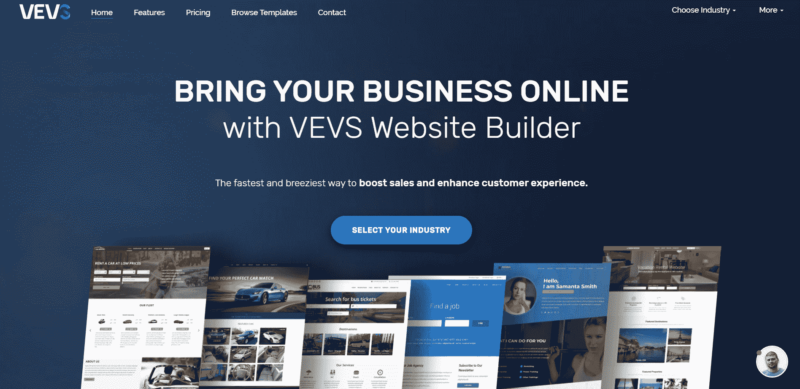
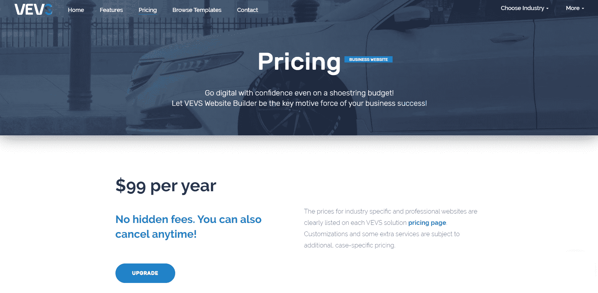
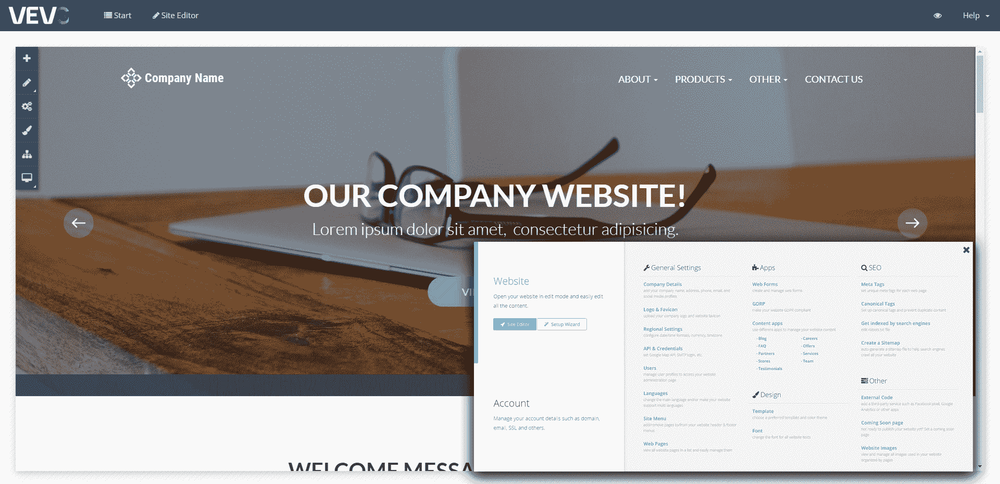

# 我们如何通过服务小众市场来超越大竞争对手

> 原文：<https://www.indiehackers.com/interview/how-were-gaining-on-big-competitors-by-serving-small-niches-dc43b12cf1>

## 你好！你的背景是什么，你在做什么？

嗨，我的名字是韦塞林斯托伊洛夫，我有很长的历史，建设网络应用程序。12 年前，我与他人共同创立了 PHPJabbers.com，从那时起，我和我的团队已经将我们的应用销售给了来自世界各地的 40，000 多家客户，创造了超过 1，000 万美元的收入。

最近，我一直在 VEVS.com 的[工作——一个电子商务网站建设商。VEVS 网站的设计和开发旨在满足多个行业领域的需求，并配备了在线开展业务的相关软件，如租赁软件、预约系统、分类列表等。](https://www.vevs.com/)

我们花了四年时间才走到今天。在最初的几年里，我们为 CMS 创建了三个不同的主要版本，在过去的 12 个月里，我们设法最终提供了一个设计良好、可扩展且用户友好的产品。很高兴看到客户数量每周都在增加，我们得到了很多积极的反馈。

## 是什么促使你开始使用 VEVS？

在积累了 10 多年的 web 应用程序开发经验后，我们有机会与成千上万的 web 开发人员和小型设计机构合作，他们为客户建立了网站。

 

我们已经看到我们的网络应用集成到各种不同的网站中，但我经常不喜欢这些网站本身。它们要么没有反应，没有吸引力，要么缺乏关键功能。这让我们认为，我们应该向客户提供更多的东西，而不仅仅是 web 应用程序。这就是我们产生创建站点构建器想法的地方。

当然，网站建设者的市场竞争非常激烈。有许多大玩家在广告上花费数百万。为了与他们竞争，我们不能只生产好产品，我们必须提供从 A 到 z 的完整服务。

最大的挑战是建立一个可扩展的产品，我们可以很容易地适应每个行业。使用 PHPJabbers，我们有 75 个不同的 web 应用程序的组合，管理所有这些应用程序变得很困难。这一次，我们必须仔细考虑如何构建 VEVS 平台的核心。前三年基本上是试错，随之而来的是大量的内部成长和对未来应该如何构建事物的洞察力。

## 构建最初的产品需要什么？

我们有一长串我们知道应该提供的东西，但我们也知道我们不能从一开始就做所有的事情。我们不得不在完美的产品和制造它的资源之间做出妥协。不幸的是，资源稀缺。我们最初的团队由六个人组成:后端和前端开发人员、产品负责人、内容作者、平面设计师和 QA。

为了竞争…我们不能只生产好产品，我们必须提供从 A 到 z 的完整服务。

TweetShare

从开始到结束，我们花了四到五个月的时间来开发框架，推出我们的网站，并推出前五个垂直市场解决方案。我们使用自己的 PHP 脚本和框架作为 VEVS 产品的基础。从那时起，我们就没有停止开发该平台及其所有产品。

VEVS 一开始不是做网站建设的，因为当时我们的 CMS 相当有限。相反，它最初是一个面向垂直行业的网站解决方案。我们的核心理念是服务于没有现成网站或者定制网站太贵的电子商务行业。因此，我们专注于特定行业的“业务软件”，并将其构建到我们的每个解决方案中，让市场来验证我们的想法。结果很有希望，我们决定更进一步。

从那以后，VEVS 就演变成了今天的网站建设平台。我们的功能路线图主要由客户的反馈驱动，我们从根本上改进了 CMS，并在后端 UI 中添加了更多的功能。截至今天，我们已经推出了 16 个垂直市场解决方案和一个通用商业网站。

## 你是如何吸引用户和发展 vev 的？

我们在 2015 年 12 月推出，并在同一个月获得了我们的前两个客户。我们吸引访客和线索的第一步是在 PHPJabbers.com 做广告。我们还向我们的老顾客介绍了这项新服务。尽管 vev 和 PHPJabbers 提供不同的服务，但它们仍然属于相同的行业领域。这为我们提供了急需的 SEO 提升，并帮助我们滚雪球式地获得客户。

我们还做了以下工作:

*   冰冷的电子邮件:我们研究并找到网站质量差的公司，给他们发送大量电子邮件，指出我们如何改善他们的形象，帮助他们发展在线业务。我们甚至用他们当前站点的公司数据创建了试用安装。
*   电子邮件营销:我们向免费试用过的人发送时事通讯和宣传材料。这包括电子邮件跟进、关于我们产品更新的新闻、他们可能感兴趣的功能以及一般提示和知识文章。
*   产品列表网站:我们在列表和评论网站上列出了 vev。我们还在一些小众网站中列出了我们的垂直解决方案。

这些年来，我们所有营销活动(除了 SEO)的强度一直在波动，有些活动变得比其他活动更重要。资源有限意味着我们不能一直做所有的事情。这更像是一个“测试和评估”过程，在这个过程中，我们只重复提供可行和一致结果的活动。

我很幸运地说，这些年来，我们一直依赖两个关键因素:快乐的客户和口碑。在我们创造的 1000 万美元收入中，我认为我们实际上花在营销上的钱不超过 5 万美元。

## 你的商业模式是什么，你是如何增加收入的？

我们从两个主要来源获得收入:

*   订阅:我们以三种不同的价格等级收取定期订阅费。
*   定制修改:我们为那些需要更独特或更具体的东西的客户提供“设计和开发”服务。我们对这项服务收取一次性费用。

我们从第一天开始就对我们的服务收费，但我们已经几次改变我们的定价计划，以找到对我们来说最好的市场价格。我们确实有过一段时间的免费计划，但我们决定放弃它。

帮助我们增加收入的是找到我们的定价“最佳点”，即我们的目标客户和目标受众愿意为我们提供的产品支付的确切金额。一旦我们发现并同意这个数字，我们就能够更快、更有效地扩大我们的收入。

在所有的变化和测试中，我们不断发现，那些愿意付出一些努力并使自己的网站成形的公司也很乐意付给我们一个合理的价格。

当谈到你的商业模式和不断增长的收入时，对有抱负的企业家的一个好建议是专注于一件事，并把它做好。我们专注于帮助没有现成替代方案的行业，并努力成为这方面的佼佼者。弄清楚你的第一服务是什么，集中精力完善它，而不是事事都做到最好。

我们现在平均从 350 多家付费公司获得大约 25000 美元的 MRR。

 

## 你未来的目标是什么？

我们最近达到了一个重要的里程碑:在过去的 12 个月里新增了 500 个客户！

目前，我们正在考虑融资，以帮助我们加速增长，并推动我们进入下一阶段。考虑到我们到目前为止所获得的牵引力，我毫不怀疑我们将在现有资源的基础上同比增加至少 50%的收入。但是市场潜力要大得多，我现在主要关注的是如何为我们未来的增长融资。

我们还计划做更多的事情:

**1。营销和销售:**自 4 年前推出以来，我们主要专注于证明我们的概念和开发客户会喜欢的可扩展产品。现在是时候简化营销和销售流程，增加我们的预算，并建立一个成功驱动的团队来提高我们的品牌和销售额。

**2。产品更新**

*   添加更多支付处理器
*   推出更多垂直市场解决方案
*   开发电子商店解决方案
*   提供渠道集成和第三方软件管理流程
*   改进垂直市场软件，以满足更细微的业务需求

**3。服务:**我们希望增加额外的服务，并在提供完整和集成的数字营销服务方面更进一步。

我们预计会有更多的障碍，但我们相信一句古老的格言:“如果第一次你没有成功，尝试，再尝试。”

## 你面临的最大挑战是什么？

我们必须优化所有的内部流程，并真正专注于系统化，因为我们不希望我们的团队在重复的任务上浪费时间。和任何初创公司一样，流程每一两个月都会发生变化，为了应对这些变化，我们必须跟着变化。

专注一件事，把它做好。

TweetShare

当然，自筹资金是另一个挑战。但是，我们非常自豪我们能够克服这个困难，建立一个像我们现在这样为众多客户服务的企业。

## 如果你必须重新开始，你会做什么不同的事？

我们当初做出的一些决定现在看来可能是错误的，但考虑到所有其他因素，我认为我们做得很好。

我们总共构建了三个不同版本的 CMS，直到我们设法使它达到一个既稳定又可扩展的水平。我知道，如果我们花更多的时间来计划，花更多的时间来制定战略，我们可能会把这个数字减少到一个或两个版本。然而，这会延迟我们想法的发布和验证。我们决定做出明智的决定，推出、测试和改进 CMS，直到我们做对为止，我们决定根据真正的客户反馈来做这件事。

我们错过的最大机会之一是没有在用户增长上投入更多资源。一开始，我们的大部分资源都投资在产品开发上，但如果我们在用户增长上投入更多，我们就能更快地实现我们所拥有的。

## 有没有发现什么特别有帮助或者有优势的？

你的团队很重要。在每一项业务中，总会有这样一种情况，你根本无法独自完成所有的事情，你必须寻求帮助。你必须建立一个理解你使命的团队，并帮助推动业务向前发展。

我知道在任何企业中，人是第一资产，信任是关键。我们有一个经验丰富和敬业的网站开发人员，网页设计师，搜索引擎优化技术人员，销售和营销专家，以及整个业务领域的专业人员的完整团队。我从不为任何事情牺牲我的核心价值观，这是人们留在我的企业的原因之一。

你的想法很重要，努力工作很重要，但最重要的是，运气很重要！作为一个企业主，你需要学会创造自己的运气。:)

## 对于刚刚起步的独立黑客，你有什么建议？

不要浪费时间等待，直到你 100%准备好，因为你永远不会准备好！与其浪费时间试图在第一次尝试时就把事情做得完美，不如把精力集中在开始和测试上，以最大化你的生产力。

有一句名言很好地解释了这一点，“种植一棵树的最佳时间是 20 年前，第二好的时间是现在。”你不需要把一切都计划好，准备好，你只需要有足够的东西就可以开始了。

 

我想向任何刚刚起步的人推荐的一本书是拿破仑·希尔的《思考致富》。这是一本令人震惊的商业书籍，提供了关于精神态度和商业基本原则的课程。

## 我们可以去哪里了解更多？

如果你想了解更多，请访问[我们的网站](https://www.vevs.com)，更具体地说是我们的博客，在那里我们分享[有用的资源](https://www.vevs.com/blog.php)。

如有任何疑问，请联系我们: [【邮箱保护】](/cdn-cgi/l/email-protection#9bf2f5fdf4dbedfeede8b5f8f4f6) 。

——[<picture id="ember8122542" class="user-avatar ember-view user-link__avatar"></picture>韦塞林【斯托伊洛夫】](/VEVS?id=TEEdJ5S8dwcjp65q8kpHU7Se4ln2)，VEVS.com 创始人

## 想像 VEVS.com 一样建立自己的事业吗？

你应该加入[独立黑客社区](/)！🤗

我们是几千名创始人，互相帮助建立有利可图的业务和副业。来分享你正在做的事情，并从你的同事那里获得反馈。

还没准备好开始使用你的产品吗？没问题。这个社区是一个认识人、学习和实践的好地方。随意[随便浏览](/)！

—[<picture id="ember8122547" class="user-avatar ember-view user-link__avatar"></picture>考特兰艾伦](/csallen?id=ibTLPyjwVebnZjMGKvz6ztarnuV2)，独立黑客创始人

13votes