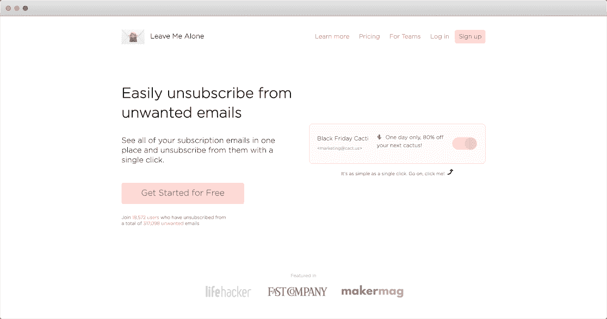
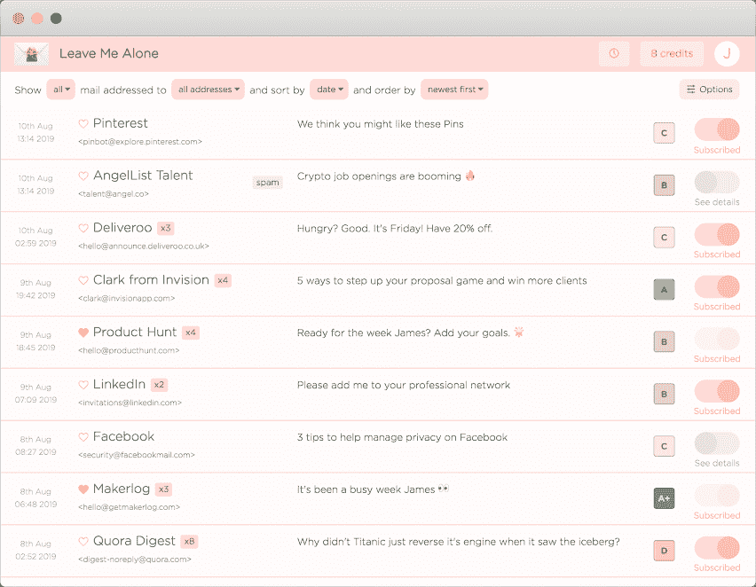
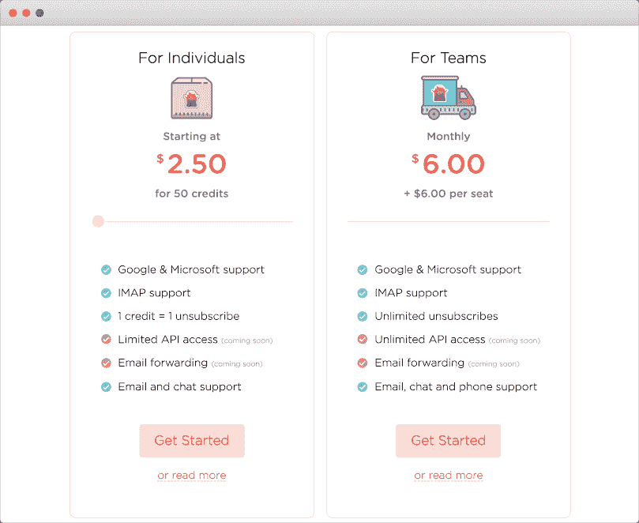
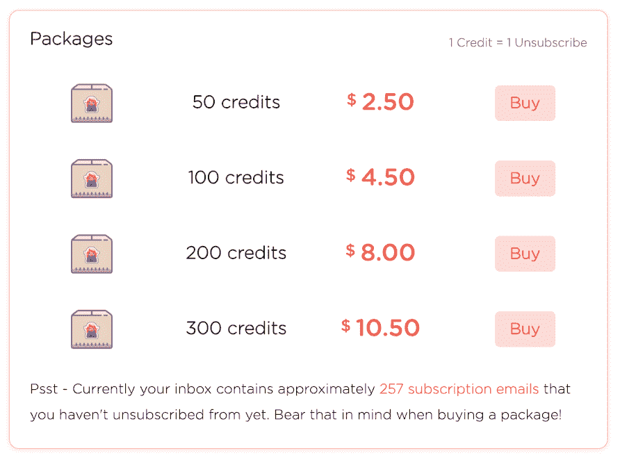

# 我们如何通过公开解决我们自己的问题来发展我们的业务

> 原文：<https://www.indiehackers.com/interview/how-were-growing-our-business-by-solving-our-own-problems-in-public-1b2d776e57>

## 你好！你的背景是什么，你在做什么？

你好！我是丹妮尔，一个数字流浪者和独立制作人。我最初来自英国，但在过去的三年里，我一直和我的伙伴、最好的朋友和开发伙伴 James 一起旅行。我们在旅途中一起创建了我们的网络开发机构 [Squarecat](https://squarecat.io) ，我们偶尔也自由职业，但我们的主要焦点是我们的旗舰产品[让我一个人呆着](https://leavemealone.app):一项可以轻松退订不想要的电子邮件的服务。

“让我一个人呆着”是写给那些想从收件箱中清除多余噪音的人的。你可能有数千封未读邮件，正在努力实现零收件箱，或者只是觉得重复的邮件真的在消耗你的时间。没有简单的方法只查看收件箱中的订阅和时事通讯，并能够决定哪些值得保留。但是用“让我一个人呆着”会让这变得轻而易举！

我们为自己是一家[开放式创业公司](https://hackernoon.com/what-does-it-mean-to-be-an-open-startup-f4446984189)而自豪。这意味着我们的所有指标，包括我们的收入、支出、用户等等，都在我们的[公开页面](https://leavemealone.app/open)上完全公开。我们还[通过公开分享我们所有的决策、进展、里程碑和失败来建立开放](https://blog.leavemealone.app/building-in-the-open/)。我们相信透明对我们和我们的客户都有好处。我们能够更好地了解他们的需求，获得更多有用的反馈，我们的客户也能洞察产品背后的人，从而建立更好的关系。

我们[在 2019 年 1 月推出了我们的第一个版本](https://blog.leavemealone.app/our-successful-product-hunt-launch/)。我们获得了 1186 美元的收入，在[产品搜索](https://producthunt.com/posts/leave-me-alone-3)中获得了当天和本周的第一名产品，并收到了大量积极的反馈！

自从我们推出第一个版本的“别烦我”已经一年了，从那以后，我们听取了用户的意见，改进了服务，使退订比以前更好、更容易。2019 年 10 月初，我们推出了官方[Leave Me Alone 2.0 版本](https://www.producthunt.com/posts/leave-me-alone-2-0)，性能提升，多账户支持，定价更加公平，体验更加流畅。

我们现在拥有近 2 万名用户，并创造了近 1.5 万美元的收入。此外，我们看到了超过 100 万封电子邮件，有超过 30 万人退订了这些邮件！

## 是什么促使你开始写《别管我》？

《别烦我》不是我们的第一个产品，但它是第一个走上成功之路的产品。到达那里是一次有趣的旅程！

我们在旅途中创建了 Squarecat，并接受自由职业项目来资助我们的旅行，但我们离开英国的部分原因是因为我们不想再为其他人工作了。

我们的第一批产品不太成功。对于我们的第一次创业， [ReleasePage](https://releasepage.co/) ，我们太专注于构建和完善产品，而不是确定人们是否真的想要它。因此，我们从来没有得到任何客户，这是一个彻底的失败。我们的第二个产品 [UptimeBar](https://uptimebar.app) 是我们的第一个 MacOS 应用。这不是非常成功，但我们赚了几百美元，我们觉得我们终于走上了正确的道路。我们也学到了很多重要的经验；构建解决您自己问题的产品，获得早期产品验证，并保持开放。

不要因为一个不好的想法或产品是简单的选择就坚持不放。

TweetShare

《别烦我》的诞生是因为我们采纳了自己的建议，坚持解决自己的问题。我们都花了很多时间整理邮件，所以我们去寻找一项服务，帮助我们找到并取消订阅我们不想要的邮件。我们找到了一些可以免费帮助我们的网站，但仔细观察后发现它们并不收费，因为它们出售所有用户的数据用于营销。面对混乱的收件箱或所有数据被利用的困境，我们决定建立自己的解决方案。

## 构建最初的产品需要什么？

我们在从阿根廷到玻利维亚的巴士上开始建造《别烦我》。不是最传统的工作环境，但是南美的公共汽车非常舒适，做一些工作是打发 18 个小时左右时间的好方法！

我们在七天内制作了第一个原型。由于我们在之前的项目中取得了小小的成功，并注意到我们的失败，我们采取了不同的方法来建立这家创业公司。我们希望共享一切，获得早期验证，并进行迭代。所以我们选了一个名字，制作了一个快速登陆页面，并开始在社交媒体上分享。

反响非常积极！几个小时之内，我们就有了 50 个潜在的测试用户，以及大量的想法和功能需求。所有这些都发生在我们编写一行代码之前！最酷的部分是人们投入到旅行本身，而不仅仅是产品；他们想跟踪我们正在做的事情。我们知道我们从一开始就开放的决定将会给我们带来巨大的好处。

编写代码是构建我们最熟悉的产品的一部分，正如我们开始理解的那样，它也可能是最不重要的部分。我们构建了一个关注核心功能的基本原型，向用户显示他们的订阅电子邮件，并让他们轻松退订。第一个版本只支持 Gmail，并且只显示过去一周收到的邮件。有了现成的东西，我们问人们是否愿意加入封闭的测试版。我们最初在 Twitter 和创客社区进行了接触。该应用是基本的，但概念的反馈是压倒性的积极。

测试是一个可怕的前景。在你的应用还没完全准备好的时候就让用户进入？如果东西坏了怎么办？嗯，事实证明，事情*做*打破，有时他们很难打破。但是测试版用户并不期待一个成品，而且他们出奇的宽容！在我们的案例中，我们用免费使用我们的测试版产品来换取专注地聆听他们对这款应用的所有评论。

【T2

结果，我们发现并修复了大量的 bug，调整了用户界面，并推出了一些我们没有想到的新功能，这些功能现在对应用程序来说是必不可少的。我们很确定，如果不尽快让用户松绑，《别管我》的效果不会有现在的一半。

我们的第一批用户已经验证了我们的想法，所以我们继续构建产品，但是我们小心翼翼地不包含任何不必要的功能。我们想添加的好主意越来越多，但我们专注于确保“让我一个人呆着”执行它的核心功能，让用户退订不想要的电子邮件，真的很好。其他一切都在“下一个版本”的任务列表中结束了。第一个版本是精益的。

## 你是如何吸引用户并成长起来的？

对我们来说，增加我们的受众最有效的方法就是开放构建，让我们所做的一切都变得透明。我们有一个社区的追随者，他们投资于我们和我们构建这个产品的旅程，希望看到我们成功。

这有助于我们不偏离轨道，保持责任感，并在遇到困难时提供了一个宝贵的支持网络。老实说，我们的成功很大程度上归功于我们所在的精彩社区，他们帮助分享我们的更新，宣传我们的发布，并给我们继续前进的动力。其中最大的是 [Makerlog](https://getmakerlog.com) 和 [Women Make](https://womenmake.com) ，但我们也在 [Twitter](https://twitter.com/LeaveMeAloneApp) 、[独立黑客](https://indiehackers.com)上获得了很多支持，最近还有来自巴厘岛和清迈的游牧合作者和会面团体的支持！

我们所有的交通都是有机的；来自社交媒体、我们的博客和口头宣传，因为我们还没有开展任何广告活动。我们[在博客](https://blog.leavemealone.app)上讨论了各种话题，包括产品的变化、隐私、远程工作和编码。每周两次使用 Buffer 在我们的 Twitter、脸书和 LinkedIn 上分享这些信息。Twitter 是我们流量的最大驱动力，也是我们最活跃的地方。我们尝试联系其他博客，为彼此撰写[客座博文](https://blog.leavemealone.app/tag/guests/)，为我们的读者带来不同的知识和专业技能。我们已经成功地为 Metomic 的隐私圣经撰写了文章，我们希望找到更多的博客来交换客座博文。

我们已经尝试赞助利基简讯，但由于我们的营销预算几乎为零，我们还没有看到这方面的成功。然而，在 2019 年 9 月底，我们在几天内看到了流量和销售额的巨大飙升，因为我们在拥有 28，000 名订户的[这份推荐简讯](https://www.getrevue.co/profile/Recomendo/issues/leave-me-alone-ken-burns-on-tim-ferriss-really-good-questions-199551)中得到推荐。这表明，如果我们能够获得正确的简讯受众，那么我们几乎肯定会看到这一领域的增长！

时事通讯推动流量和销售的讽刺意味并没有在我们身上消失，但是我们并不反对时事通讯，我们只是反对不需要的时事通讯。并非所有的订阅都是不好的，我们希望我们的客户保留他们阅读的电子邮件。这是我们没有“取消订阅一切”按钮的原因之一，因为几乎所有的用户都不希望这样，他们只想清除垃圾邮件，保留他们喜欢阅读的内容。

分享“让我一个人呆着”的 Recomendo 简讯实际上使用了一个推荐链接，在 24 小时内直接导致了 624 个访问者、271 个注册(43%)和 24 个销售(8%的注册或 3%的访问销售)!这很好，因为新客户可以获得额外的免费积分，推荐人也可以，所以那个人现在可能已经有几千积分了！

不需要的订阅电子邮件会占用工作场所的大量时间，因此我们也有一个[团队计划](https://leavemealone.app/teams)，每月每个席位以固定价格无限退订。如果有人推荐一个超过 10 个用户的团队客户，我们会付给他们 50 美元的佣金。我们希望这将鼓励人们与可能受益的小企业和团队分享我们的每月计划。

## 你的商业模式是什么，你是如何增加收入的？

《别管我》我们有两个收入来源；个人客户可以购买取消订阅的积分包，其中一次取消订阅花费一个积分，团队可以为每个座位支付每月固定价格，以无限制取消订阅。我们的大部分收入来自购买积分的个人客户，但我们正在努力接触更多的团队，增加我们稳定的每月经常性收入。

【T2

当我们推出时，根据用户希望扫描订阅邮件的时间收取费用:上周 3 美元，上个月 5 美元，等等。这有许多局限性，因此在 2019 年 7 月，我们将定价模式从基于时间改为基于信用。我们在这里写了一整篇关于这个[的博文，但主要原因是为了让定价更公平，增加付费客户转化的注册，以及增加回头客的数量。](https://blog.leavemealone.app/why-we-changed-our-pricing/)

新客户现在可以用几个免费点数使用完整版的“别管我”。这意味着他们可以立即看到价值，一旦他们看到退订前几封邮件是多么简单，就更有可能购买套餐。这是更公平的定价，因为套餐是根据客户的收件箱大小分层的，所以他们只需要购买他们需要的信用点数。此外，取消订阅失败不需要任何积分！

为了进一步增加回头客的数量，我们建立了一个带有推荐项目的奖励系统。客户可以在应用中免费获得更多积分，例如在社交媒体上分享和设置再次扫描的提醒。这对我们也是有益的，因为它鼓励人们在推特上谈论让我一个人呆着，我们从推荐中获得了额外的高质量流量。

我们的收入增长缓慢，但稳定。由于我们的定价模式是一次性付款，我们经历了一些起伏，很难预测我们的收入。在过去的几个月里，我们的收入超过了 1，000 美元，10 月是我们收入最高的一个月，因为我们发布了 v2.0。销售的注册数量以同样的速度增长，所以我们只需要获得更多的流量来获得更多的客户！

我们去年的月收入、利润和费用都可以在我们的[打开页面](https://leavemealone.app/open)上找到。

## 你未来的目标是什么？

我们总是将我们的主要产品“让我一个人呆着”描述为“重新控制你的收件箱”的一种方式，我们对“让我一个人呆着”的长期计划源于我们的使命宣言。一整年以来，我们允许用户对不想要的邮件列表采取行动。然而，我们开始意识到这还不够，我们开始考虑如何让你“*保持*对收件箱的控制”。

如果你以前用过“让我一个人呆着”,那么你会看到我们也将你的订阅邮件从 A 到 F 进行了排名，这样你就可以很快判断出你是否应该取消订阅。我们现在正在开发一个新产品，可以让你在订阅之前看到这些排名和更多关于邮件列表的信息，我们称之为订阅分数。

[订阅分数](https://subscriptionscore.com)是一个浏览器插件，可以让你在给他们你的邮箱地址之前*看到一个邮件列表会给你发多少封邮件，以及有多少人取消订阅。我们的 Subscription Score 目标是将权力还给你。现在，你可以在第一时间做出明智的选择，而不仅仅是取消订阅。*

## 你面临的最大挑战和克服的障碍是什么？

作为开发人员，我们面临的最大挑战是营销和销售。我们在工作中学习了很多，调整电子邮件并就我们的推销请求反馈，尝试博客帖子主题并分享到各种社交平台，但我们正在变得更好！我们已经学会了不要过多地纠结于内容，而是专注于接触更多的人。博客帖子也是如此，在阅读了[这篇关于培养更好写作习惯的文章](https://nesslabs.com/writing-habit)后，我尽量不去想内容，在发帖前只校对几次，尽管我是个完美主义者！

最困难的部分是不能全职做《别管我》,因为它还没有给我们带来足够的收入来维持生活。

我们唯一的最佳决定是分享我们的跌宕起伏的旅程，让人们从世界各地的不同地方深入了解我们的生活。当我们需要反馈、建议、鼓励，甚至是测试版测试人员的时候，我们的观众已经被证明是无价的！

我们已经学会了不要过多地纠结于内容，而是专注于接触更多的人。

TweetShare

然而，有几个事件像这篇 [Fast Company](https://www.fastcompany.com/90326825/the-25-best-new-productivity-apps-for-2019) 文章一样，在[recommendo](https://www.getrevue.co/profile/Recomendo/issues/leave-me-alone-ken-burns-on-tim-ferriss-really-good-questions-199551)时事通讯中被提及，给了我们一个急需的推动，这些都是运气！事实上，当我在写这个故事的时候，我们的一个梦想实现了，我们[上了《生活骇客》](https://lifehacker.com/automatically-unsubscribe-from-unwanted-emails-with-lea-1838373894)！这对我们来说是一个巨大的胜利，因为 Lifehacker 是一个巨大的技术出版物，我们一直渴望成为其中的一员。希望这是更多媒体报道和增长的开始。

我们绝对学会了保持简单。“别烦我”2.0 版比我们第一次发布时多了很多功能，但我们的主要产品保持不变:取消订阅不想要的电子邮件。甚至退订开关也和我们的第一个原型一样。我们每天都收到对功能的请求，构建它们会很简单，毕竟这是我们的工作。更困难的是保持专注于增长和营销，而我们宁愿埋头于一些代码，不断推出新功能。为了让自己保持在正确的轨道上，我们对我们的路线图非常严格，并且只致力于改进我们的核心产品或在支持请求中花费我们大量时间的功能。

在线工作和在社交媒体上推广你的产品也可能会分散注意力。一开始，我发现自己花了几个小时看分析和 Twitter。它们曾经是我浏览器中的固定标签，一直都是打开的，所以我可以快速查看它们。这对我的注意力来说很糟糕，所以我有一个规则，每天只允许我看一次分析(在早上醒来的时候)，我正在努力把我在 Twitter 上的时间压缩成更短、更有意义的时间。

老实说，如果我们必须重新开始，我不认为我会做任何不同的事情。我们已经失败了足够多的产品，现在知道我们正在做一件好事，我们只需要传播消息！

## 对于刚刚起步的独立黑客，你有什么建议？

最重要的是要意识到，你尝试的前几件事很可能会失败，或者你可能不得不根据意想不到的反馈进行重大调整。这是完全正常的，如果你从错误中吸取教训，这将有助于你成为更好的企业家。找到一个坚持的想法需要时间。不要因为一个不好的想法或产品是简单的选择就坚持不放。很难承认你已经建立或正在建立的东西没有工作，没有得到用户，没有增长。如果你能意识到这是什么时候发生的，并对此保持客观，那么你就不会浪费太多时间去重新思考下一个想法。

冒名顶替综合症是非常真实的。公开或私下记录你的旅程，当你挣扎时，看看你早期的原型和博客帖子，看看你已经走了多远。加入社区，结识他人，寻求帮助。做创始人可以很孤独；即使詹姆斯和我都经历过这种情况，尽管旅行和创建让我独自在一起。我从未想过我会出现在 Starter Story 中，并收到来自其他制作者的建议请求，我有信心回答这些请求，并且对即将到来的发布会的直播前景感到奇怪的平静——有一天我会做更大的事情并回顾这一点。

走出去，走出你的舒适区，开始行动。这很可怕，很辛苦，很有压力，但是当你成功了，并且有客户告诉你你帮了他们多少时，这是令人难以置信的回报。我迫不及待地想看看未来会发生什么，让我一个人呆着吧。我希望你能跟随我们的旅程。:)

## 我们可以去哪里了解更多？

*   网址: [leavemealone.app](https://leavemealone.app)
*   脸书: [@LeaveMeAloneApp](https://facebook.com/LeaveMeAloneApp)
*   推特: [@LeaveMeAloneApp](https://twitter.com/LeaveMeAloneApp)
*   LinkedIn:[@ LeaveMeAloneApp](https://linkedin.com/showcase/leave-me-alone-app)
*   博客: [blog.leavemealone.app](https://blog.leavemealone.app)
*   邮件: [【邮件保护】](/cdn-cgi/l/email-protection#87efe2ebebe8c7ebe2e6f1e2eae2e6ebe8e9e2a9e6f7f7)
*   个人 Instagram: [@dinkydani](https://instagram.com/dinkydani)

非常感谢您的阅读，如果您有任何问题或反馈给我们，请在下面留下您的评论！

——[<picture id="ember5264061" class="user-avatar ember-view user-link__avatar"></picture>丹妮尔·约翰逊](/dinkydani?id=Disrj5cjBxYn6dT0RV9Fk6FVVDo2)《别烦我》的联合创始人

## 想建立自己的事业，就像别烦我一样？

你应该加入[独立黑客社区](/)！🤗

我们是几千名创始人，互相帮助建立有利可图的业务和副业。来分享你正在做的事情，并从你的同事那里获得反馈。

还没准备好开始使用你的产品吗？没问题。这个社区是一个认识人、学习和实践的好地方。随意[随便浏览](/)！

——[<picture id="ember5264066" class="user-avatar ember-view user-link__avatar"></picture>考特兰艾伦](/csallen?id=ibTLPyjwVebnZjMGKvz6ztarnuV2)，独立黑客创始人

37votes