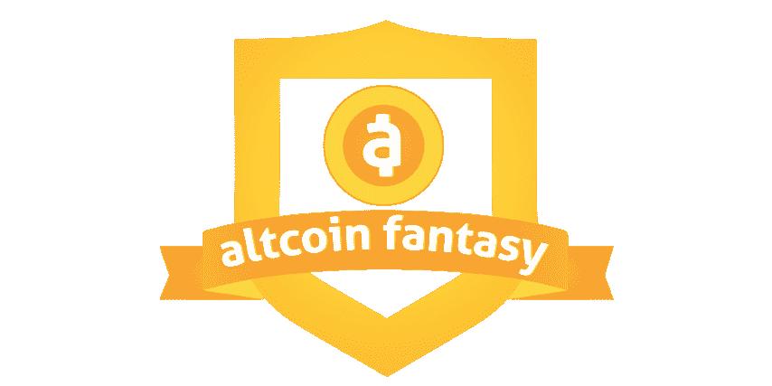
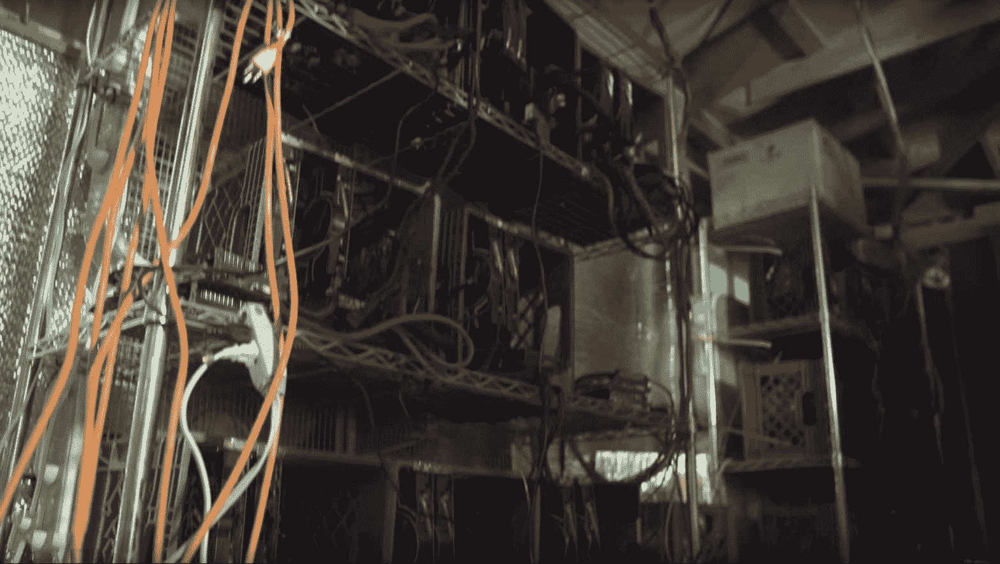
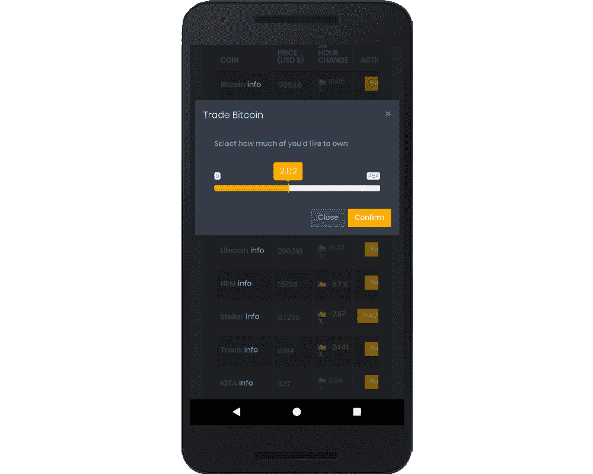
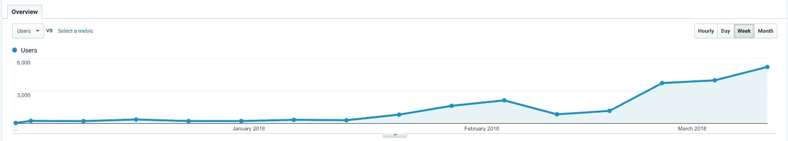
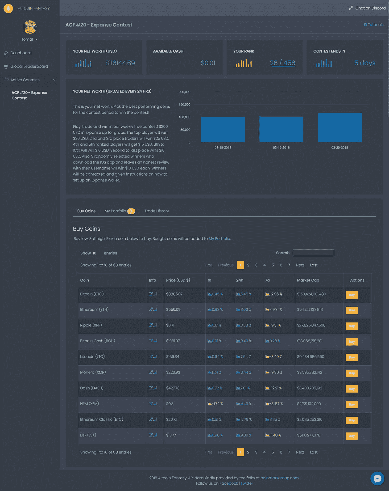

# 我们如何开发一款盈利的加密货币教育应用

> 原文：<https://www.indiehackers.com/interview/how-weve-grown-a-profitable-cryptocurrency-education-app-795ef801c2>

## 你好！你的背景是什么，你在做什么？

来自加拿大 BC 省温哥华的你好！Tom 来自[alt coin Fantasy](https://altcoinfantasy.com/)(ACF)——我们是一个加密货币模拟交易平台，帮助人们了解更多关于加密货币交易的知识，而不会失去他们一生的积蓄。玩家从 10 万美元的虚拟现金开始，在比赛结束时(通常是一周)，最有净值的人将实际赢得真正的加密货币，如比特币、以太坊、莱特币等。

 

我做了大约九年的开发人员。我的职业生涯始于为较小的初创公司工作，最终走向了戴尔(Dell)和电子艺界(Electronic Arts)等较大的公司，但我一直想拥有自己的企业。2014 年，我决定冒险一试，开始和一个朋友一起开发一个市场应用。我们有足够的初始牵引力进入 500 家创业公司加速器(第 8 批)，并在旧金山呆了六个月，期间我们经历了他们的种子计划。虽然我们最终不得不关闭公司，但在这一过程中，我们遇到了一群很棒的人，在初创公司工作给了我宝贵的知识和经验，这些知识和经验极大地塑造了我对待初创公司和业务的方式。

几年前，我和一个四人团队参加了一系列黑客马拉松，我们赢得了 2 万美元的大奖。因为这是“免费”的钱，我决定买一堆视频卡，并开始组装采矿设备。在某一点上，我们的车库简直就像硅谷第一季中的场景，他们试图管理存放在车库中的过多服务器，以支持他们羽翼未丰的初创公司。从那以后，我发现自己不断地教育我的朋友关于加密空间的知识，这迫使我创建了 ACF。

这个平台是完全免费的，我们从赞助和私人团体竞赛中赚钱。今年年初，我们有大约 300 名用户，截至 3 月初，已经增长到大约 4500 名。

 What my garage looked like at one point.

## 是什么动机让你开始玩 Altcoin Fantasy？

我看到加密市场有很大的波动性，人们在购买加密硬币时没有做出理性的决定或进行适当的研究。他们会从朋友那里听说一个朋友很早就进来了，并很快变得非常富有。当然，对错失良机的恐惧驱使他们盲目投资，不了解区块链技术，也不知道加密或首次发行硬币是如何运作的。我强烈地感觉到，这不是正确的投资方式，尤其是在一个极其不稳定、比凯蒂·佩里(Katy Perry)还要忽冷忽热的领域。这就是为什么我们创建了 ACF T1，让用户了解不同的硬币和基本的市场原则，这样如果他们想投资和交易，他们就可以掌握更多的信息。他们也可以尝试无风险交易，同时享受一些乐趣。

确保你总是跟上新的潮流。

TweetShare

我开始在下班后和周末兼职，同时为另一家公司做咨询。幸运的是，我从最初的采矿作业中保留了一些硬币，并能够在我为 ACF 建造原型时用这些硬币来资助奖励和奖品。第一次比赛有大约 10 名选手，其中三人获奖。大约在这个时候，我遇到了我的联合创始人 Jerry，他以前在 TD AmeriTrade 工作，对这个想法非常兴奋，因为他也对加密领域感兴趣。

虽然你永远不会真正知道你是否有正确的想法，但基于我们的成长和我们从用户那里收到的反馈，我们觉得我们已经发现了一些伟大的东西。我们的许多用户都是狂热的粉丝，非常支持这个平台，经常一天玩 12 个小时。我们最终招募了其中一个用户作为社区经理，因为她对 ACF 充满热情，我们觉得我们必须让她加入进来。当你的用户花更多的时间玩你的平台，而不是和他们的另一半，你就知道你有所收获了！

## 构建最初的产品需要什么？

对我来说幸运的是，在过去的五年里，我参加了许多黑客马拉松，所以我现在能够根据我通过快速原型制作获得的经验来创建产品。我在大约六周的时间里建造了 [ACF](https://altcoinfantasy.com/) 原型，并兼职工作。起初，目标只是建立一个模拟交易平台，让人们参与每周的自由竞赛。在最初的版本中，并不是所有的东西都能正常工作。我有死链接，但我会跟踪人们点击了什么，以确定下一步要构建什么。

从那时起，这个产品已经成熟了很多，尤其是在引入了像 Jerry 这样的加密迷之后。我们最近推出了我们的原生 iOS 和 Android 应用，并致力于为我们的用户构建更多的教育功能。就所涉及的技术而言，我们使用了 Rails 后端和 React native 来支持我们的移动应用程序。幸运的是，我保留了一些我开采的以太币——自从我第一次获得它们以来，它们的价格从 6 美元涨到了 1000 美元——并用它们来资助这个项目。

## 你们是如何吸引用户，让 Altcoin Fantasy 成长起来的？

与独立黑客上的许多产品不同，我们没有正式发布——这是一项正在进行的工作，我想在投入大量时间之前拿出最初的原型。今年年初，我们有大约 300 名用户和大约 500 笔虚拟交易。截至 3 月底，我们拥有约 6500 名用户，系统中有 7 万笔虚拟交易。

与大多数人所说的相反，好的广告可以以低廉的价格推动巨大的用户增长。

TweetShare

作为我们最初增长战略的一部分，我们研究了应用商店中的比特币游戏。自然，我想把比特币游戏玩家作为目标，因为我们最初的产品是一款围绕加密硬币的游戏。因此，对于我们的 Android 应用程序的 0 版本，我们实际上只是包装了一个指向我们的 web 应用程序的嵌入式 web 浏览器(我们的 web 应用程序是移动响应的)，将其部署到应用程序商店，并针对这些用户投放广告。我们能够以不到 8 美分的价格购买 25%的转换率，并从这些活动中看到一些巨大的初始回报。

下面是我们 Android 应用程序的 0 版本(只是一个网页浏览器包装器):

 

然后，我们尝试在与加密相关的 Youtube 频道上投放视频广告，每次观看付费 1 美分，转换率为 10%。我敢说，我们的 4500 名用户中有一半是通过这些广告活动转化的。然而，我们负担不起持续的付费活动，因为游戏是免费的，比赛和赞助没有产生足够的收入，所以我们正在实施一个系统，让用户推荐他们的朋友，并希望这将推动增长。当人们推荐他们的朋友时，他们可以获得 ACF 积分，可以用来参加特定的比赛或参加特殊的抽奖活动。我们也在通过在比特币和加密交易相关网站上做客座博客来进行 SEO，但这需要一段时间来建立权威。

关于增长的一些建议——与大多数人所说的相反，好的广告可以以低廉的价格推动用户的增长。你可能认为你了解 AdWords，但你可能并不了解它的一切，尤其是考虑到谷歌不断增加的新功能。为了解决这个问题，我请 AdWords 专家审查我的广告并给出一些反馈(AdWords 提供免费服务，这很棒)。本来应该是 15 分钟的聊天变成了两个小时的学习时间，因为我不想让那个人走。每个创业者都应该利用这一点！最后，我们围绕定制意向受众开展了 AdWords 活动，它超越了预先定义的受众类别，并通过锁定正在积极研究相关产品或服务的人来影响他们做出购买决定。我们将梦幻体育玩家作为我们的定制目标受众，在特定的比特币应用中投放广告。我们为它支付了相对较少的费用，它确实为我们的平台带来了相关用户。

 Our growth over the last 3 months.

## 你的商业模式是什么，你是如何增加收入的？

比赛总是免费的，因为我们想让人们在不损失真钱的情况下以有趣和吸引人的方式进行加密交易。我们一直自掏腰包支付竞赛获胜者，但我们已经开始与不同的 alt 币和密码相关公司建立合作伙伴关系，以便让他们赞助我们每周的竞赛。我们向这些公司收取 500 美元以上的管理费，用于举办每周的比赛，寻求市场的品牌提供 200-300 美元的奖金。

我们还为特殊利益群体举办了私人竞赛，并将在会议上宣传我们的产品。我们计划先从区块链和加密领域的会议开始，然后扩展到其他领域。类似于我们的合作伙伴关系，我们将收取费用来管理和举办这些私人竞赛，这对与会者来说是一个有趣和有吸引力的工具。我们还希望为公司及其员工举办私人竞赛，最初的目标是科技公司，因为我们认为他们最感兴趣。

作为黑客，在孤岛中工作很少意味着你第一次就能做对。重要的是要有一个支持网络和可以交流想法的人。

TweetShare

到目前为止，我们已经获得了两个合作伙伴，还有十几个正在筹备中，目前我们每月产生大约 800 美元的收入。显然，这不足以支付任何人事费用，所以在这一点上，杰里和我不拿工资。然而，因为我们基本上只支付托管费和一些 SaaS 订阅费，所以我们的利润很低。

## 你未来的目标是什么？

我们的目标是在未来六个月内培养 10 万名玩家。这是一个崇高的目标，但我们相信我们正在为人们提供一种价值服务——特别是那些没有加密货币经验，但希望无风险涉足加密货币的人。

摆在面前的障碍显然是加密货币价格的波动。如果加密货币崩盘，那么营销人员和品牌将因此变得谨慎。然而，这不是我们能控制的，所以我们只能专注于我们能控制的事情。此外，随着我们不断了解我们的用户，我们可以帮助品牌创建更有针对性的营销活动。

 We're continuing improving our product to add more educational features.

## 你面临的最大挑战和克服的障碍是什么？如果你必须重新开始，你会做什么不同的事？

我们面临的最大挑战是学会在需要日常处理的业务的不同方面之间进行思维转换。杰里和我都是工程师，例如，必须从产品开发切换到市场营销，这需要一点精神体操，这会让我们感觉我们没有全力以赴。我们试图在一天的第一部分解决困难的工程问题，然后在稍后进行业务开发，通常是在午饭后，因为这提供了一个很好的精神休息。

我们面临的另一个挑战是试图从未知的海洋中寻找答案，我相信我们和其他独立黑客都面临这个挑战。我认为，为了找到适合市场的产品，需要有一个合适的框架，使他们能够在问题出现时快速找到答案。这意味着你需要掌握相关数据，并确保你明白什么是推动事情向前发展的真正价值，而不是浪费时间在那些最终不会给你的用户或你的业务带来任何价值的事情上。

最后，从开发人员到销售人员的转变起初有点难以适应，但在读了几本书之后，比如《T2:销售是人:感动他人的惊人真相》和《T4:销售的艺术:向大师学习生活中的生意》之后，我能够将我的对话围绕着帮助另一方，而不是向他们推销某些东西。对于 ACF 来说，尤其如此，因为我们不卖任何东西给我们的用户——事实上，我们给他们免费的加密！

## 有没有发现什么特别有帮助或者有优势的？

利用你的人际网络来促进发展和伙伴关系。

作为黑客，在孤岛中工作很少意味着你第一次就能做对。重要的是要有一个支持网络和可以交流想法的人。同样重要的是与你的用户交流。我们认为我们已经掌握了用户的人口统计数据(年轻，有商业背景)，但当我们深入研究时，我们发现所有年龄、背景和职业的用户都从他们的朋友和家人那里听说过比特币。

## 对于刚刚起步的独立黑客，你有什么建议？

我对独立黑客的建议是不断学习。如果我没有研究区块链是如何工作的，或者对建造采矿钻机感兴趣，我可能不会进入这个领域。

确保你总是跟上新的潮流，因为从一开始就使用正确的工具和技术可能是优化你的跑道和死亡的区别。技术进步速度非常快。如果没有我构建原生应用的经验，我们不可能快速开发出原型。

## 我们可以去哪里了解更多？

想了解更多关于加密货币的知识，甚至想试试赢得免费加密吗？你可以在 AltcoinFantasy.com 了解更多信息。

如果你有朋友和家人对进入 crypto 感兴趣，告诉他们尝试 Altcoin Fantasy，否则他们可能会失去所有辛苦赚来的钱！或者，如果你认为你的公司可以从在办公室举行一场小小的友谊比赛中受益，请告诉我们，我们可以为你安排！

 

各位独立黑客，你对加密有什么想法？你认为它会留在这里吗？

——[<picture id="ember8166266" class="user-avatar ember-view user-link__avatar"></picture>托米](/TC?id=4DlycYE1exZ7tT91hQyXV9wfeCA2)，【奥特币幻想】CTO

## 想像 Altcoin Fantasy 一样建立自己的事业？

你应该加入[独立黑客社区](/)！🤗

我们是几千名创始人，互相帮助建立有利可图的业务和副业。来分享你正在做的事情，并从你的同事那里获得反馈。

还没准备好开始使用你的产品吗？没问题。这个社区是一个认识人、学习和实践的好地方。随意[随便浏览](/)！

—[<picture id="ember8166271" class="user-avatar ember-view user-link__avatar"></picture>考特兰艾伦](/csallen?id=ibTLPyjwVebnZjMGKvz6ztarnuV2)，独立黑客创始人

21votes