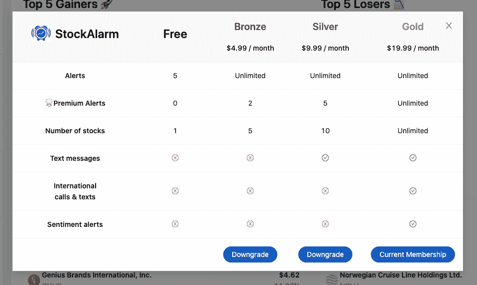

# 我们如何通过吃自己的狗粮在竞争中成长

> 原文：<https://www.indiehackers.com/interview/how-weve-grown-in-a-competitive-space-by-eating-our-own-dogfood-9c76002091>

## 你好！你的背景是什么，你在做什么？

我叫 [Yahia Bakour](https://yahiabakour.com/) ，是 Stock Alarm 的增长主管。我的职业是软件工程师，但我也有营销和增长发展方面的经验。我对股票衍生品领域感兴趣已经有好几年了，也很喜欢在这个领域工作。

股票警报是由交易者为交易者建立的平台，它为你监视股票市场，一旦你的警报响起，它会给你发电子邮件、发短信或打电话。我们已经在这个领域发展了 8 个月，经历了相当多的挑战和成功，现在我们已经发展到 9K MAU 和$3K MRR。

## 是什么促使你开始使用股票警报？

股票警报源于我们对警报服务的需求，这种服务将取代我们丢失跟踪图表的*小时*时间。就我个人而言，我花了比我愿意承认的更多的时间粘在图表上，等待交易头寸的最佳进场点或出场点。

我们需要一种服务，当 XYZ 股票价格高于或低于目标时，它能简单地让我们知道(通过电话、短信或电子邮件)。

在建立了 MVP 之后，我们意识到这是一个许多交易者会喜欢的服务，并将其货币化。我们开始收到许多要求更多触发类型的请求(基于新闻、技术等…)，这时我们知道我们正在做一些事情。我们的主要焦点是创建一个强大的交易工具，将它的复杂性隐藏在直观的 UI 后面。

## 构建最初的产品需要什么？

作为为大公司工作的工程师，我们最初花了大约四个月的时间利用晚上和周末建立股票警报的 MVP。我们 MVP 的主要目标是确认产品的市场适合度超出了我们对产品的个人需求。为了确保我们所有的时间都得到有效利用，我们首先专注于一组最少的高质量核心功能(只是根据价格限制设置警报)，而没有过多考虑我们将如何赚钱或扩大规模。

我们确保避免功能蔓延，无情地优先考虑那些会证实我们核心假设的功能:股票市场警报的需求是存在的。一旦我们看到免费版本的有机增长和保留，我们就想确认这种需求是否足以让客户付费。

在看到付费用户中 70-80%的月环比保留率以及向付费层的有机转化后，我们决定加倍努力构建更丰富的功能集、客户发现和客户成功，并投资于更好的工程以支持可扩展性/成本利润。

到目前为止，我们已经启动了整个公司，创始人个人只投资了几千美元，但我们也从谷歌(通过谷歌初创公司)授予我们的 100，000 美元的 GCP 信贷中受益匪浅，这是通过向我们的 LLC 填充 Stripe Atlas 实现的。

## 你的技术是什么？

我们的技术堆栈包括作为我们后端的 [Firebase](https://firebase.google.com/) ，其中运行着 70 多个云功能， [React.js](https://reactjs.org/) 用于 web 应用， [Swift](https://developer.apple.com/swift/) 用于 iOS， [RevenueCat](https://www.revenuecat.com/) 用于管理跨平台订阅，以及一个运行在独立虚拟机上的弹性搜索实例。

对于我们的提醒，我们使用 [Twilio](https://www.twilio.com/) 发送电话和短信，使用 [SendInBlue](https://www.sendinblue.com/) 发送电子邮件。[哨兵](https://sentry.io/welcome/)处理日志 web 错误。我们还有一个自动化的流程，如果出现任何问题，它会在 Slack 中通知我们。因为我们是几个工程师，所以我们决定用 GitHub Actions 来自动化我们能做的任何事情，包括我们的测试基础设施。

对您的调查做出积极和消极回应的客户是最热情的用户，他们是您最大的资产。

TweetShare

我们面临的最大挑战是构建这样的架构，如果需要，我们可以同时支持数千个警报。我们必须每分钟更新 10，000 多个股票报价器，并优化了我们的云功能，以确保我们的报价是最新的，我们的警报总是可以通过。我们计划很快扩展到 Android 市场。

## 你们是如何吸引用户，壮大股票警报的？

我们已经启动了几次，第一次是[产品搜索](https://www.producthunt.com/posts/stock-alerts)的启动，给了我们一个流量高峰，但没有订户。

我们增长的 60%来自 iOS 应用商店上的有机搜索，而另外 40%来自各种来源，包括付费搜索广告、有影响力的 Instagram 促销、谷歌搜索和口碑。

我们发现，与金融领域的 Instagram 影响者一起推广我们的产品非常成功。我们还每三个月进行一次调查，询问用户到目前为止对我们产品的看法，以及他们认为我们下一步应该做什么。

我们的 Twitter 账户已经完全自动化，将使用我们现有的一些数据免费提供股市见解。我们的机器人将每小时提供突发新闻，还会在推特上发布下一天和下一周的收益日期。通过这个策略，我们每天都有 5 到 15 个追随者，同时也有一些订阅者。

我们还向用户发送每月简讯，让他们了解我们的最新功能，并鼓励他们联系我们。我们在 iOS 应用程序上的菜单结构让我们的订户只需点击一个按钮就可以轻松地向我们发送功能请求(我们随后会跟进)。

自从我们开始关注社交媒体外展，我们的增长就开始了。去年 12 月，我们有 500 名用户的 MAU，而现在我们的 MAU 超过了 92k。

## 你的商业模式是什么，你是如何增加收入的？

我们的商业模式是基于多个定价层的免费增值订阅模式。我们最初从一个免费层和一个付费层(每月 5 美元)开始。我们的免费层将允许用户在多种条件下一次对一只股票设置警报，而我们的付费层将允许用户对无限的股票设置警报。

随着我们的不断发展，我们开始遇到一些问题，比如承担国际电话费用的增加(几乎是美国国内电话费用的 10 倍)。此外，我们的一些更复杂的触发器比简单的上限/下限触发器要昂贵得多，并且它们的使用频率要低得多。

以前，我们有以下模型:

*   自由层:在 3 种正常条件下对 1 只股票设置警报
*   高级层 4.99 美元/月:无限股票/无限条件

但是我们决定实施多种定价等级。这是我们的新型号:

*   自由层:在 3 种正常条件下对 1 种股票分配集合警报
*   青铜级 4.99 美元/月:设置 5 只股票的警报，无限的正常条件，2 溢价条件
*   银级 9.99 美元/月:设置 10 只股票的警报，无限的正常条件，5 个高级条件，短信警报
*   黄金级 19.99 美元/月:设置无限的股票，无限的正常条件，无限的溢价条件，国际电话+短信，基于情绪的警报

实施这种订阅模式后，我们实际上设法在一个月内将我们的 MRR 翻了一番。就用户数量而言，我们的增长率保持不变，但我们设法在月底将 MRR 翻了一番。这最初让我们如此震惊，以至于我们写了一篇关于独立黑客的[快速帖子，以开始围绕定价等级的讨论。](https://www.indiehackers.com/post/always-always-always-add-pricing-tiers-ce5949f5cd)

| 月 | 收入 |
| --- | --- |
| 1 月 20 日 | 195 |
| 2 月 20 日 | 210 |
| 3 月 20 日 | 400 |
| 2010 年 4 月 | 1560 |
| 5 月 20 日 | 2470 |
| 2010 年 6 月 | 4100 |

我们的支付系统由 Stripe 和苹果的订阅系统组成，两者都与 [RevenueCat](https://www.revenuecat.com/) 集成，可以轻松管理所有订阅服务器端。使用 RevenueCat 这样的服务，我们可以轻松地授权用户访问任何层级，这将有助于我们在未来建立一个顺畅的推荐系统。

我们的大部分费用来自 Twilio，这是基于我们一个月内短信和电话提醒的使用情况。由于我们通过 Stripe Atlas 和 Google Cloud 之间的促销活动获得了 10 万美元的 Google Cloud 信用，我们已经取消了服务器使用成本。到目前为止，我们的支出一直保持在每月经常性收入的 20-30%，但我们确信，通过更多的服务器端优化，我们可以降低这一数字。

我们对任何 SaaS 创业者的主要建议是，总是尝试增加多个定价层级，尤其是如果你的产品同时满足新手和高级用户的需求。考虑按年折扣而不是按月折扣来添加订阅，这将有助于大幅提高您的 ARR。

## 你未来的目标是什么？

在进行客户访谈和处理关于警报类型的数据后，我们发现我们的用户群与不断增长的散户千禧一代人口相一致——这种观众在 Robinhood 和 [Wallstreet Bets](https://en.wikipedia.org/wiki/R/WallStreetBets) 上可以找到。虽然我们完全支持长期以来华尔街独享的金融工具的民主化，但我们认为，正如最近媒体所暗示的那样，越来越多的散户投资者可能会被利用。

股票警报旨在公平竞争，因此即使普通人无法访问彭博终端，他们仍然可以根据市场事件接收快速警报。

除了提醒之外，我们认为让用户能够了解技术指标(如 RSI、MACD、布林线)并在现实世界中快速部署也很重要。因此，为了弥合华尔街和每日交易者之间的知识和工具差距，我们将把大部分精力投入到关于每种触发类型的教育页面上，并将警报与实际交易联系起来。

这将让任何人都可以轻松地“编程”自己的交易(链接触发器和技术指标)。如果我们能够完成我们的使命，Algotraders 将不再能够带着刀进行拳击比赛。

## 你面临的最大挑战和克服的障碍是什么？

在搭建平台的过程中，我们遇到了相当多的问题。获得可靠的股票市场数据是相当昂贵的，这些数据随时可用并不断更新。我们每分钟都在准时更新 10，000 多个股票报价机，需要我们的数据源来跟上。

不要太担心原创，担心自己是最好的。

TweetShare

过去一个月左右，我们一直在寻找外汇和大宗商品数据的可靠数据源，但一直未能找到一个符合我们当前预算和汇率要求的数据源。我们还需要根据我们试图从中提取数据的交易所申请特殊许可证。

目前，我们正在从纳斯达克获得 UTP 延长时间数据的授权(年费+一次性费用)。

## 如果你必须重新开始，你会做什么不同的事？

如果我们重新开始，我们将使用 typescript 而不是普通节点来构建我们的后端。我们强烈建议任何使用 javascript 的人尽可能使用 typescript。Typescript 对于构建我们的 [web 应用程序](https://app.stockalarm.io/)是如此重要，以至于我们能够在不到一周的时间内构建前端应用程序。

我数不清我们的单元测试救了我们多少次。在每次提交和部署时，我们都使用 GitHub 操作运行我们的 linters 和单元测试。

## 有没有发现什么特别有帮助或者有优势的？

我们强烈建议增加定价层级，尤其是当您拥有多样化的用户群时。我们的新手交易者不需要复杂的基于技术和情绪的警报，而是依靠一些上下限。这意味着我们可以以较低的价格留住他们的业务，同时向更有经验的交易者提供高级功能。添加价格层级导致我们的 MRR 在两个月内飙升了 70%以上，因为我们的用户最终找到了他们的最佳选择。

随时准备与您的客户交流。我们引以为豪的是，我们的产品易于访问，并且在多个地方都有联系我们的入口。许多热情的顾客会想和你交谈，给你建议，并对产品本身产生影响。

如果你和其他人一起工作，每周开一次会，重新安排下周工作的优先顺序。这有助于让每个人都在同一页上，并在轨道上。它还允许你在市场发生变化时快速调整你的产品。

【T2

[狗粮](https://en.wikipedia.org/wiki/Eating_your_own_dog_food)！确保你和你的伙伴每天都使用该产品。我们团队的所有成员一直使用 StockAlarm 来交易股票和密码。这有助于我们与客户达成共识，并发现我们可能会忽略的棘手问题。

## 你对刚刚起步的独立黑客有什么建议？

不要太担心自己是不是原创，担心自己是不是最好的*。股票警报不是我们唯一的产品，但我们肯定是最好的。当投资者决定使用哪种工具时，这给了我们很大的帮助。*

 *早点发货，经常发货。我们发现，我们的许多同行也是独立黑客，他们倾向于等到他们的产品完美后再发货。问题是完美是主观的，对你来说完美的可能对你的用户来说不完美。你必须尽早发布，找到痛点，解决它们，并不断重复直到成功。

倾听你的客户，每隔一段时间给他们发一份简短的调查，以找出他们到底想要什么，以及你的产品缺少什么。对您的调查做出积极和消极回应的客户*，是最热情的用户，他们是您最大的资产。*

 *## 我们可以去哪里了解更多？

您可以访问我们的[网站](http://stockalarm.io/)了解更多关于股票报警的信息。

您也可以尝试我们的[网络应用](https://app.stockalarm.io/)或 [iOS 应用](https://apps.apple.com/us/app/stock-alarm-market-alerts/id1465535138)，感受一下我们的平台是如何运作的。

我们的 [Twitter](https://twitter.com/Stock_Alarm) 在每个交易日自动提供股票市场更新，包括突发新闻和即将发布的收益数据。

我们每周定期更新我们的 LinkedIn 和 Instagram 账户。

要了解更多关于股票警报创始人的信息，请查看一下[路德·维瑟](https://www.linkedin.com/in/rgmvisser/)、[摩根·豪威尔](https://www.linkedin.com/in/morgan-howell-21181751/)和[亚希娅·巴库尔](https://www.indiehackers.com/yahiabakour)。

我们希望听到交易者对我们这样的交易工具最关心的方面的任何建议！

——[<picture id="ember7997568" class="user-avatar ember-view user-link__avatar"></picture>叶海亚·巴库尔](/yahiabakour?id=SSHOPZXNOWOsvG895bS2Qc2ljx83)，股票报警创始人

## 想像股票报警器一样建立自己的事业？

你应该加入[独立黑客社区](/)！🤗

我们是几千名创始人，互相帮助建立有利可图的业务和副业。来分享你正在做的事情，并从你的同事那里获得反馈。

还没准备好开始使用你的产品吗？没问题。这个社区是一个认识人、学习和实践的好地方。随意[随便浏览](/)！

—[<picture id="ember7997573" class="user-avatar ember-view user-link__avatar"></picture>考特兰艾伦](/csallen?id=ibTLPyjwVebnZjMGKvz6ztarnuV2)，独立黑客创始人

17votes**