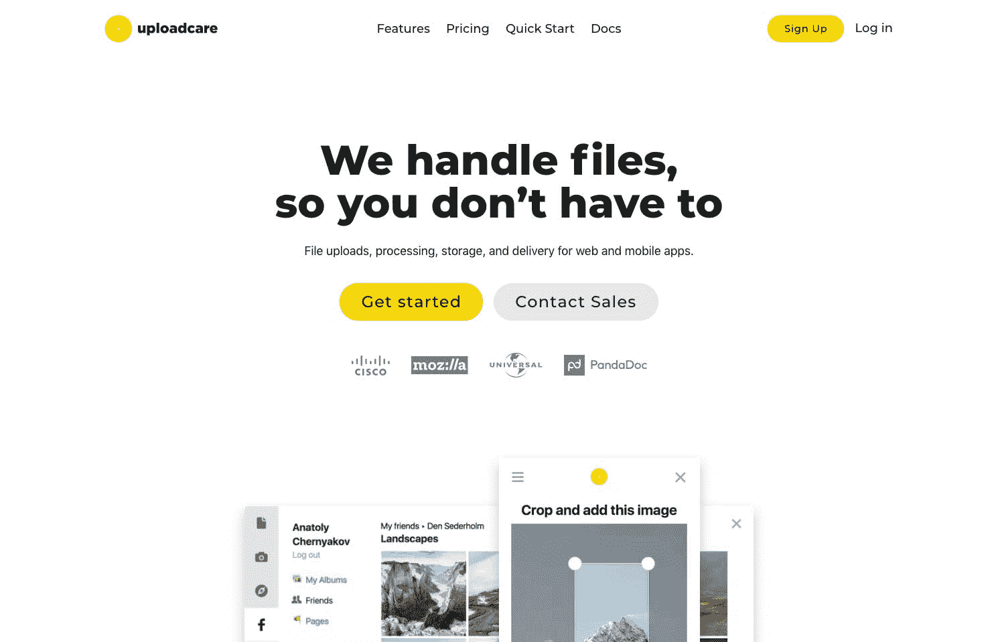
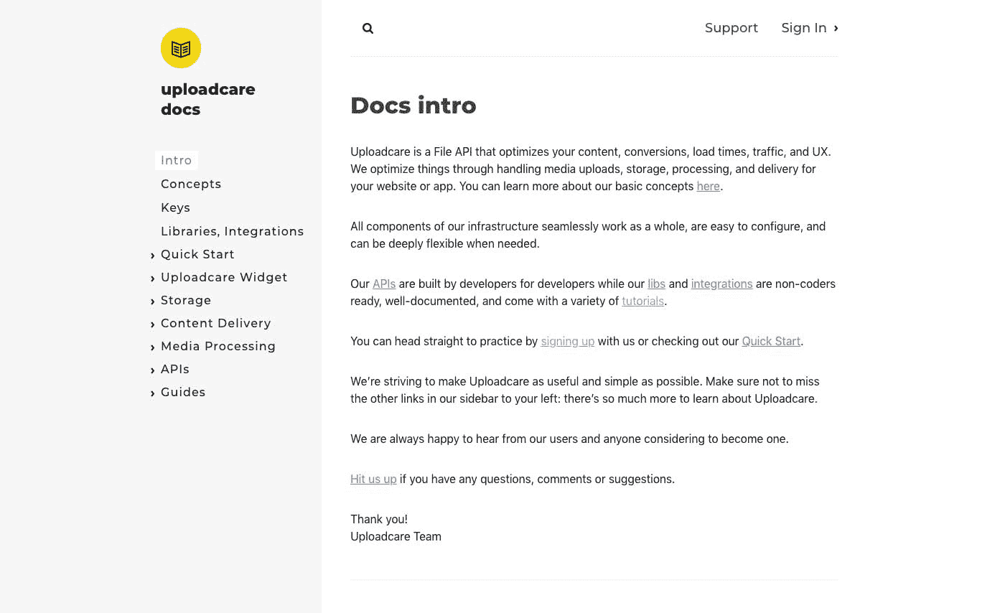
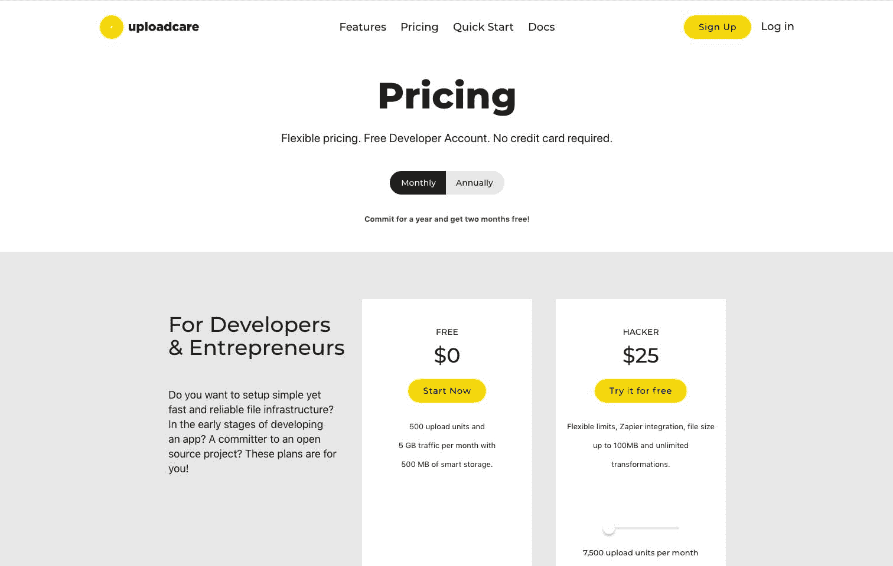

# 我们是如何培育出这种能挠我们痒痒的产品的

> 原文：<https://www.indiehackers.com/interview/how-weve-grown-the-product-that-scratched-our-own-itch-a372fedeae>

## 你好！你的背景是什么，你在做什么？

我是 Igor Debatur， [Uploadcare](https://uploadcare.com/) 的首席执行官，也是[骑手](https://riders.co/)的董事会成员。十年前，我和我的合伙人共同创立了一家网络开发机构: [Whitescape](http://whitescape.com/) 。我们总是想开始开发我们的产品，但创建一个代理机构是必要的，以获得初始资本，更重要的是，相关的知识和技能。

在开始 Uploadcare 之前，我们设法将 Whitescape 的总收入扩大到 100 万欧元，并为我们的客户启动了 150 多个项目，包括英特尔、微软和欧莱雅。

 

## 是什么促使你开始使用 Uploadcare？

如上所述，作为一家网站开发机构，我们已经开发了 150 多个不同的项目。这些人来自很多不同的行业:电子商务、分类广告、SaaS、印刷店、社交媒体等等。

每当我们发现自己在开发一个新东西时，总有一个组件必须从头开始复制:文件上传。此外，我们需要为我们支持的每个项目的这一部分保持一致性和质量。虽然开发一个 MVP 通常需要两个月的时间，但是仅仅在文件上传上花费两个人周的时间就感觉不太对劲。

当然，我们试图跳过这种手工操作。我们的工程师试图实现像 Uploadify 这样的现成构建模块，但没有解决方案可以处理我们的所有需求(如上传大文件、处理媒体、在浏览器中编辑图像等)。).还有，使用开源产品的时候，你要花很多时间去维护。它可能会花费你数千美元，而你可能一开始就只省下几百美元。

如果你想做一些伟大的事情，你需要在不被烧伤的情况下完成工作。

TweetShare

长话短说，我们决定一劳永逸地解决文件上传问题。不仅仅是为了我们自己，而是为了所有地方的每一个开发者。从那以后，我们发现这个问题涉及到更多的受众:不仅仅是开发者，还有企业。当文件上传或传送失败时，你就失去了一个客户。

在我们开始投入时间和金钱之前，我们进行了一些客户开发调查，询问最强大的熟练工程师社区他们是否需要文件管理 SaaS 产品。反馈相当鼓舞人心；它帮助我们获得了一个由数百名早期用户组成的谷歌团队。一切就是这样开始的。

从那时起，我们已经投入了 3 万美元自有资金，并从 Vaizra Investments 合作伙伴那里获得了 25 万美元的天使投资。风投发现 Uploadcare 位列“十大科技创业公司”之一，我们在不到两周的时间里就签下了一笔交易。我们认为这些名单都是废话，但其中一些工作。

## 构建最初的产品需要什么？

有作为一个网站开发代理的工作经验是有利有弊的。专业人士对如何组建一个 MVP 团队有深刻的了解，并且知道如何在生产中推出它。我们习惯于启动项目，但我们不太知道一旦 MVP 启动后该做什么。

如果你在一个机构工作，实际的 MVP 发布是终点。你拿到钱就可以保释了。

如果你是一家初创公司，MVP 只是小小的第一步:漫长旅程的开始。这更像是一场超级马拉松，你缺少资源和适当的训练。最终，你可能会成功，但这需要很大的耐心和信心。然而，你仍然可以在旅途中被秃鹫吃掉。它总是停留在你头脑中的一个开放循环中，这会扰乱你的睡眠。你需要有弹性。

我们花了一年半多的时间，才完成了从技术原型到实际产品的过程。我们正在开发的产品使用起来非常简单，但是很难设计。我们开发它来适应用户的当前状态，然后扩展到每月数百万和数十亿次操作。

现在，我很高兴我们花时间构建了一个核心产品，而不是试图实现尽可能多的功能。自那以后，它很好地为我们服务，这是我们流失率低于百分之一的主要原因之一。开发者信任我们的核心基础设施，并把我们推荐给他们的朋友。这意义重大。

 

## 你是如何吸引用户和发展 Uploadcare 的？

起初，我们进行了一次秘密发射。我们发布了我们的 MVP:一个登陆页面和一个极简仪表板。然后，我们请我们的几个朋友给 Uploadcare 一次创业的机会。我很高兴地说，他们中的大多数仍然是我们的客户。他们的 Uploadcare 集成随着他们的业务而扩展。这有助于我们在不冒太大风险的情况下测试我们的假设(也许有机会在酒吧被一群友好的人痛打一顿)。

第二步，我们在许多开发友好社区上宣布了我们的发布:Hacker News、Reddit 和许多其他社区。产品搜索在当时甚至还不存在，所以我们只是搜索相关的新闻，并试图进入其中。

当时我们没有任何来自 Tech Crunch 或 The Verge 的媒体报道，现在也没有。一些对这种媒体有经验的朋友告诉我们，这种媒体不会产生太多的线索。不过，如果你在寻找下一轮投资，这有利于获得投资。

Uploadcare 从一开始就一直在稳步增长。感谢我们的主要增长渠道:口碑。当你的产品是可靠的，并且你重视你的用户，这就允许你创造奇迹。唯一的问题是它不可扩展。

由于我们团队的大多数成员都是工程师，我们写了一些文章作为我们内容营销策略的一部分。成功了。这些文章仍然产生了大量的流量、新的线索和口碑。我们分享了黑客新闻、Reddit、StackShare 和 Twitter 上的文章。

一些很好的例子:“[最快的生产就绪图像尺寸调整出现在那里](https://blog.uploadcare.com/the-fastest-production-ready-image-resize-out-there-part-0-7c974d520ad9)”，它爬上了 HN 的第一页，并可能帮助 Discord 选择我们的开源库来处理他们的所有图像，以及“【Uploadcare 如何建立一个每天处理 3.5 亿文件 API 请求的堆栈”，它已经成为 StackShare 上 2017 年前 5 篇文章之一，有 27k 次读取。

## 你的商业模式是什么，你是如何增加收入的？

我们是一家 SaaS 公司，按月收费。我们使用三点定价模式。在他简单但非常有用的文章“[关于定价的十年经验](http://tomtunguz.com/pricing-summary/)”中，Tom Tunguz 曾经描述了一个例子:“*该软件有一个基本平台费，但费用是 25，000 美元，因为它包括第一个 150，000 活动是免费的。每个边际事件花费 0.15 美元。*”

当一个社区重视你的产品时，这个产品就不应该便宜。

TweetShare

我们从一开始就开始向客户收费，以弥补我们的基础设施成本。当你想推出一款采用订阅模式的 SaaS 产品时，我想不出还有什么其他选择。我们提供了一个免费的计划，适合任何愿意暂时使用 Uploadcare 或将其用于小型项目的人。

 

这是一项长期战略，也帮助我们发展了一个开发者社区。每一个优秀的开发人员最终都会成为高级/领导/CTO，我们努力在他们的道路上帮助他们。我们向前支付它。

我们使用 Stripe 来处理支付，我们很快就会在 MRR 达到 10 万美元。由于我们有现金，我们甚至在预算中有一些空间来试验营销和付费渠道，而不需要额外的投资。

一开始，我们最小的计划是每月 5 美元。当我们计算利润时，我们决定把它改为每月 25 美元。这是一个信念的飞跃，但最终我们收到了很多积极的反馈。当一个社区重视你的产品时，这个产品就不应该便宜。我们的用户为我们的决定鼓掌，没有人离开。我们的 MRR 成长了，我们收到了一些现金来投资建设我们的团队。

 (Revenue from March 2013 through January 2018)

## 你未来的目标是什么？

我们的使命是改变 web 开发的基本方法。我要引用我们的一个客户，Prezly 的 CTO Gijs Nelissen:*“最好的代码是我们不写的代码。”*

Uploadcare 帮助工程师、产品经理和首席执行官专注于他们的产品，而不是重新发明轮子。

今天的目标是允许第三方开发人员扩展我们的 API，实现越来越多令人敬畏的功能，如人工智能、病毒检查、OCR，以及我们慷慨的收入共享模型。

## 如果你必须重新开始，你会做什么不同的事？

我只强调一个错误的决定，但是失败是巨大的。当我们推出 Uploadcare 时，我和我的合作伙伴试图跟上 Uploadcare 和 Whitescape 机构的步伐。我们甚至推出了第三家创业公司 RIDERS。它严重扰乱了我们的注意力。它耗费了我们大量磨损的神经末梢，最终，耗费了大约两年的宝贵时间。

我们已经设法保留了所有的初创公司，但如果埃隆·马斯克正在开发时光机，请让他给我写一句话:“伙计，别这么做！”

## 有没有发现什么特别有帮助或者有优势的？

最主要也是最难的是你的专注。我们花了很多时间与三家初创公司周旋。这是不对的，会耗尽你的身心。你会精疲力尽的。

另一件对我个人有帮助的事是阅读。经典小说和基础文学帮助你学习、提高和思考。历史和宗教文学奠定你的基础。它帮助你把注意力从工作上移开，并播下许多种子，最终帮助你做出自己的决定，而不是盲目地从商业和教练书籍中复制食谱。

我花很多时间骑自行车、爬山和在野外滑雪。对我来说，它是一个伟大的调解人，不需要实际的冥想行为。

经典小说和基础文学埋下了许多种子，最终会帮助你做出自己的决定，而不是盲目地从商业和教练书籍中复制食谱。

TweetShare

当我做运动时，我把我的思想从工作和烦恼中解放出来。我的潜意识得到了它，并产生了现成的决定和想法，这些决定和想法突然出现在我脑海中某个不知名的山上。每次旅行回来，我都有一个待办事项清单。

每次度假回来，我都感到精神焕发，有动力不断改进我们的业务。如果你想做一些伟大的事情，你需要在不被烧伤的情况下完成工作。

## 我们可以去哪里了解更多？

如果你觉得这个采访有用，请在评论中给我留言！任何意见或建议都非常感谢🙌🏻。

向您的工程师展示[upload care](https://uploadcare.com/)；又好玩又免费。

让我们保持联系:

*   https://fb.com/debatur
*   【http://debatur.com 

—[<picture id="ember8077769" class="user-avatar ember-view user-link__avatar"></picture>伊戈尔辩手](/igordebatur?id=zNEuBja8YkXdLXtMwDljrCEgdE03)，Uploadcare 创始人

## 想像 Uploadcare 一样建立自己的事业？

你应该加入独立黑客社区！🤗

我们是几千名创始人，互相帮助建立有利可图的业务和副业。来分享你正在做的事情，并从你的同事那里获得反馈。

还没准备好开始使用你的产品吗？没问题。这个社区是一个认识人、学习和实践的好地方。随意[随便浏览](/)！

——[<picture id="ember8077774" class="user-avatar ember-view user-link__avatar"></picture>柯特兰艾伦](/csallen?id=ibTLPyjwVebnZjMGKvz6ztarnuV2)，独立黑客创始人

52votes