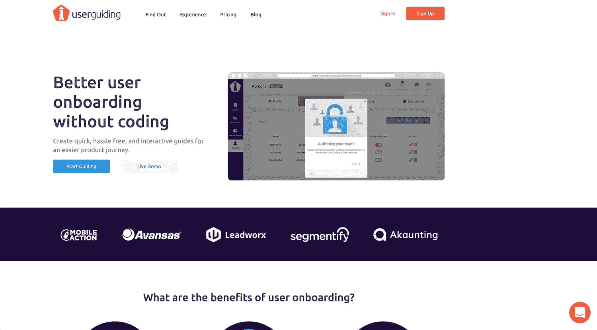
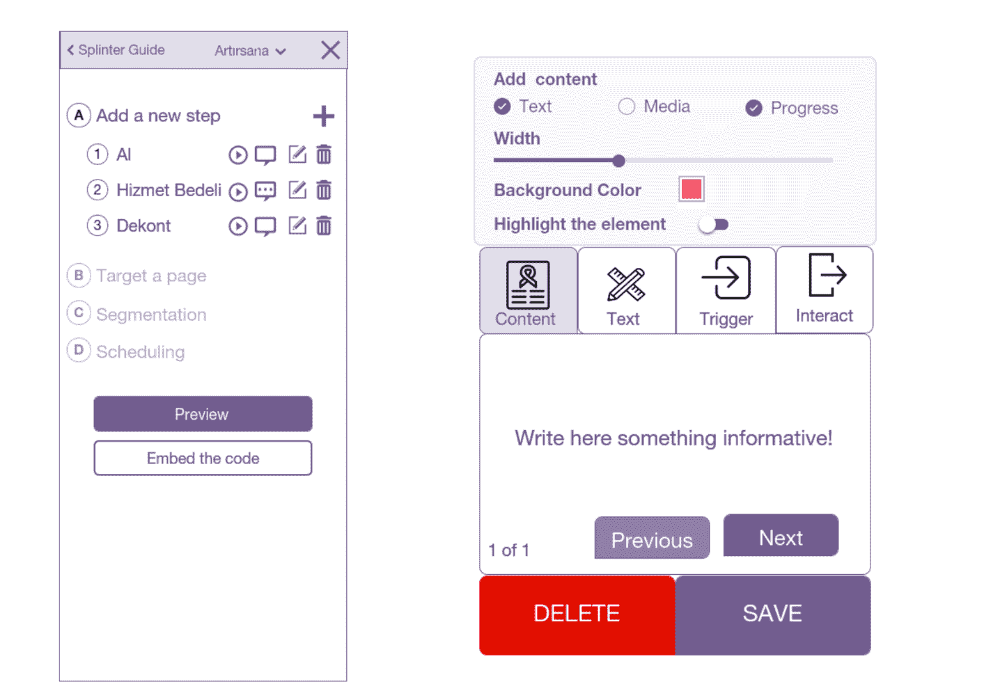
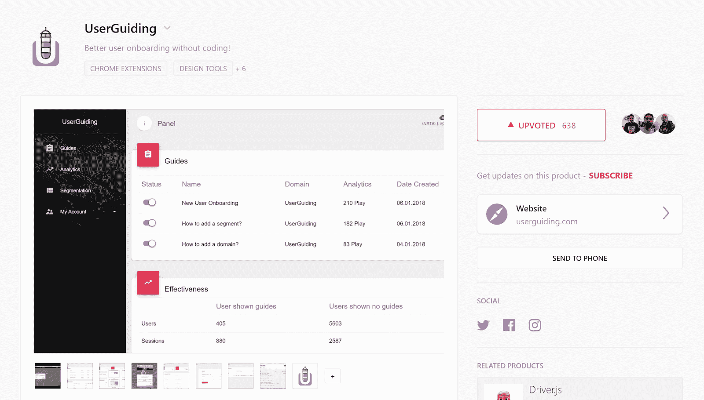
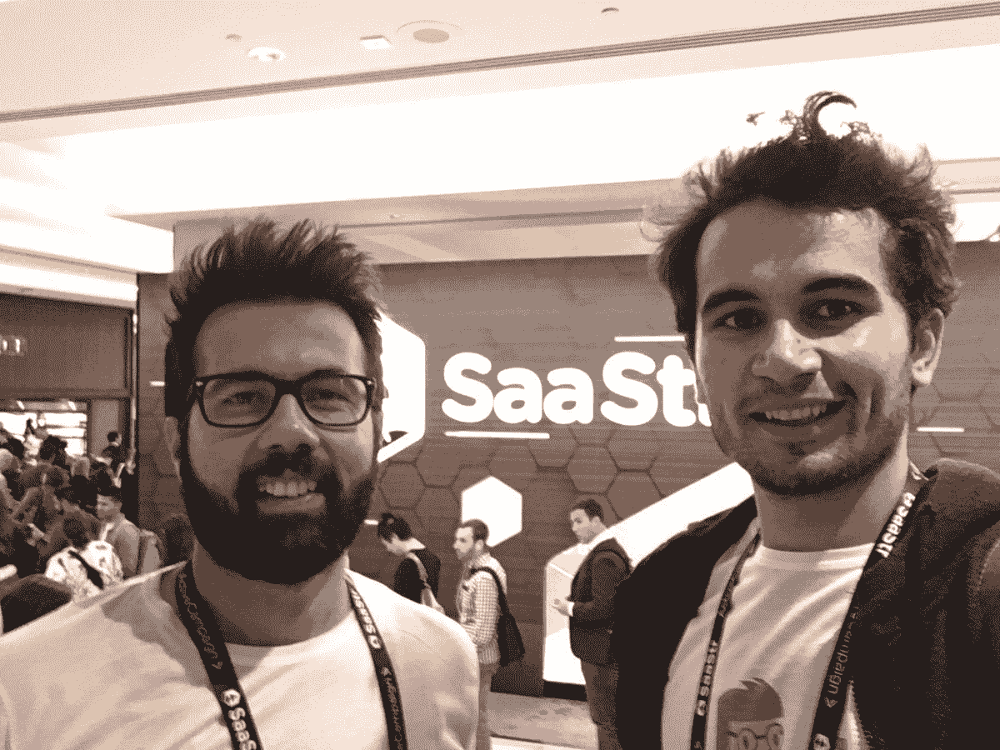
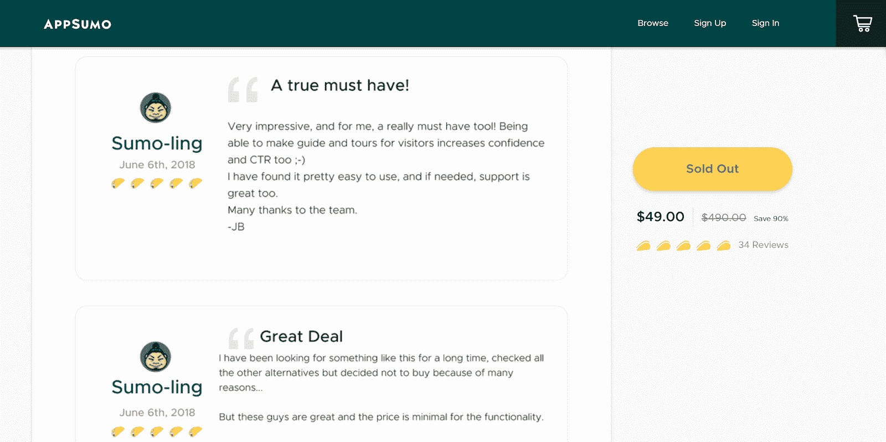

# 我们如何启动和发展我们第一个盈利的 SaaS 业务

> 原文：<https://www.indiehackers.com/interview/how-weve-launched-and-grown-our-first-profitable-saas-business-36604e12aa>

## 你好！你的背景是什么，你在做什么？

嗨，我的名字是[奥斯曼·科科](https://www.linkedin.com/in/osman-ko%C3%A7-27941287/)。[穆罕默德·恩吉纳](https://www.linkedin.com/in/muhammet-enginar/)和我创立了[用户指导](https://userguiding.com/)，这是一个帮助公司提高产品采用率的用户入门工具。通过 UserGuiding，公司可以设计不需要任何编码或编码知识的交互式指南和帮助页面，允许非技术产品人员在几分钟内创建交互式教程、应用内消息和可重复使用的指南。

与利用内部资源相比，这是一种更容易、更快捷的方式来设计独特的用户入职体验，原因如下:

1.  不需要开发人员工作
2.  用户指导助理提供 24/7 客户支持
3.  该服务带有内置的详细分析服务

今天，我们有来自 82 个国家的 1300 多名活跃用户，我们每月从这项服务中赚取大约 5000 美元。

 

## 是什么促使你开始使用用户指导？

穆罕默德和我从高中到大学一直是好朋友，UserGuiding 是我们一起创办的第二家公司。我们有一个名为“YNOT 合伙人”的创业工作室——源自“为什么不呢？”—旨在帮助企业家从构思到投资建立自己的企业。我们知道我们想成为创始人，而硅谷是最好的地方，所以我们都投身于工作，以便积累搬家所需的储蓄，并专注于全职创业。一年后，我们攒够了钱，可以搬到旧金山开始新的生活。我们不知道生意会是什么，也不知道我们会卖什么产品，但我们很兴奋！

在迈向十亿美元公司的竞赛中，我们有很多优势。我们很高兴能和我们的朋友 [Deniz](https://www.linkedin.com/in/deniz-d%C3%BCndar-608820aa/) 住在一起，他是 [Voscreen](https://www.voscreen.com/) 的创始人。我们在硅谷，这里是创造力和成长的温床，我们有很多空闲时间，存了相当多的钱，也有让一些东西起步的技能——我们只是没有真正的产品！最初几周的头脑风暴压力很大，但我们知道我们最终会找到一个富有成效的产品创意。我们时刻提醒自己，任何人都可以想出一个产品——创意是免费的——发展一个成功企业的重要部分在于执行。我们没有产品创意，但我们对自己经营和发展业务的能力充满信心。

我们花了很多时间在类似于 [G2 Crowd](https://www.g2crowd.com/) 、 [crunchbase](https://www.crunchbase.com/) 、[或](https://alternativeto.net/)的网站上寻找产品创意。我们在旧金山的第一个月致力于我们的商业模式，参加了超过 25 场活动，会见了至少 100 名新人。尽管如此，我们仍然没有产品的想法。

此时，我们的一个朋友，曾经在谷歌工作，现在是旧金山一家风投公司的管理合伙人，他在他的公司投资的一家初创公司给我们提供了一份工作。我们感到有些不安，这个提议引起了我们的兴趣，所以我们花了一些时间分析这家初创公司，研究他们的产品。我们很快意识到，尽管该产品有潜力，但理解起来有些困难——就这样，我们想出了自己的产品创意！

在你找到一个商业想法后，分配大量的时间和精力去寻找合适的顾问和导师是很重要的。

TweetShare

我们决定开发一个工具，让这家公司能够创建产品参观和教程。在我们的规划过程中，我们希望确保该工具是可扩展的，而不仅仅是这家特定公司的一次性工具，而是任何企业都可以使用的通用工具。研究表明，这个市场上已经存在一些参与者，但不管出于什么原因，他们开发的工具并没有很好地发挥作用。因为我们有丰富的 web 开发经验，我们有信心能够开发出比现有工具更好的用户入门工具。

我们创建了一个潜在客户名单，并开始四处打电话，以获得确认和反馈。尽管最初的反馈是积极的，人们似乎对我们计划建造的东西感兴趣，但我们仍然有点紧张。你永远不知道你的产品在上市前会有多好。具有讽刺意味的是，我们的用户入职流程的第一次迭代非常糟糕。我们发现自己一遍又一遍地回答同样的客户问题，转化率不到 1%。

像许多其他产品一样，我们的最终产品是为了解决我们自己的问题而诞生的。我们检查了哪些地方不起作用，考虑了客户的反馈，并使用我们自己的工具重新设计了我们的产品采用流程。重新设计后，我们的转换率上升到约 3%，我们的客户支持工作量减少了约 50%。

## 构建最初的产品需要什么？

首先，我们分析了目前市场上的工具，以便了解我们自己的产品中需要的关键功能。因为我们都已经领导过不同的网络项目，所以我们知道用户加入的要点，但是我们需要成为专家，所以我们花了大量的时间进行研究。为了巩固我们的知识，我们阅读了数百篇关于入职流程的文章和书籍。同时，我们在 proto.io 上做了一个原型，一个我们喜欢的工具。我们最初的几次迭代实际上被称为分裂指南。

 

我们的转折点是与应用营销智能工具[移动行动](https://www.mobileaction.co/)的创始人[艾库特](https://www.linkedin.com/in/aykutkaraalioglu/)。他是硅谷最成功的土耳其企业家之一，看了他的视频后，我们真的很想和他见面讨论我们的产品。来回发了几封电子邮件后，他同意在附近的一家咖啡馆见面喝咖啡。我们谈论了我们在 web 开发方面的背景，并向他展示了我们的原型。他告诉我们，他已经为类似的工具每月支付 200 美元，并说如果我们能制造出这种产品，他将是我们的第一个客户。他向我们挑战，如果我们能在两周内造出一个 MVP，他会再次和我们见面。

这对我们来说是一个极好的开端。我们安排了与 Aykut 的第二次会面，并希望达成我们的第一笔销售！

任何人都可以想出一个产品——创意是免费的——发展一个成功企业的重要部分在于执行。

TweetShare

那两个星期忙疯了！我们打电话给[阿里肯](https://www.linkedin.com/in/mert-alican-bektas-328255b5/)，我们在 YNOT 合伙人公司的设计师，来创作用户引导的第一个设计。在 Alican 和我完成产品设计和网站后，Muhammet 立即开始 MVP 的工作，并以闪电般的速度完成了它。我们还创建了几个移动行动指南来展示 Aykut。只有两个星期的时间来把所有东西组装起来，这显然是我们产品的一个非常原始的版本。但这已经足够好了，它是一个明确的信号，表明我们真的可以构建一个有前途的用户入门工具。

当我们展示我们创造的 MVP 和指南时，艾库特惊喜不已，所以他给了我们另一个为期两周的挑战。他让我们访问他目前使用的入职工具，并告诉我们在两周内过渡到我们的工具和所有指南。

## 你是如何吸引用户和发展用户导向的？

一旦我们将 Aykut 的移动行动入职流程迁移到我们的工具并上传了我们的移动行动指南，我们就回去向 Aykut 和他的团队成员演示。尽管他们指出我们的产品并不具备他们一直使用的竞争对手工具的所有功能，但他们认为这是值得购买的！Aykut 订阅了年度增长计划，我们完成了第一笔销售！通过这笔交易，UserGuiding 在第一个月就赚了 2000 美元。艾库特主动提出在持续的基础上帮助我们提供建议，我们每周在他的办公室呆半天。

我们于 2018 年 1 月 17 日在[商品寻购](https://www.producthunt.com/posts/userguiding)正式推出用户引导。这是一个难忘的夜晚，数百名游客从世界各地来到我们的网站。人们询问即将推出的功能，给出反馈，并对我们的产品提出有益的批评。接下来的一周，我们有了 300 多个新注册用户和一些付费用户。我们正式开始经营全球业务，这真的很令人兴奋！

 

在产品搜索发布会之后，Aykut 问我们是否打算参加 2018 年 SaaStr 年会。该活动接待了来自世界各地的数千名 SaaS 企业家，是一个很好的交流机会。然而，对于刚刚起步、预算没有太多回旋余地的早期创业公司来说，门票很贵。艾库特大方地给我们买了两张票作为启动礼。萨斯特是我们的天堂。我们拼命工作，最终获得了几个付费客户，并结交了一些也在经营自己的 SaaS 业务的朋友。

 

## 你的商业模式是什么，你是如何增加收入的？

我们的收入模式是基于每月订阅。我们有三个主要的准备计划:启动、代理和增长。每个计划都根据每月活跃用户的数量进行分类。我们还为拥有大量用户的公司制定了企业计划，提供专门的成功指导和目标跟踪。我们的付费客户大多在 SaaS，电子商务，或 ERP 业务。我们每个月大约赚 5000 美元。

我们的主要营销渠道是冷电子邮件。我们有一位伟大的导师，[杰姆](https://www.linkedin.com/in/cemhurturk/)，为我们的邮寄策略提供建议。杰姆是 SaaS 的元老，也是两家成功公司 [Sendloop](http://www.sendloop.com/) 和 [Octeth](http://octeth.com/) 的联合创始人。我们向潜在客户发送个性化的电子邮件，这大大提高了打开率和点击率。Muhammet 开发了一个机器人，它可以自动为您的网络平台创建一个指南草案，并允许潜在客户在提交之前测试产品，而无需我们做太多的工作。在这一点上，我们还没有对我们的登录页面或定价进行任何 A/B 测试，但我们计划很快开始这样做。

我们还在 AppSumo 上组织了一个终身交易，我们认为这是一个早期创业的惊人催化剂。从构思到推出再到成长的整个过程令人难以置信地兴奋，包括许多压力和不眠之夜，最终真的令人满意。我们卖出了数千份订阅，获得了 34 条五份玉米卷评论，并在短短两周内赚了一笔种子前投资的钱。

 

## 有没有发现什么特别有帮助或者有优势的？

建设一个不断增长、可持续和盈利的 SaaS 是一项艰巨的任务，尤其是如果你没有在 SaaS 的经历。你可以花上几千个小时开发一个产品，但在发布十天之后却没有人使用它。唯一比最初从别人那里拿钱更难的事情是每个月从别人那里拿钱。当你没有任何现有的付费客户为你的产品担保时，很难将免费试用转化为付费客户。这是一个恶性循环。我相信还有其他方法可以打破这种循环，但对我们来说，一个行之有效的方法是组织一次终生交易。

唯一比最初从别人那里拿钱更难的事情是每个月从别人那里拿钱。

TweetShare

终身交易在三个主要方面有帮助:

*   数字:它增加你所有的正数。我们获得了来自 82 个国家的 1000 多个新客户，这对于提高种子投资来说是非常棒的。
*   反馈；只有付费用户才会给出真实的反馈。我们几乎所有的反馈都来自我们的付费客户。根据他们有价值的反馈，我们能够开发出所需功能的路线图。
*   合作伙伴关系:您的品牌认知度显著提高。我们有几个很好的合作机会，这有利于交易后的营销和客户开发。

## 对于刚刚起步的独立黑客，你有什么建议？

在你找到一个商业想法后，分配大量的时间和精力去寻找合适的顾问和导师是很重要的。如果你找到了合适的人，你就能得到你需要的指导，并为可能出现的任何问题找到一个合适的答案。不要害怕向你亲近的人和业内陌生人寻求帮助。很可能他们已经走过这些路，并成功地解决了一些相同的问题。当你有可能通过向正确的人询问正确的问题而立即找到解决方案时，为什么要无限期地独自奋斗呢？

## 我们可以去哪里了解更多？

最好的地方是 userguiding.com 的。你也可以通过 [Twitter](http://twitter.com/UserGuiding) 或 [LinkedIn](http://www.linkedin.com/company/userguiding/) 与我们取得联系。

谢谢你让我们上独立黑客！欢迎在下面的评论中提问。我会尽我所能回答。

—[<picture id="ember8114678" class="user-avatar ember-view user-link__avatar"></picture>Osman Koc](/osmankoc?id=d3GBslFfzQZOj15I0uMRR8vwPiz2)【user guiding】联合创始人

## 想像 UserGuiding 一样自己创业？

你应该加入独立黑客社区！🤗

我们是几千名创始人，互相帮助建立有利可图的业务和副业。来分享你正在做的事情，并从你的同事那里获得反馈。

还没准备好开始使用你的产品吗？没问题。这个社区是一个认识人、学习和实践的好地方。随意[随便浏览](/)！

——[<picture id="ember8114683" class="user-avatar ember-view user-link__avatar"></picture>柯特兰艾伦](/csallen?id=ibTLPyjwVebnZjMGKvz6ztarnuV2)，独立黑客创始人

47votes