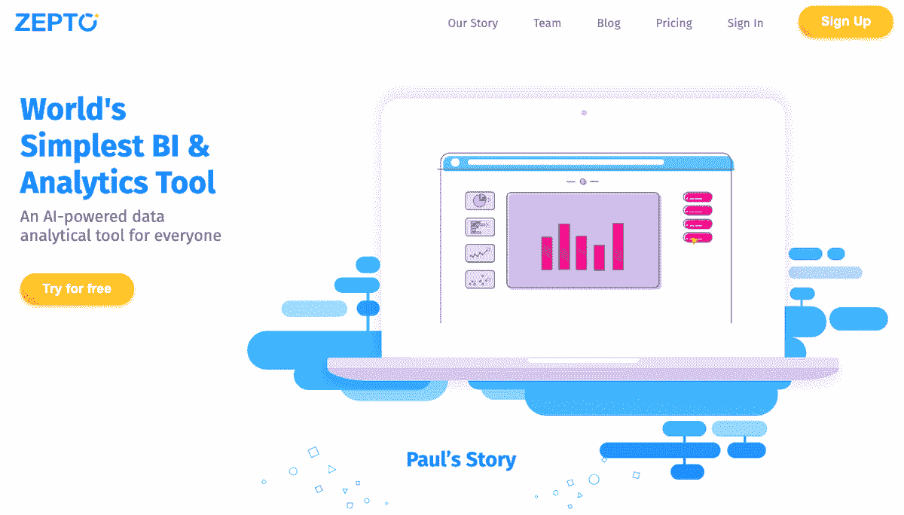
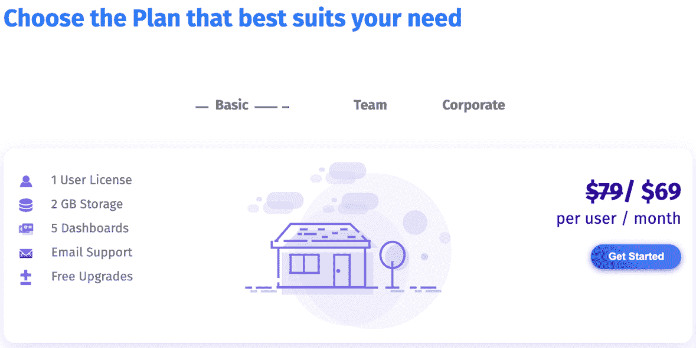

# 努力打造每年 2 万美元的产品

> 原文：<https://www.indiehackers.com/interview/hustling-hard-to-build-a-20k-year-product-246365412a>

## 你好！你的背景是什么，你在做什么？

嗨！我叫 Apurva Udeshi，是一名来自斯里兰卡科伦坡的企业家，拥有伦敦帝国理工学院的计算机科学学位。我是 [Argent Capital](http://argentcapital.com/) (一只结构性基金)的创始人兼董事总经理；一家专注于机器学习和区块链的服务型公司 [Avantrio](https://avantrio.xyz/) 的联合创始人；也是[蓝坎天使网络](http://www.lankanangelnetwork.com/default.php)的创始董事之一。

但是今天我要说的是我创办的另一家公司(没错，我同时经营三家公司！)名为 Zeptolytics，是一家专注于自助数据分析和人工智能(AI)的科技初创公司。它的旗舰产品 [Zepto](https://www.Zepto.io/) ，字面意思是 10^-21 的一个因素，是一个简单的商业智能工具(带有人工智能)，适用于中小型企业。

我们使用 Zepto 的主要目的是确保用户能够深入研究数据，并根据事实和数据而不仅仅是观点做出商业决策。用户的真正优势是他们可以使用我们的人工智能平台简单地分析他们的数据。把它想象成你口袋里的数据科学家！Zepto 的第一个版本于 2018 年推出，已经拥有投资组合管理、制造、食品饮料和交易等多个行业的客户。我们很幸运在东南亚地区拥有一些大客户，如 Kotak Mahindra Bank、First Capital 和 Capital Alliance，我们现在希望通过在北美提供金融服务来扩大我们在美国市场的影响力。

 

## 是什么促使你开始使用 Zepto？

尽管我拥有计算机科学学位，但我一直对金融充满热情。在伦敦金融界工作了五年后，我决定开始自己的创业。我热衷的一件事是让技术在金融领域发挥最大作用。对于任何金融公司来说，数据都是最有价值的资源，我的目标是确保即使是中小型企业也能够从其可用数据中获得有效的洞察力。

正如我提到的，我管理着一只结构性基金，投资于私募股权、上市股票、房地产、初创公司等。我公司的大多数决策都是基于我的意见，几乎所有的分析都是在 Microsoft Excel 上进行的。我意识到可用数据的价值，以及利用这些数据为我们造福的必要性。作为一家初创公司，我们想要简单、干净、易于使用的东西，而不需要训练有素的分析专业人员、基础架构团队和支持团队的开销，所以我决定构建一个简单的分析工具。

在我参与的不同企业之间周旋绝对不是一件容易的事！最终，我不得不在我的金融初创公司中退居二线，让我的团队负责公司的日常运营，这样我就可以专注于建设我的科技公司，即 Zepto。

## 构建最初的产品需要什么？

最初的 Zepto 团队由三名成员组成，心中有三个目标:

1.  专注于构建一个具有人工智能功能的简单产品，可以很容易地被中小型企业采用
2.  尽快将 Zepto 推向当地市场，这样人们就可以开始使用该产品，并在游戏早期给我们反馈
3.  建立 Zepto 团队

最后一个非常具有挑战性，因为我在努力为一家初创公司寻找年轻人才。刚从大学毕业的学生渴望进入企业界，并对加入创业公司感到担忧。我们终于能够雇用渴望学习的高技能技术毕业生。

我们最初的构建包括:

1.  一个简单的高性能工具，能够在几秒钟内处理数据
2.  干净易用的用户界面
3.  通过简单地拖放变量来创建图表和可视化的能力
4.  人工智能驱动的高级预测

我们让 Argent Capital 的团队对 Zepto 进行试点，并在构建时测试新功能。这有助于我们了解如何改善用户体验，从用户的角度来看什么有效，什么无效，以及我们如何构建任何更有价值的功能。

在初始阶段这样做是非常重要的，因为这有助于我们确定我们试图瞄准的市场，也有助于我们获得早期和真实的反馈。即使我们的用户认为某个特性失败了，我们也可以很快地发现它，并承担相对较小的风险，然后着手修复或改进它。

我们还给金融和科技领域的朋友和家人发了电子邮件，请他们尝试我们的产品，并给出宝贵的反馈，承诺如果他们的意见被添加到 Zepto，就带他们去吃周日早午餐。:)

## 你是如何吸引用户并发展 Zepto 的？

当我们第一次寻求推出时，我们为印度和斯里兰卡的金融服务业人士进行了演示，他们都热衷于在没有任何付费订阅承诺的情况下开始试用版本。不理想，但至少我们有顾客。在第一周，我们有近 20 人在试用版本，我们专注于获得更多，并希望将他们转化为付费客户。同一周，我在健身房和我的一个熟人漫不经心地谈论 Zepto，事实证明，他有兴趣开一个演示会议。顾客会在你最意想不到的地方出现，所以保持开放的心态，随时准备推销。健身房的那个熟人变成了我的第一批付费客户。

我们继续试运行该产品，并探索斯里兰卡和印度的市场，以获得更多的用户，并试图获得一些牵引力。相信我，这并不容易！我会和朋友、家人、家人的朋友交谈，随机介绍，等等。，为 Zepto 可能适合的公司进行演示。通过这样做，我们在东南亚地区获得了第一批大客户。

顾客会在你最意想不到的地方出现，所以保持开放的心态，随时准备推销。

TweetShare

在最初的用户浪潮之后，我们希望扩大我们的地理用户群。为了实现这一目标，我们入围了四个牵引频道，以面向更广泛的受众。我们现在使用社交和展示广告以及 Medium、Quora 和 LinkedIn 等现有平台来锁定用户。病毒式营销技巧和销售策略，包括电话推销、客户演示和 YouTube 视频，都是获得客户的重要渠道。

## 你的商业模式是什么，你是如何增加收入的？

Zepto 是一款基于网络的 SaaS 应用，任何用户都可以注册试用版或付费版。试用版为期三天，之后用户必须付费才能继续使用。我们的付费订阅模式是每个用户每月 69 美元。五个用户每月 245 美元的团队套餐也是可用的，但最初没有提供。团队包的引入帮助我们获得了更多的用户和更多的收入。我们主要通过个人或团队的付费订阅来创收。

 

我们在注册过程中做了一个小但重要的调整。Zepto 最初的注册过程要求预先支付详细信息，即使是免费试用期，但这导致了很多用户根本不注册。我们最终取消了这一功能，这样用户就可以无缝注册，而无需提供支付信息，从而提高了注册率。

我在早期收到的一个非常好的建议是，不要给 Zepto 打折或提供更低的价格，不管结果会有多少潜在用户注册。许多公司希望以更低的价格订阅，因为他们带来了更多的用户，但我们没有这样做，因为我们不想贬低我们的产品。同样重要的是，要确保你在整个客户生命周期中拥有良好的客户支持，而不仅仅是在用户注册的最初阶段。这有助于提高保留率，并传播你拥有良好的客户支持的信息。

如今，Zepto 每年的经常性收入接近 20，000 美元，并在美国和斯里兰卡的各种峰会上赢得了多个奖项，包括:

*   亚军——2018 SLASSCOM 创新峰会最佳创业产品/服务
*   入围者—2018 年 500 家创业公司(第 24 批)
*   获胜者 PeopleConnect 2018
*   出色的用户体验和后起之秀—2018 年在线金融

## 你未来的目标是什么？

我在 2019 年为 Zepto 设定的目标之一是在亚洲以外的更广泛市场获得牵引力，如美国和加拿大。我还希望增加更多的产品功能，如:

*   咨询机器人(consulting bot):个人顾问，提供建议、行动项目建议，并向用户解释为什么会对特定数据产生洞察
*   *主动提醒*:在关键图表上创建定制参数，当图表值达到设定参数时，获得即时电子邮件提醒
*   *故事书*:一个身临其境的报告平台，用户可以在其中加入他们的图表、见解和叙述，以便轻松地与同事分享
*   *数据连接器*:连接日常使用的第三方应用，如谷歌分析、脸书、亚马逊等。直接更快地分析数据
*   *预测建模*:虽然我们已经有了一个时间序列预测模型，但我们目前正在开发一个机器学习预测模型，该模型将能够使用不同的场景进行预测。这对公司来说将是一个真正的游戏规则改变者，因为我们发现他们中的一些人确实在寻找预测模型，而不是该平台目前提供的更多描述性模型。

## 有没有发现什么特别有帮助或者有优势的？

读书对我很有帮助。了解如何获得正确的产品-市场匹配，如何产生牵引力，如何分析市场，以及阅读鼓舞人心的成功故事，这些都帮助我走过了与 Zepto 的旅程。举几本书:加布里埃尔·温伯格和贾斯汀·马雷斯的 *[牵引](https://www.amazon.com/dp/1591848369/ref=cm_sw_em_r_mt_dp_U_XHYVCbJ2230Z9)* ，埃利亚胡·戈德拉特的 *[目标](https://www.amazon.com/dp/0884271951/ref=cm_sw_em_r_mt_dp_U_PIYVCbAWVZKCH)* ，查尔斯·杜希格的 *[更聪明更快更好](https://www.amazon.com/dp/0812983599/ref=cm_sw_em_r_mt_dp_U_6JYVCbRTAYPS9)* ，以及吉姆·科林斯的 *[从优秀到伟大](https://www.amazon.com/dp/0066620996/ref=cm_sw_em_r_mt_dp_U_6KYVCbQYYBEYD)* 。

在商展或会议上展示你的产品也是非常有用的。它围绕产品制造了一个嗡嗡声，有助于吸引最初的客户群。

## 对于刚刚起步的独立黑客，你有什么建议？

我的名言(来自 LinkedIn 联合创始人雷德·霍夫曼)是，“如果你对你的产品的第一个版本不感到尴尬，那么你已经推出太晚了。”对于每一个为了上市而试图打造完美产品的人，不要这样做！尽快把你的产品推向市场。它将帮助你找到一个好的产品市场匹配，找出任何漏洞，并让你快速了解你的产品在市场上的地位，以及你可以做些什么来使它变得更好。

## 我们可以去哪里了解更多？

*   访问我们的网站:[https://www.Zepto.io/](https://www.Zepto.io/)
*   在这里找到我们的博客:[https://www.Zepto.io/blog](https://www.Zepto.io/blog)
*   在 [LinkedIn](https://www.linkedin.com/in/apurva-udeshi-7a1b2b15/) 上找到我

请随时在下面的评论中问我任何问题！

——[<picture id="ember8097418" class="user-avatar ember-view user-link__avatar"></picture>阿普瓦尔·乌代什](/ApurvaUdeshi?id=31NR5xBO8yg8f81o5TQebYRoCsA2)，泽普托创始人

## 想像泽普托一样建立自己的事业吗？

你应该加入[独立黑客社区](/)！🤗

我们是几千名创始人，互相帮助建立有利可图的业务和副业。来分享你正在做的事情，并从你的同事那里获得反馈。

还没准备好开始使用你的产品吗？没问题。这个社区是一个认识人、学习和实践的好地方。随意[随便浏览](/)！

——[<picture id="ember8097423" class="user-avatar ember-view user-link__avatar"></picture>考特兰艾伦](/csallen?id=ibTLPyjwVebnZjMGKvz6ztarnuV2)，独立黑客创始人

19votes