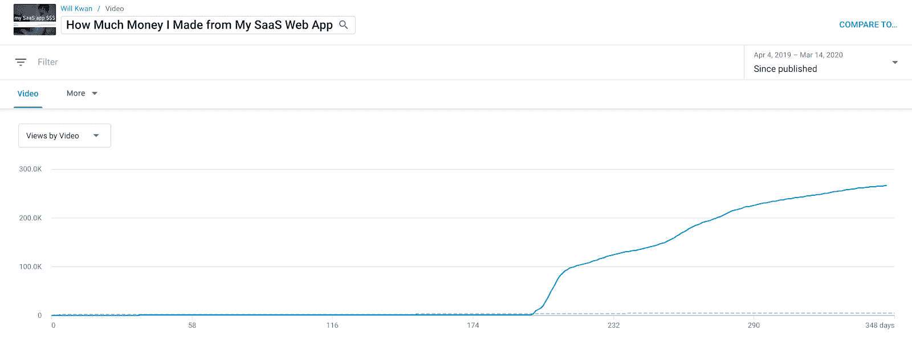
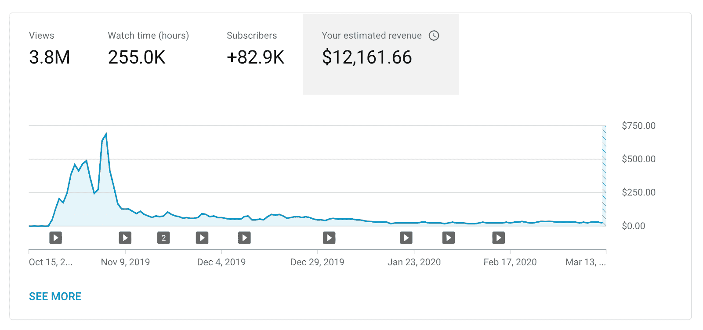
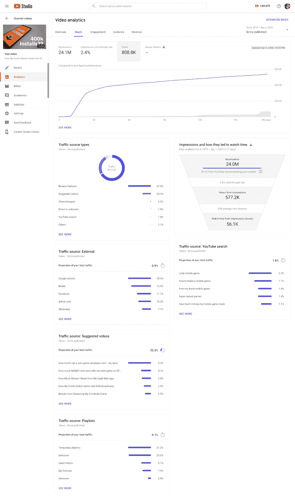
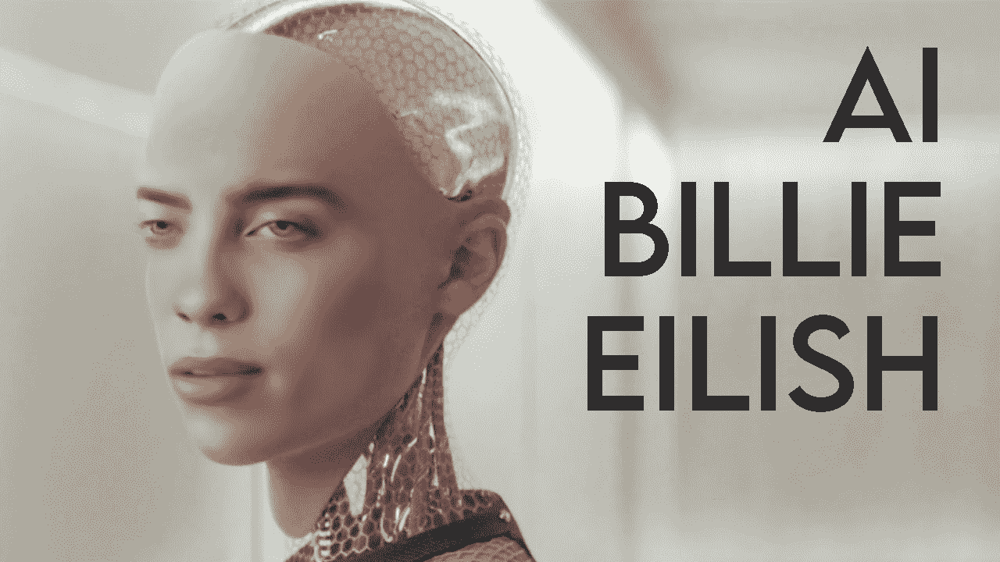

# 我找不到专注于创业的 Youtubers。所以我把自己变成了一个

> 原文：<https://www.indiehackers.com/interview/i-couldnt-find-startup-focused-youtubers-so-i-turned-myself-into-one-90b962c232>

## 你好！你的背景是什么，你在做什么？

我的名字是威尔·关，我经营着以威尔·关命名的 YouTube 频道。我是一名软件工程师和独立黑客，我制作视频以娱乐和创意的形式分享我的创业。

我的观众主要是 20 岁出头的年轻人，但他们观看的原因因人而异。我尽量避免太多的编码术语，以便专注于展示结果和讲述一个令人难忘的故事，所以我怀疑很多人都在寻找自己项目的灵感。或者也许他们想学习如何编码，发现我的个性值得信赖，对我有性吸引力，等等。

我一年前开始制作这些视频，当时我决定从 Dota 自动象棋视频(250 名订户！)然后聊一些我其实很擅长的东西。从那时起，我已经制作了 21 个视频，用户增加到了 9 万。

## 是什么促使你开始使用 YouTube？

我关注了太多的 YouTubers，包括各种各样的程序员，比如 Jon Blow、carykh 和霍马理工大学，但他们都不关注创业公司。所以我填补了这个空缺。我相信这是有观众的，因为这是我在现实生活中经常接触的那种人。在最初的六个月里，我只有不到 1000 个订阅者，但是我每个月都会发布一到两个视频。在早期，Reddit 是我的主要认证。我的视频会不断被推上热门子主题的榜首。与通过 YouTube 推荐获得的流量相比，Reddit 的流量极低且短暂(稍后会有更多介绍)，但它激励我继续前进。

当时，我从 7D2DServerHosting 每月获得大约 2000 美元的被动收入，因此这成为我第一个视频的主题。我还和两位联合创始人为另一家初创公司筹集了 7 万美元。那家初创公司失败了，但我还有一些资金来探索不同的想法。计划是用我的频道记录严肃的、有利可图的冒险，但现在我发现自己(有意或无意地)在用迷因编码。请不要评判我。

我从来没有考虑过除了 YouTube 之外的任何其他平台来分享我的创业内容。(我确实想在 Twitch 上播放自动象棋，但我发现直播编码太无聊了，如果你像大多数观众一样在一个流中来回切换，很难跟上。)我沉迷于视频，我发现短视频阿拉抖音/Instagram 不能令人满意，我不认为我会很快得到一个网飞秀。

## 你的第一个视频是什么？

我的第一个视频是一个 Unity 教程，教我如何在纪念碑谷创造透视错觉。我刚刚辞职，有很多空闲时间，所以我决定开办自己的频道，因为我已经考虑了一段时间。几个视频之后我退出了，因为它花了很多时间，没有多少人在看，我发现了独立黑客(来自黑客新闻！)所以我决定专注于构建 web 应用。

两年后，因为沉迷游戏，开始制作 Dota 汽车象棋视频。几个月后，这变得很无聊，所以我又开始制作科技视频，但以一种更非正式的方式。

第一个是*我从我的 SaaS 网络应用程序*中赚了多少钱。这是第一个视频主题的明显选择，因为它是我的主要收入来源。它实际上只有不到 2k 的浏览量，直到上传六个月后我的频道爆炸。现在它有 28.1 万的浏览量。

【T2

我不记得我当时考虑的其他视频主题，但这是第一个视频的明显选择，因为这是我的主要收入来源。

我一天就写好了剧本，第二天就拍戏剪辑了。我借了我室友的 DSLR 相机，我不知道怎么用，所以我的脸模糊了。我没有悬挂式或领夹式麦克风，所以我使用了摄像头上的内置麦克风，这非常有回声，每个人都在评论中抱怨(讽刺的是，这可能为 YouTube 算法提供了视频)。我是用盗版的 Adobe Premiere 编辑的(后来买的)。

## 你是如何吸引用户和扩大渠道的？

我曾经到处发我的视频(Reddit，脸书集团，Slack 频道等)。这在大背景下毫无用处，尽管 Reddit 上的投票满足了我的自尊心，而这一点实际上很重要。我 94%的观点来自 YouTube 的推荐(那些你在主页上看到的，或者看视频时在侧边栏看到的视频)。对于我最受欢迎的视频，它是 99%，这个视频贡献了我总频道浏览量的一半。

所以现在我不在自我推销上花任何力气(不算没人看的随机推文)，而是专注于尽我所能制作最好的视频。如果你的指标很好，YouTube 非常擅长将你的内容呈现给合适的观众。标题/缩略图的点击率和视频的平均观看百分比/持续时间似乎是最重要的，但我确信谷歌正在跟踪和考虑一切和任何事情。我对我的任何视频都不满意，我希望每一个都比上一个更好，YouTube 提供了互联网上最好的生态系统来支持这种心态。他们的神经网络太聪明了，所以你实际上必须做出好的视频。

## 你的商业模式是什么，你是如何增加收入的？

广告和赞助。AdSense 的收入是不稳定的，因为它取决于你的观点和你的 CPM。CPM 很大程度上取决于视频的利基和长度(较长的视频通常有较高的 CPM)。我的 CPM 相对较高，因为技术人员和企业家喜欢购买昂贵的东西。

此外，只有当观众不使用 AdBlock 时，你才能获得报酬，所以大部分收入来自移动观众。这很不幸，但我总是用 AdBlock 看 YouTube，所以我不能抱怨。

这是我自 2019 年 10 月开始货币化以来的 AdSense 收入，当时我达到了启用广告所需的 1k 订户阈值。如你所见，我的 AdSense 收入正在减少，我需要另一个病毒式视频。

在我的视频*我的愚蠢的手机游戏如何获得 40 万下载量*开始被推荐给每个人之后，赞助商开始通过电子邮件联系我。初创公司通常会直接联系我，更大的公司通常会与中间人影响者营销公司合作，这些公司会找到相关的内容创作者并联系他们。因为我发布的内容不多，所以我可以为我所有的视频找到赞助商，尽管有时我会选择不发，如果这会影响视频的话。我一开始对 45-90 的整合收费低至 900 美元，尽管现在我收费约 1500 美元。我不做冷接触，除了一个赞助商(Kite ),因为我看到他们赞助另一个编码 YouTuber，我认为他们的产品很棒，也很有意义。

我很少推出自己的产品，因为我还没有开发出适合像我的观众这样的广大观众的产品。我构建非常小众的产品的独立黑客本能与我的频道目前的营销潜力严重冲突，但这是我在 YouTube 之前的背景，分享这些经验是我的频道最初增长的原因。现在，我很高兴只是制作我喜欢的视频(通常是一些人工智能项目，因为我从制作这些视频中学到了很多)，并通过广告和赞助商获得报酬。但是我不反对自我推销。你可以打赌，当我建造下一个优步或抖音时，我会宣传我的创业公司。

## 你还喜欢你的原创视频吗？

两年前当我开始我的频道时，我犯的一个大错误是制作编码教程。我很少看编码教程。我对学习的偏好顺序是:

跑代码→看代码→看人代码

所以很自然地，我甚至不喜欢我制作的视频，即使是在我制作它们的时候。但是我当时真的很笨拙，我不知道我还能做什么。

自从去年我开始认真对待 YouTube 以来，作为一名电影制作人，我已经提高了很多，但就内容而言，我仍然喜欢去年年初的视频。

## 你做的东西有没有火起来？你的“病毒配方”是什么

我的突破视频是*我的哑手机游戏如何获得 40 万次下载*。这个视频走红后，我的一些旧视频也开始被推荐给人们。

正如你所看到的，97.6%的印象(标题/缩略图被看到的次数)来自推荐，这对于病毒式视频来说是典型的，所以如果你的目标是扩大渠道，那么在外部推广或搜索优化上花太多时间是没有意义的。

我并不惊讶这个视频是第一个爆炸的，因为游戏本身就是一个显著的成就，它比我的大多数其他项目都更有关联，因为每个人都玩游戏。但与此同时，我很幸运，因为我搞砸了录制(我第一次在我的相机上以 4k 模式拍摄，裁剪因子太高，所以放大了很多)，显然我的眼睛令人毛骨悚然，所以评论爆炸了。我要了:3

我制作病毒式视频的秘诀是始终保持视频的吸引力。平均观看百分比是最重要的指标，所以每一秒都应该让观众思考或感受到一些东西，而我还远远没有那么好。我听过 YouTubers 谈论制作更长的视频来提高平均观看时间，而不是百分比(freeCodeCamp 是一个很好的例子)，但我没有看到视频长度和我的频道上的浏览量之间有任何关联，我不喜欢浪费人们的时间。

## 你有超过 90，000 的用户和超过 400 万的浏览量。你认为自己会走到这一步吗？

我是不合理的骄傲，如果我不认为我能在这里，我不会开始这个频道。但是我非常感激，我想成长得更快。我知道过分在意数字是很危险的，因为名气不会带来长期的快乐，甚至不会像我一样带来那么多钱。但现在对我来说这很有趣，所以我会继续努力。

专注于制作好的视频，YouTube 算法会给你所有你需要的观众。

TweetShare

## 运营你的渠道带来了哪些线下机会？

很多人要求我帮助或加入他们的创业公司，但我现在已经够忙的了。我以前在现实生活中随机遇到过一些观众，这很酷，因为我不怎么出门。对我来说，最重要的事情是可以灵活地做我想做的任何事情，而不必担心马上就能卖出很多东西或找到投资者，因为只要我能拍出一部好的视频，我就能不断发展。

## 你选择标题和描述的逻辑是什么？

我花了很多时间思考这个标题。我试图简洁地传达视频的价值，同时保持其广泛的吸引力。例如，我喜欢使用的一种标题格式是*在*的某个时间段*做一些*的事情，比如:

*   7 分钟内完成 7 年的代码创业
*   在 57 小时内建立一个网站
*   在一天内编写一个人工智能创业公司的代码

长时间意味着视频中充满了信息，短时间意味着你将看到事情是如何快速完成的。

为了保持标题的广泛吸引力，我使用了“网络创业”这样的通用术语，而不是“SaaS 电子竞技创业”。你不知道 YouTube 会把你的视频推荐给谁，在我的视频中，我试图用简单易懂的术语来解释事情，所以如果我一开始就用一个小众的标题来限制我的观众，我就是在低估自己。

我不在乎优化标题中的关键词。我怀疑关键词填充在这个时代能带来什么显著的好处，所以我专注于用对话的语气和简单的词汇让标题更容易被人理解。

YouTube 还根据显示位置的不同对标题进行不同的截断，所以我尽量保持简短，或者如果需要更长的话，将重要信息放在前 70 个字符中。

我认为描述并不重要，因为当推荐视频时它不会显示出来。然而，我最近一直在做的一件事是放相关视频的链接。我怀疑许多观众会扩大描述并观看其他视频，但如果他们这样做，我认为 YouTube 正在跟踪我的视频有助于让观众在网站上停留更长时间。不知道这是否会提升我的视频，但无论如何，至少我可以帮助推广其他渠道。

## 你创建成功缩略图的过程是怎样的？

我没有一致的缩略图样式。我不认为像许多 YouTubers 那样有一个一致的风格能帮助你现有的订阅者认出你的视频，因为他们已经知道是谁发布的了。即使有所帮助，我还是专注于吸引新的观众，我宁愿为每个视频制作最合适的缩略图。然而，我喜欢保持我的缩略图简单，并确保所有的文字在缩小时清晰可辨。

在过去的几个月里，我已经改进了我的缩略图很多。我以前只是从视频中截取一帧，然后用 Photoshop/Lightroom 让它看起来更漂亮，并添加一些文本，但后来我意识到缩略图对于抓住人们的注意力是多么重要。

最近，我做了很多人工智能视频，我认为像 deepfakes 这样的人工智能生成的图像是很好的 clickbait，因为它很奇怪，让人们好奇它是如何制作的。此外，我不是最好的艺术家，所以我可以训练一个模型来生成这样的缩略图，这为我节省了很多时间和/或金钱。

原始图像是来自前玛奇纳的艾娃，我在 7000 多张比莉·艾莉丝的照片上训练了一个深度假模型，把她面部交换到艾娃的头上。我这样做纯粹是为了缩略图。(视频的标题是“我用 AI 克隆了比莉·埃利什的脸和声音”，但显然我实际上并没有用比莉的脸造出人形机器人。)如果我在 Photoshop 中手工制作这个，我必须找到艾娃和比莉头部角度相同的完美照片，然后煞费苦心地让肤色、灯光和边缘匹配起来。对我来说，花几个小时收集/清理数据并在 DeepFaceLab 中建立模型更容易，然后让它在云上训练一天半。观者大概以为这只是一张 PS 过的图，但这并不重要，因为好看。

大多数 YouTubers 不会制作深度假缩略图，但基本原则是一样的。你必须让你的缩略图突出，同时保持它与视频相关(一个误导的缩略图会导致低观看时间，这会杀死你的观众，所以不要这样做)。做这件事没有固定的方式。

## 你的创作过程或工作流程是什么样的？

到处都是。去年早些时候，这些视频结合了对着摄像机说话、表演随意的短剧、不必要的 b-roll 和我工作时的截屏。所以我会在谷歌文档中想出视频的大致结构，拍摄大量镜头/录制大量截图，并尝试一起编辑。

毫不奇怪，我最受欢迎的三个视频都是我从头到尾策划好的视频。我喜欢做自发的博客，但我没有最激动人心或最能引起共鸣的生活方式，所以这对我来说不太好。所以现在我主要关注两个方面:

*   我想建造什么
*   我想讲什么故事(一个 Google Doc 脚本+ shotlist)

如果我能得到一些有趣的自发镜头，那很好，但我不依赖它。

我总是在技术和故事之间来回跳跃。例如，脚本/镜头列表比我想要训练的模型的规格更容易更改，所以通常情况下，我会有一个故事的想法，但我会更改它以使它更容易构建。我不介意删除大量的视频或代码，因为我的目标是尽我所能制作最好的视频，并在这个过程中做有趣的事情，而不是制作最多的视频。

毫不奇怪，我最受欢迎的三个视频都是我从头到尾策划好的视频。

TweetShare

当我有了所有的镜头，我就开始剪辑。至此，我对自己想要什么有了一个清晰的想法，所以这很简单，尽管我是一个完美主义者，经常会花几天时间让它看起来完全是我想要的样子。考虑到我的视频从计划到完成需要几周时间，我可以在首映式上多花一点时间，尽管我希望它不要那么糟糕。

## 有哪些 YouTubers 给你的启发？

科技不仅仅是教程，看到 Devon Crawford、TechLead 和霍马理工大学的倒闭让我相信，我应该发挥自己的优势，在科技创业公司中开辟自己的一席之地，而不是制作游戏视频。

就具体的视频创意而言，我的灵感主要来自于我感觉喜欢从事或学习的东西，但我肯定我会下意识地受到我所观看的东西的影响。carykh 和 Code Bullet 是我最喜欢的 AI YouTubers，我也是这款名为 Dani 的奶突突 gamedev 的忠实粉丝。

在科技之外，我曾经关注过很多游戏玩家，但是我停止了，因为这浪费了太多的时间。我喜欢有非常独特的利基市场的 YouTubers。最近看了很多 HealthyGamerGG，Nathaniel Drew，还有《天生尴尬》。

## 你未来的目标是什么？

在短期内，我的首要任务是通过制作尽可能好的视频来发展我的频道，并成为一名更好的电影制作人。我的第二个优先事项是使用我的视频来激励自己从事机器学习项目。当我与真正的机器学习工程师交谈时，我感到非常无能，这让我很困扰，因为在我看来，这是技术中最有趣的领域。

从长远来看，尽管我经常取笑硅谷的刻板印象，但我确实想利用我的渠道来启动一家独角兽公司。我身上的 A 型人格就是放不下把那些观众都转化成产品用户的想法。不要让你的迷因成为梦想！

## 你面临的最大挑战和克服的障碍是什么？

总的来说，作为一个 YouTuber 用户，最大的挑战是制作好的视频，这是没有公式的。就我个人而言，我更喜欢引人入胜的故事和有意义的镜头选择。这意味着我必须花很多时间在谷歌文档上。一个 10 分钟的视频需要我数周的时间来计划，但拍摄和编辑通常只需要几天。

具体到我的视频，最大的挑战是使用开源机器学习项目。学术研究人员编写可怕的代码。我总是对一些模型(例如人工智能音乐生成)感到兴奋，开始为视频提出许多想法，然后我用头撞键盘，因为我不能安装一些库或训练的模型表现很差。通常，我会从一个视频的想法开始，尝试制作它，然后根据我使用的工具所能制作的东西，想出一个不同的想法。有时候，结果甚至比最初的想法还要好。例如，在我的人工智能生成美丽的 Instagram 人物视频中，我原本计划训练一个模型来识别会在 Instagram 上获得大量赞的人脸，但我最终从头开始生成了“Instagrammable”人脸。

## 有没有发现什么特别有帮助或者有优势的？

看电影和网飞秀！最近看了很多科幻片和纪录片，虽然我觉得类型没那么重要。无论你在做什么，高质量的灵感和参考材料都很重要，但内容创作者尤其喜欢复制他们所在平台上的其他创作者。我喜欢 YouTube，但通常通过分析花费大量时间和专业知识制作的电影和节目，还可以学到更多东西。

## 你对刚刚起步的独立黑客或 YouTubers 有什么建议？

阅读[谷歌关于 YouTube 神经网络架构的研究论文](https://static.googleusercontent.com/media/research.google.com/en//pubs/archive/45530.pdf)。这是几年前的，没有所有具体的细节，但它是我在新 YouTubers 最重要的主题上找到的最好的资源。

TLDR 如果你不是程序员或者懒得去读它:仔细考虑你的标题和缩略图，并试图让人们长时间观看。

当我开始的时候，我并不知道这份文件。如果能回到一年前，改变一件事，我会读这篇论文。我想如果我在很多地方宣传自己，人们会喜欢并分享我的视频，这将使我出名。人们喜欢并分享我的视频，这并没有让我出名。如今，社交媒体影响者是神经网络的副产品。这是活着的美好时光。

## 我们可以去哪里了解更多？

尽管我所有的好内容都在 YouTube 上，但你可以在 Twitter 或 Instagram 上随意给我加 DM @ _ will kwan。

你想成为一名 YouTuber 用户吗？用一句话表达你的渠道想法，我会在评论中告诉你我的想法！

——[<picture id="ember5275049" class="user-avatar ember-view user-link__avatar"></picture>将林雪](/wkwan?id=vDmUspvvV6U5PwjXu9rrAZna0lN2)，将林雪的创始人

## 想像威尔·关一样开创自己的事业吗？

你应该加入[独立黑客社区](/)！🤗

我们是几千名创始人，互相帮助建立有利可图的业务和副业。来分享你正在做的事情，并从你的同事那里获得反馈。

还没准备好开始使用你的产品吗？没问题。这个社区是一个认识人、学习和实践的好地方。随意[随便浏览](/)！

——[<picture id="ember5275054" class="user-avatar ember-view user-link__avatar"></picture>考特兰艾伦](/csallen?id=ibTLPyjwVebnZjMGKvz6ztarnuV2)，独立黑客创始人

56votes