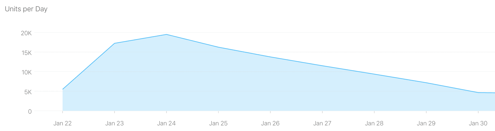
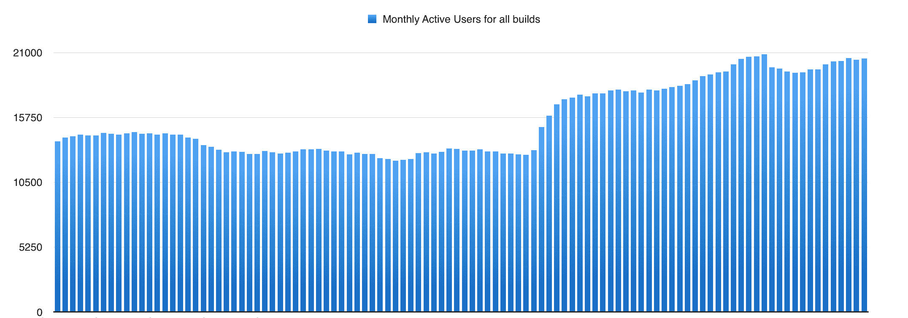

# 我继承了一个失败的创业。我是这样扭转局面的。

> 原文：<https://www.indiehackers.com/interview/i-inherited-a-failed-startup-heres-how-i-m-turning-it-around-90fea3712e>

## 你好！请告诉我们关于你自己和你正在做的事情。

我是首席执行官，克里斯·盖尔西。我在底特律的大都会区长大并上学，我的背景是软件工程(具体来说是 iOS)。除了工程，我在底特律的一所内城中学工作了 2 年。这是一次大开眼界的经历，当谈到教育系统和市内学校相对于郊区学校的劣势时。

我在 2014 年 8 月搬到旧金山，从事 Handle 的工作。在一家大公司，我每天至少会收到 200 封电子邮件，对我来说，让事情井井有条的斗争是真实的。当 Handle 的创始人肖恩·卡罗兰(Shawn Carolan)向我展示该产品的早期版本时，我立刻就喜欢上了它。

Handle 结合了你的待办事项、收件箱和日历。影响我决定加入的一个因素是从收件箱中取出一封邮件，并把它放在你的待办事项列表中。我们都以不同的方式入侵过电子邮件，以接近这种行为，标记未读、标记、贴标签等等。人们努力保持他们的收件箱有组织是一个真实的，当肖恩打开潘多拉的盒子，并介绍我处理，我被吹走了。

## 目前你自己在运行 Handle，但并不总是这样。你加入的时候是什么样的？

我以软件工程师的身份加入了 [Handle](http://www.handle.com) 。离开底特律的家人和朋友不是一个容易的决定。搬到一个新的地方，尤其是像旧金山这样昂贵的地方，是我一生中迄今为止做的最困难的事情。

当我加入时，Handle 刚刚完成了 A 轮融资，总额近 1000 万美元。这个团队很大，大约有 15-20 名员工。在风险投资资助的湾区初创企业的早期阶段，目标是爆炸性增长。你以完美为基础来评估公司的价值，从而尽你所能地用篱笆钉住它。人们感兴趣的是一家在短时间内从种子公司成长为全球霸主、估值超过 10 亿美元的公司。我们尽全力荡向栅栏。

我们在 App Store 发布了一个爆炸性的版本，第一周我们仅在 iOS 上就有超过 10 万的下载量。尽管发布会非常成功，但由于缺少功能和 UX 问题，我们很快失去了所有的新用户。我们的增长和保持不佳，我们需要争夺和重组。

旧金山有如此庞大的工程师和设计师团队，我们的烧钱率很高。每个月的工资和其他费用总计几十万美元，是的，每个月。我们的钱很快就用完了，我们不得不做出艰难的决定，将团队几乎减半。我在 Handle 工作还不到一年，这是我第一次经历裁员。这是超现实的，但当尘埃落定，我仍然是团队的一员。

## 你最后是如何独自经营这家公司的？

尽管我们已经将[手柄](http://www.handle.com)缩减到 7-10 人，但我们仍然保持了 15-20 人团队的结构和开销，我们的过程正在消耗开发时间。回想起来，我们应该更加斗志昂扬，将团队人数减少到最多 5 人。

一旦银行账户真的开始亏空，我们就寻找收购机会，并找到了几个。团队解散、公司没有员工的那一天，就是我们拒绝了一家价值数十亿美元的公司的大规模收购要约的那一天。这是一项要求大多数员工加入新公司的协议。不幸的是，我们作为一个团队决定不走这条路。

快进几个月:我在 Glassdoor 开发他们的 iOS 应用程序。Shawn 给了我一个机会:退出 Glassdoor，接管 Handle，做你认为应该做的事情来扭转局面，并完全控制资产、银行账户、法律决定、代码库等。有什么问题吗？如果你想给自己发工资，想办法让生意成功。

我为这个决定挣扎了将近整整 5 分钟，但最终还是很简单。从每一个可能的角度来看，对我和我女朋友来说，这在经济上是一个坏主意。我几乎肯定会花光大部分积蓄。考虑到所有这些，我问自己是否会后悔没有走这条路，答案是 100%会，因此我决定冒险一试。

## 作为一个 solo 开发者继承一个大的代码库和现有业务是什么感觉？你的技术是什么？

[Handle](http://www.handle.com) 是我用过的最大的手机应用之一。单个应用程序内置了一个电子邮件客户端、一个功能齐全的待办事项列表和一个日历系统。仅仅其中一个就可以成为一个大的应用。由于代码的复杂性以及我是唯一一个处理 Handle 的人，我不得不做出一些艰难的选择。

我立刻决定，作为唯一的开发者，我不能同时支持 web 和 iOS。大多数用户都使用 iOS，而我的专长是 iOS，所以我决定将增长和盈利的主要重点放在 iOS 方面。我花时间实现一些功能，我认为这些功能会带来有机增长、更高的留存率，并且不会对网站流量产生任何负面影响。

在 iOS 和 web 上，Handle 使用各种服务。两个大的是[火基地](http://www.firebase.com)和[英雄](http://www.heroku.com)。Firebase 主要用于存储待办事项，而 Heroku 则用于认证和分析。我进一步依赖 [Mixpanel](http://www.mixpanel.com) 和 [Fabric](https://get.fabric.io/) 进行分析。(在这一点上，Mixpanel 实际上相当昂贵，所以我可能会迁移到 Google Analytics。)我不得不推迟这些杂务，因为它们对短期增长几乎没有任何价值。广泛的分析对于长期规划和增长当然非常有用。

## 在生产力领域，你有很多竞争对手。你有什么策略来减少噪音和增加手柄？

生产力领域的竞争非常激烈。单身员工的一个好处是，我可以考虑用户反馈和当前趋势，并迅速决定要开发什么功能。我在同一天收到了反馈并实现了所有的功能，这在大型团队中通常是很难做到的。作为产品所有者和开发人员，评估我所开发的每个特性的投资回报要容易得多。

目前的策略是围绕待办事项清单开发新功能。我的重点是让计划和组织尽可能的快速和简单。我会立即在 Twitter、Reddit、LinkedIn 等网站上发布我正在开发的功能。获得反馈的最佳方式是以 gif 或视频形式发布特征。我用这种方式来争取支持，同时在发布之前收集对我正在开发的功能的反馈。

到目前为止，这种策略很有效。2016 年 10 月 25 日全职接手[手柄](http://www.handle.com)。那时，它每周都在流失用户。从那时起，它的月活跃用户从 12.8 万增长到了 20.5 万。为了实现这一增长，我在营销上花了 0 美元。相反，我专注于通过社交媒体平台传播 Handle 消息。自从我接手以来，Lifehacker 已经写了两篇关于 Handle 的文章，苹果在 App Store 的专题页面上的“增强 3D touch”部分下专题介绍了 Handle。

虽然新用户的增加是巨大的，但是如果您计划增加和保持活跃用户，您需要保留这些用户。为了提高记忆力，我在 Handle 中内置了一个规划工具。任何应用程序中的待办事项列表在用户决定不去做他们已经安排好的待办事项的那一刻就分崩离析了。他们最终会列出一个庞大的清单，上面写满了他们错过的承诺——这是一件非常令人沮丧的事情，每天都要打开来处理。

规划功能由单独的工具组成，允许用户快速规划他们的一天，而没有一个巨大的废弃承诺列表的过载。它是在观察依赖纸笔待办事项列表的用户后建立的。他们每天从一张空白页开始，把前一天未完成的重要项目抄下来。Handle 中的规划工具采用了这一过程，并使其更加高效，帮助用户放弃他们的纸笔方法。

我也一直在开发一个功能，这将是一个伟大的增长催化剂。迄今为止，用户没有邀请他人的动机，应用内部的有机增长几乎不存在。这就是共享列表的由来。依靠 Handle 管理生活的用户现在可以在项目、家务、度假等方面与其他人合作。这是 Handle 的第一个特性，为有机增长提供了强大的途径。

我在 2017 年 1 月 19 日推出了这项功能，我使用了我所有的社交媒体渠道以及所有当前 Handle 用户的邮件列表，让他们了解这项功能。发送深思熟虑的更新有助于带回已经停止使用 Handle 的用户。

## 你的营收背后有什么故事？你是如何赚钱的？

当我第一次加入这个团队时，我们还没有建立起一个货币化的结构，这种情况持续了一段时间。我们最终建立了一个订阅服务测试，看看用户会支付多少钱。订阅服务只能在网上看到，因此只有极少数用户看到了付费墙。大多数顾客仍然可以免费使用该产品。

这个小测试的结果很有趣。测试开始时，月收入约为 600-700 美元。目前每月的收入约为 300-400 美元，但问题是:订阅服务后端已经关闭了 8 个月。用户会输入他们的信用卡信息并尝试支付，但我们永远不会实际收集他们的支付信息或向他们收费。现在的收入来自于大约一年前开始付费并且没有取消服务的用户。

[手柄](http://www.handle.com)未来绝对需要增加收入。我没有从公司领薪水，我只能靠积蓄维持一段时间。在没有员工的情况下，Handle 本身的运营成本约为 1000 美元/月。我未来几个月的目标是通过共享列表等功能真正加速增长，同时最终在 iOS 应用中实现订阅模式。

增长和收入之间有一个微妙的平衡。我可以建立一个付费墙，迫使用户要么付费，要么失去访问权限，但我不认为这是未来增长和留住现有用户的正确方式。虽然许多喜欢这款应用的用户肯定会付费，但剥夺那些在 Handle 上投入大量时间的用户的权利是不公平的。目前的用户群对 Handle 充满热情，我相信一个不会将未付费用户拒之门外的订阅模式是正确的选择。这将是避免发育迟缓的最佳方式，同时让用户有机会支持 Handle 的未来发展。

随着收入的增加，我能够雇用更多的开发人员，这将更容易实现当前用户要求的功能。对于 2017 年来说，获得积极的现金流至关重要。用数字来表示，我们的目标是在未来 3 个月内达到每月 1.5 万美元的经常性收入。

## 到目前为止，你学到的最大的教训是什么？如果你必须重新开始，你会做什么不同的事？

我全职运营 [Handle](http://www.handle.com) 时快速经历的一件事就是内疚感。我每天尽可能多的工作，即使在周末也是如此，但是有时候当我没有完成当天的待办事项清单时，我会有巨大的负罪感。这是我在其他公司工作时从未经历过的事情。在我不得不花时间做除了写代码之外的任何事情的日子里，我觉得我是在浪费时间。当我在为 Handle 创建资产、营销材料或写博客时，我会为自己没有写代码而感到内疚。

我很快认识到，我花在成长上的时间最终是值得的。虽然我仍然无法摆脱不写代码的罪恶感，但如果没有为 Handle 带来兴奋，Lifehacker 就不会写关于它的文章，苹果不会特别介绍它，人们也不会发现它。打造产品只是成功的一半，另一半是获得用户。由于营销预算为零，我尽可能多地依靠免费媒体和营销。

在一天结束的时候，我必须让自己保持高效。有些日子是巨大的起伏，我无法停止代码工作，从早上到深夜。也有一些日子，我不得不强迫自己完成一些功能，充分利用一天的时间。

我确实使用 Handle 来保持我的承诺。推动 Handle 特性的部分原因是我认为这将使我更有效率，这样我就可以完成更多的工作。

## 你对有抱负的独立黑客有什么建议？

当构建移动软件时，我发现紧凑的迭代和发布周期是至关重要的，尤其是对于一个小的创业公司。我有大量的 beta 用户，由最活跃的 [Handle](http://www.handle.com) 用户组成。我每隔几天就给他们发送一些功能，并通过脸书小组收集反馈。之后，我确信我发布的特性将对增长和保持以及最小的新错误产生积极的影响。作为一个快速发展的开发人员，beta 组是一个惊人的资源。

在这个过程中，有一本书对我有所帮助，那就是 Ryan Holiday 的《T2 增长黑客营销》。这本书有很多成功的大公司使用增长黑客的例子。虽然我没有采用任何相同的策略，但它帮助我在零预算营销时树立了正确的心态。这本书也很短，当你宁愿花时间写代码时，这真的很有帮助。

## 我们可以去哪里了解更多？

如果你有兴趣跟随我的旅程:[媒体](https://medium.com/@kgellci)，[推特](https://twitter.com/kgellci)，也可以随时联系 [LinkedIn](https://www.linkedin.com/in/kgellci) 。

无论你的目标是什么，Handle 都会帮你实现: [iOS](https://itunes.apple.com/app/id766063605) ， [Chrome](https://chrome.google.com/webstore/detail/handle-for-gmail-google-a/mkcnamloafopbialjjifhnjhddnnoiim) ，[handle.com](http://handle.com)。

—[<picture id="ember8232295" class="user-avatar ember-view user-link__avatar"></picture>Kris](/kris?id=rH4lQJPo1ES1F2wCYB4aCteacAp1)，句柄的创建者

## 想像 Handle 一样建立自己的事业？

你应该加入[独立黑客社区](/)！🤗

我们是几千名创始人，互相帮助建立有利可图的业务和副业。来分享你正在做的事情，并从你的同事那里获得反馈。

还没准备好开始使用你的产品吗？没问题。这个社区是一个认识人、学习和实践的好地方。随意[随便浏览](/)！

——[<picture id="ember8232300" class="user-avatar ember-view user-link__avatar"></picture>考特兰艾伦](/csallen?id=ibTLPyjwVebnZjMGKvz6ztarnuV2)，独立黑客创始人

4votes