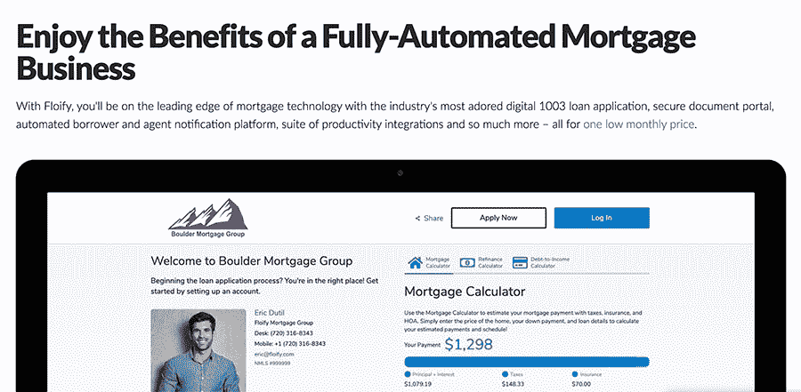
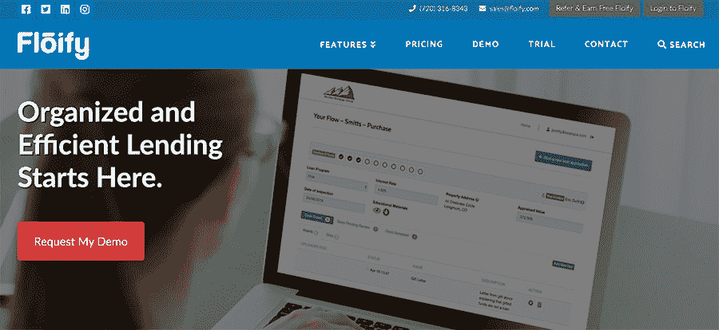

# 我在工作时间跑我的副业。现在它赚了几百万。

> 原文：<https://www.indiehackers.com/interview/i-ran-my-side-hustle-during-work-hours-now-it-makes-millions-35469ddaa5>

## 你的背景是什么，你现在在做什么？

从职业上来说，我一直是一名软件开发人员，已经超过 19 年了。我创办了一家名为 Flux 的软件公司，现在仍在蓬勃发展。Flux 是一个面向银行、金融科技、媒体和娱乐公司的文件工作流程编排平台。我从 2000 年夏天就开始关注这个问题。

大约六年半前，flo lify 脱离了 Flux。Flux 和 Floify 都是自筹资金，随着我们的发展，我们很自然地过渡到了客户资助。

 
 ## How much money is Floify making today?

现在，我们每年的经常性收入高达 600 万英镑。

## 是什么促使你开始使用 Floify？

给你多一点背景资料，我在大约七年前为我的房子进行了再融资。这基本上是一次非常糟糕的借款经历。我知道这对借贷双方都有好处。

所以激励我的既有不良借款人的经历，也有我能为在银行、信用合作社或抵押贷款公司工作的人做得更好的想法。还有能有机会帮助这么多人的激动心情。

我们的平台上现在有超过 100 万的注册用户，这让我震惊，因为美国只有大约 3.3 亿人。事实上，我们已经帮助了 100 多万人，对我来说，这是非常了不起的。

## 一旦你有了想法，你做了什么来验证它吗？

如果我今天再做一次，我会比那时做更多的验证。我做了一点验证:我四处打探，看看其他人是否也在这么做，找到了几家似乎很小的公司，觉得这是一部好戏。幸运的是，它成功了。

## 构建最初的产品需要什么？

一开始，Floify 脱离了 Flux。我们使用了 Flux 的一些开发人员(包括我自己)来构建这个产品。大约三个月后，我们有了一个真正的 MVP。在那个时候，我没有退缩，决定是时候把它拿出来了。我们在 2013 年 8 月推出了这项服务，从那以后，它一直是一个快速、敏捷的反馈循环。

## 你怎么会有时间研究 Flux？

我在 Flux 工作的时候也在做 Floify。因为我是首席执行官和所有者，所以一开始我就把 Floify 作为我的主要项目。这是我日常生活的一部分。  

## 你是如何吸引用户和发展公司的？

开始的时候，很难。最初几年相当艰难，要求推荐，在我们的网站上创建内容，通过朋友传播消息。没什么特别的。

我们做的第一件事就是发布新闻稿，事实上我们通过这种方式赢得了第一个客户。她叫梅勒妮，已经和我们在一起六年半了。虽然我不会说你永远不应该做新闻稿，但我不会推荐它们——它们通常不会产生很多线索。

我们就是我们，所以对你擅长什么要现实一点，知道你可以改进的地方。

TweetShare
 ## How would you describe your business model, and how have you grown your revenue?

我们是一家 B2B SaaS 公司，但我们有点不同于其他人。

我们使用旧的自下而上的模式，因为我们最初出售给个人信贷员。几年后，我们终于能够“长大”并与抵押贷款公司和银行的决策者交谈。

因此，成为我们客户的信贷员把我们介绍给了决策者——过去的土地扩张公司。

## 基于你从中学到的东西，你对有抱负的企业家有什么建议吗？

我会说你的想法绝对可行，我认为 Floify 只是表明它可行的众多数据点之一。

如果我们一开始就试图达成一笔企业交易，那会非常困难。一开始，我是一个内向的软件开发人员，即使我做销售，帮助营销和支持，我也不是一个好的企业销售人员。或者总的来说是个好的销售人员。但是，慢慢开始，在几年的时间里建立信任肯定会奏效。并继续问“你能给我介绍谁？”

## 作为一名开发人员进入销售和营销领域对很多人来说都是一个挑战——在这一点上你有什么建议或者在那个阶段你发现对你有用的东西吗？

我将借用乔科·威林克的一句话，说我有机会克服天生的羞怯，打开开关。要么做，要么不做。所以我做了。

这不是我固有的个性，但如果我不得不热情地与某人谈论我的产品，我可能通常不会表现出我的兴奋。但我做到了，随着时间的推移，这变得越来越自然，因为我真的对我们做过和正在做的一切感到兴奋，所以我只是让这种兴奋闪耀。

## 你未来的目标是什么？

我们的目标是达到一些令人印象深刻的数字，我们帮助的人数真的让我震惊。例如，我们的平台上每月有超过 55，000 笔贷款。在开始的时候，如果我们在一个月内只开始 10 笔贷款，我会非常兴奋。最激动人心的数字是我们每月的贷款额，现在已经超过 150 亿美元。

我从信贷员和我们的企业客户那里听说，我们的软件不仅改善了他们的日常生活，也改善了他们的业务。

## 你面临的最大挑战和克服的障碍是什么？

六年前，我有一个开银行的邻居，我告诉他我在做什么。由于他认为这是一个很棒的想法，我决定让他免费使用，以获得一些反馈。

但是有一个免费客户的问题是，他们并不总是使用产品或欣赏它。因为他们没有付钱，他们没有动力去使用它；那是我第一次也是最后一次免费提供我们的服务。

我会说这可能是你能做的最糟糕的事情之一，因为当有人不为某样东西付钱时，他们就不会那么重视它。或者，他们可能会要求付费用户可能不想要的功能。在我那位拥有银行的朋友的特殊案例中，他的一名员工请求的功能与实际付费客户的功能请求并不一致。我很高兴我很早就学到了这一课。

知道自己擅长什么，不擅长什么，发挥自己的长处就行了。不要免费赠送你的东西。

TweetShare

## 还有什么事情你会做得不一样吗？

雇用聪明、有才华、有动力的人会有很大的不同。我要说的一件事是，当有人加入我们公司时，我们非常重视所有权和信任。我们告诉每一个新员工，他们有自己的自主权和信任，这个范围可以扩大或缩小。

我们希望给人们越来越多的自主权，让他们去做自己的工作，扩大他们的工作范围。然后他们会增加信任。

这是吸引高绩效员工的好方法，因为没有高绩效员工你将一事无成。吸引高绩效员工的一个显而易见的方法是什么？创造一个良好的工作环境，让他们热爱工作；他们知道他们可以锻炼他们的创造力，他们有进步的自由。

## 你发现有什么特别有帮助或有利的事情吗？

对我影响最大的人是杰森·莱姆金。我读过他写的每一个字。我看过他的每一个视频。他在 B2B SaaS 领域，他说的很多话都非常准确。

## 对于任何刚入门的独立黑客，你有什么建议？

充分了解你自己，知道你的副业是否真的能完成。就我而言，我发现我只能在周一到周五阳光明媚的时候工作。所以我调整了我的职业和个人生活来适应这个现实。

为了成为一名优秀的销售人员，我总是不得不鞭策自己一点点，但是你不可能克服你所有的缺点。我们就是我们，所以对你擅长什么要现实一点，知道你可以改进的地方。知道自己擅长什么，不擅长什么，发挥自己的长处就行了。不要免费赠送你的东西。

## 我们可以去哪里了解更多？

*   www.floify.com
*   [推特](http://twitter.com/floify)
*   [Instagram](http://instagram.com/floify)
*   [领英](http://linkedin.com/company/floify)
*   [脸书](http://facebook.com/floify)

对我个人来说，你可以在 [Twitter](http://twitter.com/floifydave) 、 [Instagram](http://instagram.com/floifydave) 、 [LinkedIn](http://linkedin.com/in/floifydave) 上关注我。

——[<picture id="ember8040691" class="user-avatar ember-view user-link__avatar"></picture>戴夫·西姆斯](/floifydave?id=sEZNhQ1uGtSn1ip6bpQoIqtgw0z2)，Floify 创始人

## 想像 Floify 一样建立自己的事业？

你应该加入[独立黑客社区](/)！🤗

我们是几千名创始人，互相帮助建立有利可图的业务和副业。来分享你正在做的事情，并从你的同事那里获得反馈。

还没准备好开始使用你的产品吗？没问题。这个社区是一个认识人、学习和实践的好地方。随意[随便浏览](/)！

——[<picture id="ember8040696" class="user-avatar ember-view user-link__avatar"></picture>考特兰艾伦](/csallen?id=ibTLPyjwVebnZjMGKvz6ztarnuV2)，独立黑客创始人

31votes