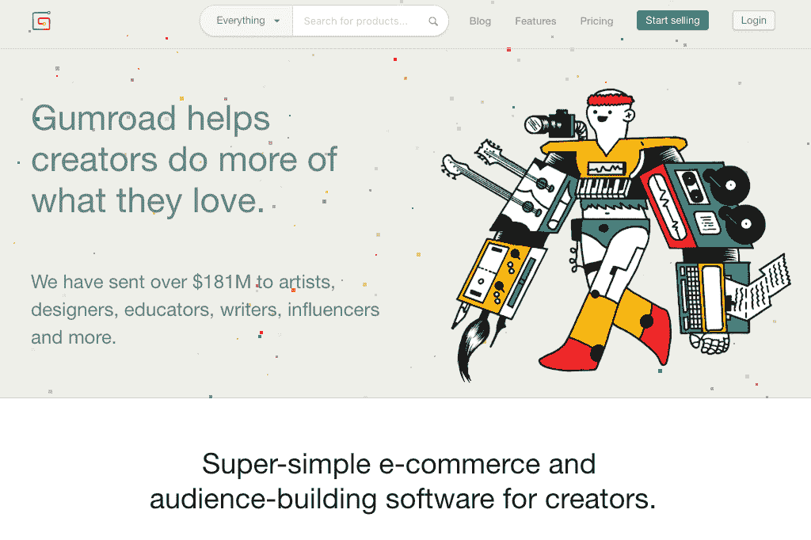

# 我开始 Gumroad 作为一个周末项目，现在它每月赚 35 万美元

> 原文：<https://www.indiehackers.com/interview/i-started-gumroad-as-a-weekend-project-and-now-it-s-making-350k-mo-4fc6cbc0e8>

## 你好！你的背景是什么，你在做什么？

嗨！我叫萨希尔·拉文吉亚。我经营着一家名为 Gumroad 的小公司，我们为数字内容创作者提供一个超级简单的电子商务工具。在那之前，我在 Pinterest 设计和开发东西，包括 iPhone 的 Pinterest。

Gumroad 最初是一个周末项目。我在寻找一种以 1 美元的价格出售图标的方法，但在网上找不到什么好东西。所以我建了 Gumroad。七年过去了，我们每月收入约为 35 万美元，帮助创作者每月收入超过 500 万美元。

 

## 是什么促使你开始使用 Gumroad？

我喜欢建筑材料。我真的很喜欢这个过程，带着一个问题，想出一个解决方案，然后发布一个解决方案的原型，看看我的概念有多好。大多数时候，并没有那么好。

但是有时候事情做得很好，然后我不得不决定我是否真的想继续这个想法。很少情况下，答案是肯定的。Gumroad 就是如此。这个问题的核心对我来说很有吸引力:一个人能让销售变得多容易？

当我刚开始工作时，我的朋友约翰已经创办了一家名为 Stripe 的支付公司，并给了我一份试用邀请。这让我的生活轻松多了。我真的不知道我在做什么，但有些是故意的。我认为在着手解决一个问题之前对它进行过多的研究并不总是那么有利的。对问题所占据的空间及其后果了解太多可能会令人沮丧，可能会让你无法带着清晰的头脑去解决它。尽可能理想化地度过一个周末——你总是可以在以后学习，用增加的知识的背景和视角重新审视这个问题，但你不能反过来做。

几个月后，我离开 Pinterest，全职在 Gumroad 工作，并从 KPCB、麦克斯·拉夫琴和其他投资者那里筹集了 800 万美元。

## 构建最初的产品需要什么？

几乎没有，真的。就在我 2011 年 4 月的一个周末。我在 Pinterest 工作的时候学过 Python，能够拼凑出一个基本的 CRUD 应用程序。整个 Gumroad 就是一个 main . py——一个 Python 文件。它部署在谷歌应用引擎上，所以我不需要知道如何做任何与运营相关的事情，我也不需要。

如果你让事情变得简单，并学习如何从 Stack Overflow 和 GitHub 中复制/粘贴代码，你就能在一个想法上走得非常非常远。只要确保想法简单。我很少从事比周末项目更复杂的工作。

没有什么能像现实生活那样教会你。有时候你只需要走出去开始。只要确保你开心快乐就行了。你在学习。生活的其余部分会自动填充进来。

TweetShare

在 Gumroad 的案例中，包括设计在内，总共花了大约 22 个小时。除了吃饭，我唯一的休息时间是和一个叫约瑟夫·瓦拉的人喝咖啡。那次会议之后，我投资了他的初创公司——他们刚刚以 2.3 亿美元的价格卖给了 Dropbox。所以这对我来说是一个很棒的周末！

## 你是如何吸引用户并发展 Gumroad 的？

总有人问我这个，回答总是超级无聊:我们发了很多邮件。真的是这样。我们在网上搜寻可以从 Gumroad 这样的产品中受益的人，然后告诉他们。几乎成千上万次。这是唯一的方法，真的，当你年轻的时候，没有人关心或知道你是谁，让人们使用你的产品。

随着时间的推移，我们需要做的越来越少。但是，除非你有很多顾客或者其他可以提供一些动力的力量，否则没有什么比敲门更好的了。或者有，只是我还没找到。我的感觉是，人们真的不想给别人发电子邮件，而是在寻找出路。如果是你:停！不存在！蹲下身子，花些时间去找人，通过电子邮件、电话或其他方式亲自联系他们，暂时接受这种情况。

你不能仅仅因为你有一个惊人的发布就摆脱困境。第一天就有近 5 万人来看 Gumroad，太棒了！更多人看到了我们的筹款公告。但是就真正的顾客而言，几乎没有一个是来自那些大张旗鼓的人。在很长一段时间内，这是一个非常稳定的增长，主要是由努力工作的销售团队推动的，尤其是在开始阶段。

我们从未在付费营销、搜索引擎优化或类似的事情上投入大量资金。我们尝试了内容营销；效果还不错，不是很好。到目前为止，人工“销售”效果最好。口口相传让我们超越了这一点。这两件事为 gum road 99%的增长做出了贡献。这不是一个光鲜亮丽的答案，但这是事实。

 

## 你的商业模式是什么，你是如何增加收入的？

我们的商业模式从一开始就已经改变了。一开始我们拿的是 7.5% + 25 的纯交易费。我们最终将其调整为 5% + 30。然后，因为我们希望稳定我们自己的增长，并专注于我们特定的增值(不是支付，而是电子商务)，我们切换到一个混合模式，有几个选项:

*   免费和 8.5% + 30 一次交易
*   每月 10 美元，每笔交易 3.5% + 30 美元

SaaS 有一个非常不同的增长曲线和增长率，但我们认为这是正确的方法，因为我们将 Gumroad 从一个风投支持的初创公司变成了一个伟大的生活方式企业。

支付处理是使用 Gumroad 的核心，但实际上我们只是 Stripe 和 PayPal 之上的一层(占我们交易量的 38%！).我们将很快添加其他技术。因此，我们决定将自己定位为电子商务，并像电子商务公司一样收费。我们目前每月收入约为 33 万至 35 万美元。

如果你有兴趣关注我们的成长，你可以在 [Twitter](https://twitter.com/shl) 上这样做。到目前为止，这是相当一致的——我们构建的东西几乎没有帮助或伤害它。口香糖随着市场的扩大而增长！在你决定做出承诺之前，确保你明白这一点，因为违背市场趋势和现有的消费者行为是非常非常困难的。

除去付款、托管和风险——我们做生意仅有的三项成本——我们可以获得大约 30%的毛利。

| 季度的 | 收入 |
| --- | --- |
| 2012 年 4 月 | 12009 |
| 2012 年 7 月 | 46762 |
| 12 年 10 月 | 57399 |
| 2013 年 1 月 | 183481 |
| 2013 年 4 月 | 167775 |
| 2013 年 7 月 | 267498 |
| 13 年 10 月 | 542430 |
| 2014 年 1 月 | 812664 |
| 2014 年 4 月 | 895899 |
| 2014 年 7 月 | 1198073 |
| 14 年 10 月 | 1677639 |
| 2015 年 1 月 | 1229531 |
| 2015 年 4 月 | 1584734 |
| 2015 年 7 月 | 1832522 |
| 15 年 10 月 | 2047459 |
| 2016 年 1 月 | 2580108 |
| 2016 年 4 月 | 2900184 |
| 2016 年 7 月 | 2716201 |
| 16 年 10 月 | 3139282 |
| 2017 年 1 月 | 3307551 |
| 2017 年 4 月 | 3192912 |
| 2017 年 7 月 | 3053258 |
| 17 年 10 月 | 3456455 |
| 2018 年 1 月 | 3732041 |
| 2018 年 4 月 | 3956820 |
| 2018 年 7 月 | 4296066 |
| 18 年 10 月 | 4354476 |
| 2018 年 12 月 | 5146240 |

## 你未来的目标是什么？

我想让 Gumroad 不仅成为一个伟大的产品，而且成为一个伟大的公司。一家在许多方面对世界产生巨大影响的公司，不仅仅是我们的产品。我们即将开展的最大项目是开源整个项目，这样人们就可以构建自己的 Gumroad 版本，甚至可以与我们竞争。

## 你面临的最大挑战和克服的障碍是什么？如果你必须重新开始，你会做什么不同的事？

我认为最大的挑战是不得不重新考虑我的身份，我不是在经营一家十亿美元的公司，也许永远也不会。从很早的时候起，我就痴迷于成为亿万富翁。这是一个天真的幻想，可能导致我做出一些错误的决定。

如果你让事情变得简单，并学习如何从 Stack Overflow 和 GitHub 中复制/粘贴代码，你就能在一个想法上走得非常非常远。只要确保想法简单。

TweetShare

我现在在一个更健康的地方。我并不想成为一个有远见的人——我只是根据用户的真实反馈对产品进行迭代。很简单，不性感。对我、Gumroad 和我们的创造者来说，这将引领一种更加可持续的生活方式。

还有更多“显而易见”或有形的硬事情，比如裁掉公司 75%的员工，包括我最好的朋友。太重了。每个人都知道这很难，但这是小的，存在的东西会产生影响，你必须准备好后果。

## 有没有发现什么特别有帮助或者有优势的？

老实说，几乎没有。没有什么能像现实生活那样教会你。有时候你只需要走出去开始。只要确保你开心快乐就行了。你在学习。生活的其余部分会自动填充进来。

## 对于刚刚起步的独立黑客，你有什么建议？

首先，给自己造点东西。这样，你至少有一个用户，这比大多数创业公司都多！从尽可能小的地方开始——有人称之为“效用量子”。

然后，确保你对市场有很好的了解。与市场内的人交谈。向他们推销你的产品。让他们使用它。征求他们的反馈。

一旦你有了爱你的用户，剩下的就变得容易多了。这仍然很难——但是专注于前两点会让你朝着正确的方向前进！

尽可能理想化地度过一个周末——你总是可以在以后学习，用增加的知识的背景和视角重新审视这个问题，但你不能反过来做。

TweetShare

## 我们可以去哪里了解更多？

你可以在 Twitter 上关注我或给我发消息，我在那里发的大多是关于口香糖(从不谈论政治): [@shl](https://twitter.com/shl)

我也[偶尔在媒体](https://medium.com/@shl)(很)上写。

当然，你可以在下面评论！

——[<picture id="ember8117395" class="user-avatar ember-view user-link__avatar"></picture>萨希尔·拉文吉亚](/sahil?id=pQPBFnvY9GdPVbFOtQ6rrkgnc0v1)，Gumroad 的创始人

## 想像 Gumroad 一样建立自己的事业吗？

你应该加入[独立黑客社区](/)！🤗

我们是几千名创始人，互相帮助建立有利可图的业务和副业。来分享你正在做的事情，并从你的同事那里获得反馈。

还没准备好开始使用你的产品吗？没问题。这个社区是一个认识人、学习和实践的好地方。随意[随便浏览](/)！

—[<picture id="ember8117400" class="user-avatar ember-view user-link__avatar"></picture>考特兰艾伦](/csallen?id=ibTLPyjwVebnZjMGKvz6ztarnuV2)，独立黑客创始人

190votes