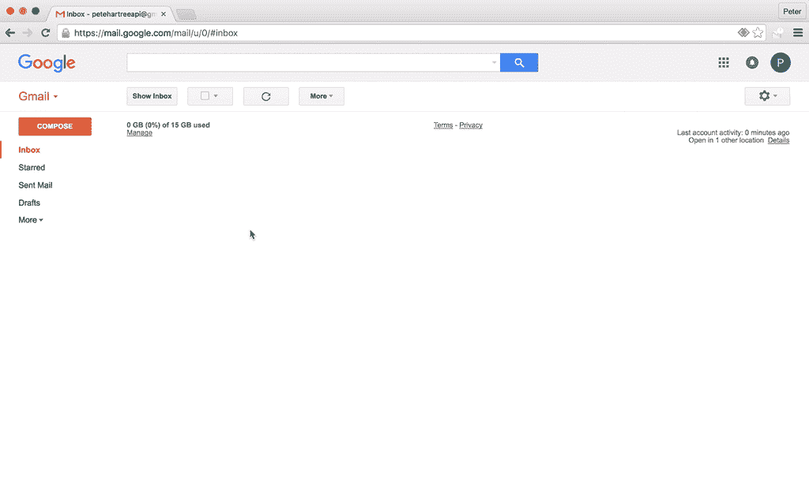

# 我过去常常被电子邮件分散注意力。所以我做了一个工具来保持专注。

> 原文：<https://www.indiehackers.com/interview/i-used-to-get-distracted-by-email-so-i-built-a-tool-to-stay-focused-c0a3d64f27>

## 你好！你的背景是什么，你在做什么？

嗨！我是 Peter Hartree，我是 [Inbox When Ready](https://inboxwhenready.org) 的开发者，这是 Gmail 的 Chrome 扩展，帮助人们建立更好的电子邮件工作流程。

我 12 岁时创建了我的第一个网站，并在青少年时期作为一名自由职业者从事网络开发。我获得了哲学学士学位，然后做了几年自由合同工。我现在(几乎)全职在 [80，000 小时](https://80000hours.org)担任远程角色，这是一个帮助人们在职业生涯中产生巨大积极社会影响的非营利组织。

“收件箱”一开始是一个“挠痒痒”的周末项目。两年后，该扩展拥有 2000 名每周活跃用户和每月 12k 美元的收入。发现扩展很合适的人每周使用它可以回收 30-60 分钟的专注工作。

## 是什么促使你开始使用收件箱的？

在我大学期间，我读过关于[扩展思维论文](http://consc.net/papers/extended.html)，该论文鼓励我们将计算机视为我们生物思维的延伸。从那以后，我想了很多关于“[扩展思维设计](https://medium.com/@peterhartree/extended-mind-design-f8388056f77d)”的问题——我认为这是一个有用的框架，可以用来思考许多通常被称为“生产力建议”、“生活黑客”或“元技能”的技术和工具。

扩展思维的一个关键功能是帮助你有效地分配注意力。默认情况下，我们日常的注意力环境令人惊讶地充满敌意，因为很多演员有强烈的动机去误导我们的注意力。认识到这一点，我开始观察我的注意力在一天中是如何转移的，并采取措施使我的注意力环境更适合卡尔·纽波特所说的“深度工作”。

一天早上，我正在编程，我需要问我的客户一个问题。我打开 Gmail，打算给客户发邮件，但我的注意力立刻被收件箱里的一些新邮件转移了。当我记起我的初衷时(大概 30 分钟后)，我意识到如果我的收件箱被默认隐藏的话，Gmail 对我来说会少很多注意力负担。

第二天，我黑了一个 Chrome 扩展来实现这个功能。我用了几个星期，发现它是我的焦点的一大胜利。我从一天 10-20 次无意中看到我的收件箱变成了一两次有意为之。我在 Chrome 网上商店上发布了这个扩展，并与几个朋友分享，然后继续我的日常工作。那是 2015 年 10 月。

## 构建最初的产品需要什么？

在接下来的几个月里，我开始收到一些感谢、功能请求和错误报告。2016 年春天，我意识到这个扩展已经积累了大约 25 名每周活跃用户和一些完全陌生人的积极评价。

所以我决定在夏天留出 10 天的时间来做更多的扩展工作。我的计划是修复一些错误，设置基本的分析，制作一个营销页面，并做一些用户研究。从根本上说，我想更好地了解这是否是很多人想要的东西。

整个夏天，我给几十个人发电子邮件和打电话，他们说他们喜欢这个扩展。早期的分析数据看起来很有希望——大约 30%尝试过该扩展的人在两周后仍在使用它，许多用户每天都要隐藏他们的收件箱几个小时。这让我觉得我应该继续做这个项目，所以我在秋季又留出了 30 天来专注于产品开发(75%)和用户获取(25%)。

 

到目前为止，该扩展只是默认隐藏了你的 Gmail 收件箱，并在 Gmail 用户界面上添加了一个显示/隐藏按钮。

在与一群用户交谈后，我开始意识到我对这个扩展的最初设想——保护你的焦点，默认隐藏你的收件箱——太狭隘了。我意识到，很多人都有糟糕的收件箱工作流程，可以从一个积极尝试帮助他们培养更好东西的界面中受益。所以我对扩展的愿景变成了“保护你的焦点，培养一个更好的电子邮件工作流程”，我开始尝试一些功能来满足这个用户需求。

这个阶段的功能开发是由定性反馈和我的一般阅读和直觉的混合来指导的。不过，我意识到，没有详细的量化使用数据，很难决定哪些新功能是“守护者”。

所以我花了几天的时间建立使用分析和功能标志基础设施，让我 A/B 测试新功能。我希望进行强有力的认知实验，以衡量新功能对关键行为的影响，比如人们每天点击“显示收件箱”的次数，以及他们让收件箱可见的时间。

这项投资被证明有些不成熟——我的用户群太小，不足以支持我想要运行的许多测试。因此，在此期间，我的大多数决定都是由定性反馈和不太可靠的定量指标来指导的，比如“有多少比例的用户启用并保持使用该功能”。

## 你是如何吸引用户和增加收件箱的？

我的前 100 个用户中的大部分都是通过人工推广获得的。我列了一个名单，上面有几百个我认为准备好了会有兴趣尝试收件箱的人，我分别联系了他们，大部分是通过电子邮件。为了列出清单，我:

*   想到了我所有可能感兴趣的朋友、同事和熟人
*   在 Chrome 网上商店、Twitter 和谷歌上搜索那些对以不同方式解决类似用户问题的扩展不冷不热或持否定态度的人
*   在同一个地方搜索对电子邮件效率感兴趣的 Gmail 用户。

我写了一封主题明确的简短邮件。我通过 [Mailgun 的免费 SMTP 服务](https://mailgun.com)发送电子邮件，这使得跟踪打开率和垃圾邮件投诉变得容易(我没有收到垃圾邮件投诉，我认为这意味着我以合理的方式向正确的人发送了电子邮件)。大约 20%的接受者尝试了延期。至关重要的是，这些人中有相当一部分继续使用这个扩展，并开始在社交媒体和 Chrome 网络商店上支持它。

在超过每周 100 个活跃用户之后，我继续手动推广，但将我的重点转移到了“超级节点”上。这导致特里斯坦·哈里斯、以斯拉·克莱恩和埃里克·巴克等人的支持，新闻报道的涓涓细流，以及[产品搜索的专题报道。](https://www.producthunt.com/posts/inbox-when-ready)

我还在扩展中添加了一些功能，以鼓励人们告诉他们的朋友:在你隐藏收件箱 20 次后显示的对话框，以及在你加载扩展 50 次后出现的自动电子邮件。

以下是一段时间以来 Inbox When Ready 的使用数据:

| 月 | 活跃用户 |
| --- | --- |
| 六月 | 0 |
| 七月 | 26 |
| 八月 | 22 |
| 九月 | 225 |
| 十月 | 404 |
| 十一月 | 810 |
| 十二月 | 844 |
| 一月 | 788 |
| 二月（February 的缩写） | 1206 |
| 瑕疵 | 1402 |
| 四月 | 1519 |
| 五月 | 1644 |
| 六月 | 1760 |
| 七月 | 1744 |
| 八月 | 1850 |
| 九月 | 1959 |
| 十月 | 2078 |

## 你的商业模式是什么，你是如何增加收入的？

[收件箱就绪【2016 年冬季达到 1000 周活跃用户。此时，我确信这些用户中有相当一部分从扩展中获得了一些真正的价值——大约每周回收 30-60 分钟的集中工作。我还觉得，再花 6 个月的时间，这个产品可能会变得更好 2-5 倍，并有可能帮助成千上万的用户实现如此巨大的成功。因此，是时候考虑一下我对这个项目的长期承诺了，还有商业化。](https://inboxwhenready.org)

作为第一步，我制作了一个 Patreon 页面，并通过电子邮件发给了数百名我最热衷的用户。一些用户友好地承诺他们的支持，但两周内很明显，基于捐赠的模式是不可持续的。

我研究了其他流行的 Gmail 扩展如何增加收入，并决定采用简单的免费增值模式。该扩展的免费版在发出的电子邮件中添加了“我准备好了就使用收件箱”的签名——如果你不喜欢这样，你可以支付 36 美元/年的专业版。每个人在注册时都可以获得 14 天的免费试用版。

这个项目从来都不是为了钱，总的来说，我已经为回报感到高兴了。

TweetShare

我不喜欢这种模式——签名作为一种增长黑客，与我对注意力伦理的看法不太一致(在我看来，这是一种相当令人反感的注意力污染形式，因为它依赖于打断电子邮件收件人的注意力)。

从好的方面来说，签名让我可以向所有用户提供所有功能，而不是让一部分功能“只付费”。对于专业用户来说，它也是一个相当吸引人的“请升级”标签，这是我觉得可以要求付费的用户子集。总的来说，签名工作得很好，但我希望能很快找到更好的东西。与此同时，我邀请无力支付的人申请一个[免费的专业许可证](https://inboxwhenready.org/upgrade/#concessions)。

自推出以来，每月收入一直相当稳定。每月的变化主要是由于访问 Inbox When Ready 网站或 Chrome 网络商店列表的人数的变化，这种变化本身也因媒体报道或影响者提及而不时出现高峰。

| 月 | 收入 |
| --- | --- |
| 三月 | 108 |
| 四月 | 918 |
| 五月 | 1514 |
| 六月 | 1152 |
| 七月 | 972 |
| 八月 | 1908 |
| 九月 | 1008 |

注:三月是一个不完整的月份。

我跟踪我花在准备就绪的[收件箱上的所有时间，所以我可以告诉你，截至 2017 年 10 月 1 日，我已经花了 568.5 个小时在这个项目上，我的所有时间有效工资约为 9 美元/小时。](https://inboxwhenready.org)

对于我的个人财务来说，我的边际时薪趋势才是最重要的。它正朝着好的方向发展。在过去的 3 个月里，它从每小时 50 美元涨到了 60 美元。

从狭义的财务角度来看，需要一段时间来收回最初的时间投资，这样我所有时间的有效工资看起来和我仅仅做自由职业者的工资差不多。但这个项目从来都不是为了钱，总的来说，我已经对我在时间上得到的回报感到高兴和感激，这些回报的形式是学习、朋友和乐趣。

## 你未来的目标是什么？

明年这个时候， [Inbox 在准备就绪后](https://inboxwhenready.org)应该至少会提升两倍，并且每周至少有 10，000 名活跃用户。我对这个项目的梦想成果是有效地影响 Gmail 和其他主要电子邮件客户端的设计者(他们每月有超过 10 亿的活跃用户！).

与这种可能性相比，我的个人目标显得微不足道。但它们包括:不断学习(特别是关于产品开发和用户获取)，享受帮助陌生人的乐趣(我每周都会收到感谢邮件，这真的很满足)。额外的收入也不错，如果事情进展顺利的话，可能会改变生活。

最大的挑战是我的时间非常紧张。我可以在这个项目上工作大约 3 天/月，这不会很快改变，因为我强烈承诺每天工作 80，000 小时。

我的默认计划只是在我可用的时间内推进产品开发和用户增长。我的进度会比我希望的要慢，但没关系。

我正在积极寻找潜在的合作者——我希望雇佣能够从事产品开发和/或营销和增长的人，或者与他们合作。我也收到了一些收购咨询，如果我找到一个我信任的人，让这个项目朝着好的方向发展，我会考虑出售。

## 你面临的最大挑战和克服的障碍是什么？

时间限制是我最大的持续挑战。我试着专注于最有价值的活动，对其他事情说“不”。总的来说，比起外包，我更喜欢自动化。

我做了大量工作来保持客户支持负担的可控性，主要是通过解决常见查询的根本原因，并使用模板和脚本优化查询的处理。我通常每周花不到 30 分钟在客户支持上，我在外包上拖拖拉拉，因为事实证明我喜欢这样做，人们似乎很欣赏他们直接从制造商那里获得支持的事实。

在过去的六个月里，用户增长比我希望的要慢一些。在产品开发方面，我可以做很多事情来解决这个问题——on boarding 可以提高两倍，我有一个长长的想法列表，可以让扩展对更多人更有用，从而提高长期保留率。

在漏斗的顶端，我还没有找到一个可重复的活动，形式为“X 和 Y 新人会尝试扩展吗”。如果我能搞清楚这一点，我就能更有信心地在产品开发上投入更多(比如雇人)。

## 如果你必须重新开始，你会做什么不同的事？

如果我再做一次，我会在超过 100 周活跃用户里程碑后马上开始收费。

正是这种有用的反馈让人们愿意付费，而付费用户一旦投入，往往会花时间提供特别有价值的书面反馈。我敢肯定，如果我早点开始收费，产品会更好，会有更多的用户。

## 有没有发现什么特别有帮助或者有优势的？

我在 2015 年通过 Y Combinator 用了 8 万小时，这段经历帮助很大。YC 的许多基本建议非常有价值，你在项目中得到的反馈是一种帮助你内化的训练。对于刚刚起步的人来说，“在你准备好之前启动”，“找到喜欢你产品的人”和“你总是可以做得更少”让我觉得是特别有价值的 YC 格言。

总的来说，专注于最有价值的活动是非常困难也是非常重要的。我自己的过程是制定每日、每周、每月和每季度的计划，在每一级计划中搜索可能性空间，然后对我可能从事的所有看起来有希望的事情的成本和收益进行[费米估算](http://lesswrong.com/lw/h5e/fermi_estimates/)。这些估计经常揭示出期望值的巨大差异，这种差异很难直观地看到。

这些书对我帮助很大，我会推荐给所有的独立黑客:

*   [Ash Maurya 的《瘦跑》](https://leanstack.com/running-lean-book/)——因为他强调速度、学习和专注。
*   Alex Osterwalder 的[价值主张设计](https://strategyzer.com/books/value-proposition-design)—关于用户研究和构思的建议。
*   加布里埃尔·温伯格(Gabriel Weinberg)如果你想创业，在开始创业之前，考虑一下分销是值得的。
*   J.D. Meier 著[以敏捷的方式获得结果](https://www.amazon.com/Getting-Results-Agile-Way-Personal/dp/0984548203)——我读过很多关于个人生产力的书，令人尴尬。这是我最喜欢的。

## 对于刚刚起步的独立黑客，你有什么建议？

如果你还在寻找问题来解决，斯潘塞·格林伯格有一个关于有意创新的精彩演讲。除此之外，他指出，如果你培养技能和领域专业知识的罕见结合，你将更好地产生新的和有价值的想法。

总的来说，我希望看到更多的独立黑客思考他们的工作如何帮助解决世界上最紧迫的问题。即使你不适合直接解决这些问题，你也可以利用你的技能让在这些领域工作的人更有效率。

我们日常的注意力环境令人惊讶地充满敌意。很多演员有强烈的动机误导我们。

TweetShare

## 我们可以去哪里了解更多？

您可以在网站的[收件箱中找到更多信息并尝试扩展。](https://inboxwhenready.org)

我在[推特](https://twitter.com/peterhartree)、[中](https://medium.com/@peterhartree)，我的个人主页是[这里](https://www.peterhartree.co.uk)。

我很乐意回答评论中的问题。:)

—[<picture id="ember8171520" class="user-avatar ember-view user-link__avatar"></picture>皮特·哈特里](/peterhartree?id=H2opxMMmDyU9pUNz8c8S18cTQiT2)，创建者的收件箱准备就绪

## 想建立自己的业务，如收件箱时准备好了吗？

你应该加入独立黑客社区！🤗

我们是几千名创始人，互相帮助建立有利可图的业务和副业。来分享你正在做的事情，并从你的同事那里获得反馈。

还没准备好开始使用你的产品吗？没问题。这个社区是一个认识人、学习和实践的好地方。随意[随便浏览](/)！

——[<picture id="ember8171525" class="user-avatar ember-view user-link__avatar"></picture>柯特兰](/csallen?id=ibTLPyjwVebnZjMGKvz6ztarnuV2)，独立黑客创始人

10votes