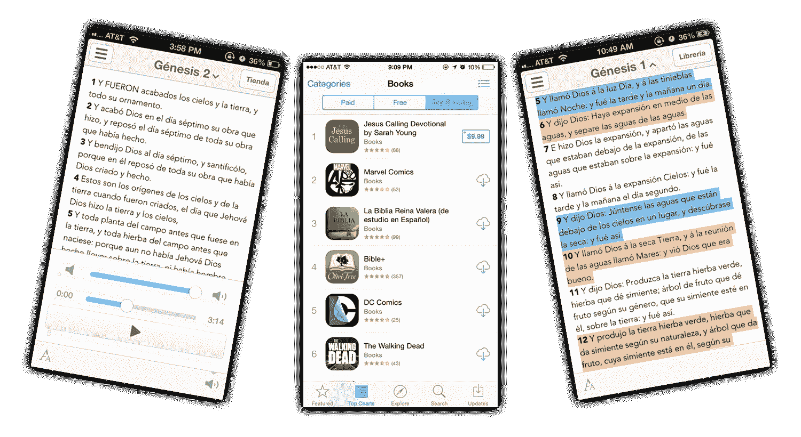

# 发现市场差距，并在应用商店排名第一

> 原文：<https://www.indiehackers.com/interview/identifying-a-gap-in-the-market-and-reaching-1-on-the-app-store-02e756f768>

## 你好！你的背景是什么，你在做什么？

你好！我是特雷弗·麦肯德里克。我创建了 Salem 软件，并在后来出售了它，这是 iPhone 上排名第一的西班牙语圣经应用程序。

不过，我的职业生涯并不是从技术领域开始的。我实际上是去学校拿会计学士和硕士学位的。毕业后，我在硅谷的毕马威会计师事务所当审计员。我的主要客户是 Adobe，所以当你阅读他们的年度报告时，我是幕后人员之一，在每个“I”上打勾，以确保每个数字都是正确的。

(如果这听起来像是一份痛苦的工作，那么嘿，你在一段话里就明白了我花了五年多才明白的事情！😄)

所以我辞掉了工作，创办了塞勒姆软件公司。在美国，它的用户倾向于说西班牙语。人们使用我们的圣经应用程序是因为我们所做的一切——营销、整个应用程序、客户支持等等。—100%是西班牙语。

2015 年，当我把公司卖给 Salem Media(纳斯达克股票代码:SALM，有趣的巧合是我们的名字很相似)时，我们的应用程序每月的收入约为 8000 美元(在苹果削减 30%的收入后)，但每月的收入波动很大。

## 是什么促使你开始使用 Salem 软件？

2011 年底结婚那周，我辞掉了会计工作。我妻子还在犹他州上学，所以我们一结婚，我就搬回了盐湖城。我在银行里存了不到一万美元，谢天谢地，只有一点学校债务。

到达犹他州后，我有一些小的工作机会，但都不是实质性的。我最终从事了一份奇怪的兼职工作，报酬是每小时 15 美元，每周只给我 10 个小时的工作时间。回想起来，这听起来很疯狂，但当时我知道这是唯一的选择。会计职业不是我的选择，在那个洞里多呆几天是我不想去的方向。

圣经应用的目标只是赚足够的钱来付我们的房租:当时是 600 美元。说实话,《圣经》应用只是我当时正在研究的几个想法之一。我不知道自己在做什么，只是在尝试。

## 你是怎么想出这个主意的？

我以一种非常简单的方式发现了这个想法。

我查看了 App Store 每个类别中票房最高的应用程序，并特别寻找了排名较好的应用程序(例如，它们正在赚钱！)但这很糟糕:它们看起来质量很差，或者评论很差，或者两者兼而有之。

我会说西班牙语很有帮助，因为我 20 岁的时候在墨西哥住了两年，但那只是一个幸运的巧合。我确实认为语言障碍帮助限制了竞争，这可能是没有像样的西班牙语圣经应用程序的原因之一，尽管当时应用程序商店已经存在了 4 年。

我认为许多企业家太专注于创造新的东西，然后必须得到验证。

TweetShare

除了浏览应用商店，我没有做任何验证。很明显，圣经是有市场的，我有预感 App Store 上也有这个市场。

我认为许多企业家过于专注于创造新的东西，然后必须“验证”，而不是环顾四周，注意到已经存在并且做得很好的行业。圣经市场已经存在了几百年，基督教也已经存在了几千年……我并不需要去衡量一本存在了几千年的书的需求。需求是存在的。

唯一真正的问题是人们是否会在 App Store 上找到我，竞争如此激烈，我认为我有机会。

## 构建这个应用程序需要什么？

我自己不是专业的开发者，所以我不得不雇佣一个承包商来开发这个应用程序。第一个版本花了大约一个月的时间，花费了 500 多美元，这是我自掏腰包的。第一个版本相当糟糕，但它足够好，可以看看我是否能得到一些牵引力。

我从 Elance(现在是 Upwork)雇了一个叫 Bob 的人。他来自罗马尼亚。我们通过 Skyped 聊过一次，然后我们其余的交流都是通过 Elance。他完成了大部分工作，但在最后说他有个人问题，不能完成这个项目。

我们已经建立了付款里程碑，所以他不像是在敲我的竹杠…我只是为他所做的工作付了钱。这款应用已经完成了 90%,但还有一些功能没有完成，比如在社交媒体上分享一段话。

我不想付钱给别人来完成它，我可以自己编写一点代码，所以我没有尝试去完成那些不完整的特性，我只是进去想办法把它们去掉。这最终是一个伟大的决定，因为这些功能最终并不重要，它让我可以更快地发布应用程序。

我仍然记得那个晚上，我觉得这个应用程序“足够好”可以发布。已经是午夜时分了，我想，“好吧，我现在就把这个上传到 App Store，”好像这是件容易的事。

上传过程一点也不简单，但在某一点上，我只是告诉自己，在我想出如何提交应用程序之前，我不会睡觉。最后花了 4-5 个小时完成所有的工作，但我最终完成了，然后上床睡觉。这种感觉棒极了。

更大的教训是，应用程序可以更好，我可以花更多的时间，但这将是一个巨大的错误。你可以花更多的时间。您可以随时添加新功能。

但在某些时候，你只需要说，“已经完成了”，并把它放在那里。

## 你是如何吸引用户并发展 Salem 软件的？

除了我妻子之外，我没有发布这款应用，也没有把它告诉任何人。

该应用 99%的下载量来自于在应用商店搜索的用户。我们最终在 App Store 的“la biblia”和“la biblia reina valera”的排名中来回徘徊。

有人问，“你真的建造了它，他们就来了？”这在一定程度上是正确的。然而，更广泛的教训是找到需求和市场之间不匹配的地方。这也适用于初创企业和普通企业:解决一个尚未解决的现有问题是最好的营销形式。

一旦我们有了用户群，我仍然需要想办法扩大用户群，增加收入。

我所做的最重要的改变之一是让应用程序免费，并通过出售内容来赚钱。这一夜之间增加了下载量(这并不奇怪),并帮助我们在搜索结果中排名更高。

我尝试与基督教出版商合作营销，但收效甚微。他们的线下渠道比不上已经在 iOS 上等待的庞大用户群。

当公司被出售时，我们已经有超过 130 万的下载量。

## 你如何改变商业模式并增加收入的细节是什么？

我最初对这款应用收费 99 美分，第一个月的收入是 1500 美元。

后来我创建了第二个相同的应用程序，但也包括圣经的有声读物。那个应用程序我们收了 5 美元。该书出版后，我们的收入大幅增长，所以很明显，有声书大受欢迎。

**有声读物**

我做的最好的决定之一是外包有声读物的制作。我在秘鲁找到了一个录音室来录制整本圣经。我们可以这样做，因为在公共领域有大量的旧翻译。他们最初给我报价 30，000 美元来做这个项目，这完全超出了我的预算。

我回去问他们是否愿意出 7000 美元，令我完全吃惊的是，他们接受了！他们说这会花更长的时间，有时他们不得不优先考虑其他项目，但如果我同意，他们可以让它工作。结果花了他们 4 个月的时间，这对我来说完全没问题。

最好的一点是，我将直接拥有有声读物，所以我不必支付任何版税。这也意味着我可以在任何我想去的地方出售有声读物。

我在我们的网站上建立了一个 Gumroad 页面，直接向客户销售(而不是通过苹果从中提成的应用程序)。我还联系了有声读物发行商(有很多！)并在那里签了几笔交易。我把音频调成了可听的。所有这些加起来可能最多一个月 1000 美元，但一旦它们建立起来，就是免费的。

**其他内容**

最终，最成功的应用商店商业模式从付费应用转变为应用内付费的免费应用。有声读物是我们的主要收入来源，所以我决定从头开始重建这款应用，并让它免费，在应用内部有一个内容库，用户可以在那里购买有声读物和电子书。

为了获得内容销售许可，我去了基督教出版会议。我对这个行业一无所知，只是出现在地板上，开始与人交谈。

我对这个行业一无所知，只是出现在地板上，开始与人交谈。

TweetShare

最终我了解到，每个出版商都有一个完整的部门负责旧内容的授权，还有一个授权经理负责整个事情。

我说服这些人把他们的电子书授权给我，我们对半分成。用户将在我们的应用程序中购买和阅读他们的电子书，然后我将支付 50%的收入(同样，在苹果的分成之后)给出版商。

这增加了收入，但只是略微提高了利润。收入分成是一件大事:在苹果降价后支付 50%意味着如果我们以 10 美元的价格出售一本书，苹果得到 3 美元，出版商得到 3.5 美元，我们得到 3.5 美元。好吧，但我更愿意通过我们自己的渠道(如我们自己的网站)销售我们拥有的内容(如圣经有声读物)。

我确实收集了电子邮件地址，并发送了包含交易的电子邮件来增加收入。用户第一次启动应用程序时，会被要求选择订阅时事通讯。到我卖出时，我们已经收到了超过 12 万封电子邮件，所以表现相当不错。

我还在大多数周日(我们一周中收入最好的一天，可能不足为奇)推送通知，对一些内容打折。

## 如果你必须重新开始，你会做什么不同的事？

如果我可以重来一次，我会尝试有偿收购。我一直认为，在通过脸书广告获得新用户方面，我无法与游戏竞争，但实际上我并不确定。

我也会尝试在应用程序中投放广告。这是收购者收购公司后做的第一件事。

## 你最大的优势是什么？有什么特别有用的吗？

显然，懂西班牙语是一个优势，尽管我认为即使不懂这种语言也能做到。这只是让挑战显得更加艰巨。

老实说，几乎所有阅读这篇文章的人都有一个巨大的优势，那就是你很小。你不需要为了增长而在这个月获得一个大客户或者一百万美元的收入。

因为大小对我来说并不重要，所以我完全可以尝试一个疯狂的想法，比如一个西班牙圣经应用程序。当我每月 600 美元的目标变成了 1500 美元时，我欣喜若狂！那些创业者的第一笔钱感觉很神奇。

小也让你可以手动做事。你可以一天到晚跟人打电话，或者发人工邮件。没关系，因为你只需要几个人说“是”就可以动针。

小完全是一个没有被充分谈论的优势。

## 对于刚刚起步的独立黑客，你有什么建议？

别读这个了，去做点什么吧。去卖东西吧。

成功只是一张长长的待办事项清单。它简单明了；这并不容易*。*

 *[怀疑顿悟](https://www.trevormckendrick.com/be-suspicious-of-epiphanies)。成长和成功来自长期每天一点点，而不是相反。

我和其他人一样有计划过度的罪恶感，所以我总是试图提醒自己开始行动，以后再解决细节问题。大多数项目无论如何都不会成功，所以你担心犯的那些“错误”无论如何都不会被发现。

发布一个相当垃圾的 iPhone 应用程序最终成为我一生中最好的创业决定，但当时我并不知道。你看不到那么远，所以今天就把事情做完。

## 我们可以去哪里了解更多？

*   我的博客:[trevormckendrick.com](https://trevormckendrick.com)
*   推特:【twitter.com/trevmckendrick 

我购买 SaaS 的小公司/产品。如果你有一个你可能有兴趣出售的 SaaS 产品，请随时联系我: [【电子邮件保护】](/cdn-cgi/l/email-protection#67131502110815270406170e13060b06040603020a1e49081500)

请在评论中自由提问，我会尽可能的回答。

—[<picture id="ember5283274" class="user-avatar ember-view user-link__avatar"></picture>特雷弗·麦肯德里克](/nyuman?id=TYoDqK4JpSgfYWXUU71BhiQDhK32)，塞勒姆软件的创造者

## 想像塞勒姆软件一样建立自己的事业？

你应该加入独立黑客社区！🤗

我们是几千名创始人，互相帮助建立有利可图的业务和副业。来分享你正在做的事情，并从你的同事那里获得反馈。

还没准备好开始使用你的产品吗？没问题。这个社区是一个认识人、学习和实践的好地方。随意[随便浏览](/)！

—[<picture id="ember5283279" class="user-avatar ember-view user-link__avatar"></picture>考特兰艾伦](/csallen?id=ibTLPyjwVebnZjMGKvz6ztarnuV2)，独立黑客创始人

23votes*