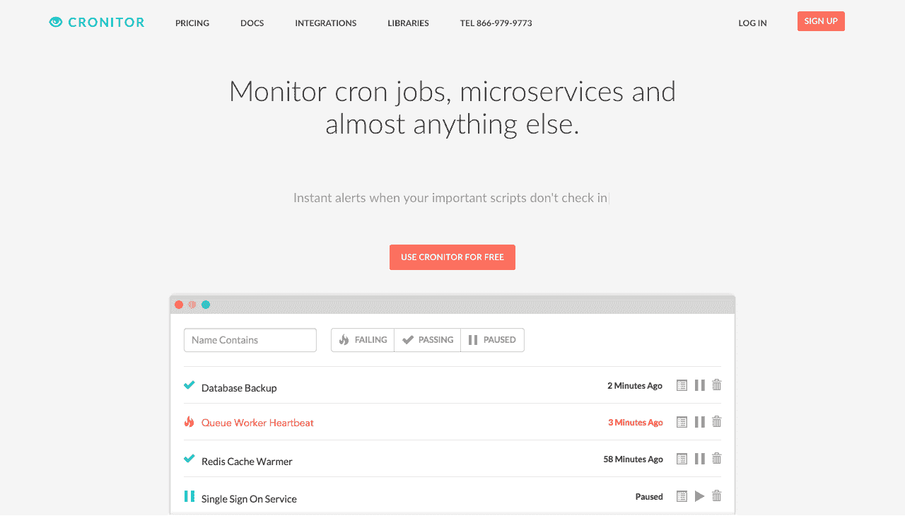
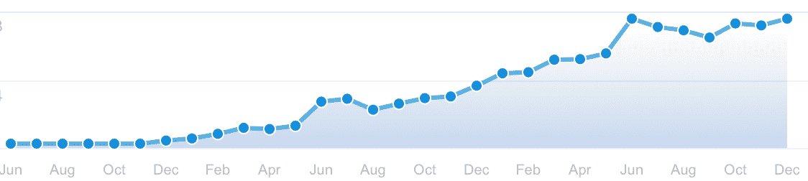
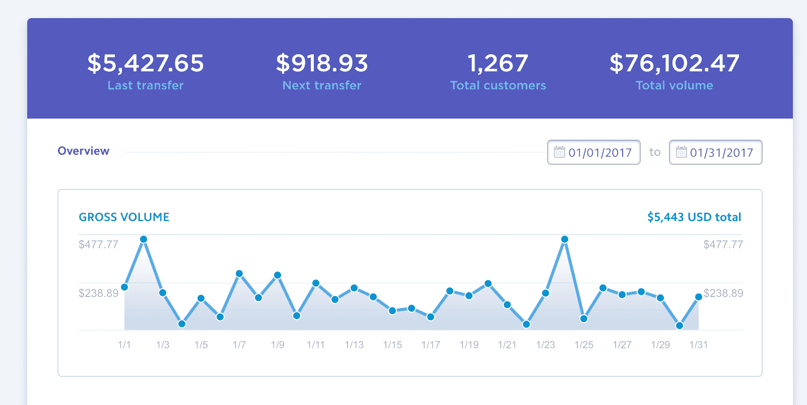

# 发现一个简单的问题并提出一个解决方案，成本达到每月 6000 美元

> 原文：<https://www.indiehackers.com/interview/identifying-a-simple-problem-and-growing-a-solution-to-6000-mo-b92b126fa2>

## 你好！告诉我们关于你自己和你正在做的事情。

我叫奥古斯特·弗拉纳根，是加州伯克利的一名软件开发人员。我和我的联合创始人[谢恩·哈特](https://twitter.com/shaneharter)一直致力于开发[Cronitor](https://cronitor.io)——一款监控 cron 作业/预定任务、web 服务和守护进程的工具，至今已有近三年时间。

如今，我们每月从这项服务中获得约 6000 美元的收入。

## 你是怎么想到克罗尼特这个主意的？

2014 年 3 月，我作为唯一的全职工程师在一家非常小的初创公司工作。我们正在解决一个有趣的现实世界的问题(管理/安排运输车队)，我们每天都在运输软件，让司机们在路上。

我们开始严重依赖 cron 来检查驱动程序进度、处理订单和向客户发送通知。我们在现实世界中如此忙碌，以至于 cron 这么快就成了我们的单点故障，这让我有点吃惊。

我知道我需要开始监控这些任务关键的 cron 作业。一天早上，我花了大约 10 分钟盯着 Monit 文档，并决定必须有一个更简单的方法。我开始寻找一个 SaaS 工具，如果我的 cron 作业停止运行、运行时间过长或者开始重叠从而限制了服务器资源，它会通知我。我找到了几个解决第一个问题的工具，但没有一个能解决其他问题。

那天晚上，我碰巧向我的妻子(也是一名开发人员和创始人)提到了这件事，她说:“哦，我的上帝！我刚刚发现我的数据库备份 cron 作业在过去的两个月里一直失败。我绝对会花钱买那个工具。”

这让我很兴奋，所以我给谢恩发了一条关于这个想法的短信，他立即提到了他在几家大型科技公司担任工程师时，曾几次看到关键的克隆人工作无声无息地失败。基于此，我们决定建立一个原型。

[

克罗尼特今天的网站。](https://cronitor.io) 

## 构建最初的产品需要什么？

我们都在创业公司做全职工作，没有太多空闲时间。这迫使我们对哪些特性可以进入我们的 MVP(最小可行产品)以及哪些可以放弃变得苛刻。

我们认为，使它成为一个有用的工具(并测试它作为一项业务的可行性)所需的最基本要素是:

1.  创建帐户。
2.  创建监视器:定义规则并选择电子邮件或短信提醒。
3.  如果监视器出现故障，则发送警报。
4.  收集付费账户的信用卡信息。

基本的工作相当多，但我们设法在一个长周末把大部分工作拼凑起来。在接下来的 8-10 周内，我们在这里和那里度过了几个晚上，然后我们决定与几个朋友分享它。

我认为也值得指出一些*没有*做到的事情:

1.  编辑基本帐户信息。(差不多过了两年我才加了个表格更新你的邮箱。)
2.  查看显示器的 ping 历史记录/持续时间信息。
3.  为付费帐户创建订阅。(我们在 Stripe dashboard 中为前 20 名左右的付费用户手动完成了这项工作。)
4.  发送自动电子邮件。(我们会手动向每个新注册者发送电子邮件。)

## 推出后，你是如何扩大 Cronitor 的客户群的？有什么营销策略特别有效吗？

我们知道发布只是第一步，我们需要一个吸引首批用户的计划。问题是，我们正在构建一个利基工具，所以它不是很多人会在第一天就尝试的东西。(因为产品相当粗糙，所以更是如此。)

考虑到这一点，我们对最初的营销工作采取了游击式的态度。换句话说，我们打算做一些不可扩展的事情，希望只获得一两个付费客户。

我们的官方“发布”是《黑客新闻》上一篇强制性的[秀 HN](https://news.ycombinator.com/item?id=7917587) 帖子。它设法在头版上出现了一个下午，我们收到了大约 25 个注册。这些人中只有少数人真正创造了显示器，而且没有一个人注册付费计划。

在 HN 的注册人数激增之后，我们做了几件事来保持新用户的流入:

1.  回答了 StackOverflow 的问题。有[个](http://stackoverflow.com/a/24515623/351400)[问题](http://serverfault.com/questions/33145/techniques-to-monitor-cron-tasks)与 cron 作业/调度任务监控相关，我们相信 Cronitor 是许多问题的令人信服的解决方案。
2.  添加了一个来自开源库的链接。Shane 为在 PHP 中创建守护进程的[维护了一个相当受欢迎的库。Cronitor 对于简单的守护进程心跳监控非常有用，这是一种交叉提升它的简单方法。](https://github.com/shaneharter/PHP-Daemon)
3.  创建了一个 [Stackshare 页面](https://stackshare.io/cronitor)。
4.  将 Cronitor 提交到 Startupli.st. [尼克·弗罗斯特](https://twitter.com/thinker)曾经运营这个伟大的网站，可惜现在已经不在了。这是一个关于新的创业公司/微服务的综述，有着不错的时事通讯和 Twitter 追随者。被包含在他们的每周电子邮件中是我们获得第一个付费客户的原因。
5.  将 Cronitor 提交给[一件事做好](http://onethingwell.org/)。类似于 Startupli.st，但更侧重于开发工具/软件。他们花了几个月的时间才发布了我们，但我们至少有两个付费用户被收录到了他们的日常电子邮件中。这感觉像是验证这个想法的一个真正的转折点。我们在工作中休息了一会儿，但是那些注册让我们每周花几个小时重新开始工作。

这些努力加上在其他一些小论坛上发帖和给朋友发邮件，为我们带来了第一批 6-10 名用户。

我们之前讨论过的一件事(甚至在我们写一行代码之前)是，我们正在构建一种人们永远不会想到的产品类型，直到他们迫切需要它——也就是说，只有当你在生产中被一个失败的 cron 工作烧伤时，你才会去寻找这种类型的东西。

考虑到这一点，我们开始编写高质量的文档来帮助我们的 SEO。我们开始编写文档，专注于使用 Cronitor 解决人们可能会搜索的特定问题，如[监控 cron 作业](https://cronitor.io/docs/cron-job-monitoring)、[监控 Windows 计划任务](https://cronitor.io/docs/windows-scheduled-task-monitoring)或 [cron 作业时间跟踪](https://cronitor.io/docs/cron-job-time-tracking)。

我们知道这不会是一夜之间的胜利，但是我们花在文档上的时间越多，我们在谷歌上做得就越好。在过去的两年里，有机搜索一直是我们最好的获取渠道。

## 你的商业模式是如何运作的？你的营收背后有什么故事？

Cronitor 真正让我们兴奋的一件事是，从一开始就很清楚，我们将把它作为 SaaS 的产品来销售。我们将根据显示器数量、用户数量和其他一些特征进行细分。作为产品的用户，我们觉得我们可以想象不同类型的公司会为这些不同的计划买单。

对我们来说，在第一天推出付费计划非常重要。我们都相信我们正在构建的产品的实用性，但我们不仅仅是为了构建软件而构建它。我们想证明这有可能成为一项真正的业务，而最好的方法就是让人们输入信用卡。

我们花了很多时间讨论如何给我们的产品定价。我们不想把价格定得太低，但同时我们推出了一个非常简单的服务，我们想吸引早期客户。最终，我们决定推出三种计划:6.99 美元、19.99 美元和 49.99 美元。我们最初的几个用户主要是 6.99 美元的计划——当我们的第二个有机注册选择 19.99 美元的计划时，我们激动不已。

大约 6 个月后，我们对产品进行了一些改进，决定将价格提高到 9.99 美元、24.99 美元和 49.99 美元。人们不断注册，我们增加了几个经常被要求的功能(团队、页面任务、Slack 集成)，所以我们决定再次提高价格，现在是 24 美元、69 美元、149 美元。

在下图中，您可以看到最近一次价格变动发生在哪里(2015 年 6 月),此后收入开始快速增长:

收入，2014 年至 2016 年。

提价对业务也有另一个影响。它改变了注册的客户类型。在较低的价格下，我们得到了许多爱好者或小型开发商店的注册。虽然我们会对我们能得到的任何客户感到高兴，但我们注意到，一旦这些用户(他们往往对价格更敏感)不再频繁地注册，就会发生一些变化:

1.  我们的流失率下降了——我认为这是因为我们的用户现在是更成熟的企业，他们不太可能通过每年削减几百美元来节省成本。
2.  事实上，我们收到的关于我们定价的投诉更少了——这似乎违反直觉，但当我们首次推出时，我们每个月都会收到几封电子邮件，批评我们对这样一个“简单的产品”收取如此高的费用。这有点打击士气，也让我们多次质疑我们的定价。
3.  我们收到的定制计划/折扣请求越来越少——我再次认为这可以追溯到价格变化如何改变了我们的客户。如果你是一家大公司的工程师，你需要团队支持，你会毫不犹豫地选择团队计划。但是，如果你是一个需要削减成本的小商店或独立开发商，你肯定会主动要求折扣或定制计划。*注意:尽管我们已经开始关注较大的公司，Cronitor 对任何需要单显示器的人来说仍然是免费的。非营利或开源项目绝对应该联系我们，以安排折扣/免费访问。*

2017 年 1 月的收入，不包括年费。

截至 2017 年 1 月，克罗尼特的月收入约为 6000 美元。去年我们的利润率是 77%。因为这是纯软件产品，所以我们的主要支出也是软件服务也就不足为奇了:

*   [AWS](https://aws.amazon.com)~ $ 400/月
*   [条纹](https://stripe.com)~ $ 300/月
*   Twilio～120 美元/月

我们还为其他一些让我们生活更轻松的服务付费，比如 Pobox 和 MailChimp。

## 你未来的目标是什么，你打算如何实现它们？

使用 Cronitor 最酷的事情之一就是看到人们用它做我们从未想过的事情。Cronitor 是一个非常简单的工具，但是它的灵活性使它非常适合于解决那些不适合其他监控解决方案的问题。例如，我们让客户监控多步 ETL 过程、docker 容器、在使用第三方 webhooks 时发送通知，以及在部署或测试套件完成运行时通知团队。

看到 Cronitor 的所有这些聪明的用法(并提出一些我们自己的用法)使我们扩展了我们的使命，不仅仅是 cron/heartbeat 监视。我们的目标是能够监控任何可以发出或者*接收*HTTP 请求的东西。为此，几个月前我们增加了创建将 ping 你(而不是你 ping 我们)的监视器的功能，主要目的是使[监视微服务](https://cronitor.io/docs/micro-service-monitoring)更容易。

有很多类似的工具用于监控网站，但我们真正想要的是一种在我们的代码中定义路由的地方配置这些类型的健康检查的方法。我们一直致力于解决这个问题，并很高兴在本周发布我们称之为“[自动健康检查](https://cronitor.io/docs/django-health-checks)的测试版。我们认为这对于任何网站开发人员都是有价值的，但如果您正在管理一个具有数十或数百个端点的大型微服务部署，这一点尤其有价值。

我们的第一个 SDK 是为 Django 开发的，这是我们最熟悉的框架，但是如果这类工具令人兴奋，我们计划在未来几个月发布 Express、Rails 和 Laravel 的 SDK。

除了上面提到的产品目标，我们两人都有一个稳定的收入来源，可以支付我们的抵押贷款。我们住在海湾地区，那里的房价相当高，但我们认为，到 2017 年底，我们将能够独自从克罗尼特支付我们的抵押贷款。到了这一步，维护一个副业项目的额外时间和努力变得非常值得。

## 你面临的最大挑战是什么？如果让你从头开始，你会有什么不同的做法？

我认为让我们俩都感到惊讶的一件事是，联合创始人关系需要付出多大的努力。谢恩和我是多年的朋友，在创办 Cronitor 之前就一起工作，但当我们成为联合创始人后，我们的关系发生了很大变化。

我们必须弄清楚如何以一种富有成效的方式与对方意见相左，以及如何抛开我们的自我，以建立我们自己无法建立的东西。如果你问我，我认为我们在这个项目中最大的三个挑战是什么，那肯定不会在列表上。

现在，经历过这些之后，我一直在询问创始人/阅读更多关于联合创始人关系的内容，结果发现这是一个非常普遍的主题。杰西卡·利文斯顿[提到过](http://www.foundersatwork.com/1/post/2012/10/what-goes-wrong.html)她花了很多时间在 YC 批次中调解联合创始人的纠纷。

虽然我不会做任何不同的事情，但我会建议任何考虑与朋友或同事一起创业的人，不要只关注产品，而是要确保他们也投资于与联合创始人的关系，并确保他们在出现问题时进行诚实的对话。这些对话发生得越早，你就越有可能超越它们。

## 你最大的优势是什么？有什么特别有用的吗？

我认为我们早期最大的优势是我们在为自己建造[克隆人](https://cronitor.io)。当在 MVP 上工作时，我们从来没有真正想过“我们的用户希望它如何工作”。我们只是建造了我们需要的东西，并尽快开始用狗食喂养它。

有一个合作伙伴也是非常有益的。Cronitor 仍然是一个小企业，但有很多时候，有人可以一起讨论问题，调试生产问题，或者只是在发生糟糕的事情时表示同情，这些都有很大的帮助。在过去的三年里，它给了我们不断改进和增加新功能的能量。

## 对于刚刚起步的独立黑客，你有什么建议？

从第一天起，我们就有一种心态，我们不应该做任何可以推迟到以后的事情。我们称之为 [JIT 思维](https://blog.cronitor.io/the-jit-startup-bb1a13381b0#.ri832q558)。它帮助我们避免了我们以前遇到过或看到别人遇到过的陷阱。向世界展示你创造的东西可能会令人害怕，并且很容易证明继续在没有发布的情况下工作是合理的，这样你就可以发布一些*只是*更加完美的东西。尽量避免。

记住创业需要时间也很重要。一夜之间什么都不会发生。创办一家公司可能需要数年时间。调整自己的速度，记住这是一场马拉松。

我读过的几本书确实帮助我构建了我如何思考创建软件产品或解决问题的框架:

*   史蒂夫·布兰克《顿悟的四个步骤》
*   [杰森·弗兰德和大卫·海涅迈尔·汉森重新制作](http://amzn.to/2lsIvuK)
*   [你潜意识的力量](http://amzn.to/2lgiixg)约瑟夫·墨菲博士著

## 我们可以去哪里了解更多？

你可以在 [cronitor.io](https://cronitor.io) 上试试 Cronitor。当我们认为我们有关于建立业务或应对有趣的技术挑战的有趣事情要说时，我们会将它们发布在我们的博客上。你也可以在推特上和我们联系。

如果有人对我们有任何问题，请不要犹豫，在评论中提问。我们会尽力回答任何问题。感谢你邀请我们上独立黑客节目，科特兰！！

—[<picture id="ember8233798" class="user-avatar ember-view user-link__avatar"></picture>cronitor](/cronitor?id=pfTQFGmxgsbZ7xbikylLD2gTcZr1)，Cronitor.io 的创建者

## 想像 Cronitor.io 一样建立自己的事业？

你应该加入[独立黑客社区](/)！🤗

我们是几千名创始人，互相帮助建立有利可图的业务和副业。来分享你正在做的事情，并从你的同事那里获得反馈。

还没准备好开始使用你的产品吗？没问题。这个社区是一个认识人、学习和实践的好地方。随意[随便浏览](/)！

—[<picture id="ember8233803" class="user-avatar ember-view user-link__avatar"></picture>考特兰艾伦](/csallen?id=ibTLPyjwVebnZjMGKvz6ztarnuV2)，独立黑客创始人

23votes