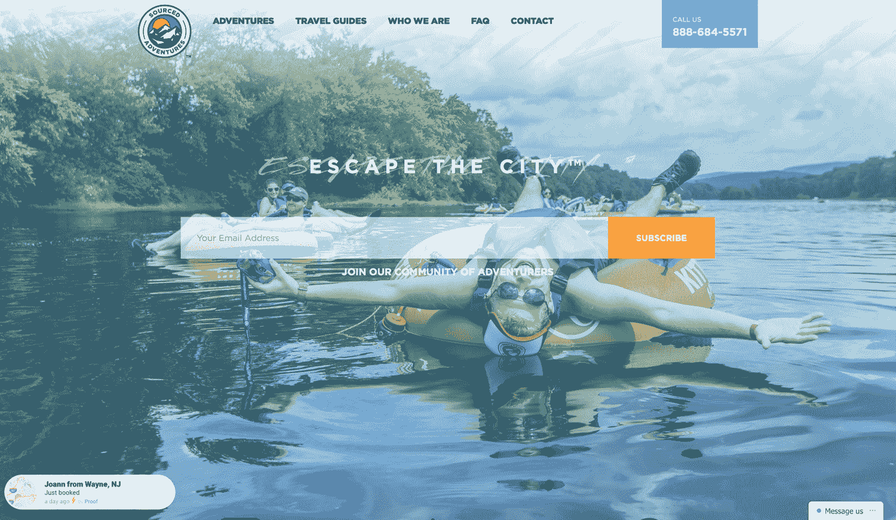
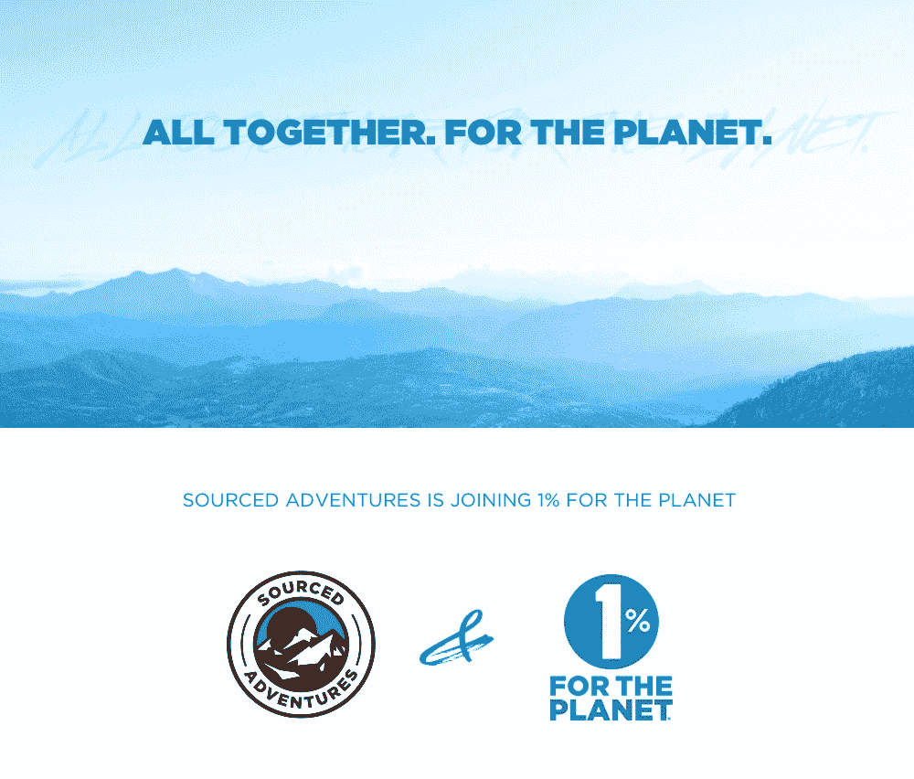

# 在建立我的旅游服务之前识别消费者需求

> 原文：<https://www.indiehackers.com/interview/identifying-consumer-demand-before-building-my-travel-service-ed3190654c>

## 你好！你的背景是什么，你在做什么？

我叫凯尔·戴维森。我是纽约一家在线探险旅游公司 [Sourced Adventures](https://www.sourcedadventures.com) 的创始人。

我们专门从事从纽约市，波斯顿和华盛顿 DC 的一日游，我们在冰岛，墨西哥和尼加拉瓜经营三个目的地旅游项目。我们运营着纽约市和 DC 最大的滑雪巴士服务，并在当地市场运营定期的白水漂流一日游、河流管道一日游、葡萄酒之旅、皮划艇一日游和其他几个项目。

我们 2016 年的总销售额为 150 万美元，在 3.5 年的时间里，我们带了大约 4 万人去旅行。

## 是什么促使你开始《寻源历险记》的？

我在旅游业起步时是旧金山的一名全职导游，为一家名为“难以置信的冒险”的公司工作。

2011 年，在旅行了几个月后，我搬到了纽约，受雇为 LivingSocial 的一个全新部门管理纽约市场。这个部门叫做“冒险”，我们的任务是建立一个内部旅游运营商/旅游业务。我们将其扩大到在美国 30 个市场经营当地旅游。

LivingSocial 在 2013 年进行了裁员，他们取消了整个冒险部门。这给我留下了一个接管它的大好机会，所以我启动了[资源冒险](https://www.sourcedadventures.com)来重启我们的大部分程序。

首先考虑你将如何分发你的产品，然后从那里开始逆向工作。

TweetShare

我向我们最大的供应商之一借了 10，000 美元，他通过帮助我创建 Sourced Adventures 获益匪浅。我用这笔钱购买了我需要的大额保单，并与 LivingSocial 达成协议，在平台上向我们的老客户推销我们的旅行。

在几个月内，我已经卖出了 5000 张我们第一次滑雪巴士旅行的票。第一季的现金给了我足够的钱来维持下去。我不知道这会有用。事实上，我很确定人们不会感兴趣，因为我们在网上没有名气。

我已经被 LivingSocial 解雇了，因为他们停止了整个部门的运营，所以不存在竞业禁止的问题，但是为了完成这件事，我不得不放弃我的公寓，继续失业，并为那 1 万美元的贷款承担个人责任。我当时的经济状况是…零美元。

事实是，如果不利用已经了解该产品的现有客户群，Sourced Adventures 就不会这么快取得成功。当然，他们并不知道 Sourced Adventures 本身，但我已经验证了这个想法，我只是把碎片放回一起。我们只是溜进来填补空白。

如果有一件事我明白了，那就是业务的分销方面，以及分销在旅游业中的重要性，所以一开始我总是专注于这些事情。

## 构建最初的产品需要什么？

最初，我们无法在网上预订来源于[的冒险](https://www.sourcedadventures.com)。没有电话号码，只有一个带有电子邮件支持的登录页面——我每天都会回复大量的支持请求。实际上，我所拥有的只是这一份让我们出名的分销协议。

因此，当我在网站上工作时，当时没有流量，我去了每一个 OTA(在线旅行社)和第三方经销商网站，并说:“看看我们通过一个渠道卖出了多少张机票！你应该参与进来！”我建立了尽可能多的渠道来资助下一阶段。旅游运营商要么没有技术，要么技术很差，这很常见，所以对这些频道来说并不奇怪。

在那里，我建立了一个非常简单的网站，安装了一个预订系统，并开始捕获从其中一个渠道发送给我们的所有客户数据。通过这种方式，我们能够建立一个专门的追随者，并重新营销其他产品。

从公司成立到可以在我们的网站上接受预订，我们花了大约 4 个月的时间。在我们有一个工作网站或任何在线基础设施之前，我们基本上完成了 5000 笔销售。去旅行的人甚至不知道这家公司的名字。

关键是启动并运行我们的预订系统，这样我们就可以开始获取客户数据。我很幸运马上得到了牵引。尽管我们有现金收入，但大部分都回到了业务中。我们的利润并不是很大，因为我们在每一单预订上都向频道支付佣金，所以我仍然在挣扎，但此时我已经承诺全职做这件事了。

我的好朋友达米安，经营着 [https://sammich.shop](https://sammich.shop) 建立了网站的第一、第二和第三(当前)版本。目前的版本是建立在 Wordpress 上的。我的朋友给了我很大的帮助。任何有所贡献的人都这样做了。无论是建议、公关帮助，还是做介绍，我在 LivingSocial 的老朋友都在从内部帮助我。说到底，都是关系的问题。

 

## 你是如何吸引用户和发展来源冒险的？

对我们来说，一直都是在线旅行社，比如 Expedia。然后这些顾客需要到[源冒险](https://www.sourcedadventures.com)来完成他们的预订。之后，我们试图说服他们下次回来直接和我们预订。这对我们来说非常有效，因为我们提供了良好的在线体验、出色的客户服务，并且在重新营销他们可能感兴趣的其他旅行方面做得很好。

我们每月有大约 5-6 万的浏览量。这项业务现在非常庞大，而且是季节性的，所以我们一年中只有 6 个月(1 月到 3 月和 6 月到 8 月)的收入占总收入的 75%左右。

我们每年平均接受约 12000 份预订，在不到 4 年的时间里，总共接待了约 40000 人。

这是我们去年交通状况的大致分类:

*   直接(~25%)
*   有机搜索(约 25%)
*   推荐(约 25%)(主要是在线旅行社)
*   社交型(约 14%)
*   电子邮件(约 8%)
*   付费(约 3%)

直到最近，我们还没有做任何公关，企业旅行的出站冷邮件，或其他 B2B 参与。对于 B2B 推广，我们使用 [reply.io](http://reply.grsm.io/KyleDavidson) 。我们做了大量的电子邮件营销，并通过渠道获得了相当多的预订。然而，第三方联盟网站对我们来说仍然是一件大事。我们与大约 10-15 个销售我们产品的不同网站合作。

我们热衷于发行来传播消息。在旅游行业，你需要出现在每一个频道，除非你服务于一个利基市场或拥有一个人们知道的品牌。每个人都想去激流泛舟或冰岛，但你必须在他们真正想预订的地方找到他们。我不能过分强调分配的重要性。通常你可能会觉得建立一个喜欢你产品的观众群是一项不可能的任务，但是你的观众很可能已经存在于其他地方了。一些平台已经把它们都收集起来了——你只需要找到那个平台并和它们一起工作。

也就是说，我们的直接业务对我们来说是最重要的，也是整个业务未来的关键。现在，我们正在加强我们的付费和点击费营销。在你真正了解你的受众以及如何优化你的广告之前，我不建议在重新定位之外做这件事。

我认为，我能给创业人士的最好建议是，首先考虑你将如何分销你的产品，然后从那里开始逆向工作。你可能有最好的产品，但是如果你还没有想出如何比你的竞争对手更快更有效地把它呈现在客户面前，那就没关系了。传统上，你可能会制造一个产品，然后寻找客户。我更喜欢反过来看问题——找到你的客户，然后生产他们想要的产品。根据我的经验，你可以通过这种方式更快地验证一个企业。

## 你的商业模式是什么，你是如何增加收入的？

我们的大部分收入来自当地一日游。之后是我们的目标产品，最后是我们的 B2B 业务。我们已经开始做很多公司旅行，很多公司把他们的旅行/活动计划外包给我们。我们为 ZocDoc、Google、HelloFresh、Harry's、Nationwide、BlackRock 和许多其他你可能听说过的公司做过企业旅行。

我们使用一个名为 [PeekPro](https://peekpro.com/) 的预订系统/后端，我们使用 Stripe 来处理支付。我们是 PeekPro 的第 25 个客户。他们刚刚推出，只有几个销售人员，所以我就打电话给他们，问我们是否可以参与进来。现在他们是一个大约 150 人的团队。

我们去年的销售额是 150 万美元，今年我们有望实现$2M。以下是我们在线直销的明细:

| 年 | 收入 |
| --- | --- |
| 2015 | 213484 |
| 2016 | 665259 |
| 2017 | 950000 |

(预计 2017 年收入。)

我们业务的最大驱动力可能也是我们最大的弱点。在最初的几年里，我们严重依赖分销渠道，所以很难摆脱它。偶尔，某个频道会决定提高我们的佣金，彻底毁掉我们。这也是我们从一开始就积极尝试多样化渠道的部分原因，这一点很有效。有时我们会在一个频道上做得很好，而其他时候一个频道会在佣金上杀了我们，所以我们不得不在下一季关闭那个频道。压力很大。这就是我们更喜欢直销的原因。

我对动态定价感兴趣，只是想搞清楚一般的定价。对我来说，在适用的情况下，以更低的价格出售你的不良库存，以更高的价格出售你的更有价值的库存是有道理的。供给和需求，就像酒店和 Airbnb 和航空公司做的那样。当需求很大时，价格就会上涨。

起初，我没有想到将这一点应用到我们的商业模式中。现在，我们根据我们系统中大约 7 种不同的定价规则对商品进行不同的定价。例如，我看了一下我们的一次旅行，它最初卖得很好，我试着把最后几张票的价格提高了 5 美元。嘣，成功了！就这样，我在那辆巴士上增加了我们的利润。所以我坚持不懈，我们仍然在寻找新的方法来动态地为我们的旅行定价，这对我们和我们的客户都有意义。

我们努力保持所有产品 25%左右的利润。但很多盈利能力都与收益管理有关，我们试图明智地考虑这一点。把它想象成一架飞机。无论公交车是否满载，我们的运营成本都是一样的，所以当公交车满载时，我们会比满载时多赚很多钱。有了动态定价，这变得更容易了。

例如，以较低的价格出售公共汽车上的前 10 张票，以稍高的价格出售公共汽车上的后 10 张票。或者对 30 天或 45 天的预订给予较低的价格，并在行程临近时提高价格。我们可以自动化所有这些定价规则。在我们的失约率(通常在 5%左右)之下，也有很强的理由通过触摸来过度销售。

自动化一切。说真的，一切。把它变成一个挑战:我能自动化多少事情？

TweetShare

## 你未来的目标是什么，你打算如何实现它们？

我们与 [Sourced Adventures](https://www.sourcedadventures.com) 的一大目标是提供更多的目的地。目前，我们正致力于提供全球几个新目的地的接入，包括瑞典、德国、爱尔兰、特拉维夫、意大利和其他一些国家。我们还刚刚锁定了一个非常好的航空公司合作关系，所以我们希望能够更容易地扩展航班。在国内方面，我们正在启动旧金山。

我们面临的一大障碍是销售、项目开发、运营和客户服务之间的联系。在我们的业务中，我们必须几乎同时扩展所有这些，这极具挑战性。我们发布和实施的每一次新的旅行对整个团队来说都是一个巨大的负担。我们最短的行程可能是 10 个小时，最长的行程是 5 天，这意味着我们花了很多时间和客户在一起。所以一切都需要完美。一直都是。

## 你面临的最大挑战和克服的障碍是什么？

我犯了许多错误——有大有小。我们早期犯的错误是我们获取和维护用户的过程。你*需要*有一个获取用户的可靠计划，以及你将如何与这些用户沟通以保持他们的参与。开始时，我只专注于获得新客户，但从来不考虑一旦我们真的获得了他们，该怎么做。我认为，在最初几年，我们可能因为这种方式失去了很多客户。我们试图向现有客户推销错误的产品，这对他们是一种伤害。

我犯的另一个大错误是在一夜之间将我们的整个预订系统切换到另一个平台。这不仅让我的员工感到不安(他们现在似乎毫无理由地需要学习一个全新的系统)，也让我们的预订软件提供商 PeekPro 感到不安，这是可以理解的，我们一直与 peek pro 保持着非常密切的关系。

我认为这没什么大不了的，但是我发现如果你对你的软件或者任何一种服务不满意，在你采取行动之前打电话给他们告诉他们哪里出了问题是个好主意。你可能会惊讶地发现他们是多么容易接受你的反馈。如果他们不接受，你可以停止使用他们。

## 你最大的优势是什么？有什么特别有用的吗？

看了很多创业书籍，也问了很多人的意见。最近，我喜欢巴塔哥尼亚创始人芮伟航·舒伊纳德的《T4 让我的人去冲浪》。

为了实现这一目标，我不得不放弃我的公寓，继续失业，并为那 1 万美元的贷款承担个人责任。

TweetShare

我们所做的最好的决定之一是加入星球的 [1%。从 1 月 1 日开始，我们决定将总销售额的 1%捐给支持环保的非营利组织。我认为所有企业都应该考虑它们对环境的影响，并实施某种形式的慈善事业。](https://www.onepercentfortheplanet.org/)

除非考虑到对环境的影响，否则你无法计算经营一家企业的真实成本。最让我震惊的是我们得到了多少支持。你的顾客会感谢你，你的员工会感谢你，希望环境也会感谢你。如果我能回到过去，我会从第一天就这样做。

我擅长构建 MVP(最小可行产品),并把一堆软件拼凑在一起，让一些东西按照我想要的方式工作。我们使用大量不同的服务来简化流程，我痴迷于为每件事寻找完美的解决方案。有一次，我在一周内更换了我们的整个电话系统三次，因为我知道它可以做得更好。如果我认为有人有更好的产品或做得更好，我不喜欢满足于此。

我非常喜欢的几项服务:

*   [Chatra](https://chatra.io/) 进行聊天
*   [网络电话的空中呼叫](https://aircall.io/en/)
*   寻求支持
*   社交竞赛用的 Gleam.io
*   [Bill.com](https://www.bill.com)用于虚拟邮寄支票
*   [已开票](https://invoiced.com/)认购&应收
*   [1 对 1 销售邮件回复 io](http://reply.grsm.io/KyleDavidson)
*   [Zapier](https://zapier.com) 用于集成等等

## 对于刚刚起步的独立黑客，你有什么建议？

自动化一切。说真的，一切。把它变成一个挑战:我能自动化多少事情？我也推动我的团队这样做。分析你做的每一件事是很重要的，尤其是那些需要大量时间的事情。事情花费你的时间越多，自动化的回报就越大。我喜欢寻找能为我们省钱的小改进，并随着时间的推移不断积累。

我不断尝试改进我们的内部流程，我发现人们往往不想做出改变。有很多强大的软件，你应该总是寻找新的东西。我并不是建议你为了改变而改变，而是寻找合适的工具来改善你的业务。

我也鼓励独立黑客从第一天开始就构建一切可扩展的东西。从你的客户服务，到工资，到人力资源流程，以及你使用的每一个工具。总是在想，“如果有 10 倍或 100 倍以上的人使用它，这将如何工作？”如果它不能扩展，我不会这样做，除非我不得不这样做，或者这显然是一个巨大的或必要的成本节约措施。

我强烈建议在雇佣别人做某件事之前，先知道如何去做。否则你永远也不会真正知道处在那个人的位置上是什么感觉，或者在那个角色上的成功是什么样子。在繁忙的日子里，我有时仍然会打电话，并且喜欢偶尔被几个客户吼一顿。我通常会立即跳起来，对网站或我们的运营政策进行 10 项单独的修改。

## 我们可以去哪里了解更多？

您可以在[https://www.sourcedadventures.com](https://www.sourcedadventures.com)了解更多信息或预订行程。欢迎在下面的评论区问我们任何问题，我们会尽力回答。感谢阅读，祝黑客快乐！

——[<picture id="ember8091254" class="user-avatar ember-view user-link__avatar"></picture>凯尔·戴维森](/kdavidson?id=5u5N5pVDAofDpEG36SLk7SiiGK32)《寻根历险记》的创作者

## 想像 Sourced Adventures 一样建立自己的事业吗？

你应该加入[独立黑客社区](/)！🤗

我们是几千名创始人，互相帮助建立有利可图的业务和副业。来分享你正在做的事情，并从你的同事那里获得反馈。

还没准备好开始使用你的产品吗？没问题。这个社区是一个认识人、学习和实践的好地方。随意[随便浏览](/)！

—[<picture id="ember8091259" class="user-avatar ember-view user-link__avatar"></picture>考特兰艾伦](/csallen?id=ibTLPyjwVebnZjMGKvz6ztarnuV2)，独立黑客创始人

17votes