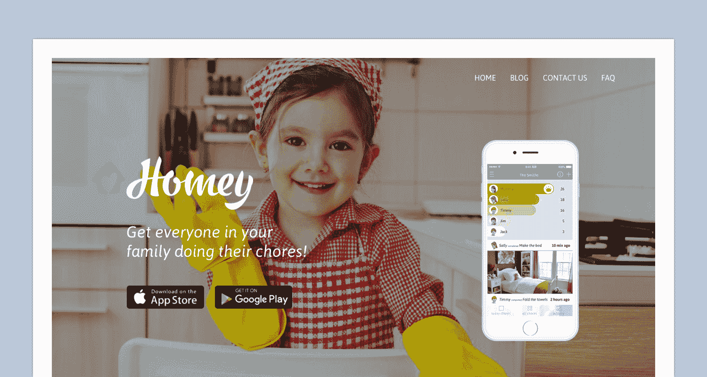
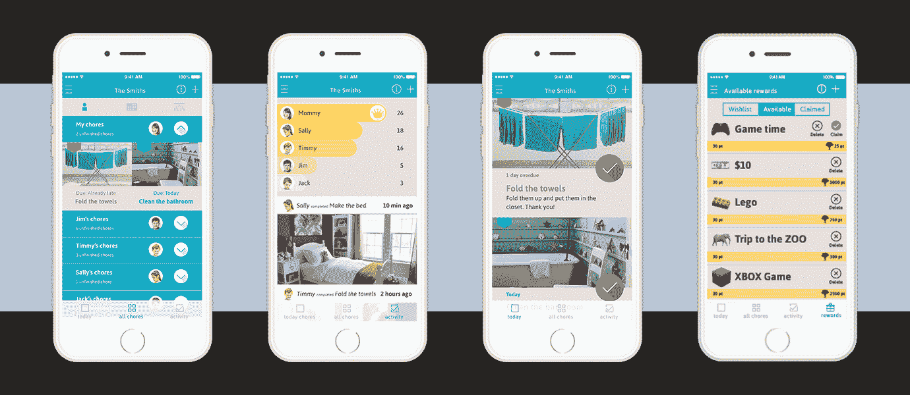

# 通过搬到客户居住的地方来改善我的业务

> 原文：<https://www.indiehackers.com/interview/improving-my-business-by-moving-to-where-my-customers-live-eb3ee0823a>

## 嗨！告诉我们你的背景和你在做什么。

我叫桑佳·泽潘。我有传播学和媒体研究的学位，我是传播学硕士的免修生。我来自斯洛文尼亚，在攻读硕士学位期间，我和我的男朋友开始了我的家庭生活，他是一名经济学家和程序员。我们住在一起，与其他学生合租公寓，我们遇到了许多家庭都会遇到的问题——确保每个人都做好自己的家务。

[Homey](http://www.homeyapp.net) 是一款手机应用，适用于 [iOS](https://itunes.apple.com/app/homey-chores-and-rewards/id1033286805) 和 [Android](https://play.google.com/store/apps/details?id=com.homey.app) ，父母可以给孩子分配家务，并为这些家务设定津贴或其他奖励。家务可以是孩子们在家里的责任或额外工作——他们可以奖励他们额外的工作或两者兼而有之，通过我们正在开发的应用程序的 v2，他们还可以将津贴直接转移到孩子们的银行账户。父母真正喜欢 Homey 的是，它教会孩子工作和延迟满足的价值，并在早期提供财务教育。

虽然这款应用程序可以免费下载，但我们确实提供了一些付费内容，这使得安装速度更快，我们每个月大约可以赚 300 美元。该应用程序的 v2 将有几个按月订阅的高级功能。

我们对目前的增长非常满意，也很高兴我们有高度参与的用户喜欢我们的应用程序，有些人甚至免费为我们翻译，所以我们现在可以提供几种外语版本。

## 是什么促使你开始做 Homey？你最初的目标是什么？你是怎么想出这个主意的？

[Homey](http://www.homeyapp.net) 最开始是一款针对室友和同居情侣的 app。这一切都适用于照片，因为这就是我们之前所做的——互相发送脏乱的照片，并附上一张纸条，“你最好在我回家之前清理干净！”我的联合创始人很快就做出了一个工作原型，尽管他还在另一家初创公司担任 CTO。

我们认为其他人可能会喜欢它，所以我们开始制作一些设计模型。我在 Instagram 上分享了这些，并使用了#DIYchorechart，突然，来自美国的父母(主要是母亲)开始写信询问这款应用程序叫什么，他们在哪里可以找到它。我们制作了一个登陆页面，召集了 500 个家庭来测试这个应用。

根据这一反应，我们认为家庭家务应用比最初的室友应用好得多，我们开始采访父母，决定功能，向他们展示原型，然后开发它。

 

## 在您收集了这些反馈后，构建最初的产品需要做些什么？你准备了多久才发射？

2015 年夏天，我们开始了 beta 测试 [Homey](http://www.homeyapp.net) ，一些非常棒的家庭自愿尝试 buggy 和不断变化的早期版本。

2016 年 1 月，我们不得不按原样发布它，因为进行 beta 测试变得太难了。我们需要让整个家庭都参与进来，这样应用程序才能真正发挥作用，但是孩子们通常没有电子邮件地址，不知道他们的 Apple IDs，也不知道如何加入谷歌社区。

所以我们发布了一个明显未完成的版本，这是最好的决定之一——我们得到了*很多*很好的反馈，也有很多新功能的想法，比如奖励和津贴交易。这对我们来说尤其重要，因为我们自己也不是父母，所以我们不知道父母想要什么。

我们发现教孩子延迟满足对他们来说有多重要(这是未来成功的最大预测指标之一！)，工作的价值，如何管理金钱，成为家庭的一员，以及所有与家务管理相关的技术问题。我们的一些用户以前使用非常复杂的家务图表，甚至在上面贴上美元钞票！

我们很幸运，斯洛文尼亚有一些非常好的创业项目，所以我们的第一笔资金来自无股权赠款。然后我们加入了位于斯洛文尼亚的 [ABC 加速器](https://abc-accelerator.com/)，在斯洛文尼亚获得了更多的资金。

发布后，很明显，我们几乎所有的用户都来自美国，大部分来自南部各州。我们不确定这是否是因为南方的育儿价值观，但我们知道我们需要见见这些父母。我们开始在这个地区寻找加速器，并加入了孟菲斯的 Start Co，这也为我们提供了种子资金和关系，以开发下一个版本，使父母能够真正将零用钱转移到孩子的银行账户。我们在这里与当地品牌建立了第一个合作伙伴关系，这无疑让我们获得了一些认可。

## 你用了哪些营销策略来扩大 Homey 的用户群？

因为我们是出于需要而公开发布的，所以我们没有就此进行任何公开声明或营销活动。我们最初的用户是我们测试的 500 个家庭。但我们仍然发现，人们在应用商店和推荐中找到了我们的应用。我们的早期用户也在他们的社交媒体账户上提到了我们，并在博客上谈论了 is。(尽管当时我们在应用程序中没有任何分享按钮，我们仍然没有给予应有的激励。)

当我们觉得我们的应用程序处于有意义的营销水平时，我们尝试了脸书广告，但我们很快发现它对我们来说太贵了。美国父母是最大的消费者，我们正与最大的家庭品牌竞争，以在他们的时间表中出现。这就是为什么我们决定更加关注病毒式传播和公关。

当我们来到美国时，我们接触了当地的几本育儿杂志，它们覆盖了我们，这给了我们最好的投资回报，因为它是免费的。我们也开始接触妈妈博客，因为我们发现这对我们最有效。

我们还与以家庭为目标的本地品牌合作(例如，孟菲斯的一家本地剧院为通过我们的应用做了足够多家务的孩子提供了家庭系列的免费门票)，并做了一些有助于增长的交叉推广。

## 你的商业模式是如何运作的？你的营收背后有什么故事？

老实说，当我们开始做 Homey 的时候，我们并不确定盈利，在很多方面我们仍然不确定。在我们开始考虑如何赚钱之前，我们希望把产品做好，尽管产品/市场匹配的一部分也是搞清楚用户准备为你的解决方案支付多少钱。

家长们要求一种更简单的方法来安排所有的家务，所以我们做了几个预制的家务包，还有描述、循环和图片。我们决定让其中一些付费，只是作为一个测试，发现许多用户喜欢它们。我们从付费春季大扫除开始，收取最低费用。我们的用户喜欢那个包。

几位导师然后问我们，我们是如何达到这个价格的。我们没有答案！我们把价格提高了一点，发现即使春天早已过去，包装也一样受欢迎。然后我们又做了几包，根据它们的大小来定价。我们没有从中赚到多少钱，因为我们的大多数用户设置了一次重复的家务，然后就不再回到那个屏幕，但这是一个开始。

当我们推出奖励和愿望清单功能时，我们看到孩子们在亚马逊上放置产品链接，所以我们开始与孩子们谈论这个问题。一个小女孩告诉我，她曾经向她的父母要一个洋娃娃。具体来说，她许愿要一个蓝头发的娃娃，结果却得到了一个绿头发的，她肯定不高兴哈哈！她说，现在她只发送她想要的东西的链接，所以她得到了正确的东西。因此，我们将亚马逊联盟链接整合到应用程序中，效果很好——父母为产品支付相同的价格，亚马逊支付我们产品价格的 4-8%。

但是，由于通过我们的应用程序获得的大多数奖励都是货币形式的——要么是定期津贴，要么是做家务的额外工作的钱——我们现在集成了一个功能，让父母可以直接将钱转移到孩子的银行账户。由于方便银行转账对我们来说是有代价的，而且我们还必须处理合规性和各种各样的事情，我们将把它作为一项高级功能，并收取每月订阅费。

但是，即使所有的采访都是关于父母准备为一款能让他们管理家务和津贴并教会孩子工作价值的应用支付多少钱，找到正确的价格点和货币化策略仍需要测试。

 

## 你在 Homey 遇到的最大挑战是什么？知道你现在所知道的，如果你必须重新开始，你会做什么不同的事？

早点想出如何利用这款应用赚钱会好得多。如果我可以重新开始，我会马上启动津贴转移——在技术和伙伴关系方面更困难，但一旦你转移资金，货币化的道路就清晰多了。

我们花了很多时间来改变应用程序中的用户体验，这是我们可以通过样机更好更便宜地解决的事情。有一段时间，我们与一位设计师和一位 UX 设计师合作，他们设计颜色、字体和基本的建筑，但我们没有全职的设计师。因此，所有的 UX 和设计工作都由我和我的联合创始人完成，我们都没有设计背景。

[Homey](http://www.homeyapp.net) 也是 iOS 和 Android 的原生应用，这意味着我们有两条开发路线，而且成本很高。一些功能在一个或另一个平台上姗姗来迟，这使事情变得复杂，甚至像客户支持这样的事情。也许一个跨平台的应用会更好，但是我们也知道这会带来一些麻烦。

## 你最大的优势是什么？有什么特别有用的吗？

很早就加入加速器是我们做出的最好的决定之一——你真的在这么短的时间里学到了这么多。移动到我们的用户所在的地方(在这里是一个加速器)也是非常有益的。来自斯洛文尼亚意味着我们的生活和发展成本更低，这在我们起步时绝对是一个优势。谈到工作，我和我的联合创始人都非常自律，我们合作得非常好。

我们吸引了非常有才华的人与我们一起工作，并全职加入我们的团队，即使对于尚未为人父母的人来说，为父母开发应用程序可能看起来很奇怪。但是同时要孩子和开公司是非常困难的，所以我们认为我们比大多数人处于更好的位置，他们决定解决这个问题仅仅是因为他们在家知道这个问题。

最后，我们读过的最好的书是[Hooked:How to Build habiting-Forming Products](http://amzn.to/2i8stUB)。如果你正在开发一个需要高度参与才能成功的产品，这一点非常重要。

## 对于刚刚起步的独立黑客，你有什么建议？

我想说的是，尽快得到一个你可以和你的用户一起测试的产品是至关重要的。就像刚刚开始收费一样。你可能不会马上赚很多钱，但至少有一些现金流可以让一家初创公司从“我们只是在做一些东西，因为我们对它充满热情”变成一家真正的企业。

我认为另一件至关重要的事情是有导师，并定期与他们会面。它让整个团队变得有责任感，也创造了一个可以在很多方面提供帮助的人的网络——即使不是马上。

## 我们可以去哪里了解更多？

你可以在我们的网站 www.homeyapp.net[上找到更多关于 Homey 的信息，在那里你也可以在 App Store 和 Google Play 上找到该应用的链接。](http://www.homeyapp.net)

我们喜欢听取用户的意见，因此我们非常欢迎任何关于该应用的反馈或问题的电子邮件或评论。如果你还没有孩子，如果你把我们的事告诉你的父母朋友，我们会非常感激！

—[<picture id="ember8005205" class="user-avatar ember-view user-link__avatar"></picture>sanja](/sanja?id=fdxp6GJMKUQENNXobjl6rRjPcWZ2)【Homey】的创造者

## 想像 Homey 一样建立自己的事业？

你应该加入独立黑客社区！🤗

我们是几千名创始人，互相帮助建立有利可图的业务和副业。来分享你正在做的事情，并从你的同事那里获得反馈。

还没准备好开始使用你的产品吗？没问题。这个社区是一个认识人、学习和实践的好地方。随意[随便浏览](/)！

——[<picture id="ember8005210" class="user-avatar ember-view user-link__avatar"></picture>柯特兰艾伦](/csallen?id=ibTLPyjwVebnZjMGKvz6ztarnuV2)，独立黑客创始人

6votes