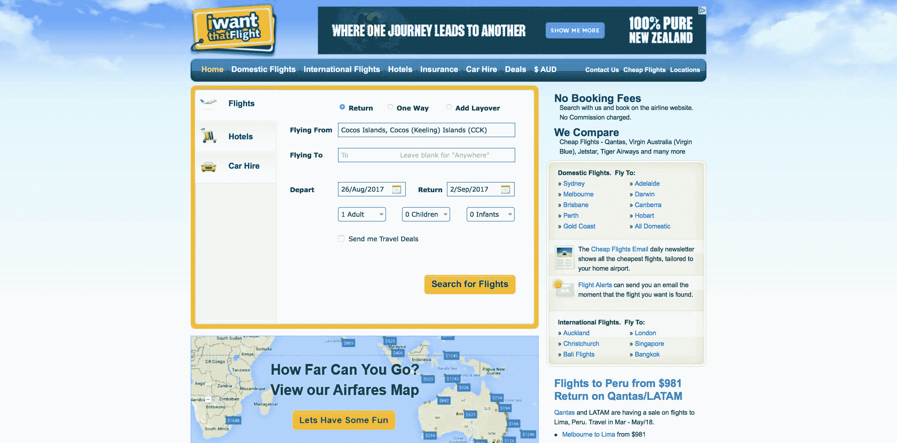
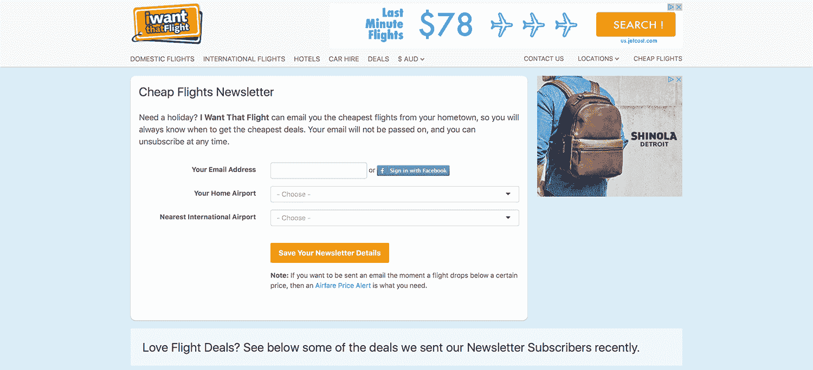

# 长期 It:从每天 20 美元增长到每月 110，000 美元

> 原文：<https://www.indiehackers.com/interview/in-it-for-the-long-haul-growing-from-20-day-to-110-000-mo-c8a638ca1a>

## 你好！你的背景是什么，你在做什么？

嗨，我叫加斯·亚当斯。我是 IWantThatFlight.com.au 的主人。我从小学就开始编程，一直做自己的项目。大学毕业后，我在银行、保险公司和电信公司担任开发人员。

当我在 2002 年开始我想要那次飞行的时候，我已经建立我自己的副业很多年了。它比较了澳大利亚三大国内航空公司的机票价格。

一开始我只给家人和朋友看我的网站，几年来我都没怎么用它。我慢慢地兼职做这个网站，增加功能，走向国际，直到 2012 年网站每月访问量达到 250，000 次，并持续了几年。

在过去的一年里，我真的专注于营销方面的事情，现在它每月有大约 90 万的访问量，每月收入 11 万美元。

我仍然是唯一的全职员工，尽管在过去的几个月里我已经雇佣了两个兼职员工。

 

## 是什么促使你开始我想要那趟航班？

想出这个主意很简单。我想要一种比较机票价格的方法，如果不打开几个浏览器窗口，就没有办法做到这一点。

这是从一个个人项目开始的，所以我是我唯一需要的证明。我只是把它编码，然后个人使用。

一年后，我买了一个域名，并把它作为一个公共网站。当时，该网站只通过几个 adsense 横幅赚钱。这实际上是一天赚 20 美分，但这很好，因为我有全职工作。

2005 年左右，[数独](https://en.wikipedia.org/wiki/Sudoku)兴起，我有幸注册了[sudoku.com.au](http://sudoku.com.au)。几周之内，我在 sudoku.com.au 获得了足够的流量，几个广告的收入超过了我的全职工作。我很快转向全职做自己的项目。

这些年来，随着对数独的兴趣下降，我越来越多地将注意力转移到[我想要那趟航班](http://iwantthatflight.com.au)。

## 构建最初的产品需要什么？

当时我在工作中使用了 VB.net，所以我也用它来建立网站(直到今天我还在使用它)。不幸的是，开发界已经转向 C#而不是 VB，但我仍然对此感到高兴。

其他的技术决策对我来说都不太好。我用 [ZURB foundation](http://foundation.zurb.com) 做手机版，我希望我选择了 [Bootstrap](http://getbootstrap.com) 。

当你是一个人的商店时，时间总是一个限制。所以我想使用安装基础尽可能大的产品，这样所有的错误都已经被测试出来，并且有一个大的社区可以让你学习。

维持这样一个网站很难——我必须和 40 多个机票供应商打交道。

TweetShare

我希望这种飞行方式已经慢慢发展了很多年。一开始，我把飞行结果显示在日历上，因为我认为这是最有用的。但是世界上的其他人认为机票清单更容易理解。这花了我几年时间，但我最终也采用了列表格式。

回过头来看，我应该更早地采用“行业标准”，但是我坚持认为日历视图值得用户费心去理解，因为它允许用户一次比较多天。这些天来，我的想法是，除非你有资源来教育整个市场，否则最好坚持人们已经知道和理解的东西。

现在[元搜索](https://en.wikipedia.org/wiki/Metasearch_engine)已经众所周知，我发现最好的方法是限制开发，简单地跟上 Kayak、Skyscanner 和类似网站的主要功能，并把大部分时间花在营销上。

## 你是如何吸引用户和增长的，我想要那趟航班？

最初推出的[我要那趟航班](http://iwantthatflight.com.au)包括给我朋友的一封群发邮件。

这是在像[黑客新闻](https://news.ycombinator.com)、[产品搜索](https://www.producthunt.com)甚至 [Digg](http://digg.com) 这样的网站出现之前(还记得 Digg 吗？？).大约有 20 个人去看了，然后...蟋蟀。

有几年我真的没做什么推广。直到 sudoku.com.au 的事情进展顺利，我才回来并开始花时间在 SEO 上，这被证明是一个巨大的流量驱动力。在航空旅行中有很多不同的关键词。想想所有的航空公司和他们飞往的所有城市，然后尝试所有的组合——“澳航航班”、“澳航飞往墨尔本的航班”、“澳航从墨尔本飞往悉尼的航班”，等等。出于多种原因，当时开始使用 SEO 是很棒的。

如今，旅游搜索引擎优化已经饱和。而在谷歌上，广告更多，有机结果更少，谷歌自己也有自己的产品——航班[和酒店](https://www.google.com/flights/?f=0&gl=us)[搜索。尽管在 SEO 上投资仍然是值得的，但我已经将我的努力转移到了两个主要方向:](https://www.google.com/hotels/about/)

*   将我的营销内容放在尽可能多的不同平台上。每一条内容(如果可能的话，包括文章和广告)都会出现在我的网站和手机应用程序(Android 和 iOS)、脸书、Instagram、各种旅游论坛上，也会通过电子邮件发给用户。每条消息都是自动定制的，并发布到给定的平台(FB、web、手机等)。)通过我写的程序。像 Instagram 这样的一些网站强制执行一种更加手动的方法，但是我尽量让一切都自动化。
*   我尽量“拥有”用户。我的意思是，一旦用户找到了我的网站，我会尝试让他们注册电子邮件简讯或下载应用程序(而不是引导他们到第三方社交媒体平台)。拥有很好的 SEO 排名或者一个巨大的脸书页面是很好的，但是你总是受到谷歌/脸书的摆布。

 

## 你的商业模式是什么，你是如何增加收入的？

元搜索有很多赚钱的方法。一些是:

*   现场广告。你也可以培养与广告公司的直接关系。
*   航空公司和旅行社为你发送给他们的流量付费。无论是每个访客发送，或当一个销售。
*   电子邮件位置。

当时，该网站只通过几个 adsense 横幅赚钱。它实际上每天赚 20 美分。

TweetShare

目前我们不接受预订。这是我的竞争对手正在做的事情，所以我正在考虑——但增加全职客户支持并不是我轻易能做的事情。

我与 40 多家公司合作，所以我完全自动化报告，以便掌握所有信息。每个供应商或广告商给我一份每日或每月报告，我用它来自动生成发票，并跟进未清债务。

几年前，我还建立了一个联盟项目，这样博客和其他旅游网站就可以为它们发送给我的流量付费。这个设置还有一个意想不到的好处，它为我提供了一种跟踪不同广告活动结果的方法。通过将每个活动或营销渠道设置为联盟，我可以准确地将收入归因于 FB 广告、Adwords、 [Outbrain](http://www.outbrain.com) 或其他来源。

## 你未来的目标是什么，你打算如何实现它们？

对于未来，我想继续增加流量，为此我需要吸引更多的国际游客。今年年初，我试图进军美国市场，但时差被证明是一个主要障碍。

我最近缩小了规模，转向了新西兰。这是一个类似于澳大利亚的市场，我已经和许多相同的供应商建立了关系。而且和墨尔本只有两个小时的时差。:)

另一个重要的考虑因素是不断变化的技术环境。维持这样一个网站很难——我必须和 40 多个机票供应商打交道。当一个新平台出现时，我必须决定在每个平台上投资多少时间，这涉及到重要的权衡。例如，我是为 iPhone 还是 Android 开发(或付费)一个应用程序？目前，我非常关注聊天机器人和语音控制应用程序。

## 如果你必须重新开始，你会做什么不同的事？

如果我必须重新开始，我可能会转向 B2B。像[I Want the Flight](http://iwantthatflight.com.au)这样面向消费者的网站现在竞争如此激烈(例如 Skyscanner、Kayak、Google Flights)，如果没有大笔资金，很难推出。

我学到的最重要的一点是，增加新功能不会带来新访客。随着 sudoku.com.au 人气的下降，我特别了解到这一点。我可以看到每个月的流量都在下降，我疯狂地添加功能，希望能够扭转这一趋势。现有的观众喜欢新增加的内容，但这并没有带来新的用户。

我觉得这是作为开发者比其他背景的人更难面对的。我们乐于编码，但不得不做市场营销时经常会感到不舒服(或者彻底的讨厌)。一旦我意识到让产品变得更好对我来说并不是获得更多流量的现实途径，专注于营销就变得容易多了。

## 你最大的优势是什么？有什么特别有用的吗？

我最初最大的优势是能够自己编码。具有讽刺意味的是，我认为这已经成为我试图扩展的一个小小的阻碍。如果你自己做了这么长时间，很难移交责任和腾出时间进行培训。

这是从一个个人项目开始的，所以我是我唯一需要的证明。

TweetShare

我最近做的最好的决定是开始定期去共同工作空间。除了社会利益(这是我开始去的主要原因)，我不断地学习新技术，以及营销和广告机会，只是通过与不同的人在一起。

以下是我推荐的几本好书:

*   [创业增长引擎](https://www.amazon.com.au/Startup-Growth-Engines-Successful-Extraordinary-ebook/dp/B00LA95B68)——这是一本关于优步、Snapchat、Square 等公司使用的增长策略的 20 个案例研究的书。
*   [牵引](https://www.amazon.com/Traction-Startup-Achieve-Explosive-Customer/dp/1591848369) —更多增长案例研究。

我也喜欢商业历史。排名不分先后:

*   [Netflixed](https://www.amazon.com/Netflixed-Epic-Battle-Americas-Eyeballs/dp/1591846595)
*   [孵化推特](https://www.amazon.com/Hatching-Twitter-Story-Friendship-Betrayal/dp/B00GDJIE1O)
*   [失去信号](https://www.amazon.com/Losing-Signal-Extraordinary-Spectacular-BlackBerry/dp/B00XD1CVJG)
*   [玛丽莎·梅耶尔与拯救雅虎之战](https://www.amazon.com/Marissa-Mayer-Fight-Save-Yahoo/dp/B00R3DEUBW)

一切都很好。

我也阅读营销博客(如 https://detailed.com/ ),并查看产品搜索寻找新的想法。

然而，我只在我休息的时候这样做(例如，在火车上，边吃早饭边看书，等等)。).工作时间是用来编码或实际将营销理念付诸实践的。不要混淆阅读博客/reddit 等。，用于工作研究。

## 对于刚刚起步的独立黑客，你有什么建议？

在你建立你的产品/网站/应用程序之前，确定你将如何营销它。这可能意味着建立一个电子邮件列表，找到一个接受广告的潜在用户论坛，拥有一个受欢迎的 YouTube 频道，等等。

除非你有资源来教育整个市场，否则最好还是坚持人们已经知道的东西。

TweetShare

在开始之前就有观众的额外好处是，你可以在构建的时候从他们那里得到建议，增加你构建用户真正想要的产品的机会。

## 我们可以去哪里了解更多？

这些天我真的没有社交媒体的个人资料。如果你在评论中提出你的问题，我会尽力回答。

——[<picture id="ember8184618" class="user-avatar ember-view user-link__avatar"></picture>加思](/Garth?id=5HP3NYyKpWM1QKHf18joe828N263)《我要那次飞行》的创作者

## 想建立自己的事业，就像我想要那趟航班一样？

你应该加入独立黑客社区！🤗

我们是几千名创始人，互相帮助建立有利可图的业务和副业。来分享你正在做的事情，并从你的同事那里获得反馈。

还没准备好开始使用你的产品吗？没问题。这个社区是一个认识人、学习和实践的好地方。随意[随便浏览](/)！

—[<picture id="ember8184623" class="user-avatar ember-view user-link__avatar"></picture>考特兰艾伦](/csallen?id=ibTLPyjwVebnZjMGKvz6ztarnuV2)，独立黑客创始人

21votes