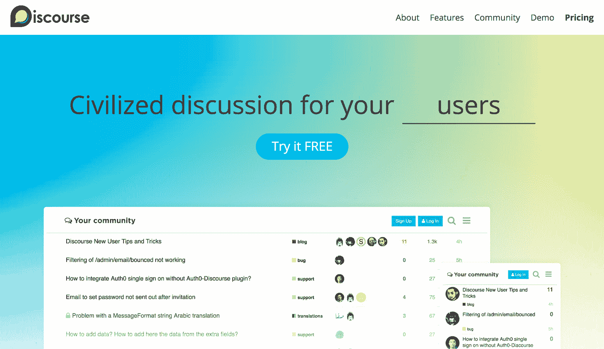

# 杰夫·阿特伍德谈每月 12 万美元的增长

> 原文：<https://www.indiehackers.com/interview/jeff-atwood-on-growing-discourse-to-120-000-mo-51b47125cf>

## 你好！你的背景是什么，你在做什么？

我是杰夫·阿特伍德， [Stack Overflow](https://stackoverflow.com) 的联合创始人，codinghorror.com[的长期博主。](https://blog.codinghorror.com)

自 2013 年以来，我一直致力于[话语](https://www.discourse.org)，一个开源讨论平台。我们经营着一家托管公司，拥有大约 600 名客户；我们目前的收入约为每月 120，000 美元，并且每年都在翻番。

## 是什么促使你开始研究话语？

如果您想要高度结构化的问答，并严格关注学习，堆栈溢出是一个非常棒的工具。但它并不完全是社会性的，它只适用于那些强烈关注数据、事实和科学的话题。我想构建一个开源的讨论软件，它可以作为所有社区的一个灵活的构建模块。

2012 年我离开 Stack Overflow 后，人们有时会向我寻求建议。我必须知道我在做什么，因为我成功了，对吗？嗯，我不知道这些…但我知道，在你所做的事情上取得成功的最好方法不是问一些像我一样的花哨的“专家”,而是问你的顾客、你的粉丝、你的用户、你的赞助人、你的..自己的社区！

为了决定下一步做什么，我们仔细倾听我们的社区和我们的客户。

TweetShare

当然，他们会说。好主意。我们用什么软件来做呢？然后我看了看 2012 年论坛软件的状况，我有点难过，因为它糟糕得令人难以置信。没有什么我可以推荐的，我不会完全不好意思安装在我自己的服务器上。

我开始改变这种状况。受 WordPress 模型的启发，我想建立下一代社区软件，我们都可以为之自豪，它是为互联网的下一个十年而建立的，可以与世界上的 Twitters、Facebooks 和 Snapchats 竞争，它是完全开源的，并且永远对每个人免费。

## 构建最初的产品需要什么？

离开 Stack Exchange 后的几个月里，我一直在思考这个问题。2012 年 3 月，我随机遇到了我的技术联合创始人罗宾·沃德，他之前开发了一款关于论坛文化的网络游戏 ForumWarz，同时还有自己的定制论坛。基本相当于在线讨论有博士学位！如果我虚构了一个同人小说风格的联合创始人，我就不会有比他更完美的了。

我认为这是宇宙在告诉我，是的，你必须继续这个项目！我们都喜欢论坛社区，认为它是黑暗物质，是网络上的 B 级电影，但是我们都厌倦了糟糕的论坛软件。我们分享了建造令人惊叹的东西的热情。我们在几个月内用 Ruby 和(非常非常早期的)Ember.js 构建了一个原型，并开始寻找种子资金。

即使没有人付钱给我，我也要做这件事。我喜欢建造这个东西！

TweetShare

鉴于我之前的成功(当然还有我们演示中完全激进的精彩)，我能够在几个月内获得种子资金，为我们提供两年的充足跑道。此后不久，我们增加了第三位技术创始人，Sam Saffron，他是我之前在 Stack Overflow 项目中的同事，我们继续为我们的初始版本而努力。在发布前的最后阶段，我们在 2012 年 12 月雇佣了我们的第一名员工 Neil Lalonde，团队规模为四人。

## 你是如何吸引用户和发展话语的？

[话语](https://www.discourse.org)是一个开源项目，所以我们不需要它“完成”，我们只需要它处于可发布的测试状态。我们终于在 2013 年 2 月 5 日发布了 Discourse 0.8。记住，如果你不发布一些让你有点尴尬的事情，你发布的太晚了！这确实很尴尬！

但是我们受到了媒体的关注，人们对此很感兴趣。我们收到了很多*关于测试版的警告。这么早就使用话语会有多痛苦？我引用了劳伦斯·特劳德的话:*

[https://www.youtube.com/embed/lSPNQ82Sq4E](https://www.youtube.com/embed/lSPNQ82Sq4E)

我们不打算在大约两年的时间里拥有付费用户，因为我们已经弄清楚了我们在构建什么以及它是如何工作的，再加上征求开源贡献者并普遍发展这个项目。感谢种子投资者！

我们还专注于获得三个大的测试版客户，作为在他们的真实网站上运行我们相当原始的测试版软件的回报，我们承诺白手套一切都会支持和免费托管两年，然后在此后大幅降低费率。我非常相信三个的[法则，它能让你摆脱最初的“我是不是只为自己建造这个？”跨栏。](https://blog.codinghorror.com/rule-of-three/)

在幕后，作为 2014 年的新年目标，我们开始通过一个非常糟糕的特别谷歌文档表单来吸引付费主机客户。我们在 2014 年 1 月关闭了第一个付费企业托管客户。当时，为了简单起见，我们只做一年的电汇和 ACH。不是的。但它让我们在从客户那里拿钱和测试我们的托管服务方面得到了宝贵的锻炼。

到 2014 年 8 月底[,我们发布了 Discourse 1.0](https://blog.discourse.org/2014/08/introducing-discourse-1-0/) ,我们认为它最终足以正式发布并提供真正的托管服务，具有正确的注册表单和正确的 Stripe 自动月结账单。简单多了。当然，你放弃了 2.9%的收入，但我很乐意这样做，因为自动结算和收据很容易。目前，我们只提供两个服务等级:企业每月 200 美元，企业每月 1000 美元。

如果可以的话，卖给其他企业，不会因为每月 200 美元而退缩的客户…卖给有钱人！

TweetShare

在 2015 年 2 月 5 日我们的两周年纪念日，我们扩大了我们的主机服务，这样我们就能够[增加每月 100 美元的标准主机服务计划](https://blog.discourse.org/2015/02/discourse-standard-hosting-plan-now-available/)。此时，我们每月的托管收入高达 40，000 美元。在我看来，我们有两份工作:

1.  确保 Discourse 的开源版本相对容易安装、理解和故障排除。如果人们不能理解它，或者很难支持它，它就不会被使用。开源就是广告！
2.  确保我们的托管平台尽可能可靠、简单易用。润滑客户获取漏斗并将其打磨成镜面光泽，这样*就没人能逃脱了！*muaha 哈哈哈！**

在开源方面，我会给我们一个明确、可靠的 A，但在托管方面，鞋匠的孩子没有鞋子穿，充其量是 c。我们花了太长时间来雇佣一名真正的专业系统管理员，并且在构建足够支持我们增长水平的托管基础设施方面，车轮不断脱落。

我们终于在 2016 年 2 月 5 日获得了[discourse.com](https://www.discourse.com)域名(花费相当大)，那时我们每月的托管收入高达 80，000 美元，我们的团队已经发展到 9 人，包括我们的第一个全职系统管理员。我们将所有服务器硬件放在一起，以提供最佳的性价比，并且我们在新服务器上进行了大量投资，以支持我们的发展。

截至今天，我们的托管收入约为每月 125，000 美元，我们即将关闭我们的第一个非常大的客户，这将使我们的收入增长近 25%。我预计，在 2018 年之前，我们将轻松达到每月 16 万美元。

## 你未来的目标是什么，你打算如何实现它们？

我们有一个大目标:成为社区的 WordPress。WordPress 是我们的精神动物，至少从 2010 年开始。每当有人说，“博客怎么样？”(在某种程度上，人们仍然这么说，我猜)显而易见的选择是 WordPress。每当有人说:“社区怎么样？”显而易见的选择应该是[话语](https://www.discourse.org)。

这里有明确的相似之处，话语变得更像一个通用的 CMS，就像 WordPress 一样。我们已经朝着这个方向迈出了一步，官方插件超越了基本的讨论，让你...

*   向员工分配主题(阿拉·布吉拉，吉拉)
*   对代表特性的主题进行投票(ala 用户之声)
*   将帖子标记为官方解决方案(ala ZenDesk)

…等等。

我们有点像特雷罗，因为我们是所有这些东西的轻量级版本，此外，如果你想要的话，你还可以得到独角兽、彩虹和一个真正的社区。

 

## 你面临的最大挑战和克服的障碍是什么？如果你必须重新开始，你会做什么不同的事？

我从根本上低估了托管公司中开发人员/系统管理员的工作量。如果我必须重新来过，我会更早地雇佣一个全职的系统管理员。

虽然我们强调在 [Discourse](https://www.discourse.org) 工作的每个人(除了一两个例外)都必须具备 devops 能力，但是与推进开源项目相比，你只能在基础设施上做兼职工作。

我也没有完全理解将“社区”作为公司想要的一个功能来推销有多难。如果你考虑任何一家公司的马斯洛需求层次，“社区”几乎不算什么。

我们一直在通过关注话语可以为你解决的更直接的问题来提升我们的等级:客户如何获得支持？你的客户如何为你营销？你的顾客如何互相帮助？你如何告诉你的客户*首先知道要造什么*？

我们最近重新推出了 discourse.org 的，更加关注**话语能为你解决什么问题**相对于“社区”的抽象好处。

## 你最大的优势是什么？有什么特别有用的吗？

我相信讨论软件和围绕这些讨论形成的社区会产生显著的网络效应。越多人看到它，越多人加入，越多人使用它，越多人接触它，并希望它用于自己的站点/业务/俱乐部。

专注于免费开源方面绝对让我们保持诚实。如果人们不愿意免费安装和使用你的软件，你怎么能指望他们会因为托管你的软件而给你任何报酬呢？我也喜欢我们能够把我们的软件送给真正需要它的人，并从中受益。

为了决定下一步做什么，我们仔细倾听我们的社区和我们的客户。这就是[话语](https://www.discourse.org)的作用！我坚信[投诉驱动的开发](https://blog.codinghorror.com/complaint-driven-development/)。

## 对于刚刚起步的独立黑客，你有什么建议？

如果可以避免，不要瞄准低端市场。我得到的最好的建议之一是早期和某人谈论低成本论坛托管。这个家伙基本上抓住我的衣领，给了我一千码盯着说*甜蜜的耶稣无论你做什么，不要做低成本论坛托管！*这个...原来是极好的建议！

我们从 200 美元/月的商业计划开始，立即排除了没有钱的客户。企业有钱，如果你能解决他们的问题，他们会很乐意付钱给你。个人不断寻找低成本的捷径。如果可以的话，卖给其他企业，那些不会因为每月 200 美元而退缩的客户——这并不算多！卖给有钱的人！

当然，我们有面向低预算或无预算人群的开源版本，以及面向流行开源社区的免费 GitHub 项目。

你每天都能看到你的产品。世界其他地方不知道。永远不要忘记，对于绝大多数看过你的软件的人来说，新的用户体验是他们唯一的 T4 体验。如果你想让你的产品更好、更快，在你的公司里灌输一种对新用户反馈的强烈关注。

如果人们不愿意安装和使用你的软件，你怎么能指望他们会因为托管它而给你任何报酬呢？

TweetShare

作为每个版本的一部分，我们还从零开始建立了一个全新的话语实例——既包括“安装自己”版本，也包括我们托管的平台——并努力思考如何改进、简化或更好地解决该过程的每一步，软件如何为您解决这些问题。我们不能弹指一挥间就为你神奇地生成一个充满活力的社区，但是我们想给你最好的机会，让你成功地建立你想要的任何类型的社区。我们选择文明话语构建工具包公司作为公司名称是出于理想的原因，我们的目标是实现这一目标。

永远不要低估润滑和抛光你的销售漏斗到镜面光泽的力量！即使很小的东西也有用。例如，很长一段时间以来，我们要求潜在客户在注册参加[对话](https://www.discourse.org)试验之前，必须先注册一个域名。这太蠢了。对此我仍然羞愧地低下头！

我们现在在注册时为人们提供了一个临时域名，这样他们就可以立即开始使用这个软件，而不是在他们有机会看到对话之前就用一堆晦涩难懂的 DNS 设置。

我喜欢在这个问题上每天去上班。对我来说，互联网是建立在这些充满活力的社区上的，让他们怪异的旗帜飘扬，这些社区拥有自己，不属于脸书或任何其他人。即使没有人付钱给我，我也要做这件事。我喜欢建造这个东西！

## 我们可以去哪里了解更多？

我们的网站在[discourse.org](https://discourse.org)，我们在 Twitter 上的名字是 [@discourse](https://twitter.com/discourse) ，当然，100%开源的 discourse 代码，以及 EZ 30 minute cloud 安装说明，都在[github.com/discourse](https://github.com/discourse/discourse)。

老实说，我不太擅长“业务”，但我更擅长通过交付优秀的产品并可靠地托管它来获得报酬。如果你有任何问题，我很乐意回答！

—[<picture id="ember5301333" class="user-avatar ember-view user-link__avatar"></picture>编码作者](/codinghorror?id=TKEYFYJNOOf2ZioyF8uvmroPa0i1)，话语的创造者

## 想像话语一样建立自己的事业？

你应该加入独立黑客社区！🤗

我们是几千名创始人，互相帮助建立有利可图的业务和副业。来分享你正在做的事情，并从你的同事那里获得反馈。

还没准备好开始使用你的产品吗？没问题。这个社区是一个认识人、学习和实践的好地方。随意[随便浏览](/)！

——[<picture id="ember5301338" class="user-avatar ember-view user-link__avatar"></picture>柯特兰艾伦](/csallen?id=ibTLPyjwVebnZjMGKvz6ztarnuV2)，独立黑客创始人

47votes