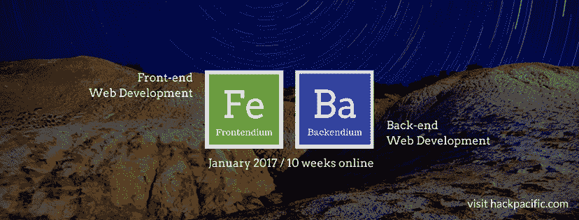

# 保持精简，发展我的在线课程业务

> 原文：<https://www.indiehackers.com/interview/keeping-things-lean-and-growing-my-online-course-business-583b7d1f8b>

## 给我们介绍一下你自己吧！你的背景是什么？Hack Pacific 是什么？

你好！我是 Harry Chen，我是一名全栈 web 开发人员。我在微软、通用和庞巴迪宇航公司工作过，过去也为一些公司做过自由撰稿人。我之前联合创立了股票推荐社交平台 [Nvest](http://nvest.me) ，并从多伦多大学早期技术计划获得了 3 万加元的种子资金。我在大学学的是机械工程，从零开始自学了网络开发。

在 [Hack Pacific](https://www.hackpacific.com) ，我们希望**让在线学习和面对面学习**一样有效。在线学习者最大的三个抱怨是:“我的问题从来没有得到回答”，“我不能和我的同学联系”，以及“我没有得到关于我学习的反馈”。

我和我的联合创始人肖正在试验一种完美的方法，让在线学习既有效又实惠。今天，我们提供网站开发、移动开发、数据分析和机器学习等领域的课程。在未来，我们认为大多数科目，像生物和音乐，可以在网上教授。

我们在 2016 年 10 月推出，从那以后我们的月收入平均为 1500 美元。

 

## 我过去上过一些在线课程。你能详细说明 Hack Pacific 与其他在线课程的区别吗？

以下是我们与所有其他大型开放式在线课程(MOOCs)的不同之处:

1.  **同步+异步**:我们对每个小组实施同步学习计划，这样学生就有动力在相同的时间表内与他们的同龄人一起学习。
2.  **即时 Q & A** :每当学生遇到卡顿，他们都会通过 Slack 或者我们的 Q & A 平台问我们。通常，我们可以在 10 分钟内回复，即使是在晚上和周末。
3.  **办公时间**:每个小组每周通过视频会议会面两次，讨论关键概念，检查他们的进度并回答他们的问题。
4.  **作业**:学生有 6 到 9 个作业/项目要完成，因为我们希望他们将理论应用于实践。
5.  **反馈**:学员除了收到教练的反馈，还会对彼此的工作进行回顾和反馈。

我们的学生大多是成年人，他们有全职工作，想在工作之余自学。他们来自不同的行业，都渴望用新技能来充实自己。

## 是什么促使你开始使用 Hack Pacific？你最初的目标是什么？你是怎么想出这个主意的？

我以前在香港的总会教过书。我看到香港和东南亚在快速发展的科技领域技术人才短缺。我们和肖一起在香港开办了一个新的面对面的编码训练营。最后我们都靠个人积蓄生活。

很快，我们面临两个问题。房租太高，更重要的是，我们不想受制于物理位置。从那时起，我们开始研究在线课程。我们知道在线课程对学习者很有吸引力，因为它们相对便宜且容易获得。我们也知道大多数人不会完成在线课程。我们对自己的见解很有信心，但我们仍然需要验证。

有两种方法可以测试它:1)帮助现有的在线课程变得有吸引力，2)我们自己主持在线课程。

我们从第一条路线开始。我们花了 3 个月的时间建立了一个 [Q & A 系统](https://ask.hackpacific.com)允许任何课程的学生来问我们问题并得到即时回应。最后，我们无法验证即时问答的价值，因为大多数在线课程已经有了自己的问答网站，即使没有回应，学生们也会去那里。

因此，两个月前，我们开始走第二条路:建造我们自己的球场。我们真的想确认学生们不仅仅在寻找课程和免费视频。我们想看看学生们是否会为大多数在线课程不提供的即时问答、反馈和社区付费。

## 建造你的第一个球场需要什么，你使用了什么样的技术？离你准备发射还有多长时间？

为了测试我们的假设，我们调整了[我们现有的网站](https://www.hackpacific.com)(它是用 Rails 和 Angular 构建的)来推出我们的第一个前端 web 开发在线课程。为了尽可能少地花费工程上的努力来验证我们的想法，我们能够将一堆现有资源整合在一起，以达到我们想要的师生互动水平。

我们使用 [Gitbook](https://www.gitbook.com) 来托管我们的课程。聊天的懈怠。[缩放](https://zoom.us)用于视频会议。用于日程安排的谷歌日历。我们自己的问答平台(用 Rails 和 React 构建)。和[带条纹的注册和支付用的类型表单](https://www.typeform.com/help/payment-field-stripe-integration)。

我们把免费和开放的材料整理成一个固定的时间表作为我们的课程。我们不想开发自己的材料，因为那不在我们的实验范围之内。同样，我们只对测试学生是否会为参与付费感兴趣。我们希望课程紧张而有效，所以我们设计的课程表要求每周工作 20 小时，持续 10 周。

总之，在最初的想法之后，我们花了大约 2 周的时间来建立第一个在线课程。

## 你用过哪些营销策略？你是如何吸引用户并壮大 Hack Pacific 的？

一开始我们尝试了所有的方法。我们在谷歌和脸书做搜索引擎优化和付费广告。我们写博客，活跃在推特和脸书上。我们还对一系列主题的现场活动进行了实验。

最成功的是我们的“从金融到科技”系列，该系列报道了那些离开金融行业去追逐科技创业成功梦想的首席执行官们。我们做了三个，每个平均 100 个道岔。这就是我们如何扩大简讯订阅列表的。我们也和我们的朋友和家人尝试了一个推荐折扣系统，但是没有用。

现在，我们专注于我们的时事通讯，搜索引擎优化和内容营销，因为我们网站的大多数访问者来自有机搜索和推荐链接。我们 50%的客户在没有与我们直接互动的情况下注册了我们的课程。另外 50%的人会在注册前通过电子邮件就课程细节进行一些简短的交谈。

我们在我们的课程页面上提供尽可能多的信息，因此访问者可以得到他们需要的一切。我们还在我们的网站上使用 Intercom 的实时聊天服务，以方便我们的访问者进行查询。提供实时聊天互动的警告是，访问者更有可能跳过网页上的阅读，直接问你。

## 你的商业模式是如何运作的？你的营收背后有什么故事？

今天，我们自己管理 [Hack Pacific](https://www.hackpacific.com) 的所有在线课程。在未来，我们希望成为一个平台，其他教师可以加入并利用我们的工具集和学生社区。

我们已经计划聘请其他教师教授移动开发(iOS 和 Android)、机器学习、数据分析和人工智能等课程。这些老师充当我们的伙伴。他们将获得 85%的销售额(减去交易成本)，我们将获得 15%的市场份额。

我们的课程学费是每个学生 300 美元。我们通过带条纹的字体进行注册。在我们首次推出在线课程仅 2 周后，第一期课程就有 5 名学生参加，我们的下一期课程将于 2017 年 1 月推出。我们的月营收率约为 15000 美元。在黑色星期五促销期间，我们的销售额有所增长。

我们的支出主要是服务器和服务成本:Heroku、AWS、Gmail、Intercom 和 Typeform，每月总计约 100 美元。

## 你未来的目标是什么？你从过去学到了什么？

在接下来的几个月里，我们希望我们的网站流量和收入每月增加 10%。我们准备在 2017 年 1 月底推出 Android 课程，iOS 课程紧随其后。

如果我们可以重新开始，我们会跳过面对面的训练营，转而选择更具雄心的在线教育平台。在验证产品的价值主张之前，我们不会开始开发产品。我们了解到 MVP 需要漂亮和令人信服，但也要在尽可能短的时间内完成。

## 在你的旅途中，什么对你最有帮助？你认为你最大的优点是什么？

我认为我们最大的优势是我们都是技术型的。这意味着我们的开发周期相对较短，我们可以非常快速地测试许多想法。如今，对初创公司来说，精益和弹性是非常有用的特质。

## 你对有抱负的独立黑客有什么建议？

问任何人制造一个产品是什么样的，他们通常会告诉你这真的非常非常难。除非你去做，否则你无法想象这有多难。

除非你去创造，否则想法一文不值。快速检验你的想法，并不断改进。我们经常通过将注册表格和登录页面放在一起来测试想法。

在筹集资金之前，要深思熟虑。没有人比你更了解你的公司。所以问问你自己，为什么你需要这笔钱，你打算怎么花，你是否可以用其他不需要放弃股权的方式来花这笔钱。

## 我们可以去哪里了解更多？

*   网址:【www.hackpacific.com T3
*   问答平台:【ask.hackpacific.com】T4
*   中:[https://medium.com/hackpacific](https://medium.com/hackpacific)
*   推特: [@hackpacific](https://twitter.com/hackpacific)
*   https://www.facebook.com/hackpacific 脸书

欢迎在下面发表评论或提出问题:

—[<picture id="ember8180927" class="user-avatar ember-view user-link__avatar"></picture>哈利陈](/harrychen?id=ECqYgMx4VUQnG9zPZCRKFq3g5Aq2)【altacademy】联合创始人

## 想像 Altcademy 一样建立自己的事业？

你应该加入[独立黑客社区](/)！🤗

我们是几千名创始人，互相帮助建立有利可图的业务和副业。来分享你正在做的事情，并从你的同事那里获得反馈。

还没准备好开始使用你的产品吗？没问题。这个社区是一个认识人、学习和实践的好地方。随意[随便浏览](/)！

——[<picture id="ember8180932" class="user-avatar ember-view user-link__avatar"></picture>考特兰艾伦](/csallen?id=ibTLPyjwVebnZjMGKvz6ztarnuV2)，独立黑客创始人

4votes