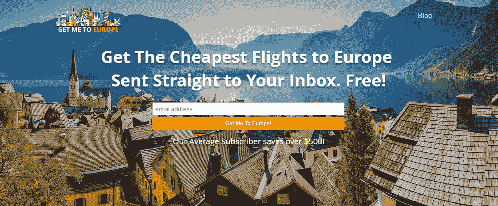
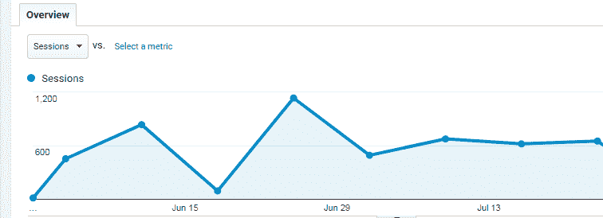
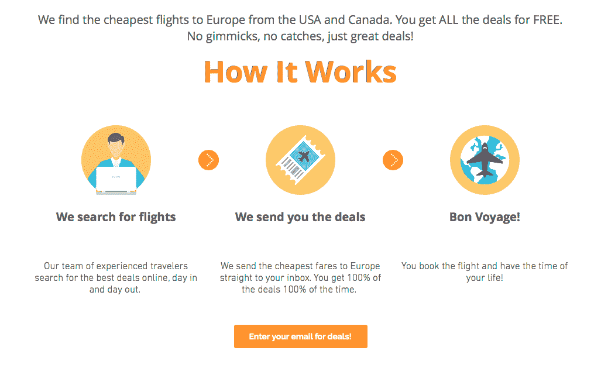

# 在没有技术创始人的情况下启动一个盈利的创业公司

> 原文：<https://www.indiehackers.com/interview/launching-a-profitable-startup-without-technical-founders-affd5e46f4>

## 你好！你的背景是什么，你在做什么？

我叫 Nicholas Romano，毕业于佛罗里达州那不勒斯的市场营销和供应链专业。我和我的联合创始人凯尔·赫瑟林顿一起为 GetMeToEurope.com 工作了大约 3 个月，这是一个致力于提供欧洲廉价旅行的网站。

截至 2017 年 8 月，我们预计每月收入为 300-400 美元，我们的用户群每周增长 5-10%。

 

## 你怎么会想到带我去欧洲的？

我没有在大学暑假上课，而是收拾行李去旅行。我是一个破产的学生，我负担不起那些向本科生宣传的花费超过 5000 美元的预建旅游。所以我必须发挥创造力，利用我对物流的迷恋，这在当时是我的主要研究领域。

我能够优化我的行程，以正常成本的一小部分进行旅行，这使我能够增加我更关心的事情的预算，如黄金地段的酒店或一生一次的足球比赛的好座位。

当我的朋友们看到我旅行过的所有不同地方的照片时，他们的好奇心占了上风:“你到底是怎么负担得起这个的？”当我告诉他们时，他们总是很震惊。

## 是什么促使你把这个爱好变成了实际的生意？

我的联合创始人凯尔·赫瑟林顿(Kyle Hetherington)有一天突然发短信给我，要求见面，这样我们就可以互相交流商业想法。就在那时，我向他提出了[带我去欧洲](https://www.getmetoeurope.com)背后的基本想法，我们都同意继续下去。

我在 2015 年注册了这个域名，并已经建立了一个基本的网站，但我们决定从头开始，立即投入运营。

我和凯尔在大学里合作过无数个项目，所以我知道他会成为一个伟大的联合创始人。他和我一样有创业的动力。

就验证而言，廉价航班简讯在业内很常见，所以我们知道需求是存在的。他们都在相同的前提下运营:他们向免费用户提供交易，但保留了对付费用户的最佳交易。

我们希望通过免费提供时事通讯中的所有交易来改变这种典型的结构，然后向我们的付费订户提供增强的体验——更快的提醒和完全内置的欧洲旅行。

到目前为止，这种方式很有效，主要是因为这些交易对时间很敏感，人们喜欢接受有时不到 500 美元的全套欧洲旅行。这些旅行通常比旅游公司的同等旅行便宜大约 3000 美元，所以我们的许多免费订户支付 14-34 美元没有问题。

## 我不得不问:为什么是欧洲？为什么世界其他地方没有呢？

我经常被问到这个问题。除了这是我的专业领域之外，我选择专注于欧洲的一些重要原因与市场潜力和专注差异化的概念有关。

运用你的专业知识很重要，你应该总是让数据为你指明正确的方向。来自 Google Trends 的数据帮助验证了我的想法。搜索“飞往欧洲的廉价航班”的人比任何其他大洲都多。

我想超越竞争对手，所以我不得不牺牲其他目的地，比如亚洲和澳大利亚，专注于欧洲。这让我能够为我的订户买到其他基于订阅的旅游服务经常错过的东西。这也让我能够比竞争对手更快地达成交易——有时甚至快几天。

## 构建最初的产品需要什么？

我的背景是市场营销，我之前提到过，凯尔学的是商业管理。当时我们刚从大学毕业，几乎没有预算来建设我们的网站。因此，我们有一个想法，没有编码技能，几乎没有营销预算。

我们做了当时我们*唯一能做的事情*,考虑我们可以用来推出我们的 MVP 的网站建设者。我们将范围缩小到 WordPress 的 [BeaverBuilder](https://www.wpbeaverbuilder.com/home/) ，Squarespace 的， [Wix 的](https://www.wix.com)，以及 [Shopify 的](https://www.shopify.com)。最终我们选择了 Wix，它会立即让任何开发人员翻白眼。

Wix 一直被证明是有问题的、缓慢的，并且通常没有响应。但它也很划算，让我们走到了现在。如果我必须回到过去，我要么学习编码，要么就在 WordPress 上重新开始。但是，嘿——活到老，学到老，对吧？

我们目前正在努力推出一个重新设计的网站，但这可能需要一些时间。我们用了不到两周的时间在 Wix 上构建了我们的第一个版本，这让我们可以快速地发布并获得一些重要的反馈。我给任何想在网上创业的人的建议是，你可能是世界上最好的营销者，但消费者仍然会对糟糕的设计产生负面反应。在我们使用专业图片和文案重新设计我们的网站后，我们的跳出率下降了大约 20%。当然，总有改进的空间，但是我们已经远远超过了我们开始的地方。

自举是一个漫长而缓慢的过程，成功不会一蹴而就。

TweetShare

凯尔和我需要找时间工作[让我去欧洲](https://www.getmetoeurope.com)做全职工作，对我们来说，这意味着在清晨和深夜工作。我们已经解决了这个问题，所以凯尔每天早上在网站上工作，我每天晚上从他停下来的地方继续工作。这里的一个好处是，我们现在对客户服务的响应速度更快了，因为我们中的一个人总是可用的。

我们还使用 [Google Hangouts](https://hangouts.google.com/) ，这对任何远程工作的团队来说都是一个很好的工具。在全职工作时，我们通过谷歌上的即时通讯工具保持持续的沟通，同时还会定期打电话和视频聊天。

我们的廉价航班简讯完全基于 [MailChimp](https://mailchimp.com/) ，一个伟大的电子邮件客户端。MailChimp 模板很容易创建，我们最喜欢的功能之一是能够根据您的订户列表使用优化的时间来安排电子邮件活动。

[Zapier](https://zapier.com) 是我们使用的另一个重要工具。这是一个自动化工具，集成了我们的网站和 Mailchimp。一开始，每次用户升级到我们的高级服务，我们都必须手动将他们添加到新的列表中。现在，Zapier 自动将用户从结帐表单转移到付费列表，然后将他们从免费列表中移除。最重要的是，最初的几个自动化是免费的，所以对于那些正在引导的人来说非常好。

我们在 2017 年 5 月底左右完成了《让我去欧洲》的第一个版本，并准备推出。

## 你是如何吸引用户并让我去欧洲的？

《带我去欧洲》的官方发布日期是 2017 年 6 月 1 日。我们采取了三管齐下、全力以赴的方式来获取我们的初始用户。

我们的方法很简单:付费广告、社交媒体和圣杯:通过博客帖子和文章免费宣传。从一开始，我们就希望我们的网站吸引尽可能多的眼球，这样我们就可以收集书面的和分析性的反馈，并相应地调整产品。一路走来，我们学到了无数的教训。

## 介意从失败的开始吗？

一点也不。第一件显然行不通的事情是谷歌和必应上的付费广告。

在竞争激烈的细分市场(如廉价旅游)开展搜索引擎广告活动，而不投入大量的时间和资源，就像烧钱一样。

我们免费用户的 CPA(每次收购成本)接近 2.50 美元，付费用户的转化率徘徊在 5%左右，搜索引擎广告根本不是一种有效的方式来花费我们非常有限的资本，所以我们放弃了这场运动。

也许我们可以优化广告，获得更好的回报，但我们得到的教训是，我们的时间和金钱花在其他地方会更好。

我们的另一个失败是努力接触旅游业的有影响力的人。这是我们最初计划的一部分。我们认为，如果我们与最有影响力的人联系，例如那些拥有 50 万以上社交媒体关注者的人，他们会利用他们的平台来推广我们。

老实说，这根本不起作用。所有有影响力的人都给了我们最初的兴奋，然后试图给我们一大笔钱。(有一次，我们在 Instagram 上的一张合照报价为*$ 8500*——这还不是我们联系的最受欢迎的影响者的报价！)

这种方法的总统计数据？

*   70 封冷冰冰的邮件
*   11 份答复
*   0 个功能

## 好的，那么哪些营销方法*对你有效呢？*

 *第一，付费 Instagram shoutouts。

正如我之前所说的，在开始的时候，我们更关注的是网站的访问量，而不是可扩展的有机增长。

我们开始接触拥有大量粉丝的 Instagram 账户，并要求他们突出我们的账户，并在他们的简历中加入我们网站的链接。我们与不同账户的互动时好时坏，价格无处不在。一些小账户想要收取 300 美元，而更了解市场的大账户实际上要合理得多。

我们最终与一个拥有超过 50 万用户的 Instagram 页面建立了良好的关系。我们每周为一个帖子支付了几百美元，持续了 5 周。

有一次，我们决定为一周中的每一天付费，看看这一天对参与度有没有影响。结果比预期的要好:我们总共吸引了 1200 名免费用户和大约 15 名付费用户。这场运动有效地收回了成本。(我们在一周不同日子的发现被证明是无关紧要的。)参与度每周都在增加，可能是因为我们每周都在改进帖子的设计。

第二件对我们很有效的事情是向新闻网站和中型博客发出冷邮件。

凯尔和我在开发技能方面的不足已经被我们对市场营销的奉献所弥补。我们接触了数百个中小型旅游博客，令我们惊讶的是，我们收到了比一些大型博客更积极的回应。

这些中小型博客希望为其不断增长的受众提供优秀的内容，他们更愿意免费与我们合作，以换取一些内部提示和原创作品。我们已经在 Twitter、脸书小组和博客上找到了关注列表的线索(例如，“通往 XYZ 的 10 大途径”)。

小贴士:当你找到一个你喜欢的博客，但在网站上找不到任何联系邮箱时，使用类似 [hunter.io](https://hunter.io) 的邮件查找工具。你也可以使用该工具联系大型出版物的编辑，如福布斯、Buzzfeed、赫芬顿邮报等。由于冷电子邮件，我们有大约五个即将推出的功能，从小型(~1 万用户)到大型(50 万用户)组织。

凯尔和我在开发技能方面的不足已经被我们对市场营销的奉献所弥补。

TweetShare

[这里有一个例子](http://happytowander.com/find-cheapest-plane-tickets-europe/),是一个博客发布的客座博文，有大约 6 万名粉丝。我们在 Twitter 上找到了她，并给她发了一封友好的电子邮件，请求她发表一篇客座博文。她的帖子反响非常好，在我们的网站上产生了数百名新用户，在 Pinterest 上获得了 100 多次回复。

讽刺的是，我们最差的链接来自《赫芬顿邮报》。我花了几天时间准备精彩的内容，并在电话上与一位投稿人交谈，这篇文章最终只用了一句话，我们网站的访客不到 10 人。

到目前为止，我们从所有冰冷的电子邮件中学到的教训是:有时当你认为自己钓到了一条鲸鱼(例如《赫芬顿邮报》的一篇特写)，你实际上钓到了一条小鱼。相反，你的一些最好的内容实际上可以从你的普通博客中产生。所以明智地使用你的时间。过多地关注星星实际上会阻碍你的进步。自举是一个漫长而缓慢的过程，成功不会一蹴而就。

## 你的商业模式是什么，你是如何增加收入的？

我们使用免费增值的商业模式。这个术语经常被使用，但它基本上意味着我们为免费用户提供标准服务，如果他们愿意，他们可以升级到增强的体验。

我们的免费电子邮件包含我们付费服务的广告，一年的会员费是 34 美元。我们通过提供免费的廉价航班简讯来吸引初始用户，在那里我们通过电子邮件向他们发送去欧洲的最便宜的机票。我们不同于许多时事通讯，因为我们免费提供我们发出的所有交易。

到目前为止，我们送出的最便宜的机票是 233 美元的都柏林往返机票。我们必须想出不同的方法来为我们的付费服务创造价值，所以我们想出了一些独特的优势，到目前为止，所有这些优势都得到了回报。

*   **家乡机场。**我们的付费用户可以选择他们的家乡机场；免费用户会得到一个总列表，上面可能有也可能没有离他们最近的国际机场的交易。
*   **优先权。**付费用户也能首先获得交易，这对于时间敏感的交易来说至关重要。有时它们在短短 30 分钟内就卖光了！
*   **满满的行程。我们还向我们的付费用户发送全旅程信息，这样他们就可以享受整个欧洲之旅。我们称之为“梦幻之旅”。我们找到飞往欧洲的廉价往返航班，然后制定欧洲热门目的地的行程。最后，我们通过电子邮件发送预订链接。整个旅程通常花费不到 600 美元。最重要的是，我们提供退款保证。如果他们不喜欢服务，我们会全额退款，不问任何问题。**

我们的支付提供商是 Stripe，我们在整个项目中坚持使用它。Stripe 在创业社区有着极好的声誉。

Wix 在这里被证明是有问题的，因为没有办法将 Stripe checkout 集成到 Wix 站点中。我就不细说了，后端就是不兼容。

我们通过使用名为 [MoonClerk](https://www.moonclerk.com) 的服务创建了一个工作区，让我们高兴的是，它允许 Mailchimp 集成。不幸的是，它增加了另一层成本，因为 MoonClerk 收取的费用与 Stripe 非常相似。(因此，本质上，我们目前受到了双重指控。)当我们将我们的网站移植到 WordPress 时，我们将停止这种做法，但目前它必须这样做。

考虑到我们主要是一个信息提供者，[让我去欧洲](https://www.getmetoeurope.com)运营费用很低。我们的利润率高达 60%左右，每月总运营成本约为 150 美元。这包括谷歌网站管理员工具——电子邮件、分析、支付处理器、虚拟主机和付费广告。当然，随着我们规模的扩大，这些成本自然会上升，但我们正在尽可能地提高成本，以保持较高的利润率。

7 月，也就是我们运营的第二个月，我们的收入从 6 月的 100 美元增加到了 400 美元。

## 你未来的目标是什么？

我们的近期目标是尽可能多地建立我们的免费订户名单，希望我们可以了解更多和优化。

事实是，我们的网站有太多可以改进的地方，这一切都始于客户体验。我们有一些巨大的牵引力，但前面也有一些障碍。

## 你面临的最大挑战和障碍是什么

迄今为止，我们面临的最大挑战是消费者教育。事实是，我们的许多用户不知道如何使用谷歌航班、Skyscanner 和 Momondo 等工具，而这些工具对我们的网站来说是必不可少的。我的收件箱收到了大量的请求和问题，比如“你如何预订？”我们通常会将他们引导到我们的说明页面，但这仍然会让一些用户感到困惑。我们开始制作一些详细描述这一过程的 YouTube 视频，我们认为这将使用户受益匪浅。

 

我们遇到的另一个问题是，整个网站需要被移植到一些对开发者更友好的地方，比如 WordPress。这将涉及一个完整的重拍，这需要一些时间。但这是 100%必要的，所以我们唯一的遗憾是没有早点开始。

## 有没有发现什么特别有帮助或者有优势的？

除了独立黑客，reddit.com/r/entrepreneur 的[也是一个很好的案例研究资源。](https://www.reddit.com/r/Entrepreneur/)

HARO 对我们来说是一个非常有用的工具。这是一个电子邮件列表，你可以订阅，在那里寻找信息的记者提交他们正在进行的报道。作为交换，你可以向记者提供建议/内容。这是双赢。

我的建议是，在试图联系记者时要真诚。与复制粘贴模板相比，我们通过这种方式收到的回复率要高得多。事实上，这就是我们在《赫芬顿邮报》上发表原创特写的方式。

## 对于刚刚起步的独立黑客，你有什么建议？

你可以拥有世界上最好的产品或服务，但如果人们不了解它，你什么也卖不出去。尽可能多出去走走，并适应反馈。

最后，如果你正在寻找独立黑客之外的灵感，看看 Builtwith.com。这是一个工具，用于找出一个特定网站背后的技术栈。

## 我们可以去哪里了解更多？

*   www.getmetoeurope.com
*   【www.facebook.com/getmetoeurope 
*   [【邮件保护】](/cdn-cgi/l/email-protection#c1afa8a2aa81a6a4b5aca4b5aea4b4b3aeb1a4efa2aeac)
*   [@ insta gram 上的 getmeteurope](https://www.instagram.com/Getmetoeurope/)
*   我关于廉价欧洲旅行的博文:[www.getmetoeurope.com/journey](https://www.getmetoeurope.com/journey)

如果你有任何问题，请在下面评论，我会尽快回复你！

——[<picture id="ember5306249" class="user-avatar ember-view user-link__avatar"></picture>kylegetmetoeurope](/kylegetmetoeurope?id=dxRo0PgK3MbUI3MCHsWFhOhsoI02)《把我弄到欧洲去》的创作者

## 想建立自己的事业，比如带我去欧洲？

你应该加入[独立黑客社区](/)！🤗

我们是几千名创始人，互相帮助建立有利可图的业务和副业。来分享你正在做的事情，并从你的同事那里获得反馈。

还没准备好开始使用你的产品吗？没问题。这个社区是一个认识人、学习和实践的好地方。随意[随便浏览](/)！

—[<picture id="ember5306254" class="user-avatar ember-view user-link__avatar"></picture>考特兰艾伦](/csallen?id=ibTLPyjwVebnZjMGKvz6ztarnuV2)，独立黑客创始人

7votes*