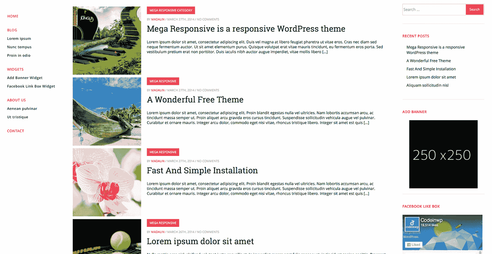
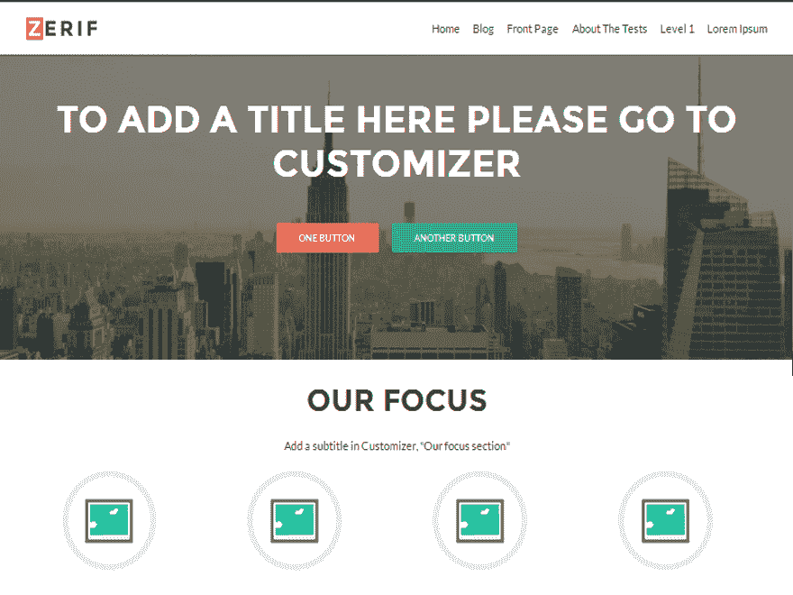

# 从过去的失败中吸取教训，创建一个每月 50，000 美元的网站

> 原文：<https://www.indiehackers.com/interview/learning-from-past-failures-to-create-a-50-000-month-site-d0f1937486>

## 你好！你的背景是什么，你在做什么？

我离开了尼古。我学的是计算机科学，然后在大学的最后一年，我从事了自由职业。我发现了一些早期的成功，所以我坚持做了大约一年。

我认为下一步将是通过开办一家代理公司来扩大业务，客户会主动来找我，原因很简单，因为我打印了一些名片，并在互联网上建立了一个商业网站。剧透警报...不是这样的。

我失败了。代理的想法没有任何进展。

所以我决定转向，我和几个朋友一起推出了[主题岛](https://themeisle.com/wordpress-themes)。目标是给人们一些高质量和简单易用的 WordPress 主题。我对它抱有很多 T4 的希望。然而，六个月后，我再次准备关闭整个事情。

但不知何故我们忍受了。我们找到了继续进行下去所必需的资金。一个月后，我们的月经常性收入达到了 12，000 美元。六个月后，我们达到了每月 6 万美元。

毫无疑问，我们经历了我们的[起伏](https://www.codeinwp.com/blog/category/transparency)。然而，如今有超过 50 万人在积极使用我们的产品。我们平均每个月创造大约 50，000 美元的收入，我们最受欢迎的作品是 Zerif Lite。

## 你如何开始使用 ThemeIsle 的背后有什么故事？

正如我提到的，我们的机构在那一点上(几乎)是失败的，所以我只是抓住机会尝试一些新的想法。老实说，当时我并没有想到我能“让世界变得更好”或其他什么。更多的是关于忙碌和简单的生存。

我们知道并理解 WordPress，我们已经在 WordPress.org 的官方知识库中有了一个免费的主题。每天大约有 300 名访客对免费主题感兴趣，所以我想，如果我们用优质产品创造一个合适的新品牌，我们应该能够吸引更多的人。

我认为你最大的财富是了解自己，了解自己的优势和劣势。

TweetShare

当然，事实证明进入这个市场并不容易。竞争比我想象的要激烈得多。

我们一开始做的一件有帮助的事情是在 Flippa 上获得了另一个 WordPress 主题网站。名字是 ReadyThemes.com，我们花了 3000 美元买下了它。当时，它的月收入约为 300 美元，所以我们认为，通过一些调整，我们应该能够增加这个数字，并将流量导向我们的新品牌。

起初，主题并没有给人留下深刻的印象，但我们仍然设法将网站的收入增加到每月 900 美元。

## 构建最初的产品需要什么？

在过去开始了大概数百个小型联盟实验后，这次我更认真地对待这个项目，所以我们在这个平台上投入了相当多的时间:

*   我使用 NameStation 为域名创意创建了一个环境，以便找到一些可品牌化的东西。(回过头来看，无论如何，当前的域名并不那么容易发音。)
*   一旦我们得到了域名和品牌，我们花了很多时间来设计网站的独特特征。
*   我们与专业作家合作，确保我们的网站文案听起来也很棒。
*   我做了大量关于买家旅程和内容展示的研究。

我们大概花了六个月的时间来搭建这个平台。现在回过头来看，我们可能应该把大部分精力放在构建实际的产品上。没有好的产品，卖东西的平台是没有用的。

从长远来看，很多人低估自己产品的价值是很常见的。

TweetShare

我们从客户的工作中出资，再加上我们自己的钱。我们最初的费用很少。最初的版本大概总共花费了 10，000 美元左右。

Catalin 是在这方面做得最多的人。我在 Envato 工作室找到了 Catalin，在几个小项目之后，我指派他在岛上全职工作几个月。他是某种意义上的独角兽——一个了不起的设计师、工程师、产品人，20 多岁。毫无疑问，他干得非常出色！他也创造了我们的第一个主题。

## 你是如何吸引用户和扩大用户群的？

头六个月对我们来说是一场冷水。就像我说的，我们对此抱有很大的希望。我们重新定位了旧的免费主题，做了一些营销活动，使用了 LaunchBit 和 Google AdWords，并抱着最好的希望。

但是大部分都不起作用。

这是我们前六个月的流量和收入情况:

| 月 | 会议 |
| --- | --- |
| 四月 | 2664 |
| 五月 | 16901 |
| 六月 | 9408 |
| 七月 | 13877 |
| 八月 | 12581 |
| 九月 | 20978 |
| 十月 | 17786 |

总共 89，500 次会话和 189，740 次页面浏览

| 月 | 收入 |
| --- | --- |
| 四月 | 400 |
| 五月 | 1400 |
| 六月 | 1500 |
| 七月 | 2150 |
| 八月 | 2310 |
| 九月 | 2100 |

587 次销售的总收入为 9，860 美元

你看不到的是，与主题相关的收入可能只占每月 2000 美元总收入的 10%。因此，在我们的主题和平台本身上工作了一年之后，我们每月卖出了价值约 200 美元的主题。

回顾我们的谷歌分析，我们获得的大部分流量——人们为免费的*主题而来——并不真正关心我们的任何其他产品。老实说，那些免费的主题并没有那么好。自己看看——这是我们最受欢迎的免费主题的样子:*

正如我之前所说，一个主要的错误是我们在主网站上投入的精力比产品本身多。然而，除了坏的步骤，我们也采取了一些好的步骤:

1.  我们花了几百美元买了一个免费的 WordPress 插件(当时叫做 [Tweet Old Post](https://wordpress.org/plugins/tweet-old-post) )。我们最初认为它只是一个不错的插件，可以用来推广我们的一些主题。但最终，事实证明用户很喜欢它，它开始为我们带来 1500 美元/月的额外销售额。我们最近将这个插件转移到了自己的品牌，现在它的售价在每月 5000 美元的范围内。
2.  我们与米赞合作，购买了使用他已经很流行的模板来构建 WordPress 主题的权利——T2·泽里夫。我们当时没有太多的钱，但是幸运的是，他允许我们在 3-4 个月内支付他，之后我们将有希望设法获得一些销售。
3.  我们坚持不懈！

当我打算重新设计 codeinwp.com 的时候，我在 UpWork 上遇到了[米赞](http://mizan.me)，并一直保持着联系。当我看到他已经建立了令人惊叹的 Zerif 模板时，我问他我们是否可以购买版权。你可以在这里看到这种模式——我一路走来学到了善待他人、保持联系和友善是多么重要。这对那些你不能立即从他们那里获得什么的人来说尤其重要。这通常会得到 10 倍的回报。

当我们在 2014 年 8 月向 WordPress.org 目录提交 Zerif Lite 主题时，我们保持了较低的期望。这可能是我们在那里的第八个主题，我们决定把我们销售的大部分内容作为专业版，免费提供。因此，即使我们不能在早期销售我们的主题，至少人们仍然可以使用它们。

我们是在 Mizan 的原始 HTML 基础上构建的，但我们仍然设法搞乱了原始设计，正如你自己所看到的:

然而，这个主题在 10 月份被存储库接受，我们的销售开始腾飞。接下来的一个月，我们雇佣了四个人，并将最初销售的剩余资金投入到市场营销中。

## 你的商业模式是什么，你是如何增加收入的？

对我们来说最有效的是免费增值模式。

我们的 WordPress 主题有免费和付费两种版本，这种方式很有效，因为一个版本不断吸引人们进门来看另一个。

一旦我看到一些销售和参与，我立即意识到这将是一个巨大的机会。这是由于过去数十次失败的平庸产品造成的。我们乐观地将大部分销售收入再投资到市场营销中，向代销商支付丰厚的签约奖金，并且我们做了当时市场上几乎没有人做的事情— *花了很多钱推广一款免费产品。*

Zerif Lite 主题在 10 月份首次推出后，到第二年 1 月，我们的主题销售额达到了每月 20，000 美元。我开始在 A/B 测试中投入大量工作，我们将价格提高了 3-4 倍，雇佣了新员工，并在营销上投入了更多。我们的收入增长情况如下:

| 月 | 收入 |
| --- | --- |
| 一月 | 20709.02 |
| 二月（February 的缩写） | 31762.51 |
| 瑕疵 | 57889.61 |
| 四月 | 62710.84 |
| 五月 | 73924.54 |
| 六月 | 86121.53 |
| 七月 | 84934.16 |
| 八月 | 81621.19 |
| 九月 | 86419.30 |
| 十月 | 95045.81 |
| 十一月 | 101546.06 |
| 十二月 | 84521.51 |
| 一月 | 94631.42 |
| 二月（February 的缩写） | 97717.55 |
| 瑕疵 | 101614.53 |
| 四月 | 106220.23 |
| 五月 | 122541.83 |
| 六月 | 120414.45 |
| 七月 | 108817.88 |
| 八月 | 109160.46 |
| 九月 | 82403.77 |
| 十月 | 57598.26 |
| 十一月 | 50375.10 |
| 十二月 | 37793.27 |
| 一月 | 44014.95 |
| 二月（February 的缩写） | 49790.38 |
| 瑕疵 | 53484.93 |
| 四月 | 49959.03 |
| 五月 | 41472.65 |

或许最值得研究的策略就是提高你的价格。

从长远来看，很多人低估自己产品的价值是很常见的。例如，我开始以 37 美元的价格出售主题，以 10 美元的价格出售 Tweet Old Post 插件，因为我不相信人们会为它们付费。但是价格可以说从来不是独立存在的。它总是和你卖的东西带给人们的特定价值联系在一起。很简单，当某样东西产生的价值大于它的成本时，人们就会买它，不管它是便宜还是贵。

我们做的一个有趣而成功的测试是调整我们销售页面上的一行 CSS 来删除我们的最低定价计划。随着时间的推移，[增加了 30，000 美元的收入](https://www.codeinwp.com/blog/transparency-report-8)..

我们从 A/B 测试中学到的另一件事是，改变主题的默认截图和默认演示，以及雇用一个好的文案，会产生很大的不同。

最后，你可能会注意到上图中 9 月份的收入大幅下降。那里的问题有点复杂。简而言之，我们最受欢迎的主题[在 WordPress.org 的目录中被暂停](https://www.codeinwp.com/blog/transparency-report-19)。幸运的是，我们事先投入了一些时间和金钱来分散我们的收入来源，所以我们设法生存了下来。

坚持很重要…反正我是傻到继续走下去了。

TweetShare

我们最大的整体投资是在我们的内容上！我们创造了一些令人惊叹的指南，如[这一个](https://www.codeinwp.com/blog/best-wordpress-hosting)和[这一个](https://www.codeinwp.com/blog/100-wordpress-blogs-and-their-best-posts)，加上我们的透明度报告，我们的博客每月的访问量增加到 30 万左右，每月的收入超过 2 万美元。

## 你未来的目标是什么，你打算如何实现它们？

我最近意识到我们最强的地方不是主题本身。但这可能是你在阅读这个故事时已经注意到的事情。

我的意思是，是的，我们已经设法制造了一些伟大的产品，人们似乎很喜欢它们。然而，我们在其他方面做得更好，比如内容、收购、营销。因此，展望未来，我们决定通过在我们的系列中接受第三方主题来更好地利用这些优势。

然而，我们并没有真正建立一个经典的市场。我们想慢慢开始，并包括手动测试和已经“流行”的利基主题到我们的新俱乐部产品。用户将继续支付单一的年费，他们将获得所有主题的访问权限(尽管许可证将限制一次活动网站的数量——关于更新和支持)。

至于作者，我们将根据使用他们主题的活跃站点的数量向他们支付月费。就像我们在开放联盟计划时所做的那样，我们将保证作者每月的最低收入，只是为了确保我们没有浪费他们的时间。

从战略角度来看，我已经开始在团队中投入比横幅广告更多的资金，我们将更加关注未来更“大胆”的计划。

## 如果你必须重新开始，你会做什么不同的事？

回想起来，由于我缺乏经验，我不够勇敢。我宁愿在网络广告上花太多钱，也不愿雇佣真人，因为这样更简单，而且我太害怕更大的项目。(项目越大，落差越大是吧？)

如果我必须重新开始，我会更专注于做困难的事情，而不是追求轻松的回报。打造更好的产品可能是我要做的主要事情。

我们经历的一段特别艰难的时期是去年，当我们的主题被暂停时，我们的收入下降了 50%以上。很难继续保持动力并让人们集中注意力。我很幸运，人们留下来努力工作，业务的其他部分继续增长，这使我们能够留在地图上。

总的来说，我们的月收入不是主要目标，这很有帮助。我之所以能够前进，主要是因为我看到了我们需要改进的地方和我们需要服务的客户，即使这变得更加困难。

## 对你帮助最大的是什么？你对有抱负的独立黑客有什么建议？

我认为你最大的财富是了解你自己，了解你的强项和弱项，包括个人的和公司的。这听起来很简单，也很有哲理，但这真的是真的！——给你很多力量。

具体来说，对我帮助最大的，也是我独特的能力，是我可以很容易地理解复杂的业务情况，因为我从很多领域学到了很多东西。有趣的是，这正是我多年前认为拖累我的事情。你知道，整个“万事通，不精通”的问题。

另一件很多人没有做的非常重要的事情是慷慨。

我真心喜欢帮助别人，不期望任何回报。不仅是那些在某些时候能帮助我的人，还有那些我知道我可能没有任何收获的人。这是一种强大的特质，一路上对我帮助很大。

坚持很重要。有时候当我回头看事情时，我不会给自己一个机会去实现某个特定的目标，但我还是傻到继续走下去。幸运的是，其他人也一直支持我。

简而言之，考虑长远，对你自己和你的团队进行投资很有帮助。我们一开始是一个由四个学生组成的团队，没有钱，没有经验，也没有技能，但我们一直在学习和成长。

## 我们可以去哪里了解更多？

*   我们的官方网站:[https://themeisle.com](https://themeisle.com)
*   我们的主要博客:【https://codeinwp.com/blog 
*   我的邮箱: [【邮箱受保护】](/cdn-cgi/l/email-protection#5c35333229281c2834393139352f3039723f3331)
*   我的 https://www.facebook.com/themeisle[脸书](https://www.facebook.com/themeisle)
*   我的推特: [@hackinglife7](https://twitter.com/hackinglife7)

我已经在我们的每月透明报告中写了更多关于我们旅程的内容(到目前为止已经有 26 个版本了！)，所以如果你想得到更深入的了解，我竭诚[邀请你去看看](https://www.codeinwp.com/blog/category/transparency)。

希望这能激励你自己创业！如果你有任何问题，请给我留言，我很乐意帮助你！

—[<picture id="ember5303474" class="user-avatar ember-view user-link__avatar"></picture>hacking life 7](/hackinglife7?id=H7vO68SrgPfg4lwob5zTTg8PrGH3)，ThemeIsle 的创建者

## 想像 ThemeIsle 一样建立自己的事业吗？

你应该加入[独立黑客社区](/)！🤗

我们是几千名创始人，互相帮助建立有利可图的业务和副业。来分享你正在做的事情，并从你的同事那里获得反馈。

还没准备好开始使用你的产品吗？没问题。这个社区是一个认识人、学习和实践的好地方。随意[随便浏览](/)！

—[<picture id="ember5303479" class="user-avatar ember-view user-link__avatar"></picture>考特兰艾伦](/csallen?id=ibTLPyjwVebnZjMGKvz6ztarnuV2)，独立黑客创始人

8votes