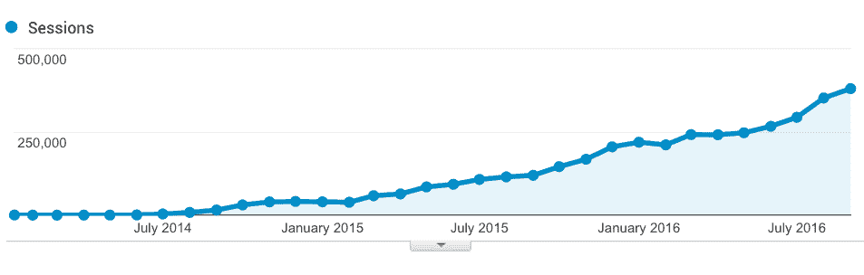

# 学习编码并构建一个应用程序，每月可产生 1500 美元的收入

> 原文：<https://www.indiehackers.com/interview/learning-to-code-and-building-an-app-that-generates-1-500-mo-bfbe905c12>

## 告诉我们关于你自己和你正在做的事情。

嗨，我是 Jaskaran Rana，一个来自印度的 24 岁的音乐爱好者和程序员。我已经做了两年多的全栈 web 开发人员和工程师。我还是电子音乐探索网站 [EDM Hunters](http://www.edmhunters.com) 的创始人。我一个人建造了它，现在继续自己管理它。

[EDM Hunters](http://www.edmhunters.com) 帮你发现你喜欢的 DJ 和流派的热门和最新歌曲。您可以浏览各种音乐排行榜，按艺术家、流派、月份或年份来查找热门歌曲，所有这些都是根据喜欢、播放次数和下载量来编辑的。

## 你是怎么开始做 EDM 猎人的？

虽然我在大学的专业是计算机科学，但直到最后一年我才知道如何编程。我的平均绩点是 5.0(印度的平均绩点是 10 分)，勉强通过考试。出现这种情况的主要原因是这门课的教学方式。这里的教育体系更注重死记硬背，而不是实践学习。我就是不能在课堂上集中注意力。

我决定尝试一下在线课程。Codecademy 在最初阶段给了我很大的帮助。它帮助我理清了我的基本思路，克服了我不能编码的抑制。我在 6 个月的时间里学习了 Python、JavaScript、jQuery 和 HTML/CSS。接下来我决定学习 Django，一个基于 Python 的 web 框架。

我建造 [EDM Hunters](http://www.edmhunters.com) 的动机是将我对 Django 的学习整合到一个真实的项目中，同时建造一个我个人喜欢使用的产品。回到大学，我开始听电子音乐，我立刻就被吸引住了。EDM 刚刚开始流行，并开始进入主流音乐领域。作为一个歌迷，我面临的一个问题是，我知道一些 DJ 的一些流行歌曲，但如果我想听更多他们的歌曲，我必须搜索各种音乐博客或浏览 YouTube 播放列表才能找到我想要的。没有一站式解决方案来帮助我在一个地方发现所有这些。[电火花猎人](http://www.edmhunters.com)就是为了解决这个问题而诞生的。

## 是什么让产品开始运作的？

我在大学的最后一年开始制作 EDM Hunters。我过去常常在课后和周末从事这项工作。我真的对建造它充满热情，所以我不介意一直工作到深夜。我在大约 3 个月内完成了一个基本原型，并在 2014 年 1 月推出了初始版本。

发布后，我继续迭代网站的设计和功能。启动这个网站并没有花很多钱。首先，唯一的成本是托管网站，因为我决定使用 VPS，这证明是相当便宜的。

大学毕业后，我一直在做全职的全栈 web 开发人员和工程师。在过去的几个月里，这个网站一直在自动运行。然而，每当我有新的设计或功能想法时，我都试图在业余时间尽快实现它们。

## 你是如何吸引用户和发展业务的？

流量的增长相当惊人。说实话，我刚推出 [EDM Hunters](http://www.edmhunters.com) 的时候，没想到它能长到现在这么大。前 6 个月，流量几乎不存在，每月不到 1000 名游客。

然而，在我找到第一份工作后，我开始每天学习新的东西。一旦我了解到一些我认为有价值的新东西，并可以整合到我自己的网站中，我就在当天晚上这样做了。我看到交通有了很大的改善，这重新点燃了我再次努力的渴望。

我开始对 SEO 做了很多研究。目前，85%的流量是有机的，并以每月 20%的速度增长。我非常注重优化我的网站的速度和内容。我还试图通过各种博客报道来宣传 [EDM 猎人](http://www.edmhunters.com)。我很幸运地出现在印度一些著名的博客上，比如[你的故事](https://yourstory.com)、[本土](https://homegrown.co.in)和[我的创业](https://myventure.in)。

## EDM 猎人怎么赚钱？

我开始 [EDM Hunters](http://www.edmhunters.com) 的时候，脑子里并没有“商业模式”。我开始它是因为我对电子音乐的热情和热爱。

目前唯一的收入来源是广告。最初，我唯一使用的广告网络是谷歌广告。在使用了一段时间后，我意识到它并没有提供大量收入的潜力，因为广告与我的用户并不相关。然后，我决定整合一些主要关注音乐的利基广告网络。这些为用户提供了价值，现在是我广告收入的主要部分。

然而，我有一些其他的收入计划，我将在未来几个月实施和推出。

更新:2016 年 11 月:在过去的一个月里，我一直在处理我的广告位，我完全删除了 Google AdSense，并将我正在使用的音乐广告网络的广告位增加了一倍。这使我的收入增加到每月大约 1500 美元。如果你愿意，也可以随时更新。

## 你未来的目标是什么？

为 EDM 猎人创建移动应用程序已经在我的脑海里有一段时间了。由于时间有限，我还不能构建它们，但我已经开始阅读 React Native，并可能考虑用它来构建应用程序。

到目前为止，我的主要精力都放在为用户建立完美的网站上。我还没有真正关注它的财务方面。我想建立一个专门的赞助上市网络，可以帮助崭露头角的艺术家与主流艺术家一起获得知名度。此外，我希望在稳步有机增长的同时，努力建立强大的社会影响力。

## 如果你必须重新开始，你会做什么不同的事？

我觉得在最初的版本发布后，我浪费了很多时间来解决与 SEO 相关的问题，比如糟糕的 URL 命名约定、重复的内容、缓慢的加载时间等等。如果我一开始就解决了这些问题，那么我从一开始就会有良好、稳定、有机的增长。但是话说回来，学习是旅程的一部分。

除此之外，我对事情的发展以及 EDM Hunters 作为一个产品的成长感到非常高兴。

## 你在旅途中发现了哪些有用的东西？

我认为我刚开始学习编码的最初阶段对我来说是最艰难的阶段。我已经决定自己建立一个完整的网站，从前端到后端以及两者之间的一切，能够想象所有的东西是如何作为一个整体连接和工作的，这在一开始是相当具有挑战性的。我得到了几个程序员朋友的帮助，这是一个很大的优势。对于其他任何事情，我总是有互联网在我的支配下。

对于 Python 和 Django 来说，有了全面的文档和强大的在线社区，就很容易开始了。对于 HTML/CSS，我在 Smashing 杂志上找到了很多好文章和教程。当需要学习主机和网络服务器时，我在 DigitalOcean 找到了详细的教程，结果证明很有帮助。除此之外，每当我陷入困境时，StackOverflow 就会来帮我。

我还认为，与初创公司合作极大地帮助了我磨练自己的技术技能，并让我深入了解从零开始开发产品的背后是什么。

## 你会和有抱负的独立黑客分享什么建议？

不要被事情一开始看起来有多复杂所暗示。每个人都从同一个地方出发。从小项目开始，试着弄清楚你的基本原则。有时候这的确会令人生畏，但关键是不要放弃。没有什么比看着自己想要的东西变成现实更令人满意的了。

也要做好失败的准备。并不是所有的商业想法都会成为下一个大事件。为了生意上的成功，你必须做好失败的准备。你可以从这些错误中学习，这些经历将会建立你对商业运作的知识和理解。要想成功，你必须准备好永不放弃，不断尝试。

## 我们在哪里可以更多地了解你？

关于 [EDM 猎人](http://www.edmhunters.com)的任何事情，你都可以通过 [【邮箱保护】](/cdn-cgi/l/email-protection#8ce5e2eae3cce9e8e1e4f9e2f8e9feffa2efe3e1) 联系我，关于其他任何事情，你都可以通过 [【邮箱保护】](/cdn-cgi/l/email-protection#a6ccc7d5cdc7d4c7c888d4c7c8c7e6c1cbc7cfca88c5c9cb) 联系我。

还可以在[脸书](https://www.facebook.com/edmhunters)、 [Instagram](https://www.instagram.com/edmhunters) 、 [Twitter](https://twitter.com/edmhunters) 、 [Google+](https://plus.google.com/+edmhunters_social) 、 [LinkedIn](https://www.linkedin.com/company/edm-hunters) 上关注 [EDM Hunters](http://www.edmhunters.com) 。

欢迎在下面留下你的评论，我会尽力回复你的！

——[<picture id="ember8184330" class="user-avatar ember-view user-link__avatar"></picture>Jaskaran Rana](/jaskaran27?id=Cl41ZITVzYgVhzUUVRgM86SUtAr2)，电火花猎人的创造者

## 想像 EDM 猎人一样建立自己的事业？

你应该加入[独立黑客社区](/)！🤗

我们是几千名创始人，互相帮助建立有利可图的业务和副业。来分享你正在做的事情，并从你的同事那里获得反馈。

还没准备好开始使用你的产品吗？没问题。这个社区是一个认识人、学习和实践的好地方。随意[随便浏览](/)！

—[<picture id="ember8184335" class="user-avatar ember-view user-link__avatar"></picture>考特兰艾伦](/csallen?id=ibTLPyjwVebnZjMGKvz6ztarnuV2)，独立黑客创始人

7votes