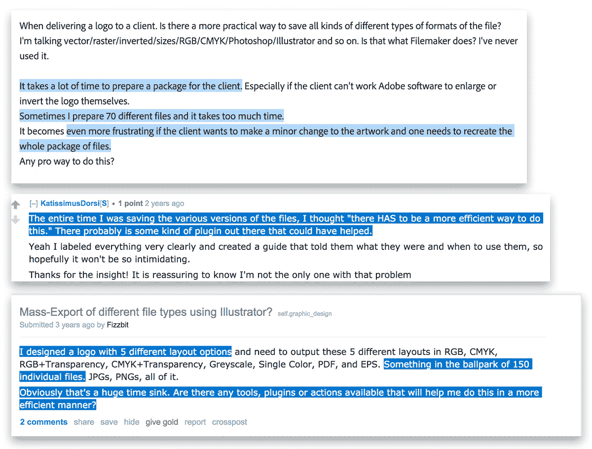
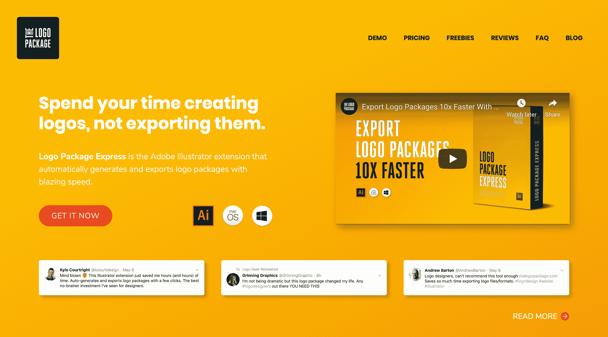
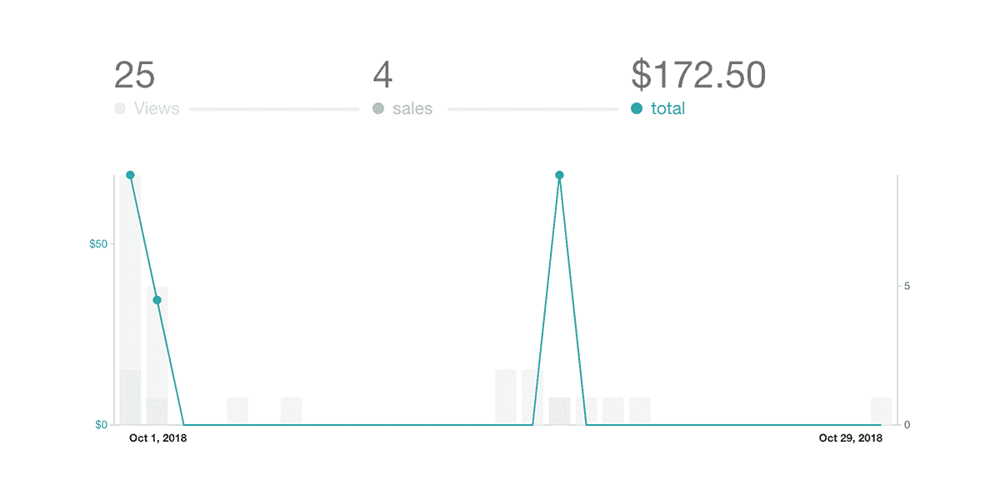
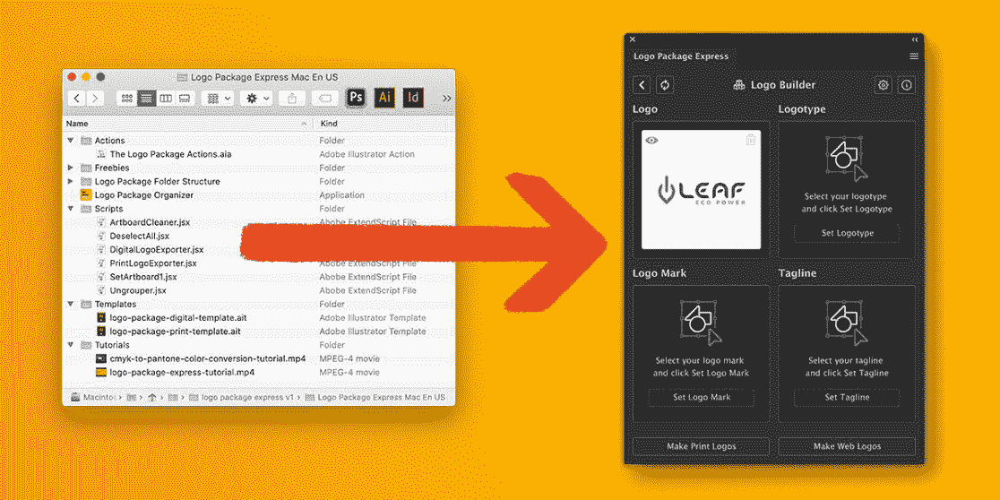
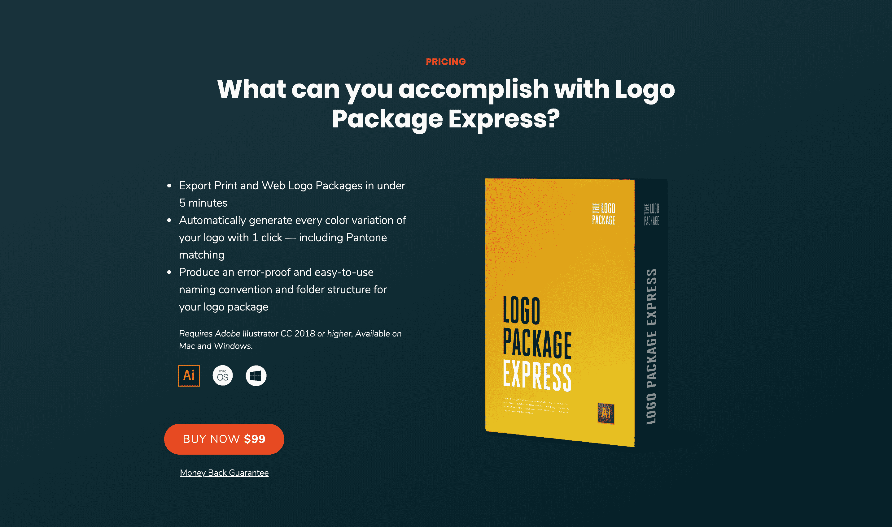
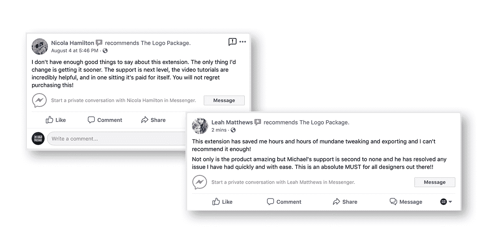

# 离开低自主性的设计职业去建立产品业务

> 原文：<https://www.indiehackers.com/interview/leaving-a-low-autonomy-design-career-to-build-a-product-business-ed93ce6530>

## 你好！你的背景是什么，你在做什么？

嗨，独立黑客们！我叫迈克尔，我成为一名成功企业家的旅程始于我在做一点单调乏味的工作时的一次顿悟。

在我工作的品牌代理处没有等级制度，但不知何故，我总是那个坚持做像素推进的忙碌工作的人。在这种情况下，我在我的办公桌前弯腰，创造一个标志包。为客户导出商标是一项真正令人麻木的任务，在许多方面，它完美地概括了我工作中所缺乏的一切。我意识到我不仅仅是制作商标包装。我被低估了，我没有成长。

我顿悟了，在短短的几个月内我就完成了代理工作。我离开了我的工作，开始为自己工作，选择自己的命运，走自己的路。我很快获得了两个主要的设计合同，并把我微薄的代理工资提高了一倍。我的客户每天都表现出他们的欣赏，我开始觉得自己又像个专业人士了。我的冒名顶替综合症被治愈了！

不要贪心；为你的顾客服务。

TweetShare

一切都进行得很顺利，但是我不知道我真的在风暴的中心。我把所有的鸡蛋都放在一个篮子里，当我的一份合同开始出现重大财务问题时，我必须尽快找到新的东西。

## 是什么促使你开始使用标志包快递？

我开始阅读一本名为《设计人们喜爱的产品》的书，作者是斯科特·赫尔夫。前几章都是关于做研究的。作者提倡一种现代市场研究系统，叫做“销售旅行”,这是艾米·霍伊和亚历克斯·希尔曼的想法，他们有 30×500 的名气。这个概念可以这样提炼:当你可以研究人们需要什么，然后生产什么，为什么还要希望人们购买呢？

退一步说，我受到了启发，于是我开始了自己的销售之旅，手里拿着数码砍刀，准备征服未知。尽管我尽了最大努力，我还是发现自己回到了非常熟悉的领域——回到了我在经纪公司工作时思考自己价值的起点。徽标包。

在浏览平面设计论坛、博客和脸书小组时，我发现了一个熟悉而持久的主题。设计师讨厌为他们的客户制作商标包装。

对于外行来说，一个 logo 包就是设计师在每个 logo 设计项目结束时发给客户的所有最终文件。因为一个 logo 必须存在于如此多的上下文中，设计师们最终只能手动导出几十甚至几百个 logo 文件，一次一个。它会从更有意义的创造性工作中抽走设计师几个小时的时间。设计师会很乐意尽可能地推迟这项任务。

我的目标很明确。我的注意力非常集中。我必须将徽标包装过程的速度和效率提高十倍。我必须把设计师从困扰我过去的痛苦的生产任务中拯救出来，这让我质疑自己作为设计师的价值。最后，我必须完成 1000 美元的销售，才能觉得这一切都是值得的。

## 构建最初的产品需要什么？

我花了 285 个小时的时间参加我的十字军东征——2018 年的整个夏天。最后，我有了一个笨重的产品，可以在五分钟内创建、导出和排序 80 多个徽标文件。我还建立了一个 36 人的幼稚邮件列表，其中包括我最好的朋友，我的女朋友...还有我妈妈。

原来做产品其实是产品生意最轻松的部分。这是建立一个潜在客户的观众群，他们正口吐白沫地向你扔钱，这是最具挑战性的部分。尤其是如果你像我一样是第一次。博客、休闲频道、电子邮件、免费赠品和登陆页面，天哪！

创建我的 logo 打包工具的 alpha 版本(然后加上光滑如丝的名字“Logo Package Automator Bundle”)是我职业生涯中最有收获和最有意义的工作。

2018 年 10 月 1 日，我准备在设计界掀起一场风暴。我急切地按下了众所周知的发射按钮……这是一次彻底的失败。看看我前三个月的销售额:

伙计们，数一数。四个。那是三个月内的四次销售。我花了六个月的时间，只靠我习惯的一半收入生活，我又能得到什么呢？172.50 美元，与我 1000 美元的目标相差甚远。

暗示严重的自我怀疑。我做错了什么？价格太高了吗？我认为任何人都在与商标包作斗争，这难道是错的吗？肯定不是；我的简单研究让我确信设计师需要我的产品。我的登录页面呢？我的副本没有转换吗？*我的纽扣颜色不对吗？*难道这个世界还没有准备好迎接我释放出来的魅力吗？

## 你们是如何吸引用户并发展 Logo Package Express 的？

作为获得用户的最后努力，我进行了一次假日销售。我把我的电子邮件序列发送给了一个现在已经有 50 名订阅者的新兴名单，令人惊讶的事情发生了。一个圣诞奇迹，如果你愿意的话。有人告诉了另一个人，另一个人又告诉了另一个人，突然一只鲸鱼来敲我的门。

伊恩·佩吉特是一个非常活跃的名为 [logo Geek](https://logogeek.uk/) 的 Logo 设计师社区的创建者，他邀请我成为其会员。他拥有近 10 万名 logo 设计师和一个排名很高的 logo 设计博客。这是神圣的干预，我不知道如何联盟计划的工作，但自然地，我告诉他，我可以，当然，让他成为一个联盟，没有问题！

与 Logo Geek 合作不到一个月，我就超过了 1000 美元的目标。我欣喜若狂。我的女朋友甚至给我买了祝贺小吃。我现在有 1000 美元的销售额和零食。我准备尝试让我的商标包装产品(现在有一个更容易接受的名字，*商标包装快递*)成为一个可行的收入来源和一个真正的企业。

## 你的技术是什么？

我那杂乱无章的产品只是 Adobe Illustrator 的一堆脚本、动作和模板。有些人可能会称之为最低可行产品。我知道，如果我想真正获得成功，我必须提升产品在设计师心目中的地位。在设计界，这意味着为 Illustrator 做一个真正的扩展。我不得不从这个到这个:

发生这种变化的唯一方式是我雇佣一个扩展开发人员，所以我从 Creative Scripts 得到了业内最值得信赖的开发人员之一 Trevor。合作非常好，他帮助我重新定义了我对扩展的愿景。

我不是开发人员，但是创建 Adobe 扩展所涉及的技术是这样的:

*   HTML 和 CSS
*   Illustrator 内置的 Chromium 浏览器
*   vue . j
*   JSX

## 你的商业模式是什么，你是如何增加收入的？

当扩展在实验室酝酿的时候，我开始收购一些拥有大量设计受众的附属公司。我在我的网站上为 Logo Package Express 的扩展版放了一个新页面。我没有太多东西可以展示给人们，所以我决定使用 [Figma](https://www.figma.com/) 为扩展制作一个我的视觉的高保真原型，然后记录我自己(使用 [Loom](https://www.loom.com/) )使用 Figma 原型做一次演练。我的分支机构同意[分享我的视频](https://www.loom.com/share/0aeda7c3218e4cbeb70ae91955828cd3)，它爆炸了！

在发布前的一个月，我以折扣价提供预订，以制造一些紧迫感，我收到了 170 份预订。这个扩展已经比 Logo Package Express 的旧捆绑版本表现得更好了，而我甚至还没有发布它。

我知道我有好东西，社区也知道。在整个发布过程中，新的代销商开始通过我网站上的代销商表单(只是一个简单的打字表单)来接近我。Instagram 上的设计影响者，拥有成千上万订阅者的 YouTube 频道的设计师。我已经完全准备好迎接有史以来最棒的发布日了…然后，灾难降临了。

## 你面临的最大挑战和克服的障碍是什么？

毫无疑问，我的上市日。

5 月 6 日是个大日子，问题几乎立刻就出现了。这个扩展还没有准备好发布。我们只需要几个小时来加密和签名。Gumroad 是我销售 Logo Package Express 的平台，它不让我改变我最初设定的发布时间。

我不得不放出一张美化的借据。我的 170 名预购客户(我想象他们穿着睡衣在电脑前等待，就像圣诞节的早晨一样)都必须打开一个数字煤块:一个. txt 文件，通知他们延期将在当天晚些时候到来。

分支机构在整个互联网上共享链接，人们涌向网站，却没有产品！我们终于准备好发布扩展，但后来我们意识到由于某种原因它不能在 PC 上工作。我不得不发布一些东西，这是发布日！我很快修改了所有登陆页面的内容，只写了 Mac，尽管几个月来我一直承诺 Mac 和 PC。我能感觉到来自世界各地的愤怒穿过时区猛烈地冲击着我的肚子。

愤怒的 PC 用户的电子邮件开始涌入，“这在我的 PC 上无法工作”，“你给我们发送了一个. txt 文件，说它即将到来，现在突然没有 PC 版本了！你在演什么戏？”

我的脸在融化，但我仍然抱着希望，希望我们能在今天结束前解决电脑问题。下午 5 点，我们发现了这个 bug 并把它压扁了，但是最严重的损害已经造成了。

在头脑中没有真正的议程的情况下开始你的搜索。

TweetShare

在所有最新发布的恶作剧中，我发现(通过一封又一封措辞强烈的电子邮件)我的 53 个预订客户被收取了双倍、三倍或四倍的费用(T2 )!在我疯狂地给每一个愤怒的顾客发电子邮件，向他们保证我会查个水落石出的时候，Gumroad 的支持在几个小时内无处可寻。当 Gumroad 的支持人员最终给我回复了一个解决方案时，我立即截取了整个对话的截图，并把它发给了所有 53 名被多收了钱的客户。很明显，它起到了使我人性化的作用，因为一些愤怒的顾客最终成为了合作伙伴。

尽管有灾难性的启动，我还是设法在当天结束前把一切都整理好了。苹果电脑和个人电脑都可以使用这种延期服务，而且退款正在向那些被多收费的人进行。

我更希望这一切都不要发生，但是回过头来看，我不知道我能改变什么。

## 你的商业模式是什么，你是如何增加收入的？

我现在离疯狂的发布日还有九个月，现在情况是这样的:

*   近 1500 个用户下载了 Logo Package Express。
*   我已经比 100，000 美元的目标超出了 100 倍。
*   已经有 100 多位优秀的人与我合作，每周都有更多的人加入进来。
*   我已经在博客、播客、推特风暴和脸书团体上出现过。
*   我已经离开了剩余的合同工作，全职专注于 Logo Package Express，我对未来无比兴奋。

多亏了代销商，一个了不起的开发者，和许多优秀的客户，我不再花时间制作商标包或质疑我的价值。相反，标志包装显示了我的价值。

【T2

## 你未来的目标是什么？

在我看来，商标包的问题只解决了一半。Logo Package Express 对于厌恶手工包装 Logo 的设计师来说是一个很好的解决方案，但是我的研究发现的另一个大问题是客户通常不知道如何处理收到的大量文件。虽然我的文件命名约定和文件夹结构确实有所帮助，但是在引导客户找到合适的文件方面还有很多工作要做，而我处在一个独特的位置来解决这个问题。

然而，我的首要任务是让 Logo Package 尽可能地表达最好的产品，为此，我目前正在努力开发第二版，它将包括我的用户高度要求的五个主要新功能。

现在对我来说，把数字作为目标似乎有点武断，但我认为实现 50 万美元的销售额将是下一个重要的里程碑。解决这个问题的客户端也将很好地为我建立一个经常性收入模型，这是非常可取的。

## 有没有发现什么特别有帮助或者有优势的？

到目前为止，我发现两种商业实践是我的业务中最有益的方面。

1.  不要贪心；为你的顾客服务。

我已经以折扣价或免费赠送了这么多份商标套装快递。要么是因为我的销售平台不向特定国家/地区销售，要么是有人用完了他们的所有许可使用。如果我太贪心，我就不会建立我的第一个会员关系。帮我联系伊恩的人没有钱买我的产品，但他非常想要，愿意帮我联系拥有大量设计受众的人。所以不要贪心。

还有，要有所贡献。我经常让客户给我发送他们的徽标文件，这样我就可以对它们进行修改。我每周制作定制视频，为特定用户解决特定问题。每次我为这样的客户做一些事情，我都把它作为一个机会，友好地请求评论，“如果你喜欢使用 Logo Package Express，请随时在我的网站上留下评论。”

我的评价通常都很正面，我的名声也很好，人们在和我做生意后感觉很轻松。

2.  附属伙伴关系是它的所在。

我不可能拿出足够多的内容来建立一个庞大的用户群，我也不想这么做。

与拥有大量想要你的产品的受众的代销商建立真正的伙伴关系是非常宝贵的。Logo 包单只有 2500 人，但我通过关联公司可以达到上百万。

当我说建立真正的伙伴关系时，我的意思是去了解这些人。我定期与我的几个分支机构交谈。想办法在和你的子公司之间建立联系*。帮助他们互相帮助赚钱，你的个人成长会超出你最大的期望。*

给你的代销商丰厚的佣金，至少 20-40%。给他们一个好的激励，你的回报会很丰厚。

## 对于刚刚起步的独立黑客，你有什么建议？

对一些人来说，这似乎是显而易见的，但我认为，当我们大多数人听到“需要是发明之母”时，我们相信如果我们向内看并找到解决我们个人斗争的方法，我们就能找到一个价值百万美元的想法。这种哲学几乎总是把你引入歧途，让你的整个创业生涯“原地踏步”。

相反，做一些真正的研究。在头脑中没有真正的议程的情况下开始你的搜索。在你理解并为之做出贡献的领域中，寻找人们抱怨的事情。做一只墙上的苍蝇，因为人们永远无法当场列出他们的问题，但他们喜欢在互联网上咆哮。利用这一点。

不要觉得什么事都要自己做，也不要太保护自己的想法。即使有人认为你有惊人的发现，他们也没有时间或精力去窃取你的想法。相反，把工作放在你的想法上以获得成功，并寻求与那些可以帮助你实现你的想法的人合作。

## 我们可以去哪里了解更多？

你可以在我们的网站上查看 Logo Package Express，看看它是如何工作的。

我在 Twitter 和 Instagram 上的身份是@TheLogoPackage。

如果你对 logo 设计和给客户发送 logo 文件特别感兴趣，可以看看我的[博客](blog.thelogopackage.com)。

最后，我上了[脸书](facebook.com/thelogopackage)。

—[<picture id="ember5288067" class="user-avatar ember-view user-link__avatar"></picture>迈克尔布鲁尼-格罗特](/mbrunygroth?id=FrUFedAhiJdrVhYOYcn8c70XFef1)【标志包快递创始人

## 想像 Logo 包快递一样建立自己的事业？

你应该加入[独立黑客社区](/)！🤗

我们是几千名创始人，互相帮助建立有利可图的业务和副业。来分享你正在做的事情，并从你的同事那里获得反馈。

还没准备好开始使用你的产品吗？没问题。这个社区是一个认识人、学习和实践的好地方。随意[随便浏览](/)！

—[<picture id="ember5288072" class="user-avatar ember-view user-link__avatar"></picture>考特兰艾伦](/csallen?id=ibTLPyjwVebnZjMGKvz6ztarnuV2)，独立黑客创始人

30votes