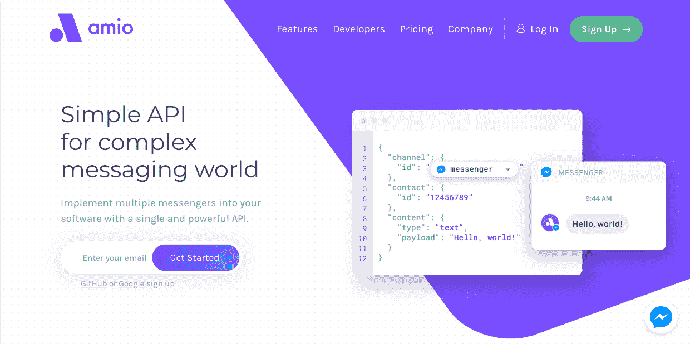
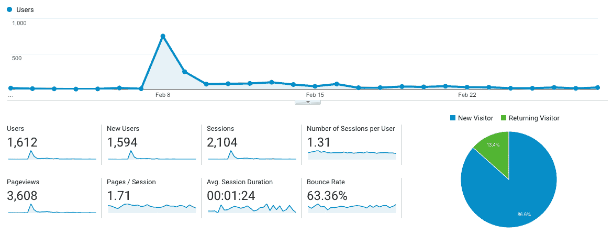

# 离开有收入的工作去做一个有激情的项目

> 原文：<https://www.indiehackers.com/interview/leaving-gainful-employment-for-a-passion-project-3eca4a1615>

## 你好！你的背景是什么，你在做什么？

嗨，我叫马托斯·库塞拉。我正在开发一个名为 [Amio.io](https://amio.io?ref=indie-hackers-interview) 的消息工具。这是一个通过统一消息 API 对多个信使进行抽象的产品。Amio 可以帮助您从简单的通知消息开始，到全天候为您的客户服务的完全自主的聊天机器人。

我和我的好朋友简·多纳泰克一起开始了这个项目。从记事起，我们就想经营自己的公司，现在已经在捷克共和国和德国的几家公司担任软件工程师，积累了经验。我们决定辞去高薪工作，开始我们自己的独立项目——简开发了一款自动交易应用，我制作了一台智能办公室冰箱。这两个项目都在生产中赚了不少钱，然而，我们逐渐意识到，无论是食品行业还是金融都不是我们感兴趣的领域。我们决定要做我们喜欢的事情，所以我们聚在一起，成立了 Amio。

我们目前的月收入为 4，500 美元，周周增长率约为 5%。

 

## 是什么激励你开始使用 Amio.io？

回到 2016 年，聊天机器人引起了很多热议。我们喜欢这个想法，但我们也意识到技术还不够，企业通常不准备使用聊天机器人来完成日常任务。另一方面，我们有这样的感觉，B2C 沟通将会迅速转变，很快客户将不再需要花很长时间等待或发送电子邮件，等待缓慢和/或不准确的回复。我们想驾驭这场变革的浪潮。

遵循精益启动原则，我们从客户访谈开始。我们的第一个目标是与中型公司的首席技术官、营销人员或客户支持主管交谈，目的是了解他们在客户沟通方面存在哪些问题。很快，我们发现这些公司缺少工具，甚至无法在 Facebook Messenger 等更新的消息渠道上做出回应。如果我们要取得任何进展，我们必须首先帮助他们解决这个特殊的问题。

在找到适合市场的产品之前，尽可能降低燃烧率。

TweetShare

我们希望构建与客户支持软件的集成，而不是跳进拥挤的水域，构建另一个服务台解决方案。从 Amio 的角度来看，这种方法是有意义的，因为我们的潜在客户会很高兴，并且有希望追加销售我们一直有兴趣构建的聊天机器人解决方案。

我们在编写一行代码之前就完成了第一笔销售，这非常令人兴奋！一旦我们开始工作，我们就在几周内编写了初始版本，并与客户一起设置好了一切。但我们很快发现，Facebook Messenger 的流量实际上相当低，因此企业不愿意花费额外的时间或金钱来实现丰富的消息传递体验。

据说，一个成功的创业公司通常会经历大约 25 次迭代，直到它最终找到一个适合市场的产品。这意味着你必须非常快速地进行迭代和调整。那个初始版本是我们众多产品中的第一个，老实说，我们还没有找到一个适合 Amio 的产品市场。但我们仍然有燃料和动力让 Amio 继续前进，继续在受限的跑道上迭代。

## 构建最初的产品需要什么？

我们开始 Amio 作为一个副业项目。我们很幸运，我们能够在我们的旧项目和 Amio 之间划分时间，所以我们不局限于只在深夜和周末开发应用程序。几个月过去了，我们意识到我们在 Amio 上投入了越来越多的时间，直到我们最终意识到我们实际上都在全职工作。

我们总是保持很低的燃烧率，所以初期投资并不太高。此外，我们总是能够找到一家愿意为我们测试的各种功能或迭代付费的公司。为了按时交付，我们甚至一度不得不雇佣一名设计师和两名开发人员。现在，我们的团队规模已经稳定在三人，这使我可以更专注于销售和营销，而将编程留给我的同事。

## 你们是如何吸引用户，壮大 Amio.io 的？

从一开始，我们就专注于中型公司，因为我们认为这是我们可以增加最大价值的地方。我们主要依靠销售——冷漠的电子邮件和冷漠的电话——这带来了几个感兴趣的客户。我们的客户遍布银行、保险、运输、电子商务、包裹递送服务等行业。每当潜在客户表示感兴趣时，我们都会尝试提出一个定制的解决方案，部署它，并衡量结果。我们的策略是将这些小实验的结果带到类似的公司，并作为有效和定制的解决方案呈现出来，但不幸的是，我们还没有找到一种可以轻松复制的模式。

这些最初的客户中有一些仍然和我们在一起，使用仍然在项目范围内的 Amio 特性和服务。然而，我们不得不放弃一些客户，因为随着 Amio 的不断变化和发展，我们无法继续支持我们的一些旧功能。对客户和他们的钱说不真的很难，但我们相信从长远来看这是值得的。

吃自己的狗粮让你站在客户的立场上，所以你可以非常直接地看到他们的需求是什么。

TweetShare

我们还在营销策略上做了一些工作。在独立黑客网站上，你可以找到很多关于如何在有限甚至没有预算的情况下有效营销的灵感。事实是，并不是所有的事情都适合所有人。也许你的项目是小众的，你对一个特定的营销渠道来说太晚了，或者其他什么。不要因失败而气馁。有些东西会对你有用，作为营销人员，你的工作就是找到它。

我们已经尝试了 Reddit、Hacker News、Stack Overflow、content marketing 等等。关于[产品搜寻](https://www.producthunt.com/posts/amio)的活动对我们来说效果很好，并产生了大量的流量。然而，这类活动的问题是它们不能产生稳定的流量。你得到了一大堆好奇的人，但他们中的大多数只是点击看看所有的炒作是怎么回事，然后就再也不会回来了。

 

在创业世界里，有时候最奇怪的想法会得到回报。在 madewithvuejs.com 的[上发布 Amio 肯定是其中之一。我们使用 Vue.js，一个渐进的前端框架，用于我们的 web 应用程序开发。我们决定通过在网站上展示我们的项目来回馈社区。它开始从高质量的开发人员那里产生大量的流量。这就是我们最终获得第一批非传统销售用户的原因。](https://madewithvuejs.com/amio)

## 你的商业模式是什么，你是如何增加收入的？

我们希望尽快使 Amio 可持续发展，所以我们专注于每月的经常性收入(MRR)。我们所有的商业决策都围绕这个数字，从产品决策到销售策略。如果我们决定下一步做哪个功能，我们总是选择我们认为最能增加 MRR 的功能。我们的目标是每周至少增长 5%。这是一个很高的标准，但是到目前为止我们还能跟上它。自今年年初以来，我们的平均增长率达到了 5.91%。

| 月 | 收入 |
| --- | --- |
| 2018 年 1 月 | 414 |
| 2018 年 2 月 | 638 |
| 18 年 3 月 | 638 |
| 2018 年 4 月 | 526 |
| 2018 年 5 月 | 571 |
| 2018 年 6 月 | 1013 |
| 2018 年 7 月 | 1125 |
| 2018 年 8 月 | 1067 |
| 18 年 9 月 | 1330 |
| 18 年 10 月 | 2047 |
| 18 年 11 月 | 2265 |

然而，我们的大部分收入来自咨询和定制功能开发。我们非常谨慎地对待我们的工作，确保一切都在 Amio 的掌控之中。在这一点上，我们不打算建立一个普通的咨询业务，所以如果我们看不到与整体 Amio 战略和投资组合的契合，我们不会接受这项工作。这种方法极大地帮助了我们改进项目。吃自己的狗粮让你站在客户的立场上，所以你可以非常直接地看到他们的需求是什么。

## 你未来的目标是什么？

从商业角度来看，我们希望达到一种“生存违约”状态，也就是说，我们希望达到一种收入覆盖所有支出的状态。一旦你达到这一点，你就有更多的空间去冒险和发展你的业务。我们认为该产品已经足够成熟，可以推动这一目标，并保证我们在销售和营销方面投入更多时间。这完全是 SaaS 空间中的数字游戏。我们必须达到一定数量的线索，以产生一定数量的网站访问，这将反过来产生一些转换。

在产品方面，我们正在努力增加更多的渠道和整合。有很多新的渠道涌现出来供我们探索，如 WhatsApp、苹果商务聊天、谷歌 RCS 等。我们可能追求的其他渠道包括语音助手(Google Home，Amazon Echo 等。)，网络聊天，或者 iOS/Android 应用内聊天。为了提供完整的消息传递工具和功能套件，我们必须添加更多的分析和人工智能工具，以及与服务台软件和其他业务解决方案的集成。

## 对于刚刚起步的独立黑客，你有什么建议？

你可以在网上找到很多建议。有些是好的，有些是坏的；有些行得通，有些行不通。建议或最佳实践列表应被视为灵感，而不是硬性规定。适合一个人或一家企业的可能不适合你。说到这里，这是我最好的建议:

*   在找到适合市场的产品之前，尽可能降低燃烧率。
*   保持开放的心态，不要因为你认为想法行不通就把它们扔出去。试试看。如果成功了，那太好了。如果没有，继续前进。
*   不要接受那些无法用清晰的标准和证据来支持自己成就的人的建议。
*   如果你需要动力，去寻找那些成功的公司，这些公司已经讲述了他们的过程，阅读了他们在开始时是如何挣扎的。这会让你感觉不那么孤独，希望能让你专注于自己的目标。
*   照顾好你自己。努力工作，也要努力休息。

## 我们可以去哪里了解更多？

你可以在 [amio.io](https://amio.io?ref=indie-hackers-interview) 找到 Amio。我们也活跃在推特 [@amio_io](https://twitter.com/amio_io) 。我的个人推特账号是 [@mat_kuc](https://twitter.com/mat_kuc) 。请随时联系我，我随时准备回馈社会！🤞

谢谢你邀请我来这里，祝你的项目一切顺利！

—[<picture id="ember5298225" class="user-avatar ember-view user-link__avatar"></picture>马托斯·库切拉](/kuceram?id=5a1OFCnFRsYEV0xO0ghtTZMnvil1)，Amio.io 创始人

## 想像 Amio.io 一样建立自己的事业？

你应该加入独立黑客社区！🤗

我们是几千名创始人，互相帮助建立有利可图的业务和副业。来分享你正在做的事情，并从你的同事那里获得反馈。

还没准备好开始使用你的产品吗？没问题。这个社区是一个认识人、学习和实践的好地方。随意[随便浏览](/)！

——[<picture id="ember5298230" class="user-avatar ember-view user-link__avatar"></picture>柯特兰艾伦](/csallen?id=ibTLPyjwVebnZjMGKvz6ztarnuV2)，独立黑客创始人

28votes