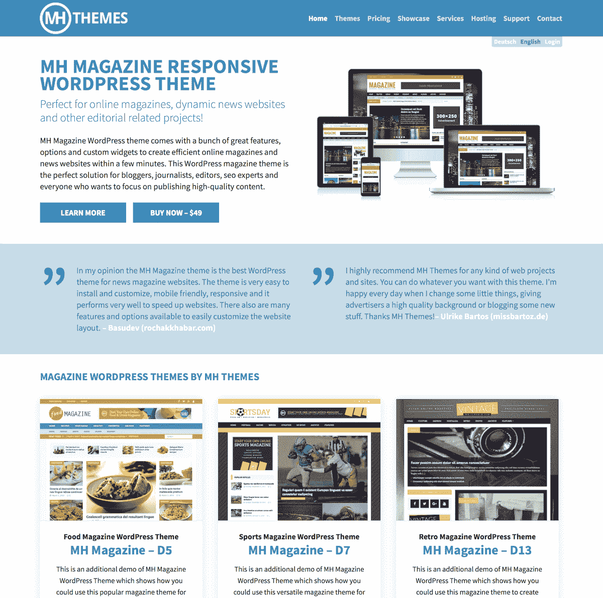
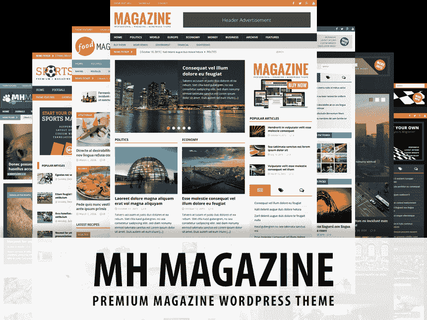
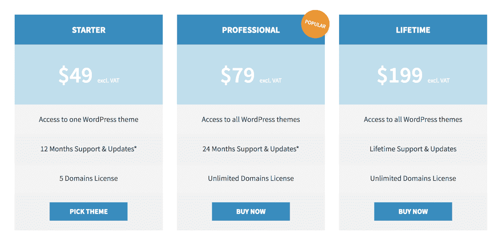

# 离开我的股票交易生涯去建立 WordPress 业务

> 原文：<https://www.indiehackers.com/interview/leaving-my-equity-trading-career-to-build-a-wordpress-business-cd10ed8057>

## 你好！你的背景是什么，你在做什么？

大家好，我叫 Michael Hebenstreit，是一名前股票经纪人和企业家，住在德国美因河畔法兰克福。

我是 [MH Themes](https://www.mhthemes.com/) 的创始人兼 CEO，这是一家 WordPress 主题公司，专门为在线杂志、新闻网站和高级博客提供专业杂志 WordPress 主题。

如今，我们的年收入约为 36 万美元。

 

## 是什么促使你开始接触 MH 主题？

我的背景和我今天做的很不一样。我的职业生涯始于银行业，在法兰克福的多家银行和经纪公司担任股票经纪人(机构股权交易)。

几年前我甚至不知道 WordPress 是什么，所以我当然不知道如何编写 WordPress 主题。我也没有接受过任何设计、开发或 IT 方面的教育。

然而，我往往很快就厌倦了，我经常有疯狂的商业想法(这些想法通常不会成为现实)，早在早期，我就作为一种爱好尝试为各种事物创建 HTML 站点。那是在 WordPress 出现之前很久的事了。

2010 年，我开始对网络营销和搜索引擎优化感兴趣，当时我推出了 2-3 份网络杂志，以便进行尝试。那也是我第一次了解 WordPress 的时候，那正是我当时在寻找的东西。

这项业务基本上是从独角戏开始的，即使在今天也仍然只有我们两个人。

TweetShare

用 WordPress 运行我的在线杂志，我并不总是对我的主题满意。他们只是没有做我希望他们做的所有事情，所以最终我开始钻研代码和调整东西，但并不真正知道我在做什么。

但是边做边学是最好的学习方式之一，我越来越擅长按照自己的意愿调整代码。我开始理解 WordPress 是如何在幕后工作的，我阅读了大量的教程和 WordPress Codex，同时不断尝试代码。

有一天，我决定从头开始设计和编写我自己的 WordPress 主题，虽然这相当耗时，但这无疑是我今天所做事情的基础。

我也注意到主题作者在 ThemeForest 上赚了多少钱。真正给我留下深刻印象的是，即使有无数的主题可用，大多数作者仍然非常成功地销售他们的产品。我已经从朋友和家人那里得到了关于我的第一个*业余爱好者*主题的巨大反馈，但是当我注意到这个巨大的市场和潜力时，我决定一头扎进去。

## 构建最初的产品需要什么？

为你自己的网站开发一个 WordPress 主题和向成千上万的人出售一个可靠的产品是完全不同的。我充分意识到了这一点，在最初阶段，我一边继续从事银行业的日常工作，一边不断提高自己的技能和对相关事物的理解。

后来有一天，在我意识到这将需要我所有的时间和精力后，我转而全职做我的主题生意。幸运的是，我存了足够的钱，不用担心这个决定的财务方面。

一旦我觉得用 PHP 编写代码和使用我需要的工具和资源很舒服，我就开始编写我的第一个商业产品。正如我之前提到的，我不是一名设计师，我可能太过于逻辑化和商业导向，以至于不能设计创造性的东西，甚至不能做艺术工作。我这辈子都没用过 Photoshop 或者其他什么设计软件。

出于这些原因，我最初与一位专业设计师合作。他的工作是设计一个很棒的杂志主题，我负责编码部分。然后我们会在 ThemeForest 上发布新的主题并分享收入。

嗯，这并不像预期的那样有效。向 ThemeForest 提交主题后，他们马上拒绝了它，因为在他们看来，主题设计不够好或不够独特。

我几乎完全放弃了这个想法，回到了我在银行业的工作中。

TweetShare

当然，这是一次非常令人沮丧和畏惧的经历，尤其是在聘请了一名设计师并投入了所有艰苦的工作之后。我几乎完全放弃了这个想法，回到了我在银行业的工作中。但经过几天的思考，我决定结束与设计师的合作，自己从头开始。

我不知道如何使用设计软件，所以我只是开始编码和构建我的 WordPress 主题，同时在浏览器中预览它。我想编写我个人一直想要的杂志主题，我根据自己的喜好应用 CSS 样式，没有过多考虑网页设计最佳实践或其他人可能喜欢什么。

我的代码编辑器是 [Coda](https://panic.com/coda/) 。我在 [MAMP](https://www.mamp.info/) 运行我的开发环境。对于版本控制，我使用了 SVN 的[版本](https://versionsapp.com/)，结合 Assembla.com 的。

我花了大约 300 个小时来准备我的第一个商业产品。这主要是因为我仍然在学习和尝试。但在 2013 年 2 月，时间到了:我推出了 [MH 杂志主题](https://www.mhthemes.com/themes/mh/magazine/)，这是今天 WordPress 最受欢迎的杂志主题之一，在全球数千家网站上运行。(你可以在 [MH 主题展示区](https://www.mhthemes.com/themes/showcase/)看到一些很棒的例子。)

 

你无法想象我和妻子在完成第一笔交易后的感受。人们真的喜欢我做的东西，这种感觉太棒了，我非常感谢他们的支持。我仍然是。

## 你是如何吸引用户并发展 MH 主题的？

在我与 ThemeForest 的看门人相遇后，我开始寻找其他方式来销售我的产品。我不喜欢经营有依赖关系的企业，所以我想最好是自己开店。我编了一个合适的主题，推出了 [MH 主题网站](https://www.mhthemes.com/)。

但是人们当然不会因为你有了自己的网站就突然开始购买你的产品。于是我开始做 SEO，写博客，建立社交媒体渠道，在相关网站做广告，等等。

我还在 WordPress.org 的[上推出了该主题的精简版(免费增值)以吸引更多用户。这在当时(2013 年)非常有效，收入增长很快，通常每月增长超过 100%。](https://wordpress.org/themes/mh-magazine-lite/)

2013 年 11 月，我在[创意市场](https://creativemarket.com)推出了这个主题，这是一个设计内容的平台，我认为这将是主题森林的一个很好的替代方案。相反，我最终发现 WordPress 主题在那里根本卖不出去。

尽管如此，创意市场成为我们的一个很好的选择。不是因为营销优势(这是不存在的，至少它与 WordPress 主题有关)，而是因为它允许我们销售 WordPress 主题，而不需要处理税收、发票和法律事务。

在德国(或整个欧盟)经营一家企业可能相当痛苦。有很多法规和税务问题需要处理，尤其是当你在全球销售时。所以我决定把这个外包给创意市场。

2014 年初，我们首次突破了月收入 1 万美元的里程碑。业务运行得非常好，将管理工作外包给创意市场也获得了回报。这让我可以把时间完全花在开发、支持和营销上。

| 年 | 收入 |
| --- | --- |
| 2013 | 52404.75 |
| 2014 | 178725.53 |
| 2015 | 371077.63 |
| 2016 | 398642.64 |

因为我们将人们从我们的网站转移到创意市场，我们的主题很快在那个市场上流行起来。它最终成为 2014 年创意市场上最受欢迎的 WordPress 主题。

2014 年 1 月，WordPress 联合创始人马特·莫楞威格经营的公司[automatic](https://automattic.com)也联系了我们。他们问我们是否愿意成为高级主题合作伙伴，在 WordPress 上销售我们的 WordPress 主题。我们对这一提议感到兴奋，因为这将使我们的产品可以提供给数百万新用户。

所以我签了合同，并开始为他们的环境准备我们的产品，这证明是相当努力的。但稍后会详细介绍。

## 你的商业模式是什么，你是如何增加收入的？

显然，MH 主题的主要收入来源是主题销售。销售额部分来自有机的口碑增长，但也有一些来自免费增值业务的升级。

我们还通过 Adwords 和脸书做了大量的点击付费广告，效果也不错。

最重要是，我们有一个只接受邀请的会员计划，目前占我们收入的 10%左右。

| 月 | 收入 |
| --- | --- |
| 2017 年 1 月 | 38227.69 |
| 2017 年 2 月 | 33952.89 |
| 2017 年 3 月 | 33761.74 |
| 2017 年 4 月 | 27905.20 |
| 2017 年 5 月 | 27304.85 |
| 2017 年 6 月 | 29095.82 |
| 2017 年 7 月 | 27245.51 |

今天，我们的月收入约为 3 万美元，比 2016 年下降了近 10%。在我看来，停滞的部分原因是整体市场环境的变化，这一点我稍后会谈到。

我特别高兴的是，我们的网站本身已经开始产生越来越多的收入。我们每月有大约 225，000 的访问量，我们收到了很多插件和主题开发者的请求，他们希望我们评论他们的产品。([这里有个例子](https://www.mhthemes.com/blog/adback-anti-adblock-plugin-review/)。)

在我们的网站上，我们已经开始推荐 [WordPress 托管公司](https://www.mhthemes.com/wordpress-hosting/)，并且我们已经制作了一个 [WordPress 主题目录](https://www.mhthemes.com/themes/wp)，在那里我们推荐第三方主题。这两者都产生附属收入。

 

这些年来，我们已经推出了一系列额外的主题，但是没有一个能与第一个产品的成功相提并论。我们也推出了几个免费的主题，但是他们并没有真正的起飞。这表明，免费增值模式并不总是很好。

我认为人们注意到我们主要关注 MH 杂志，并倾向于购买它而不是新增加的内容。也就是说，我们已经创建了[定价计划](https://www.mhthemes.com/pricing/)，将我们所有的 WordPress 主题捆绑在一起，并且受到了我们用户的欢迎。

我特别自豪的一件事是，我能够相当合理地扩展 MH 主题，同时运行在极低的资源上。

我的妻子不时地协助我回复邮件和其他小任务，她最终在 2016 年 2 月成为了一名全职员工。这项业务基本上是从独角戏开始的，即使在今天也仍然只有我们两个人。

我们还与承包商合作，在需要时，我们将部分支持、内容创建和其他工作外包给他们。但我仍然自己处理核心业务，值得一提的是，对我来说，这意味着每周工作 7 天，每天至少工作 10 小时。所以成功不是没有代价的。

然而，我见过一些竞争对手，他们有 10 多名员工，30 多名，40 多名，甚至 60 多名发布 WordPress 主题的员工，他们的收入也不相上下。有时我会想:如果我们只有两个人也同样成功，那么我们有 10 多名员工和同样的资源会怎么样呢？

边做边学是最好的学习方法之一。

TweetShare

但我也知道管理人员可能很难，虽然更多的资源会很好，但大量的时间和精力可能会花在管理员工和处理其他与此相关的意外问题上。

显然，当你的月收入在 30k 美元左右，而你的月成本在 1000-3000 美元之间徘徊时(取决于我们外包的工作量)，还有相当多的资金可以使用。在过去的几年里，我们已经将部分资金用于各种收购。

我们已经接管了几家主题商店和 WordPress 相关网站。我们使用他们的内容和流量来加强我们的网站，然后我们停用他们的主题，同时试图将他们的客户转化为我们自己的产品。这无疑对加强我们的业务起到了很好的作用。

今天，我们仍然在寻找有趣的收购，尽管在合理的时间内获得 WordPress 业务的投资回报已经变得越来越难。

目前，我们正在努力增加经常性收入。除了每个月都有新客户进来，我们还有数千名许可证过期的现有用户。

我们从未推出过自动续订，同时我们也没有让续订变得足够明显。所以我们有很多用户仍然在运行他们的网站，却没有意识到他们的许可证已经过期。目前，我们正在努力通知这些用户，以便他们可以更新他们的许可证，以便再次获得产品更新，这比我预期的要好。

我认为，对于其他企业家，尤其是那些销售数字产品的企业家来说，另一个有价值的见解是，如果你专注于核心业务，而不是处理税收、发票、法律要求等行政职责，你可以节省大量时间、金钱和麻烦。

我之前已经提到过，我们最初将这项工作外包给创意市场，但自 2014 年以来，我们一直使用 [FastSpring](https://fastspring.com/) 来为我们处理业务。这种方式非常有效，而且比通过第三方市场销售更便宜、更直接。

## 你未来的目标是什么？

在我看来，WordPress 主题的市场在过去几年里已经发生了很大的变化。

回到 2013 年，推出一个 WordPress 主题并让它变得流行起来要容易得多。今天，WordPress 主题的市场已经变得非常拥挤和饱和。如果不投入大量的时间和金钱进行营销并为你的产品建立一个社区，要让一个主题非常成功几乎是不可能的。每天都有许多很棒的 WordPress 主题发布，但大多数都不会成为一个受欢迎的产品，甚至不会吸引合理数量的用户。这很可悲，但却是事实。

然而，由于 WordPress 的巨大潜力和影响力，发布一个新的 WordPress 主题并在几个月内创造一些销售额还是可以做到的。在我看来，这不是一个好策略。我不认为一个 WordPress 主题可以让每月花费 1k-2k 美元成为一个成功的产品或可靠的业务。

选择一个有趣的利基市场，打造一个单一的产品，并让它成为面向受众的同类产品中的佼佼者。

TweetShare

例如，有许多主题商店每月(有时更多)发布一个新的主题，并从中赚取一些钱。然后有一天，他们结束了 50+主题的投资组合，所有这些都需要支持和维护。从长远来看，祝这种方法好运！

我认为更好的做法是选择一个有趣的利基市场，打造一个单一的产品，并为受众提供同类产品中的最佳产品。这也更容易营销这样一个利基产品，而不是做营销的产品组合，都服务于不同的受众或目的。

因此，我们计划进一步专注于我们的主要产品，并随着 WordPress 的发展继续改进它。

几年后，WordPress 可能不会像今天这样。通过像古腾堡编辑器这样的项目，我们已经看到了它的发展方向。

 

正如我最近[在帖子](https://www.mhthemes.com/blog/gutenberg-wordpress-marketing-problem/)中写的，我不能说我是古腾堡的忠实粉丝，或者我认为我们正朝着正确的方向前进(特别是当你考虑到整个 WordPress 生态系统的时候)，但这似乎是负责人已经决定的。

我们明白，WordPress 当然需要发展，以使其适应未来并具有竞争力，但 Gutenberg 的不确定性导致我们暂停了所有主要的开发，直到更清楚这些变化将如何影响现有的 WordPress 生态系统。

一旦未来明朗，我们可以提前计划，考虑即将到来的发布和改进。我和许多其他 WordPress 开发者交谈过，他们中的大多数都在做同样的事情。依赖 WordPress core 将会发生什么当然不是一件令人舒服的事情，尤其是当向后兼容性不再是优先考虑的事情的时候。

说到依赖性，我之前提到过，我们从 2014 年开始在 WordPress.com 上销售。由于多种原因[我们在 2017 年 6 月停止了在 WordPress.com](https://www.mhthemes.com/blog/we-stop-selling-themes-on-wordpress-com/)的销售。不幸的是，他们做出了一些我们业务无法接受的改变，我们更愿意完全控制我们在哪里以及如何销售我们的产品。

我认为其他 WordPress 公司为了在未来生存也需要发展。我们可能会在未来几个月内看到一个大规模整合的阶段，也可能会有更多的惊喜。我认为越来越多的公司将转变为 SaaS 企业，提供专注于入职和可用性的一体化解决方案。如果进一步发展对我们有意义，我们也会考虑这种可能性。

另外，我觉得在 WordPress 之外寻找商机是个不错的主意。我们目前利润很高，有非常坚实的财务基础，这将使我们能够扩展到其他领域。

我对投资其他有趣的商业项目持开放态度，我会密切关注这些项目。2015 年，我成立了另一家公司( [Array Internet](https://arrayinternet.com/) )，目前是我们 WordPress 业务的控股公司。但我也计划利用那家公司投资其他在线业务，以实现多元化。

## 你面临的最大挑战和克服的障碍是什么？

我面临的最大障碍是雇佣合适的人。我们的利润很高，我们可以很容易地雇用一整个团队的人才来把我们现有的业务带到一个新的水平(甚至尝试新的商业风险)。

然而，雇佣人似乎一点也不容易。我试过一次，效果不是很好。我雇佣了一个开发人员，这样我就可以更专注于管理和营销，但最后发现这个开发人员没有必要的技能。我不得不重做他的很多代码，这是对时间和金钱的巨大浪费。

也许这是我的一个错误，但我不喜欢雇佣和解雇文化的想法。因此，即使在我刚刚提到的糟糕代码困境之后，我也没有解雇开发人员。相反，我试着让他做其他事情——图形作品、视频制作、内容创作、客户支持和其他角色。

然而最后就是不了了之，我不得不结束合作。整体体验花费了我大量的时间、金钱和精力。不久之后，当我重新开始自己处理事情时，我注意到我又变得更有效率了——在我看来，事情本该如此。

我仍然自己照顾核心业务…这意味着每周工作 7 天，每天至少 10 小时。

TweetShare

*史蒂夫·乔布斯曾经说过，“雇佣聪明的人然后告诉他们该做什么是没有意义的；我们雇佣聪明的人，这样他们就能告诉我们该怎么做。”*

然而，事实上，找到这样的人似乎是一项艰巨的任务。许多人只是在找工作，这样他们就可以赚些钱，谋生。很难找到渴望并有兴趣为公司的成功做出贡献的人。

我们需要有自己的愿景和想法的人来推动事情向前发展，而不是只做你让他们做的事情的人。但是，正是那些拥有高超技能、想法和远见的人通常会自己创业，而不会被雇佣——至少不会以对我们这样规模的公司来说合理的速度雇佣。

## 如果你必须重新开始，你会做什么不同的事？

如果我可以重新开始，我会完全专注于一个利基产品，并使其成为市场上最好和最受欢迎的产品。不幸的是，我在过去曾被诱惑发布额外的东西，以便(可能)增加收入，主要是因为竞争对手在做同样的事情。

那绝对是个错误。我的意思是，我们基本上从一开始就让 T1 专注于一个产品，但现在我们还有九个其他产品需要维护。有足够多的 WordPress 主题公司发布一个又一个主题。我们不需要成为另一个。

我们的座右铭从一开始就是*质量胜于数量*。所以现在回想起来，我应该更严格地遵循这句格言。

## 有没有发现什么特别有帮助或者有优势的？

我认为时机是我们业务的最大优势。正如我之前提到的，2013 年的 WordPress 主题市场与今天有很大不同。

如果你今天想开始一个 WordPress 主题业务，并且没有非常独特和特别的东西可以提供，那么可能有一个更好的方式来花费你的时间和金钱。尤其是考虑到即将到来的古腾堡变革。也许带有新 Gutenberg 编辑器的 WordPress 主题只会变成一堆 CSS 文件，只关心设计，这将导致许多不同的公司创建类似的设计，并使其更难竞争。

## 对于刚刚起步的独立黑客，你有什么建议？

无论你做什么，尽可能集中注意力。决定你想提供什么，然后努力使它成为市场上最好的产品。

不要因为过于密切地关注竞争对手，甚至是模仿他们的做法而失去注意力。用不同的方式做事，试着找到你的听众，倾听他们的需求。

如果可以的话，雇佣合适的人来帮助你发展业务。让他们参与你的成功，并激励他们贡献他们的想法和愿景。如果你已经这样做了，请联系我让我知道它是如何工作的！:-)

也许我能给你的最重要的建议是不要让自己依赖第三方公司或市场。

最后，我非常感谢 ThemeForest 在早期拒绝了我们的第一个产品。否则，我们可能不会从一开始就专注于我们自己的网站，我们现在会陷入相当大的麻烦中。

如今，ThemeForest 上的许多主题作者正面临着由于 Envato 的饱和和变化而导致的收入下降，这直接影响了他们的业务。我见过一些拥有优秀产品的主题作者，他们已经因此而倒闭了。

重要的是要记住，这些市场公司都在经营自己的业务，有自己的目标，这些目标可能并不总是符合你的最佳利益。因此，尽可能保持控制，利用市场进行推广，如果没有其他原因的话。

## 我们可以去哪里了解更多？

你可以在推特上找到我( [@m_hebenstreit](https://twitter.com/m_hebenstreit) )和 MH Themes ( [@MHthemes](https://twitter.com/MHthemes) )还有[脸书](https://www.facebook.com/MHthemes)。一定要看看我们的[博客](https://www.mhthemes.com/blog/)，在那里我们定期分享见解、教程和新闻。

我也要特别感谢你读到这里。感谢您的时间，我希望这些见解有助于您做出自己的商业决策。

如果你有任何问题，请在下面留下评论。(如果您希望私下交谈，请随时通过我们的[联系表](https://www.mhthemes.com/contact/)联系我们。)

——[<picture id="ember8235148" class="user-avatar ember-view user-link__avatar"></picture>迈克尔·赫本斯特里特](/michaelh?id=lKLzFspIzhaalppUoFTfOMvnWX82)

## 想像 MH Themes 一样建立自己的事业？

你应该加入[独立黑客社区](/)！🤗

我们是几千名创始人，互相帮助建立有利可图的业务和副业。来分享你正在做的事情，并从你的同事那里获得反馈。

还没准备好开始使用你的产品吗？没问题。这个社区是一个认识人、学习和实践的好地方。随意[随便浏览](/)！

—[<picture id="ember8235153" class="user-avatar ember-view user-link__avatar"></picture>考特兰艾伦](/csallen?id=ibTLPyjwVebnZjMGKvz6ztarnuV2)，独立黑客创始人

13votes