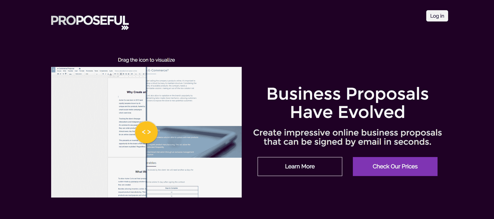

# 从 8 个月的电话推销和反馈中吸取的经验教训

> 原文：<https://www.indiehackers.com/interview/lessons-learned-from-8-months-of-cold-calling-and-feedback-d365e1ac77>

## 你好！你的背景是什么，你在做什么？

我叫 Thiago，27 岁，来自巴西圣保罗，是一名开发人员和营销人员，也是 SaaS 在线求婚网站的创始人。

我辞职开始全职做自由职业者的时候是 19 岁，2013 年，我创办了一家小型网络开发机构。在为客户工作时，我总是在发明网络和移动应用程序。从那时起，我已经建立并启动了至少 8 个项目，其中大部分只产生了一点收入，直到我推出 Proposeful。

我现在的全职工作是写建议书和管理 SaaS。我们在 2016 年 1 月推出了第一个版本，但直到 10 月份，我们才看到产品市场适应性或收入的任何迹象。这是在给潜在客户打了成千上万个陌生电话、几十个被抛弃的功能、几个月的开发时间，以及详尽拜访了我们向*每个人*推销的会议之后。

自 10 月份以来，我们的 MRR 价格已接近 400 美元，客户遍及南美和欧洲。我们预计 2 月份将达到 1000 美元，6 月份将达到 5000 美元。现在还为时尚早，但我们不会在广告上花一分钱，所以这些结果对我们来说非常令人兴奋。

 

## 是什么促使你开始创业？你最初的目标是什么？你是怎么想出这个主意的？

[Proposeful 的](https://proposeful.com)旅程始于 2013 年，当时我和一个朋友创办了一家小型网络开发机构。我为我们建立了一个项目和财务管理工具来记录账单、项目和任务。我不断改进这个工具，到 2015 年，它变得非常简洁，所以我们把它作为 SaaS 产品推出。

它获得了一些客户，我们被邀请参加我所在城市的预加速项目。它非常注重市场验证，作为项目的一部分，我对陌生人进行了近 80 次采访——自由职业者、机构所有者、顾问和其他服务提供商——并绘制了他们的所有需求，试图将这些点联系起来。

我意识到，这些人在保持销售稳定和不够快速地达成交易方面一直存在问题。我已经这样做了 5 年，所以我非常了解这个挑战，并且相信通过传授我所学到的经验和提供很棒的工具，我可以帮助他们挽救他们的企业。

所以我做的就是扔掉旧产品 90%的功能，把它重建成一个提案写作工具。

## 就时间和金钱而言，你花了多少时间来开发新产品？

事实上，我是一名开发人员，这使得我们更容易构建产品。尽管如此，我们还是花了至少 8 个月的时间不断的用户反馈和反复试验，直到我们让[proposive](https://proposeful.com)像今天一样直观和有用。

有趣的是，我们知道在这个领域还有其他的工具，但是在我们的产品有一个相当可靠的版本之前，我们从来没有关心过它们是如何工作的。这让我们能够专注于实际的可用性，而不是复制竞争对手的功能。事后看来，这确实帮助了我们。

事实上，竞争是无关紧要的。专注于他们的产品只会阻碍你的创造力。我相信这就是为什么 proposals 与其他商业计划书工具如此不同，对我们的客户如此有效。

Proposeful 一直是自举的，我觉得对一个 SaaS 公司来说是一件很棒的事情。当你没有别人的钱可以花的时候，你根本不能从第一天起就不考虑利润。我们所做的一切都是为了以最具成本效益的方式获得客户，并为他们提供一种只要他们的业务存在就会使用的工具。

## 你用过什么销售和营销策略？你是如何在顾客面前提出建议的？

当我们推出时，我们认为我们只需要一个漂亮的网站，一个大的“立即注册”按钮，销售就会来了。但事情不是那样的。大多数产品必须重新验证和重建，直到它们符合市场的需求，即使这样，你也需要一个惊人的用户体验来消除客户的障碍，增加保留率。

在发布前的几个月，我们注意到人们注册了免费试用，但并没有真正使用该产品。我们决定，如果有人想用[proposive](https://proposeful.com)的话，他们必须先和我们谈谈，这样我们才能真正了解他们想要什么。

我们要了他们的电话号码，给每个人打了电话，以便更好地了解他们在寻找什么。这过滤掉了仅仅是好奇，让我们可以和真正感兴趣的潜在客户*聊天。与此同时，我们假设可能的客户资料(如数字机构或会计师)，找到这些业务的列表(通常是协会和工会)，并逐个给它们打电话。*

我们每周致力于一个侧面。例如，第一周我们选择了联合办公。我们打电话给巴西所有的 232 个联合办公空间，说，“嗨，我能和你的销售部门通话吗？”。然后我们找到了合适的人选。有些很粗鲁，有些很棒。我们以这种方式获得了我们的第一批客户，然后在第二周对数字机构采取了同样的方式，第三周又是咨询公司。

在这样做了近 6 个月后，我们争取的客户对这个工具很满意，我们有了正确的功能(感谢他们的反馈)，并准备再次尝试自助服务模式。所以我们在 10 月份重建并推出了我们的网站，第二天早上就有了第一笔销售额。(请注意，我们已经为我们的网站建立了博客受众和一些流量。)

以下是我们如何获得客户的清单:

*   Proposeful.com 博客(我们写销售、潜在客户和谈判的博客)是我们大部分流量的驱动力。我们在巴西最相关的关键词中排名第一，随着最近推出的英文版，很快将在大多数国家推出。
*   [对我们来说，Tawk.to](http://tawk.to) 改变了游戏规则。这是一个免费但非常完整的实时聊天工具。我们 70%的顾客在结账页面开始互动，我们需要随时待命。多亏了 Tawk.to，我才在健身房完成了交易。
*   我们的邮件列表通过电子邮件获得所有帖子，平均打开率为 30%，点击率为 15%，并最终转化了一些客户。
*   我们正在与我们领域中最大的初创公司以及咨询公司建立合作伙伴关系。这包括集成、客座博文等等。对于其他创业公司，我们有机会通过整合来改进这两种产品，并减少流失，同时利用彼此的受众。对于咨询公司，我们尊重向客户说明我们产品的权威机构，以及帮助需要更多实践方法的客户的新方法。

## 你的商业模式是如何运作的？你的营收背后有什么故事？

[命题式](https://proposeful.com)教会了我们很多关于价值感知的东西。当我们打电话给潜在客户时，我们提供了一个非常低的无限制使用的价格。我们的想法是，低价能让我们更快地验证市场需求。但是我们毫无进展。我们告诉他们 Proposeful 帮助其他用户提高了 30%的销售额(这是真的，我们用我们的测试版用户测量了这一点),小小的价格可能使这种说法不太可信。

所以有一天，我决定将我们的价格提高近 10 倍，去追求更大的公司。令人惊讶的是，这就是我们达成第一笔交易的全部成本。新的定价使我们能够根据客户的需要投入尽可能多的时间进行销售，并寻找销售周期更长但对我们的解决方案有更强需求的公司。

现在，我们认为这些公司是我们的理想客户，但也让自由职业者和小公司可以使用 Proposeful。因为用户可以自己注册、购买和使用我们的产品，所以现在对我们来说是完全可行的。所有提案计划都提供我们的所有功能，如提案模板、通过电子邮件签署提案和跟踪客户访问，并且只受用户需要发送的提案和演示文稿数量的限制，每月 15 美元起，最多 10 个提案。

我们已经能够通过在我们的侧边栏和每篇文章的底部放置一个横幅来利用我们博客上已经有的流量。我有很多客座博文，这立刻带来了新客户。这些新的反向链接将在未来几个月对我们的 SEO 产生影响，也应该会提高我们的排名和销售。向内投资将永远是我们的核心技术，对于任何中低价位的 SaaS 创业公司来说，这是最有效的。

目前，我们看到访客到付费客户的转换率达到了 2%，这让我们可以相应地计划成本和活动。

## 你未来的目标是什么？你认为未来会有什么大的挑战吗？

很多！正如我所说，我们对[proposal full](https://proposeful.com)的目标比我们今天提供的提案软件要大。

我们认为这是帮助商业和企业家繁荣的一种方式，因为我们相信每个人都应该努力建设他们梦想的东西。今天，我们的工具帮助数十家企业做到了这一点，而且我们的内容每个月都有成千上万的企业家阅读，所以我们觉得我们正在前进。

我们的公司诞生于做我们热爱的事情和决定我们自己旅程的愿望。我们希望我们的产品和文化都能反映这一点。但是我们有一条规则来帮助我们保持专注:我们不谈论我们计划做什么，我们带着结果回来并分享它们。所以我会把这个演讲留到我们帮助更多人的时候。

## 到目前为止，你学到的最大的教训是什么？如果你必须重新开始，你会做什么不同的事？

当我们重新推出我们的网站时，我们必须在免费增值、信用卡免费试用和免费试用之间做出选择。我觉得在没有风投资金的情况下，免费增值不是启动 B2B SaaS 的一个选项，所以我们把它划掉了。有或没有信用卡的免费试用是一个艰难的选择，所以我们选择了第四个隐藏的选择:不试用。

这将让我们立即测试是否有人对我们的产品真正感兴趣。确实有。人们在看到我们的提案模板和产品视频后愿意购买它，因为这足以让他们认为，“天哪，我想要那个”。

尽管如此，我们认为这限制了我们的增长，所以几周后我们推出了一个演示环境，相信我们的转化率会从 2%上升到 3%或 4%。但事实并非如此。它大幅下跌，几周后我们取消了这个选项。我们认为，其原因是:

*   人们对事物的评价是基于他们为之付出的东西。免费(即使试用)通常意味着没有承诺，这是每个 SaaS 初创公司最艰难的斗争。
*   当用户付费时，他们会承诺花更多的努力去学习，当他们上瘾后，他们会留下来。
*   我们的客户有时会研究第二天用来发送杀手级提案的完美工具，所以我们有紧迫感。当他们发现[有建议性](https://proposeful.com)时，他们想要足够的钱，马上投资一点，并尝试一下。
*   我们确实对所有付款提供 14 天退款保证，这降低了买家的风险，但迄今为止没有人要求这样做。

总的来说，对我们来说，它不需要审判就能更好地工作。Leadpages.net 也这么做，也许是出于不同的原因，也许不是。但这对他们来说可能更好，即使这对 SaaS 来说不寻常。

当然，一些客户坚持免费试用。一些人表现出很大的兴趣，但表示缺乏试验对他们来说是一个交易破坏者。所以我们进行了一些试验，但是效果并不好。也许有五分之一的人改变了信仰。

正如我在代理公司的几年中所了解到的那样，想要低价或免费的客户通常还没有准备好成为你的客户，所以不要把你宝贵的早期努力放在他们身上。

## 在你的旅途中，什么对你最有帮助？你认为你最大的优势是什么，你对有抱负的独立黑客有什么建议？

每个人都读过一百遍了，秘诀就是遇见对的人，提升自己，设定目标等等。所以我要提供更多不寻常的建议。

今年对我很有效的一件事是通过减少我的空闲时间来提高我的生产力。我把这一点建立在帕金森定律的基础上，该定律认为“工作的扩展是为了填满完成工作的时间。”

所以我做的是只分配 6 个小时来完成我们一天的关键目标，而不是通常的 16 个小时，如果我们不设定我们的界限的话。尽管你可能不相信我，但这通常是可能的。我从经验中知道，如果你开始做一件事时认为要花一整天，那真的会，但是如果你专注于在几个小时内完成它，你就可能做到。

这提供了许多优势:

*   工作和其他活动之间更加平衡，从而带来更多的创造力。
*   更多的时间睡觉和锻炼。
*   迫使你决定什么是必要的，什么是不必要的。
*   这符合我们公司的文化。

我强烈推荐《本质主义》这本书(格雷格·麦克欧文著)给任何想解决浪费时间问题的人。

## 你对有抱负的独立黑客有什么建议？

关于创办和发展公司，我告诉每一个我关心的企业家同事:

如果你正在开始，忘记缩放。在巴西，我们有一句谚语:“你把战车放在了马的前面。”这就像开始去健身房，第一天告诉你的教练，“我不想变得太大”。你不会的。这需要多年的努力和经验，就像发展一家公司一样，你并不特别。除非你拼尽全力。因此，从创造你的市场想要的东西开始，不要考虑它的可扩展性如何，只有当它起作用时，你才有权利开始考虑可扩展性“黑客”等等。

你的成功取决于你自己。即使你没有技术专长，没有钱，没有关系，你的家人不支持你的计划，你的国家不是创业中心。优秀的企业家总是会成功，无论他们在哪里。所以去得到你所缺少的。

学会质疑一切。为什么要和别人收费一样？真的需要建 app 吗？不要像遵循成功之路一样遵循普通的建议，因为它通常是通往平庸之路。只有当人们决定以不同的方式做事时，伟大的事情才会发生。

玩得开心。你永远不会满足。永远不会有一个点让你对自己的财富或成长感到满意，并决定停下来。你的公司将永远不会在依赖你多年后自行运转。所以，从第一天开始享受你的旅程，今天就建立你想要的生活，而不是十年后。

## 我们可以去哪里了解更多？

我写下了我们学到的经验，关于如何在 Proposeful.com/blog 和 Facebook.com/Proposeful 销售和营销你的公司。

如果你是一名独立黑客，想要为你的公司制作一份演示文稿，或者需要发送一份商业计划书，请查看 Proposeful.com。我们喜欢看到有创意的人以我们以前没有想到的方式使用我们的提案生成器。

——[<picture id="ember8169138" class="user-avatar ember-view user-link__avatar"></picture>Thiago Obaid](/thiagoko?id=dJPJhw2EJEdCUzjkZ85ppjB84zn1)，作者名正言顺

## 想像 Proposeful 一样建立自己的事业？

你应该加入独立黑客社区！🤗

我们是几千名创始人，互相帮助建立有利可图的业务和副业。来分享你正在做的事情，并从你的同事那里获得反馈。

还没准备好开始使用你的产品吗？没问题。这个社区是一个认识人、学习和实践的好地方。随意[随便浏览](/)！

——[<picture id="ember8169143" class="user-avatar ember-view user-link__avatar"></picture>柯特兰艾伦](/csallen?id=ibTLPyjwVebnZjMGKvz6ztarnuV2)，独立黑客创始人

11votes