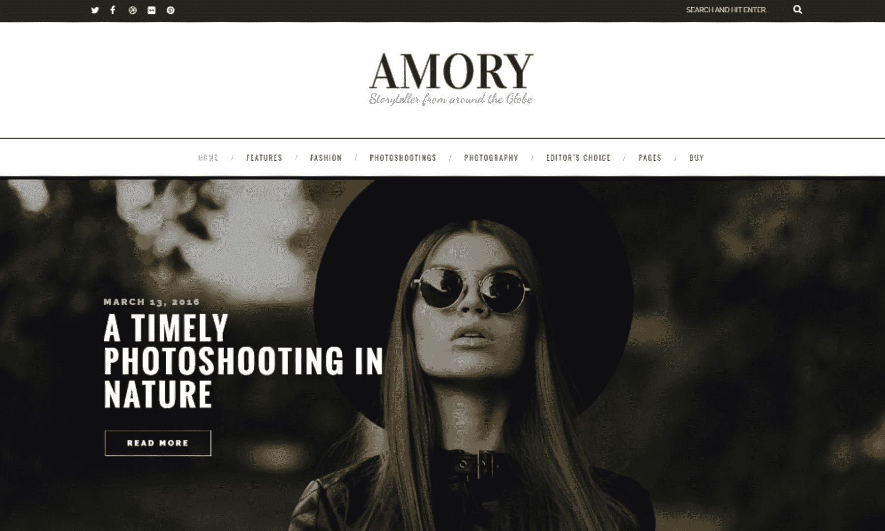
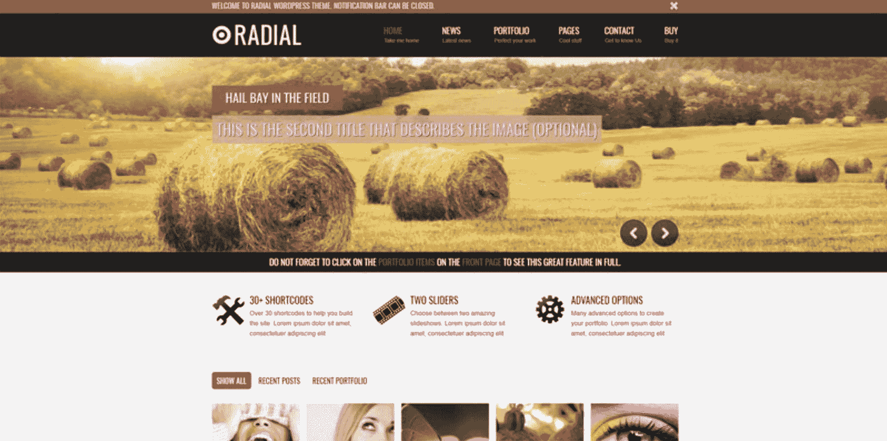
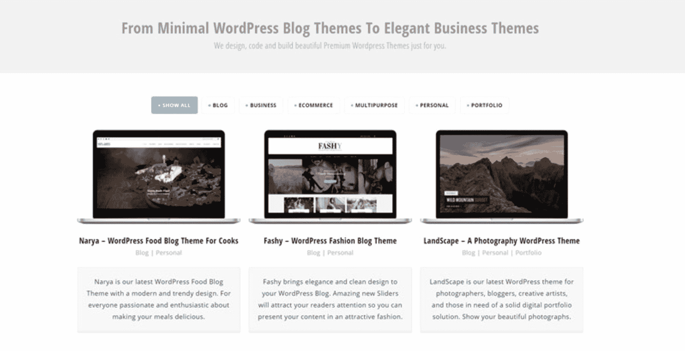
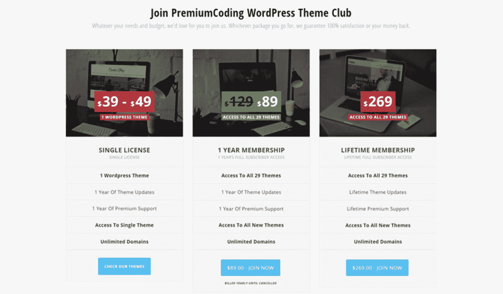

# 利用第三方平台保持竞争优势

> 原文：<https://www.indiehackers.com/interview/leveraging-3rd-party-platforms-to-stay-ahead-of-the-competition-b29704d501>

## 你好！你的背景是什么，你在做什么？

你好，我叫阿列斯克维克。我毕业时获得了计算机科学学位，并作为一名 PL/SQL 开发人员工作了一段时间。

我的联合创始人 ale agar 和我在 2011 年创立了 [PremiumCoding](https://premiumcoding.com/) ，希望开发 WordPress 主题和插件。我们目前专注于博客主题，所以我们的主要受众是世界各地的博客作者。

PremiumCoding 目前每月收入约为 12，000 至 15，000 美元。(每个月都不一样。)两年前，我们仅从 Themeforest 就获得了更高的收入，但从那以后，我们不得不进行调整，现在在几个不同的市场上销售(包括我们自己的商店)。

## 是什么促使你开始使用高级编码？

[PremiumCoding](https://premiumcoding.com/) 追溯到 2011 年 7 月。我有一份 PL/SQL 开发人员的固定工作，我的朋友在他父亲的公司做 PHP/delphi 开发人员。我们都有开创自己事业的共同愿景。我开始为 Activeden 开发 Flash 应用程序(遗憾的是，active den 现在已经不存在了),有一段时间它运行得非常好。然后苹果决定不再支持 Flash，从此就直接走下坡路了。是时候尝试一些新的东西了，我向我的朋友建议，我们应该为[主题森林](https://themeforest.net/user/gljivec/portfolio)做一个主题。

如果我现在客观地看待它，我们的第一个主题远没有好到足以被森林接受。当然，那时候我觉得这很好——只是证明了当你获得更多知识和经验时，视角是如何变化的。

我们暂时放弃了 Themeforest，开始为 [CodeCanyon](https://codecanyon.net/) 开发 WordPress 插件。这样做的主要原因是设计在插件开发中并不像功能性和有用性那样扮演重要的角色。我们做了几个插件，有些卖的还不错。

在一年的插件开发之后，我们决定是时候给 [WordPress 主题](https://themeforest.net/user/gljivec/portfolio)开发一次机会了。与此同时，我一直在努力提高我的设计技能，并在 [GraphicRiver](https://graphicriver.net/) 上批准了一些设计。我对排版的感觉也提高了，我们觉得是时候再试一次了。

有时候，离开一段时间是必要的，这样你就可以看到你业务的更大图景。

TweetShare

我们开始着手一个叫做 [Radial](https://themeforest.net/item/radial-creative-blog-portfolio-wordpress-theme/1831856) 的主题。每次上传后，我们都确信我们已经对主题做了足够的改进，并且会被接受。当然，事实并非如此。它一次又一次被拒绝。我们不想放弃，但是在六七次被拒绝后，你开始感到非常沮丧。

我们坚持下去，因为评审人员开始给出更积极的反馈，告诉我们还有哪些地方需要改进。在第八次尝试时，我们遭到了温和的拒绝，我简直不敢相信自己的眼睛。事情终于发生了:我们离被接受只有几英寸之遥。我们做了一些进一步的(也是最后的)调整，Radial 终于重见天日。

我们都预计它至少会卖得不错，但我们没想到它会卖得那么好。我们甚至上了每周畅销书排行榜。这是继续前进和继续学习的最好激励。

从那以后，我们制作了相当多的主题，其中一些(像[布里克斯顿](https://themeforest.net/item/brixton-wordpress-blog-theme/10309865)和[阿莫里](https://themeforest.net/item/amory-premium-wordpress-blog-theme-for-creatives/15347323))仍然卖得很好。一年多以前，我们还获得了超级精英资格(总销售额超过一百万美元)。

 

## 构建最初的产品需要什么？

我们花了大约三个月的时间来创建 Radial(我们为 Themeforest 设计的第一个主题)。我们大部分时间都是在正常工作之后——也就是说，在下午、晚上和周末——从事这项工作。

第一笔销售几乎是在发行后立即出现的。我们第一天卖了五件，第二天卖了十件。我仍然记得，看到市场和用户如此积极的反应，我是多么高兴。到了周末, [Radial](https://themeforest.net/item/radial-creative-blog-portfolio-wordpress-theme/1831856) 位列畅销书排行榜前 50 名。我认为这是我们第一个主题的巨大成就，我非常兴奋能够设计和开发新的主题。

 

当然这个主题现在感觉过时了，因为它是一个非常简单的作品集和博客主题。但是目前它有一些高级和酷的特性(比如博客文章和通过 AJAX 动态打开投资组合)。

幸运的是，这种业务不会占用你太多的时间。所以资金不是问题，因为我们都有固定的工作。尽管进展是渐进和务实的。从 Flash 和 Activeden，到 WordPress 插件和 CodeCanyon，最后到 WordPress 主题和 Themeforest。我们仍然坚持这一点，即使时代不如从前。

## 你是如何吸引用户并发展 PremiumCoding 的？

当我们开始我们的网站 [PremiumCoding](https://premiumcoding.com/) 时，我分发了免费的 PSD 模板，并发布了关于网页设计、WordPress 和我们进展的教程和文章。2011 年，有机流量对我们来说更容易恢复，网站很快开始每天接待超过 1000 名访客。

不幸的是，当时我们对营销一无所知，所以所有这些努力和用户流量导致零订户。这可能是我们最大的错误——我们直到大约一年前才开始发行我们的时事通讯。

当我们开始在 Themeforest 上上传更多的主题时，我们觉得不需要额外的营销。主题卖得非常好已经有两年多了，我们甚至没有想到这种变化会如此之快。

随着森林市场的某些变化，销售额开始下降。一开始很慢，但大约一年前，我们从一周到下一周有一个非常突然的下降，从那以后就再也没有真正回升。

我们必须快速适应，第一步是在 PremiumCoding 上创建我们自己的商店，并将所有不再销售的主题从 Themeforest 转移到我们自己的商店。幸运的是，这些年来我们开发了相当多的主题，我们以 18 个主题开始了我们的冒险。

我们也开始通过时事通讯增加我们的读者。(我们使用 [OptinMonster](https://optinmonster.com/) 。)

## 你的商业模式是什么，你是如何增加收入的？

我们提供三种选择:个人主题许可证、年度订阅计划和终身会员。对我们来说，单一许可证卖得最好。

 

由于 Themeforest 有一个基于帐户的独家政策，这意味着在 Themeforest 上出售的任何主题都不能在其他任何地方出售，我们决定在 Themeforest 上创建第二个帐户，在那里我们可以出售我们为商店开发的主题。

大约在同一时间，我们发现了另一个销售主题的巨大市场: [Mojo Marketplace](https://www.mojomarketplace.com) 。就在几个月前，另一个大型模板销售网站向公众开放上传:[模板怪兽](https://www.templatemonster.com)。我们不得不利用所有这些资源来保持稳定的收入，因为森林的收入损失是巨大的。

这是我们从 2012 年开始的收入——那一年我们推出了 Themeforest。我们在 1 月份以 1，245 美元开始，在 11 月份几乎达到 16，000 美元。(我们在 3 月份发布了 Radial。)

| 月 | 收入 |
| --- | --- |
| 一月 | 1245.93 |
| 二月（February 的缩写） | 1056.78 |
| 瑕疵 | 4360.40 |
| 四月 | 5053.78 |
| 五月 | 5382.00 |
| 六月 | 5461.96 |
| 七月 | 11144.42 |
| 八月 | 11213.30 |
| 九月 | 9353.40 |
| 十月 | 14721.70 |
| 十一月 | 15687.00 |
| 十二月 | 11584.30 |

在大约三年的时间里，Themeforest 的情况非常好，在 2014 年 9 月达到顶峰(22，375 美元)。2017 年，Themeforest 的销售额下降到之前的 40%左右。但是，有了来自其他市场和我们自己商店的额外收入，我们仍然可以获得可观的月收入，让我们能够开发和营销新的主题。

这是 2014 年的数据，这是我们在森林上最成功的一年:

| 月 | 收入 |
| --- | --- |
| 一月 | 16986.90 |
| 二月（February 的缩写） | 17379.60 |
| 瑕疵 | 17697.40 |
| 四月 | 15983.80 |
| 五月 | 13062.70 |
| 六月 | 15132.60 |
| 七月 | 17374.70 |
| 八月 | 20711.10 |
| 九月 | 22375.50 |
| 十月 | 18355.40 |
| 十一月 | 15056.30 |
| 十二月 | 16675.40 |

这些数字在 2016 年和 2017 年下降了 50%以上，但森林仍然是我们最大的收入来源。不过，我们自己的商店正在接近森林的数字，所以对我来说，这是一个明确的迹象，表明我们应该在未来主要投资自己的商店。

## 你未来的目标是什么？

我和我的团队仍然 100%专注于保留 WordPress 作为我们的主要业务。然而，我们正在缓慢而确定地投入更多的时间和精力来发展官方的[高级编码](https://premiumcoding.com/)商店。

但这还不是全部。虽然单一产品目前是我们最畅销的产品，但我们正在最大限度地推动年度订阅。我们目前的主要目标之一是增加我们的经常性收入，并使其更加可预测。

如果成功的话，我们将在 WordPress 主题创作上有更多的自由，我们甚至可以为我们还不支持的领域发布产品。虽然博客主题仍将是我们的头号利基，但我们将不再需要对其他行业说不，我们将能够为市场带来全新的产品选择。这绝对是我们期待投入更多时间的事情。

 

实现这一目标的第一步是发展我们的网站——包括产品和博客内容。我们通过传播关于预编码的信息并与其他网站管理员分享我们的知识来积极提升我们的领域权威。

此外，我们将继续在我们的博客上发布最高标准的文章和其他内容。通过这样做，我们已经见证了有机流量的增长，我们计划进一步扩大规模。

与其他 WordPress 店主和博客作者合作是我们的另一个方法，这对我们的网站产生了积极的影响。但是我们倾向于远离购买任何种类的链接，尽可能做有机链接。也就是说，我们不会拒绝顶级付费评论的提议，如果它感觉正确，并且该评论将使我们的读者受益。

不管需要多少次努力，或者遭到多少次拒绝，坚持不懈，绝不放弃。

TweetShare

最后但同样重要的一点是，由于我们的联盟计划进展良好，我们计划到 2018 年夏季将活跃联盟的数量增加两倍。我们一直与我们的分支机构密切合作，因此双方都能从中获得最大收益。我们在玩一个三赢的游戏:客户赢了，代销商赢了，产品所有者(我们！)胜。

我们面临的最大挑战之一可能是我们的月收入不断波动。为了获得更稳定的收入，我们还有很多工作要做。

## 如果你必须重新开始，你会做什么不同的事？

正如我之前提到的，可能我们一开始最大的错误就是我们的网站上没有允许用户订阅的地方。换句话说，当我们的商店和博客产生最大流量时，我们没有捕获任何电子邮件。

听起来几乎很傻，但不知何故，在 2012 年没有人想到这一点。直到现在我才意识到电子邮件营销的力量。

也就是说，如果我不得不重新开始，我要做的第一件事就是用 OptinMonster 这样的工具立刻建立一个受众群体。但迟做总比不做好，对吧？

## 你最大的优势是什么？

我发现有两件事是有益的。首先，在正确的时间出现在正确的地点。第二，保持我们的商业战略的远程性。

*天时地利人和。当我想到尝试森林的时候，这个行业还相当年轻。虽然我们花了一些时间来批准我们的第一个 WordPress 主题，但我相信这个时机还是很好的。但是如果我们在一两年后才进入这个行业，事情肯定会完全不同，我们会错过最好的时光。*

*远程商业战略。它给每个人在个人生活、爱好和其他方面更多的自由。我相信没有严格的朝九晚五的办公室工作，能够把自己从小隔间中解放出来，可以开阔你的思维，让你的工作时间更有效率。更不用说，你可以同时旅行和工作，这对每个参与 [PremiumCoding](https://premiumcoding.com/) 的人来说都是一大利好。但是，当需要完成工作时，我们肯定不会游手好闲。最后，我每周工作的时间远远超过了 40 个小时，但更多的时间是在一天中，而且我周末也工作很多时间。*

## 对于刚刚起步的独立黑客，你有什么建议？

不管需要多少次努力，或者遭到多少次拒绝，坚持不懈，绝不放弃。以开放的心态面对每一个挑战，并从中发现其他可能性。然而，首先要做的是:开始。你可能会发现一些让你感兴趣的东西，或者你可能已经有了一个最惊人的百万美元的想法。但是如果你不开始努力，这一切都将付诸东流。没完没了的头脑风暴和写满笔记的论文毫无价值。你知道俗话说得好:*“种一棵树最好的时间是 20 年前。第二好的时机就是现在。”*

首先要做的是:开始。你可能已经有了最惊人的百万美元的想法。但是如果你不开始努力，这一切都将付诸东流。

TweetShare

每个人都说读这本书，听那段播客，跟着这个男生或女生。所有这些都很好，并且会对你的思维、行动和事业产生极其积极的影响。然而，我会建议你在旅途中阅读、倾听并获得灵感。也就是说，用此时此刻你所拥有的知识启动你的项目。一旦你有了它，通过做所有前面提到的动作来继续炒作。

为什么？因为首先阅读和教育自己可能会变成另一种形式的拖延。“我只需要再读一篇 XYZ 的文章，然后我就开始，”这是一个非常常见的情况。一周可以变成一个月、一年等等。你得到了它的要点。今天就行动起来，不要想那么多。即使一个项目失败了，你也会从中获得很多经验，这也增加了下一个项目更成功的机会。

我相信我们大多数人在许多不同的领域都有很大的潜力。但在我看来，对某件事有激情比有天赋更重要。如果你真的热爱你正在做的事情，每天投入 12 个小时并不难，提高你的技能只是成为乐趣的一部分。我曾经读到过，在你自己相信你擅长做某件事之前，你至少需要十年的时间每天做十个小时。

在过去的几年里，我需要一些东西让我远离电脑，风景摄影就是答案。我投入了大量的时间，在某些时候我花了更多的时间做摄影和探索我周围的山。

有趣的是，许多关于主题和我们业务的好主意都来自这些徒步旅行。有时候，离开一段时间是必要的，这样你就可以看到你业务的更大图景。我的摄影技术也因此提高了很多。有兴趣可以去我的摄影网站看看: [DreamyPixel](http://dreamypixel.com/) 。

 

## 我们可以去哪里了解更多？

为了更好地了解我的生意，请查看我们的[高级编码主题商店](https://premiumcoding.com/)。此外，你可以查看我的[主题森林简介](https://themeforest.net/user/gljivec/portfolio)，在那里你可以找到独家和非独家的 WP 主题。关于社交，请关注我们的[推特](https://twitter.com/PremiumCoding)和[脸书](https://www.facebook.com/PremiumCoding/)。但是[注册我们的简讯](http://premiumcoding.us11.list-manage.com/subscribe?u=97fc8a34e87cb54899828ec5f&id=37a967128e)会让我们一直保持密切联系:)

感谢大家抽出时间参加面试。我有兴趣和任何有兴趣了解我们的企业以及我们如何适应 WordPress 市场变化的人交谈。

—[<picture id="ember5240515" class="user-avatar ember-view user-link__avatar"></picture>ale Krivec](/premiumcoding?id=NaUci9peSLSQCHhMvSlzOhn3cBl1)，PremiumCoding 的创建者

## 想像 PremiumCoding 一样建立自己的事业？

你应该加入[独立黑客社区](/)！🤗

我们是几千名创始人，互相帮助建立有利可图的业务和副业。来分享你正在做的事情，并从你的同事那里获得反馈。

还没准备好开始使用你的产品吗？没问题。这个社区是一个认识人、学习和实践的好地方。随便去[随便浏览](/)！

——[<picture id="ember5240520" class="user-avatar ember-view user-link__avatar"></picture>考特兰艾伦](/csallen?id=ibTLPyjwVebnZjMGKvz6ztarnuV2)，独立黑客创始人

7votes