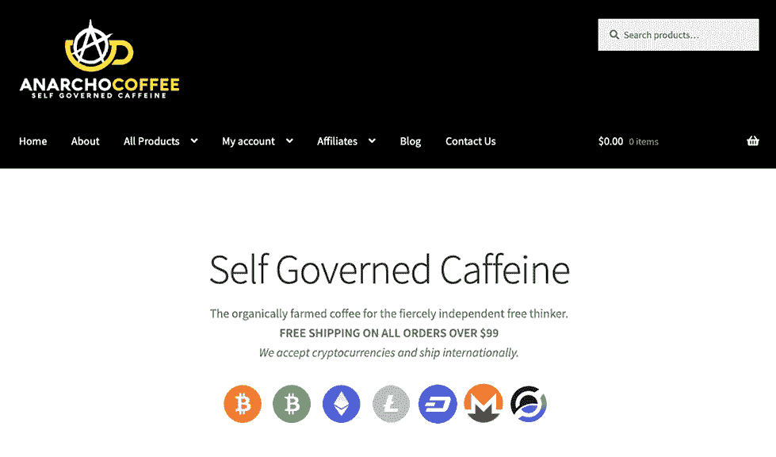
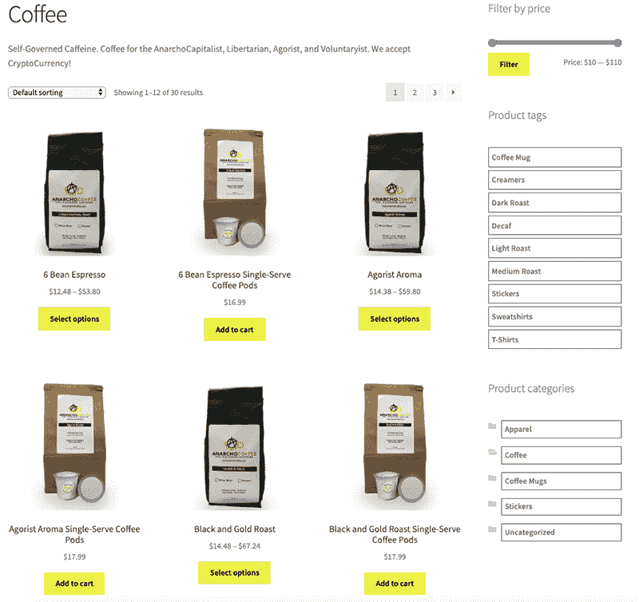
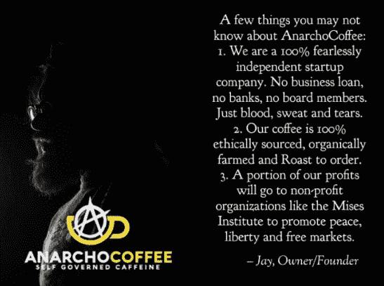

# 利用社会运动来促进我的副业发展

> 原文：<https://www.indiehackers.com/interview/leveraging-a-social-movement-for-my-growing-side-hustle-5f28456e48>

## 你好！你的背景是什么，你在做什么？

你好，我叫杰伊·卡埃塔诺，过去十年来我一直从事网页设计和网页开发。但是最近我想自己做生意。我本质上一直是一名企业家，但在我职业生涯的早期，我很快就爱上了作为一名企业无人机来赚钱。

从那以后，我开始了几个副业，包括无政府咖啡，这是我第一次真正的成功。AnarchoCoffee 是为自由思想者提供的有机种植、道德采购的咖啡。从第一个月开始，我们就保持了逐月增长，并通过法定货币和加密货币销售咖啡。

 

## 是什么促使你开始做无政府咖啡？

我创办 AnarchoCoffee 有两个主要原因。1)我爱咖啡，2)我爱自由。

我一直觉得，朝九晚五的公司工作会把你累垮。我的希望是，随着时间的推移，我的一个(或许多)商业想法会让我走上财务自由的道路。我喜欢创造被动收入，成为某种数字流浪者的想法。

我在听几个我最喜欢的播客时产生了无政府咖啡的想法，并受到自由运动中其他人的激励，去做一些有社会影响的事情。你可以看到没有真正的“验证”——我找到了一个合适的位置，并挠了挠痒痒。由于我们被禁止使用脸书广告，每个月业务都在通过增加新产品、服务和寻找创造性的广告方式而增长。

我的专长是网页设计和开发，我还不认为自己是咖啡鉴赏家。我对咖啡豆和分销做了研究，找到了合适的分销商。我发现关于咖啡分销的一些有趣的事情是咖啡豆是“道德采购”的想法——意味着没有童工。所以重要的是我找到了一个有道德采购咖啡豆的经销商。

我正在为未来工作的一些想法是每月咖啡订阅和在结账时向自由思想的非营利组织捐款的能力。今天，我仍然是一家风险投资公司的网络总监，朝九晚五地工作，但到了晚上，我就成了一名追求终极自由的企业家。

我仍然朝九晚五地工作...但到了晚上，我成了一名寻求终极自由的企业家助手。

TweetShare

## 构建最初的产品需要什么？

由于我在网页设计和网页开发方面的背景，我能够在一个周末建立网站。我创建了一些社交媒体帖子，并且是几个播客的嘉宾。从那时起，这是一个激动人心的过山车。

AnarchoCoffee 是一家完全草根化的公司。我不想成为下一个星巴克，但如果真的发生了，那太好了。我喜欢 100%独立的想法，并认为无政府咖啡是一家“夫妻店”式的公司；但是谁知道这条路会通向哪里。为了让它继续运转，我需要在午夜和周末开夜车，所以我希望能有所作为。

自从发布以来，我直接从客户和朋友那里获取反馈，并添加了他们想看的新的浏览器和功能。直接与顾客和无政府咖啡社区互动有助于口碑营销。在某些方面，我觉得这更像是一个社区项目，而不仅仅是我在经营一家企业。我继续直接听取客户的反馈，并以此来决定新功能的范围。

我的妻子一直是我在这方面最大的支持者，她花了额外的时间来看孩子，这样我就可以继续努力了。但自由运动中的许多个人也表示支持，包括自由之狮*[听起来像自由播客](http://soundslikeliberty.libsyn.com/)**[熔岩流播客](https://thelavaflow.com/)**[自由周刊播客](http://libertyweekly.net/category/libertyweekly)* ，以及 *[发射台媒体](https://thelaunchpadmedia.com/)* 。

目前的技术非常简单:WordPress、WooCommerce、MailChimp、Stripe(当然)、加密货币的 CoinPayments 和甩。再加上一点血、汗和泪。

 

## 你是如何吸引用户并发展无政府咖啡的？

就像我说的，这是草根的成长。出于某种原因，我被禁止在脸书做广告，所以我不得不寻找其他方法来传播消息，比如在脸书和 Reddit 上的独特群体中发布消息。我联系了自由运动中有影响力的人，问他们是否愿意尝试无政府咖啡。

从那时起，这些有影响力的人要么自愿在社交媒体上发布关于无政府咖啡的帖子，要么邀请我参加他们的播客节目来讨论这个项目。另一个策略就是口口相传:与朋友和同事谈论这个项目，参加当地的自由活动和聚会。

通过做以上所有的事情，我能够发现网站流量和销售额的增长。当我第一次推出这个网站时，我们每月有大约 900 名访客；从那以后，每月有大约 2500 名访客，流量来源包括脸书(50%)、Instagram (40%)和 Twitter/Reddit (10%)。我还开了一个播客，讲述我作为一名企业家的努力，并邀请其他有自由思想的企业家在节目中讨论他们的项目。除了播客上的采访，我还分享关于 AnarchoCoffee 的最新消息和任何新的公告。该播客有超过 2000 次下载，每集大约有 50-100 次下载，并且继续缓慢增长。

 

## 你的商业模式是什么，你是如何增加收入的？

我们的品牌是一个自由的社会影响组织，其使命是通过销售促进个人主义、个人权利、自发秩序、法治、有限政府、分权、隐私、自由市场、生产美德、利益的自然和谐及和平的产品来产生积极的社会影响。

就收入而言，平均每月总销售额约为 500 美元/月。我们立即开始对我们的产品收费，但在开始时做了许多免费赠品，只是为了让人们尝试咖啡。为了增加销售额和口碑，我们接受通过 PayPal、Stripe、多种加密货币(包括比特币和比特币现金)通过 CoinPayments 进行的支付，以及与其他个人进行其他商品和服务的易货/交易。

我们的收入起伏不定，我们继续解决定价和物流方面的问题。当然，我们最大的支出是运输和处理。我一直在寻找 WooCommerce 解决方案和插件的最佳选择。

在某些方面，我觉得这更像是一个社区项目，而不仅仅是我在经营一家企业。

TweetShare

## 你未来的目标是什么？

我对 AnarchoCoffee 的未来有几个目标，既有技术方面的，也有商业方面的。我们的第一个技术目标是添加订阅模型，使客户更容易获得每月咖啡订阅。我们的第二个技术目标是能够在结账时向非营利组织捐款。我们的第三个技术目标是改善运输和处理，降低运输成本。最后但同样重要的是，我们的第四个技术目标是重新设计网站和结账体验，以改善用户体验。

AnarchoCoffee 的商业目标是围绕提高品牌和公司知名度。其他商业目标包括参加贸易展览、活动和当地农贸市场。我也希望有一天能在杂货店和超市里看到 AnarchoCoffee。

## 你面临的最大挑战和克服的障碍是什么？如果你必须重新开始，你会做什么不同的事？

无政府咖啡面临的最大挑战是传播产品信息。其他较小的障碍包括运输和处理，以及没有足够的时间或资本来发展业务。但我必须不断提醒自己，在我写这篇文章的时候，这家公司才成立了六个月。我唯一的遗憾是没有早点走上创业之路。

## 有没有发现什么特别有帮助或者有优势的？

我发现的最有用的工具是[WordPress](https://www.wpconsultant.co/services/)；有很多很好的理由选择 WordPress 来开始你的在线业务。各种各样的模板、轻松分类和标记帖子的能力、拼写检查和自动保存等功能、发布音频和视频文件的能力、各种隐私选项以及跟踪网站相关统计数据的能力都非常有用。

这些功能对一些创业者来说可能比其他人更重要，所以决定 WordPress 是否适合你很大程度上是个人喜好的问题。例如，很少或没有编程经验的企业家可能喜欢 WordPress 上的无数模板，而担心隐私问题的企业家可能对可用的隐私选项更感兴趣。

此外，利用社交媒体在网上找到你的部落。从事电子商务的人都知道营销是多么昂贵。为了推动销售，向有需要的人推销你的产品或服务是至关重要的。社交网络提供了一个可行的互联网营销替代或补充。

## 对于刚刚起步的独立黑客，你有什么建议？

成为企业家是很多人的梦想。毕竟，这些人就是你在新闻中听说的赚了很多钱，过着美好生活的人。当然，并不是所有的企业家都很富有，但过这种生活会很有趣。

但是在你决定它是否适合你之前，有几件事你应该考虑。如果成为一名成功的企业家是小菜一碟，每个人都会去做。这并不是说你没有*创业成功的机会，但是你不能简单地跳进这一点，并期望开始耙入大量的现金。最有帮助的建议是找到一个合适的位置，大胆尝试。你永远不知道人们会对什么感兴趣。或许你也能找到你的部落。*

## 我们可以去哪里了解更多？

你可以在 www.AnarchoCoffee.com 的[找到网上无政府咖啡。你也可以在](http://www.anarchocoffee.com/)[脸书](https://www.facebook.com/AnarchoCoffee/)、[推特](https://twitter.com/AnarchoCoffee/)和 [Instagram](https://www.instagram.com/AnarchoCoffee/) 上找到 AnarchoCoffee。

——[<picture id="ember8087825" class="user-avatar ember-view user-link__avatar"></picture>杰·卡埃塔诺](/JayCaetano?id=F33jPiIxvPhmm6LuF9cPiVzyQlL2)，Anarcho 创始人。咖啡

## 想像 Anarcho 一样建立自己的事业。咖啡？

你应该加入独立黑客社区！🤗

我们是几千名创始人，互相帮助建立有利可图的业务和副业。来分享你正在做的事情，并从你的同事那里获得反馈。

还没准备好开始使用你的产品吗？没问题。这个社区是一个认识人、学习和实践的好地方。随意[随便浏览](/)！

——[<picture id="ember8087830" class="user-avatar ember-view user-link__avatar"></picture>柯特兰艾伦](/csallen?id=ibTLPyjwVebnZjMGKvz6ztarnuV2)，独立黑客创始人

12votes