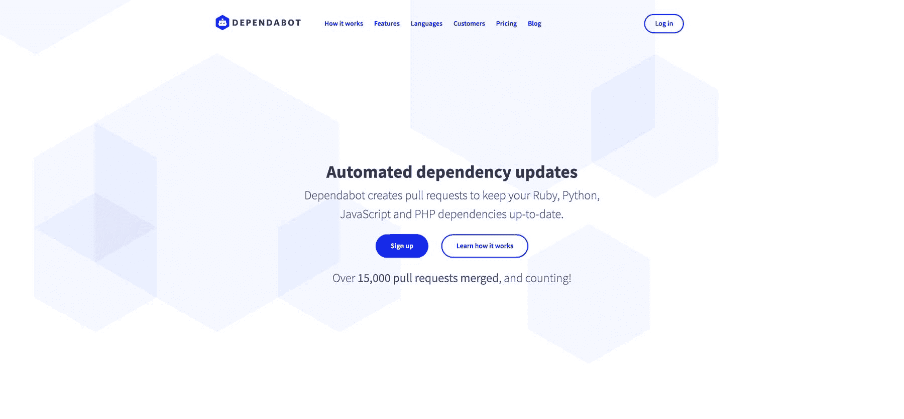
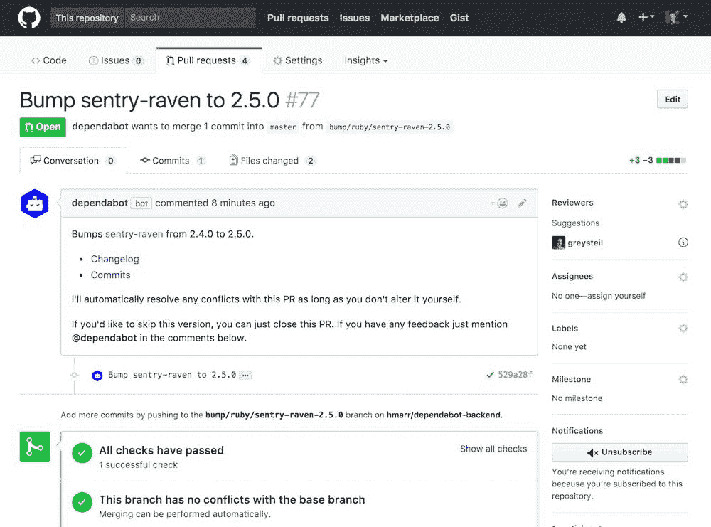
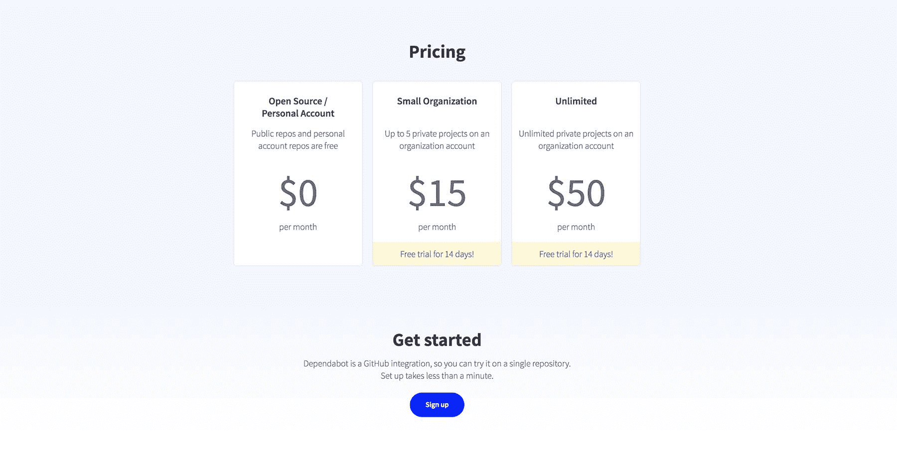

# 依靠我们的积蓄，将我们的 SaaS 增长到每月 740 美元

> 原文：<https://www.indiehackers.com/interview/living-off-our-savings-and-growing-our-saas-to-740-mo-696f9b110f>

## 你好！你的背景是什么，你在做什么？

嗨！我是格雷，我和我的联合创始人哈里一起创建了 T2 依赖机器人。这是一种自动创建拉取请求的服务，可以轻松地保持您的依赖关系最新。

我走了一条稍微曲折的道路成为一名软件工程师:在自学编程之前，我做了几年的战略顾问。在那之后，在一家初创公司(GoCardless)的一段时间让我获得了一些产品经验，在开始做自己的事情后，我创办了 Dependabot。

发布两个月后，Dependabot 每月赚 740 美元，合并了大约 5000 个拉请求。

 

## 是什么促使你开始使用 Dependabot？

[依赖机器人](https://dependabot.com)从来就不是真正的商业——它最初只是一个辅助项目，让我保持理智，同时我试图在医疗保健领域做一个“适当的”创业。

当我在 GoCardless 工作的时候，我的工作之一就是保持我们的 Ruby 依赖关系是最新的。每天早上，我都会登录我们的“Gemnasium dashboard ”,检查哪些需要更新，然后创建一堆 pr。这很快变得乏味，我想知道我是否可以自动化它，所以我和几个朋友在一次工作黑客马拉松上创建了 [Bump](https://github.com/gocardless/bump) 。

Bump 有很多问题，但它很好地结合在一起，足以在接下来的 18 个月里发挥作用。这给了我信心，让我相信它会自己站起来，但我太专注于无卡的工作，无法尝试旋转它。

构建 Dependabot 成了我的兼职解药:在一个我完全了解的行业中，我已经确切知道该构建什么样的产品。

TweetShare

一年前离开 GoCardless 做自己的事情，踌躇满志。我骑自行车环游世界，回来后想通过在医疗保健领域做点什么来改变它。然而，两个月无休止的咖啡聊天和沮丧之后，我被磨倒了。

构建 Dependabot 成了我的兼职解药，因为它恰恰相反:在一个我完全了解的行业中，我已经确切知道要构建什么样的产品。

## 构建最初的产品需要什么？

靠着我们的积蓄，哈里和我给了自己两周的时间来制作第一个版本的依赖机器人。我们让 GoCardless 给了我们 Bump 的 IP(我们过去和现在都和他们关系很好)，做了很多改进，从头开始为它构建了一个前端和 API。

我们错过了我们的最后期限，但是四个星期后我们有了一些东西，我们很乐意请朋友们来尝试。我们都是开发人员，所以寻找一些早期采用者并不太难。

从技术角度来看，Dependabot 分为前端、API 后端和依赖关系更新器。后端是 Ruby on Rails，更新器是纯 Ruby，前端是 React app。我们也有一些 Python 和 PHP 代码，用于碰撞 Python 和 PHP 的依赖关系。

一切都托管在 Heroku 上，最有趣的部分是[开源](https://github.com/dependabot/dependabot-core)。

 

我们的朋友一试用 Dependabot，他们就喜欢上了这个想法，但开始告诉我们它的许多问题。例如，当被添加到一个旧的代码库时，Dependabot 会立即“有益地”为你创建 30 多个拉取请求。合并一个和其他的会有冲突，而 Dependabot 对你没有任何帮助。想要忽略更新吗？如果您关闭了 PR，我们会在第二天早上为您重新创建一个🤦‍♂️.

我们从早期用户那里学到了很多 T2 的东西。大概花了一个月的时间，我和哈里都全力以赴，使服务达到我们认为物有所值的程度。

让 Dependabot 为其他人使用做好准备所需要的工作量绝对是一个教训。在引擎盖下，这是一个非常复杂的产品——依赖性解决方案很难——但它需要简单易用，因为这不是一个任何人都想花时间和精力的领域。它也是那些可怕的产品之一，当它完美地工作时是辉煌的，当它有一点点不足时比无用更糟糕！

## 你是如何吸引用户并发展 Dependabot 的？

如今，在 [GitHub 市场](https://github.com/marketplace)是[dependent bot](https://dependabot.com)最大的客户来源，但它并不是这样开始的。

当 GitHub 正在预览 GitHub Marketplace 时，我们开始构建 reliable bot，所以我们很自然地试图成为发布合作伙伴，并从他们的营销中获益。我们为给他们发邮件而苦恼，为没有回复而烦恼，但这并没有阻止他们在没有我们的情况下发布。更糟糕的是，他们告诉我们，我们需要 250 多个用户才能被列入名单。我们有 22 个。

做销售，不做营销。即使你是 B2C，免费赠送你的产品，也要从一对一的销售开始。

TweetShare

事后看来，在我们有所贡献之前就与他们建立合作关系是完全愚蠢的。GitHub 绝对没有理由仅仅因为我们需要他们而在我们身上冒险，他们不这样做是完全正确的。

我们没有被吓倒，尝试了一些营销。我们花了两天时间为《黑客新闻》撰写了完美的博客文章[。结果呢？黑客新闻上的两点和 Reddit 上类似的东西。](https://dependabot.com/blog/the-latest-dependency-version-is-probably-the-most-secure)[一次注册](https://twitter.com/dependabot/status/868164733572177921)。Harry 和我都不够出名，在开发者社区没有得到太多的关注，没有网络营销对我们来说是一种运气(或者更糟，一个我们不擅长的游戏)。

在这一点上，我们有我们认为是一个辉煌的产品，并从字面上努力免费赠送。最后，我们尝试了一些销售。每天我都会在 GitHub 上搜索标题中带有“更新”字样的 PRs。如果 dependent bot 可以创建公关，那么我会评论它，问他们是否想给 dependent bot 一个尝试。

我没有每天都找到很多相关的 pr，但是我找到的那些 pr 的转化率是惊人的——我联系的人中有 50%注册了！每天一个小时的公关搜索，我可以让我们有 2-3 个注册，我们慢慢地向神奇的 250 攀升。

顺便说一下，我想说我花在销售上的时间比花在营销上的时间更有价值。这是我能给任何试图推出 SaaS 产品的人的最好建议，即使你的客户很少，而且你在免费赠送你的产品。

当你做销售的时候，你会得到反馈。你一次比一次好，你的产品也是如此。你得到了一小群爱你的用户，你得到了持续的、可衡量的进步。与市场营销或寻找合作伙伴的不确定投入和产出相比，Dependabot 应该一直做些什么似乎是显而易见的。

两个月前，我们终于进入了 GitHub 市场，这改变了 Dependabot 的发行方式。我们的注册率是以前的 10 倍。

| 月 | 帐目 |
| --- | --- |
| 五月 | 6 |
| 六月 | 95 |
| 七月 | 118 |
| 八月 | 141 |
| 九月 | 230 |
| 十月 | 283 |
| 十一月 | 584 |
| 十二月 | 919 |

## 你的商业模式是什么，你是如何增加收入的？

我们向组织收取月租费，让[dependent bot](https://dependabot.com)在他们的私人回购上运行。金额很小(五次回购 15 美元，无限量回购 50 美元)，但我们的客户真的很有粘性。

我们一直保持个人和开源账户免费，我们将一直这样做，因为这些用户对我们来说是很好的广告，如果被要求付费，他们不太可能使用这项服务。我们的成本相对较低，因此这种模式运行良好，我们已经有报告称，人们在自己的项目中使用 Dependabot，享受它，然后鼓励他们的雇主也这样做。

因为我们在 GitHub 市场，所以我们通过 GitHub 收取费用，GitHub 将这些费用添加到我们客户的 GitHub 账单中。GitHub 从这项服务中获得高达 25%的份额，但这意味着为 Dependabot 付费完全没有摩擦:拥有私人回购的组织总是已经在向 GitHub 付费，所以向我们付费也只需点击一下。

Dependabot 的运营成本很低——我们 11 月份的总成本是 50 美元。几乎所有这些都是 Heroku 的托管费——我们使用他们的爱好基础设施来开发我们的前端和后端应用程序，并在一次性 dynos 中运行我们的更新作业。我们唯一付费的其他东西是 Gmail。

 

## 你未来的目标是什么？

我想让更多的人使用[依赖机器人](https://dependabot.com)！分发是我们还没有解决的大问题，但是解决了它会让开发服务更有回报。

我想解决这个问题的一个方法是为库开发人员构建工具。Dependabot 撞击 Rails 并在数百个 repos 上做出反应，并且可以访问每个 repos 的测试结果。也许我们可以让 Rails 背后的团队很容易获得这些数据(至少是公开回购的数据)并做出反应。这样做将有助于他们测试候选版本和发现回归，也许反过来他们会鼓励他们的用户去尝试依赖机器人。

除此之外，我们希望增加更多的语言。我们加入对 Elixir 和 Java 支持的工作已经进行了一半，我也很乐意加入对 Go 的支持。每种语言都为我们打开了一个新的市场，而且它们相对容易添加，因为许多 Dependabot 的功能是语言不可知的。

就我个人而言，希望如果我们能做到这一点，那么 Dependabot 可以付给我和哈利足够的钱，让我们可以靠它生活。

这可能是一个糟糕的建议，但对我来说，仅仅是建立一些东西就帮助我继续作为一名企业家。在过去的四个月里，我用一半的时间在医疗保健领域做志愿者，用剩下的时间来开发 Dependabot。如果我没有 Dependabot 来工作，我几乎肯定无法处理医疗保健方面缺乏进展的问题。

## 你面临的最大挑战和克服的障碍是什么？

学习如何分销一直是一个挑战，但经营企业的心理层面要艰难得多。

我们有一个我们认为很棒的产品，并且努力免费赠送。

TweetShare

依赖机器人不是我最初打算建造的东西，起初这让我免受一些情绪起伏的影响——我一直告诉自己，它成功与否并不重要。

然而，现在我倾向于忽视它的成功，而更强烈地感受到它的失败。当 Dependabot 成立时，我告诉自己，“是的，但它只是一个小东西，不是我想建立的大企业，它不会去任何地方。”当它下降时，我会想，“哦，伙计，我没能进入医疗保健行业，现在我甚至不能让它工作？!"

我学到的最大的事情就是度过困难时期。如果我在构建 Dependabot 和将其投入市场之间的三个月痛苦期间退出，那么我将永远不会看到另一边的成功。我的某个强迫症部分不让我走开，我一直相信这个东西应该有用，所以我坚持了下来。

## 有没有发现什么特别有帮助或者有优势的？

我发现在办公室工作对保持我的平衡非常有用。我志愿全职帮助一个医疗保健组织做软件决策，所以我坐在他们的办公室朝九晚五，主要从事 Dependabot 的工作。有同事在身边一起吃午饭是一个很好的提醒，外面还有一个世界！

此外，冒着听起来阿谀奉承的风险，我真的很喜欢阅读独立黑客。在我日复一日努力创业的过程中，我能体会到的其他企业家的故事给了我很大的鼓舞。

## 对于刚刚起步的独立黑客，你有什么建议？

如果你刚刚开始，我强烈建议把你的工作作为一个兼职项目，而不是一份全职工作。在依赖机器人的早期阶段，我花了大部分时间在它上面，当事情不按计划进行时，那真的很难。想象一下，全职工作两个月，启动，没有保险，只有一个注册。从心理上来说，当你有一份别人提醒你自己受到重视的工作时，你更容易接受这一点。

还有，我说了，做销售，不做营销。即使你是 B2C，免费赠送你的产品，也要从一对一的销售开始。就算讨厌，也要从销售入手。这是你学习了解你的客户和制造合适产品的方法。

## 我们可以去哪里了解更多？

*   dependabot.com
*   [@ deplete bot](https://twitter.com/dependabot)
*   [github.com/dependabot](https://github.com/dependabot)

如果有人对我有任何问题，请不要犹豫，在评论中提问。我会试着回答所有的问题。感谢你邀请我参加独立黑客，科特兰！

—[<picture id="ember7995846" class="user-avatar ember-view user-link__avatar"></picture>灰色面包师](/greysteil?id=BtnI8l5he6TeJjxInRHpheTLfPF2)【塌实机器人】的创造者

## 想像 Dependabot 一样建立自己的事业？

你应该加入独立黑客社区！🤗

我们是几千名创始人，互相帮助建立有利可图的业务和副业。来分享你正在做的事情，并从你的同事那里获得反馈。

还没准备好开始使用你的产品吗？没问题。这个社区是一个认识人、学习和实践的好地方。随意[随便浏览](/)！

—[<picture id="ember7995851" class="user-avatar ember-view user-link__avatar"></picture>考特兰艾伦](/csallen?id=ibTLPyjwVebnZjMGKvz6ztarnuV2)，独立黑客创始人

18votes