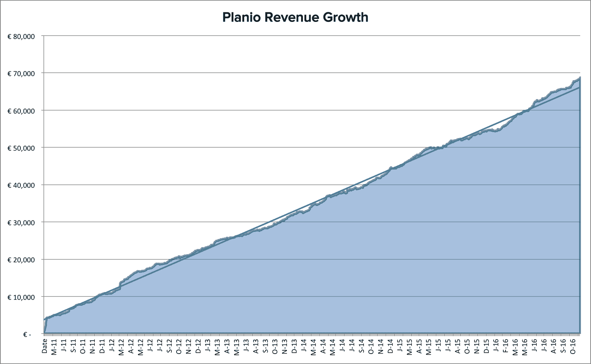

# 保持强大的产品愿景，将成本提升至每月 75，000 美元

> 原文：<https://www.indiehackers.com/interview/maintaining-a-strong-product-vision-to-bootstrap-to-75-000-mo-bc634054db>

## 嗨简！告诉我们关于你自己和你正在做的事情。

我是简·舒尔茨-霍芬，我的工作是[计划](https://plan.io)。这是一个为像我这样的人提供的协作工具:开发者。它将问题跟踪、项目管理、帮助台和 Git 托管集中在一个地方，它基于开源项目 Redmine。

我在 2009 年创办了 Planio，如今我们有一个 9 人的团队，为全球 1500 名付费客户提供服务。[这里有一小段视频](https://www.youtube.com/embed/QrkO8qpOIUc?list=PLENA1AxOpwcr00aAIRJgKwTPDuITUFIPh)展示了这是如何发生的。

## 你是怎么开始做 Planio 的？

早在 2009 年，我们在 [Planio](https://plan.io) 的日常生活就是为客户做软件项目。虽然我真的很喜欢客户工作，但我总是感觉自己在无尽的新项目的跑步机上，试图在支付账单和超负荷工作之间找到平衡。

当时，我们使用开源协作工具 Redmine 与客户合作。通常，在项目结束时，客户会问他们是否可以保留这个工具。

这是 Planio 背后的想法的种子，这个想法导致了 2016 年年度经常性收入超过 100 万美元的业务。

## 你是怎么找到时间和资金来建造一切的？

我们开始向少数代理客户提供托管版本的 Redmine-as-a-Service。早期的收入甚至不够养活一个人。因此，我继续经营这家代理公司，我自己处理从支持到销售到服务器管理的所有事情。显然，同时经营这两项业务很艰难，但这意味着我可以在没有风险资本的情况下发展业务。

## 你能谈谈 Planio 背后的技术吗？你用什么工具来开发和托管？

我们现在是，而且一直都是一家红宝石商店——这就是为什么当我们刚开始做代理时，使用 Redmine 对我们来说是显而易见的。Redmine 是目前仍在维护的最古老的基于 Rails 的开源项目之一。这些年来，我的公司已经成为一个主要的贡献者。事实上，今天我们回馈了我们为 Redmine 构建的大部分功能，只有少数例外，例如我们更高级的 pro 功能 [CRM & Helpdesk](https://plan.io/customer-relationship-management-and-helpdesk) 和 [Team Chat](https://plan.io/business-chat) 。

我们也是 devops 的忠实信徒。这意味着我们在[计划](https://plan.io)中没有单独的开发和管理角色。在技术方面，我们当然使用了 [Chef](https://www.chef.io/) ，一个基于 Ruby 的基础设施自动化工具。我们实际上已经使用 Ruby 和 Chef at Planio 实现了所有事情的自动化:从设置服务器和 Planio 帐户，到获取和扩展 SSL 证书，到开账单和创建发票，甚至检查我们的银行帐户以进行人工客户支付。

说到支付，在 2009 年创办一家需要接受信用卡的 SaaS 企业比现在更难。我们没有条纹，也没有递归之类的。因此，我们从零开始，在本杰明·柯蒂斯的令人惊叹的[SaaS·雷斯基特](https://railskits.com/saas)之上，建造了一切。从 2016 年的角度来看，这听起来可能很疯狂，但我实际上很高兴我们今天在内部拥有这些东西，因为它提供了更大的独立于第三方的能力，并且一旦达到规模，可以节省相当多的钱。

## 你是如何吸引用户和发展 Planio 的？

这一切都始于大约 7 年前 Redmine.org 论坛上的一篇[帖子，该帖子宣布启动](https://redmine.org/boards/1/topics/11029)[计划](https://plan.io)。

我们与 Redmine 社区的关系一直是我们关注的焦点。在 Planio，我们所有的工程师(总共 5 名)都是 Redmine 的核心贡献者。从 2010 年开始，我就一直是一名积极的贡献者。这意味着我们的许多客户来自社区。

早期的第二个重大胜利是欧洲最大的软件公司之一的软件公司成为了它的客户。这给了我们收入方面的缓冲，也给了我们在其他大公司中的信誉。现在，我们非常自豪地为安联、希捷、史泰博、思杰等大品牌提供服务。

## 你的营收背后有什么故事？

当我看过去几年我们的收入增长时，这是一条从一开始就稳定增长的直线。

我认为它同时展示了 SaaS 作为一个企业的艰难和伟大。当你销售 39 欧元/月的套餐时，你不会看到收入的大幅增长。然而，它慢慢积累，直到足够支持你和整个团队。

从 2011 年 5 月到 2016 年 10 月，我们每月的经常性收入增长情况如下:

## 这是令人印象深刻的线性增长。你的流失率是多少？

我们的流失率很低，大约每月 1.5%，对此我很高兴。有人可能会说，这是因为一旦您的整个团队和数据都在上面，那么从一整套项目管理和协作工具中迁移出来是一项艰巨的工作。

然而，我们总是说，我们希望客户留在我们身边，只是因为他们对 Planio 满意，而不是因为离开我们太难了。这是许多新客户问我们的问题:“如果我需要取消，会发生什么？谁拥有这些数据？”

答案在 [Planio](https://plan.io) 非常清楚。我们称之为我们的[数据自由](https://plan.io/data-independence)原则:我们的客户是他们数据的唯一所有者。句号。我们有一个功能，您可以使用它来下载所有数据的完整 SQL 备份，这些备份可以很容易地导入到您自己服务器上的独立 vanilla Redmine 中。在我看来，这是一个非常好的保险政策，以防你的 SaaS 供应商发生任何意外。我们的顾客绝对喜欢它。像这样的政策让你非常安心，实际上，我希望更多的 SaaS 提供商也这样做。

## 有什么特别的东西(价格变化、新功能、业务模式更新等)帮助推动了收入增长吗？

对我们的收入增长产生重大影响的一个变化是调整[计划](https://plan.io)的定价。

早在 2016 年 2 月，我们调整了定价，以更好地适应客户实际使用我们产品的方式。根据用户数量和项目数量，我们将四个常规计划(白银、黄金、钻石和白金)的限制移动到大约 25、50、75 和 100 个四分位数，排除异常值。这意味着我们现在的新客户在我们的计划中平均分布，而以前大多数客户会选择我们的底部两个计划。事后看来，我认为我们应该更早开始尝试定价。

## 你未来的个人和商业目标是什么？你认为未来会有什么大的挑战吗？

当我看到全球有多少不同的人每天都在使用 [Planio](https://plan.io) ，以及我们如何通过一个小型的分布式团队为这些人提供服务时，我总是很兴奋。

我对 Planio 的目标不是成为世界上最大的项目管理公司。相反，我的目标是为我们的利基客户提供一套完美的工具。

我们也不会试图为了吸引投资者或潜在的“退出”而让业务增长过快(可能是不可持续的)。

现在，Planio 产生了稳定的收入(和利润),足以支持我们的小团队和我自己。我们的用户群和收入增长缓慢，但非常稳定。在其他创业公司工作过之后，能够以这种方式发展公司完全是一种改变，尤其是在文化和招聘方面。

Planio 感觉有点像家族企业，这是我喜欢的。哦，有时我甚至可以去度假！:-)

## 如果你必须重新开始，你会做什么不同的事？

当我推出[计划](https://plan.io)时，我只买了。网站的 io 域。当时，我认为我们可以在晚些时候购买其他顶级域名，比如 planio.com。不过，我确实在德国为 Planio 注册了国家商标。

不幸的是，另一家公司推出了使用。com 域。我们解决了这个问题，另一方重新命名了他们的产品——多亏了这个商标。不幸的是，我们仍然不拥有。整个过程耗费了大量的时间和资源，而这些资源本可以更好地投资于业务发展。

因此，我的建议是尽快注册一个国家商标并购买所有相关域名。我见过很多创始人因为这样的问题而不得不改名。它总是一个巨大的生产力杀手。

## 你认为你最大的优点是什么？

[计划](https://plan.io)的第一批客户是我的开发机构 [LAUNCH/CO](https://launchco.com) 的客户。这意味着我和他们的关系非常亲密。他们不仅仅是抽象的顾客。我可以问他们想解决什么问题，然后用 Planio 为他们解决问题。

其次，我们非常相信[喂狗方法](http://plan.io/blog/post/108631306129/dogfooding-why-planio-does-not-have-feature-xyz)。从问题跟踪到 Git 托管，从团队聊天到时间跟踪和支持服务台，我们在日常工作中使用所有 Planio 功能。我认为每天八小时使用自己的产品是推动自己不断改进的好方法。就我个人而言，我会努力为没有相同需求的受众开发产品。

在 2015 年的某个时候，在我们刚刚在 Planio 中推出自己的团队聊天功能之后，团队的一部分人希望开始使用 Slack。原因是 Planio Chat 还不是很好，仍然有点粗糙。我要求团队坚持使用 Planio Chat，说“让我们度过这个难关”。我们这样做了，强迫自己使用一个不太好的产品，让我们消除了许多错误，并对我们的团队聊天进行了大量的改进，这使它成为 Planio now 的一个非常棒的部分。它与所有其他功能紧密集成，其聊天日志与其他内容一起显示在 Planio 搜索结果中，这是 Slack 永远不可能实现的整体体验。

## 你会和有抱负的独立黑客分享什么建议？

我建议人们在探索其他选择之前不要走风险投资这条路。当你启动你的业务时，你为成功的结果保留了更多的选择。

还有其他方式来为你的产品开发融资。例如，我们的一些大客户有时会要求[计划](https://plan.io)中的特定功能。如果他们愿意支付开发成本，并且这是一个很好的产品，我们将为他们建立功能。

当我们这样做时，我们总是确保协商条款，允许我们使用 Planio 本身的功能。特别是在 Planio 的早期，这种方法在构建产品时帮助了我们很多，而不必动用我们太多的积蓄。

显然，这种方法需要一个强大的产品愿景。并不是你的客户要求的每一个功能都对整个用户群有帮助，如果你盲目地添加客户愿意为你付费的所有功能，你最终可能会得到一大堆没有人愿意使用的难看的功能。

## 我们可以从哪里了解更多信息？

你可以通过我们的网站试用[计划](https://plan.io)。我很想听听您对该产品的看法，您喜欢它的哪些方面，以及您需要改进的地方。因为你是一个独立的黑客读者，我也想为你提供一个完整的 3 个月的免费计划。您将通过[这个链接](https://accounts.plan.io/signup/Diamond?ref=indhck)获得特价优惠。

我们也在 plan.io/blog[的博客上写关于生产力、项目和创业的文章，所以请一定要来看看！](https://plan.io/blog)

最后，你也可以在下面的评论里留下问题。

—[<picture id="ember8171331" class="user-avatar ember-view user-link__avatar"></picture>Jan](/jan?id=qUAJuDIEkRbH3KvtDJnBoaEqciI2)，计划制定者

## 想像 Planio 一样建立自己的事业？

你应该加入独立黑客社区！🤗

我们是几千名创始人，互相帮助建立有利可图的业务和副业。来分享你正在做的事情，并从你的同事那里获得反馈。

还没准备好开始使用你的产品吗？没问题。这个社区是一个认识人、学习和实践的好地方。随意[随便浏览](/)！

——[<picture id="ember8171336" class="user-avatar ember-view user-link__avatar"></picture>柯特兰艾伦](/csallen?id=ibTLPyjwVebnZjMGKvz6ztarnuV2)，独立黑客创始人

6votes