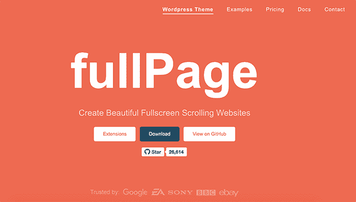
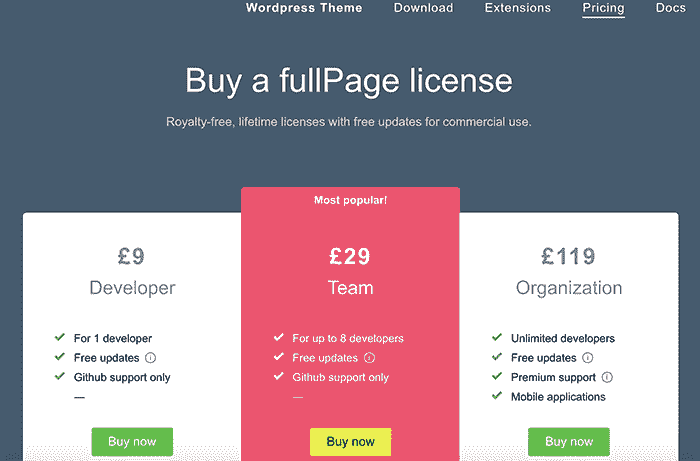

# 通过将我的免费增值产品转为付费产品，每月赚 15K 美元

> 原文：<https://www.indiehackers.com/interview/making-15k-month-by-switching-my-freemium-product-to-paid-2771241389>

## 你好！你的背景是什么，你在做什么？

你好。我是阿尔瓦罗·特里戈。我目前全职在做[full page . js](https://alvarotrigo.com/fullPage/)——一个帮助开发者创建全屏垂直和水平滑块的 Javascript 开源组件。它已经被谷歌、易贝、麦当劳、可口可乐、尼康、EA 和英国航空公司等公司使用。在过去的几个月里，我平均每月挣 15，000 美元(独自工作)。据《git-awards.com》报道，我目前在英国排名第五的 Javascript 开发人员名单上排名第五，在 T4 排名第 84。

 

这要追溯到我 16 岁的时候，我用微软 Word 创建了我的第一个网站。随着时间的推移，我对 web 技术的兴趣越来越大，后来我在西班牙(我的出生地)生活时获得了计算机科学学位，几个月后，我在英国剑桥找到了一份工作。我花了五年时间，作为一个小团队中唯一的全栈 web 开发人员，和其他八个开发人员一起工作。2013 年，当我在那里工作时，我创建了 fullPage.js 作为一个兼职项目。创建 fullPage.js 三年后，我开始对额外的功能收费；六个月后，我辞去了全职工作，因为我的收入开始超过我的工资。

## 是什么促使你开始使用 fullPage.js？

它是学习新事物和为他人做些有用的事情的愿望。我知道这听起来很老套，但这是事实。做东西很好，但是当你看到人们真的*使用*你创造的东西时，这是一个全新的水平。这就是我的动力所在，也是我三年来持续改进产品而不收取一分钱的原因。作为创客，我们希望别人重视我们的努力；这激励我们不断改进工作。就像一个教练，他会越来越努力地鞭策你，直到你发挥出最佳水平。

当我不得不建立一个基于全屏滑动效果的网站时，我想到了 fullPage.js 的想法。当时没有任何组件可以帮助开发者完成这项任务，所以我必须自己编写代码。

做东西很好，但是当你看到人们真正使用你创造的东西时，这是一个全新的水平。

TweetShare

我一直想创建一个 jQuery 插件，但是我不知道该构建什么。一旦我用全屏滑动条完成了这个网站，我想围绕这个效果开发我的第一个 jQuery 插件会很不错。这将确保如果其他开发人员想要创建类似的东西，他们不必重复相同的工作。

我把它上传到了我的 Github 资源库，并对它进行了开源。我把 Github 链接和我的网站发送到世界各地。大约一周后，我注意到 Github 库上的星星增加了数百颗，开发人员开始公开问题。这是一切的开始。

## 构建最初的产品需要什么？

我不记得*确切地说*我花了多长时间来创建这个免费产品的第一个版本，但大概是一两周和大约 300 行代码。(请记住，我有编写类似网站的经验，因此从中获得了一些知识。)那时我还是一名全职的网站开发人员，所以我只能利用我的空闲时间致力于这个项目。这正是我所需要的。不需要资金；我所需要的只是编码的时间。

我从一开始就牢记的一点是让它简单易用，让没有经验的开发人员也能使用。我已经厌倦了看到那些文档很差的开源项目，这些项目假定你对这门语言有很好的了解。所以我开始创造一个尽可能简单的产品。

我决定不添加某些我认为没有必要的功能，并且我[详细记录了一切](https://github.com/alvarotrigo/fullPage.js)。一段时间后，客户开始要求最初没有计划的新功能。就在那时，我意识到我可以对那种额外的工作收费。

在为客户定制了大约一年的代码之后，我决定以付费扩展的形式提供这些特性。我花了大约一两个月的时间思考我可以采取的方式——定价模式、许可系统，以及如何保护这些客户端扩展的代码免受潜在窃贼的侵害。我还研究了市场上不同的 Javascript 库，并从它们的定价模型和策略中汲取了灵感。

我记得和[戴夫·德桑德罗](https://www.indiehackers.com/podcast/022-dave-desandro-of-metafizzy)谈过一点，他也曾全职为网络开发人员销售类似的产品。他鼓励我，我们在 Twitter 上交换了一些私人信息。这证明对我的决定很有帮助:我问老板我是否可以在空闲时间开发我的产品，并在与人力资源部门交谈后获得了许可。几天后，我联系了一些税务顾问，并注册为自由职业者。

FullPage.js 最初是一个 jQuery 插件，后来成为一个独立的 Javascript 组件。我通过为 Vue.js、React.js 和 Angular 创建一些包装器，将它扩展到了其他框架。我目前还在和另一个开发者合作开发一个 WordPress 插件。

## 你们是如何吸引用户并壮大 fullPage.js 的？

在我创建 Github 项目后，我认为与他人分享它并了解它对他们是否有用是有益的。

所以:

1.  我创建了一个登录页面作为演示。
2.  我写了[一篇博文](https://alvarotrigo.com/blog/fullpage-jquery-plugin-for-fullscreen-scrolling-websites/)。
3.  我在谷歌上快速搜索了网页开发者和设计者的博客以及网页资源和 jQuery 插件的列表。然后我给每个网站发了一封电子邮件，提供了一些关于我产品的信息，询问他们是否有兴趣发表一篇关于我产品的文章。我时常这样做。
4.  我把它添加到像 http://www.unheap.com/[这样的网络资源网站上。](http://www.unheap.com/)
5.  在 stackoverflow.com，我回答了问题，并推荐了我的免费产品，如果它是正确的解决方案。(这种战术也有助于其他人在搜索相关事物时找到你的产品，而不必直接定位产品的网站。)

随着消息在互联网上传播，Github 项目的明星不断增加，事情也在不断发展。Github 甚至把我和我的产品一起列为趋势开发者。

但我并没有就此止步。在发布几年后，我继续推广。我为 BindPress 写了一篇文章，创建了几个 Youtube 教程，并在 StackOverflow 和 Twitter 上保持对话。我还接受了[文章](https://onepagelove.com/meet-alvaro-trigo)和[播客](https://republicaweb.es/episodio/gestionar-proyectos-en-github-y-monetizando-open-source-con-alvaro-trigo/)的采访，并且是远程[网络研讨会](https://www.youtube.com/watch?v=D4IE8rHJ6Q8&t=2s)的演讲嘉宾。

我更加努力，开发了新的功能，让自己与众不同。直达。

TweetShare

甚至在今天，我还会在谷歌上搜索我的产品，看看如何扩大我的市场(或者甚至获得试图使用它的人的信任)。我想听听困难，提供解决方案，并考虑潜在的新机会。

我试过使用谷歌 Adwords 和脸书广告，但效果不佳。可能是我的产品的搜索引擎优化已经很好了，想找到它的人通常不用广告就能找到它。这就是有很多站点指向你的文章和教程的好处。

## 你的商业模式是什么，你是如何增加收入的？

最初，我并不打算将这个项目商业化，因为这个产品是完全免费和开源的。大约三年后，我开始考虑商业化。一旦我将该产品定位为市场上这类组件的来源，我就可以松一口气，放松一点，并满足那些希望用一些我没有包括在免费产品中的特定功能来增强代码的人的请求。现在我有了更多的时间，我给他们提供了一个选项，让他们付钱给我定制产品。

我这样做了一段时间，我开始注意到人们要求相同的功能。每次手动定制产品都要花费很多时间，我不得不等待那些定制请求的到来。我会在电子邮件中来来回回，协商价格，附上文件，解释如何使用它，等等。

我想，如果我可以摆脱所有这些手动任务，让这些定制在我的网站上可用，我就不必做任何事情。没有电子邮件，手动更改，价格讨论，没有付款问题...

所以大约一年半后，我决定开始对产品本身(以及对原始产品的定制扩展)收费，看看效果如何。我选择了大约 11 美元的低价来获得持续许可，并为团队和组织提供了另外两个包选项。今天，这些销售额占我收入的 50%以上(除了扩展的销售额)。

目前，我受益于三个不同的来源:

*   [fullPage.js 扩展](https://alvarotrigo.com/fullPage/extensions/)销售
*   [fullPage.js 许可](https://alvarotrigo.com/fullPage/pricing/)销售
*   链接到 WordPress 主题

我使用 Gumroad 平台来销售扩展。它在内部使用 Stripe 和 Paypal，让我不用再处理欧盟增值税的疯狂问题，还有其他事情，比如每月只开四次发票，而不是每个客户一张。

我也使用 WordPress 主题公司提供的联盟计划，目前它提供了我联盟链接销售收入的 40%。

所有这些加起来相当于平均每月 15，000 美元，但情况并不总是这样。

| 月 | 收入 |
| --- | --- |
| 17 年 8 月 | 7013 |
| 9 月 17 日 | 6143 |
| 10 月 17 日 | 5174 |
| 11 月 17 日 | 6820 |
| 17 年 12 月 | 5207 |
| 18 年 1 月 | 6001 |
| 18 年 2 月 | 6777 |
| 3 月 18 日 | 6055 |
| 18 年 4 月 | 7290 |
| 2018 年 5 月 | 7119 |
| 18 年 6 月 | 7634 |
| 2018 年 7 月 | 12248 |
| 18 年 8 月 | 14361 |
| 9 月 18 日 | 14289 |
| 18 年 10 月 | 12412 |
| 11 月 18 日 | 15078 |
| 18 年 12 月 | 12415 |
| 19 年 1 月 | 15514 |
| 19 年 2 月 | 13701 |
| 19 年 3 月 | 16084 |
| 19 年 4 月 | 14906 |

2018 年 7 月，我决定开始对产品本身收费，从免费增值模式变成许可模式(尽管对 GPLv3 仍然免费)。我的收入几乎翻倍了。

我的利润很大，除了主机、VPN、税务助理、时事通讯、广告和社会保障税之外，几乎没有任何支出。

我的建议？从头开始充电；尽管这确实取决于产品。例如，就我而言，我来自一个大部分 Javascript web 组件都是免费的世界，所以起步慢并不是不合理的。在市场上赢得自己的位置，让自己出名，并让其他人帮助传播你的产品。一旦有大量的人使用你的产品，就开始以某种方式收费。

就我而言，如果我从第一天开始收费，竞争对手会相对容易地获得市场份额。免费提供东西更容易让你自己和你的产品出名。但是，这可能是市场的一个结果，在这个市场中，软件在很大程度上是免费的。

关于定价包，尝试不同的名称和方式来呈现它们。这里面有很多心理学和市场营销的因素。在阅读 [@patio11](https://www.indiehackers.com/patio11) 关于 Stripe 的这篇[伟大文章时，我只触及了皮毛。](https://stripe.com/atlas/guides/saas-pricing)

 

## 你未来的目标是什么？

就收入而言，我的目标是今年以 2 万英镑/月的速度完成。为了实现这个目标，我有几件事需要去做:

*   为产品创建新的扩展
*   开始销售基于产品的 HTML 模板
*   为产品构建某种编辑器
*   找到一种实现定期支付的方法，以便随着时间的推移保持更可预测的收入
*   开始新的项目/产品(我有几个想法，但还不成熟！)

我还和另一个人合作为 fullpage.js 创建了一个 [WordPress 插件。我不太了解 Wordpress 社区，也不知道他们会有什么反应，但我希望它会有所帮助。](https://alvarotrigo.com/fullPage/wordpress-plugin-gutenberg/)

我还试图专注于我认为的“所有目标中的目标”，这基本上是保持增长。有时候我太专注于我的日常工作，比如客户支持、修复 bug、处理技术问题……我觉得我不再真正创新了。我没有创造新的东西，也没有给我的产品增加任何价值。我认为，时不时地后退一步，看看大局，制定一个新目标的路线图是很重要的，这不仅会带来更好的产品，还会带来更广阔的市场和收入的增加。这是 Patrick Bet-David 在几个有趣的视频中谈到的。

就个人而言，我想继续享受我现在的生活；工作不是负担，我可以随时自由旅行或休假。我不想为了增加收入而牺牲自己的生活和空闲时间。

在市场上赢得自己的位置，让自己出名，并让其他人帮助传播你的产品。

TweetShare

## 你面临的最大挑战和克服的障碍是什么？如果你必须重新开始，你会做什么不同的事？

因为我的产品是一个开源 Javascript 组件，我遇到的最大问题是不得不与那些认为每个客户端产品都应该对每个人免费的开发人员“斗争”。这就是为什么当我开始销售扩展时，我必须明确表示它们不会是开源的。

客户端代码并不是 100%可靠的，我相信仍然有很多人非法使用它们，并使用一些丑陋的伎俩。我们前端开发人员在销售产品时受到的盗版保护要比后端开发人员或服务提供商少得多。公司通常更关心许可，但独立开发者和自由职业者并不总是如此。最近，在我发现有人在没有适当许可的情况下分发产品后，我不得不向一些软件市场发送 DMCA 撤下通知。当他们说 B2B 商业模式可以更容易时，我想这是真的！

| 月 | 用户 |
| --- | --- |
| 17 年 8 月 | 167 |
| 9 月 17 日 | 178 |
| 10 月 17 日 | 132 |
| 11 月 17 日 | 190 |
| 17 年 12 月 | 130 |
| 18 年 1 月 | 143 |
| 18 年 2 月 | 167 |
| 3 月 18 日 | 158 |
| 18 年 4 月 | 174 |
| 2018 年 5 月 | 157 |
| 18 年 6 月 | 199 |
| 2018 年 7 月 | 456 |
| 18 年 8 月 | 523 |
| 9 月 18 日 | 520 |
| 18 年 10 月 | 513 |
| 11 月 18 日 | 538 |
| 18 年 12 月 | 526 |
| 19 年 1 月 | 639 |
| 19 年 2 月 | 648 |
| 19 年 3 月 | 706 |
| 19 年 4 月 | 683 |

“反卷轴劫持”运动是我还得应付的另一场战斗。基本上，这是一种信念，即任何网站都不应该在任何情况下“劫持”预期的滚动行为，并用非默认的行为覆盖它，这基本上就是我的产品所做的。我在某种程度上理解这一点，但我坚信技术没有好坏之分，只有技术的使用有好坏之分。

我面临的另一个挑战是当其他开发人员开始创建类似的组件时。有些项目有很好的营销和优秀的开发人员，以至于我在 Github 上看到其中一些项目比我的项目更受欢迎。但跟上市场并努力生存是一个巨大的动力。我更加努力，试图开发新的功能，让自己与众不同。直达。我想这就是最终的不同之处。

就我可能错过了哪些机会而言，有人会说我应该早点开始充电。但我认为我做的是对的。客户端世界充满了免费的东西，我必须在市场上为它腾出一席之地。立即对我的产品收费可能会减缓其增长，并为其他免费解决方案创造空间，以建立更强大的地位。

我后悔的是没有从一开始就为 WordPress 创建一个插件，因为我知道那里也有一个很大的市场。我应该学习 WordPress 的技巧，甚至雇个人来帮我做。

除此之外，可能还有很多事情我错过了，永远不会意识到。从内心或当下注意到这些事情并不总是容易的。到目前为止，我做得很好，这对我来说很重要。现在我正努力着眼于长远。

## 有没有发现什么特别有帮助或者有优势的？

我认为我的产品在早期获得成功的部分原因是苹果为 iPhone 5C 发布了一个网站，其行为与我的产品帮助实现的行为非常相似。我是在苹果推出 iPhone5C 后几天才推出的。这完全是一个巧合，因为我在 fullPage.js 发布之前就已经在做了。

事实上，我的产品在 Github 上非常受欢迎，这有助于建立信任，增加我的项目的知名度。博客和网站开始谈论它并制作教程，我的网站在像谷歌这样的搜索引擎中变得非常好。当寻找一个 web 组件来创建全屏站点时，它很容易就出现在我的站点上。就像我之前说的，如果我的产品一开始不是完全免费开源的，我想这一切都不会发生。

当我开始销售我的产品的扩展时，我也决定创建一个电子邮件列表。根据经验，我知道这是与客户保持联系并让他们了解新功能或产品的好方法。

## 对于刚刚起步的独立黑客，你有什么建议？

一些提示:

*   做一些你喜欢做的事情。
*   快速建立一些东西，快速验证市场，就像在 *[精益创业](https://www.amazon.com/Lean-Startup-Entrepreneurs-Continuous-Innovation/dp/0307887898)* 中建议的那样。
*   不要在技术细节上浪费太多时间。设定一个发布日期，并为之努力。留下所有不必要的东西。
*   伟大的产品可以在几乎没有技术知识的情况下制造出来。不要把时间浪费在试图了解一切或参加每一个会议上。这只是一个“很好的东西”,但不是构建有用的东西所必需的。皮特等级会告诉你完全一样的东西。点击这里查看他的演讲。
*   如果你打算单干，宣传你的个人品牌。在 Twitter 上获得关注者，并创建内容将自己定位为一个值得信任的人。
*   至少在开始的时候，自己回复邮件并提供支持。它有助于发现潜在的市场、新的机会和改进的空间。
*   永远对顾客好。像对待你的老板一样对待他们。不管他们做什么，不要停止礼貌。
*   从小处着眼，设定合理的目标。建立一些你可以自己开始建立的东西，不要开始寻找投资者或认为你应该雇佣 50 个人来实现你的想法。否则，你会被困在梦里。让它发生！

## 我们可以去哪里了解更多？

你可以在 fullPage.js 网站查看关于 fullpage.js 的一切:[https://alvarotrigo.com/fullPage/](https://alvarotrigo.com/fullPage/)。

我也在推特上[，如果你感兴趣，你也可以查看](https://twitter.com/imac2)[我的博客](https://alvarotrigo.com/blog/)并订阅我的时事通讯，以获得关于我的产品、帖子等的最新消息。

对我、我的产品或收入有任何问题吗？欢迎在下面的评论里问我！

——[<picture id="ember8113496" class="user-avatar ember-view user-link__avatar"></picture>阿尔瓦罗·特里戈](/alvarotrigo?id=fE4tDRSrqjYlPu5cqIHq1Awdznq2)【full page . js 创始人

## 想像 fullPage.js 一样自己创业？

你应该加入[独立黑客社区](/)！🤗

我们是几千名创始人，互相帮助建立有利可图的业务和副业。来分享你正在做的事情，并从你的同事那里获得反馈。

还没准备好开始使用你的产品吗？没问题。这个社区是一个认识人、学习和实践的好地方。随意[随便浏览](/)！

——[<picture id="ember8113501" class="user-avatar ember-view user-link__avatar"></picture>考特兰艾伦](/csallen?id=ibTLPyjwVebnZjMGKvz6ztarnuV2)，独立黑客创始人

37votes