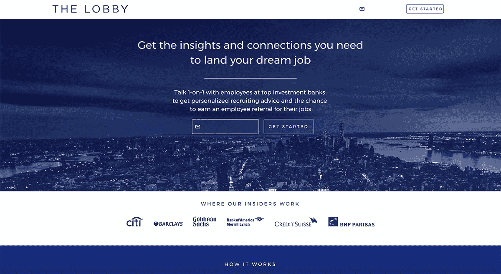
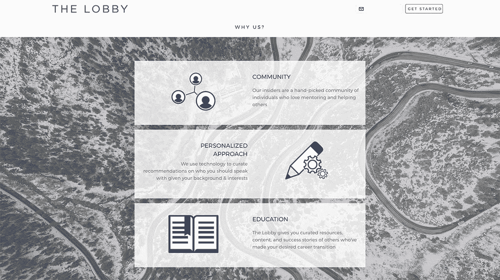

# 每月赚 2000 美元扰乱投资银行招聘

> 原文：<https://www.indiehackers.com/interview/making-2-000-mo-disrupting-investment-bank-recruiting-010c159e6f>

## 你好！你的背景是什么，你在做什么？

你好！我是[迪帕克](https://www.linkedin.com/in/deepakchhugani/)。我在厄瓜多尔长大，父母是印度人，我出生在肯尼亚！大约 7 年前，我来到美国上大学。直到一年前，我的大部分经验都是在金融领域(财富管理、私募股权、房地产和投资银行)。

然而，我从小就痴迷于自己创业。为此，我辞去了在 BofAML 的上一份工作，休假几个月，尝试开始自己的事业。

大约一年前，我创办了[lega ts](https://rc.legaats.com/)(一个社交平台，婴儿潮一代在这里分享和记录智慧片段，以传承给后代)。

大约 7 个月后，我决定将公司发展成现在的[大厅](https://www.thelobby.io/)。大堂是一个市场，求职者在这里购买与顶级投资银行员工一对一的电话，以获得个性化的招聘建议和获得员工推荐的机会。

我们在 5 周前进行了试运行，已经卖出了 5000 多美元的通话量(我们的收入约为 2000 美元)，而且我们的周环比增长率约为 32%。在我们的试运行和我们的 MVP 之间，我们有大约 730 个 B2C 注册和 2 个 B2B 付费客户，MVP 从电子表格和 4 月份的无薪 LinkedIn 状态开始。

我们在市场营销上仍然没有花一分钱，现在我们已经和美国东北部超过 15 所学校和学生俱乐部建立了合作关系。

 

## 是什么促使你开始做大堂？

我的学校，本特利大学，是一个神奇的地方，它以许多积极的方式改变了我的生活。然而，这并不是大多数顶级公司(除了一些明显的例外)认为他们会去校园招聘的“目标学校”。

游说来自于我自己解决的一个问题，我上过宾利商学院，进入了瑞银的财富管理部门，一家竞争激烈的精品公司的私募股权房地产部门，以及美国银行美林的投资银行部门，但从未在网上申请过工作。游说团还受到了至少 40 名其他朋友和同事的启发，这些朋友和同事来自非传统背景和学校，在顶级投行找到了工作。

这种奇怪的“非目标学校孩子”的方法似乎奏效了！经过更多的研究，我和我的朋友们一致认为，目前高层职位的招聘程序真的很糟糕，而且不是非常任人唯贤。这一体系似乎被设计成有利于出生在正确圈子里的人，或那些擅长“交际”的人，尽管他们可能不是这份工作的最佳候选人。这也意味着公司错过了优秀的人才。

对于 Legaats，我们忽略了 MVP 的建议，为 v1 花费了太多。这是愚蠢的，所以在游说团体的帮助下，我发誓不花一分钱来验证这个想法。简而言之，我在 LinkedIn 上发布了一个状态，告诉人们我正在做一个“实验”，帮助他们获得银行和咨询工作。

我不知道你是否可以称我们的 MVP 为初始产品。这只是一个没有报酬的 LinkedIn 状态，电子表格…

TweetShare

嘣！150 多封邮件和数十条评论和赞。有了 Legaats，我会一直发东西，却很少得到两个赞。所以这次有些不同。根据这个回答，我发明了一个即时流程，并开始销售看涨期权。我从 MVP 那里卖出了大约 20 个电话(卖给完全陌生的人，而不是购买同情电话的朋友)，有很多重复用户，我知道那里有一些东西。

## 构建最初的产品需要什么？

我不知道你是否可以称我们的 MVP 为初始产品。它只是一个未付费的 LinkedIn 状态，电子表格，一个 [Wix](https://www.wix.com/) 登陆页面，一个 [GoToMeeting](https://www.gotomeeting.com/) 免费试用， [Stripe](https://stripe.com/) ，一个[简单发票](https://simpleinvoices.io/)免费试用，以及一个 [GoDaddy](https://www.godaddy.com) 上的域名。此外，每个潜在用户都要处理大量的电子邮件和日程安排工作。

经过一个月左右的手动操作和使用 [Tacklebox Accelerator](http://www.tackleboxaccelerator.com/) 之后，我们决定开发一个可以让我们一次服务更多用户的东西。我有幸招募了一群了不起的自由职业者、兼职者，现在是全职者，并与他们一起工作，帮助他们以经济高效的方式完成产品的第一版。(非常感谢莫、苏法亚、苏海尔、伊斯梅尔、安德、奥拜茨、克劳迪娅和西尔维娅！)

 

我们变得痴迷于以一种经济高效的方式做事，所以我们的第一次发布仍然是一个非常半手工的产品，我们只自动化了大约 30%的用户体验。我相信，通过这样做，我们对用户在市场两端遇到的每个问题、瓶颈和潜在问题都有了更多的了解。

今天，我们的产品接近 80-90%是自动化的，范围是通过只关注自动化的事情来开发的，在这些事情上我们浪费了很多时间，并且没有了解我们的用户(即不必要的繁重工作)。

## 你是如何吸引用户和壮大大堂的？

在经历了专注于客户细分的 [Tacklebox](http://www.tackleboxaccelerator.com/) 之后，我们得出结论，我们必须从非常小众的东西开始。所以我们选择了纽约顶级银行的投资银行分析师和助理职位。

这个选择并不困难——我非常了解面试流程，有一个非常强大的内部人员来源网络(员工接听电话)，并且我在市场的两个方面都待过(作为一个试图打入市场的候选人，以及作为一个内部人员指导和面试候选人)。

困难的是决定只专注于这些角色，而这个概念显然适用于许多其他角色。然而，有反复的迹象表明，这是一个好的决定，由于这种专注，初始用户和内部人士的吸引力非常大。

目前，我们正在通过廉价的实验来验证我们做出的每一个主要假设。

TweetShare

我还试图与我的网络中擅长获取/增长用户的人交谈，并获得了关于我们如何廉价地找到初始用户群的具体建议。(邮件简讯很神奇！)

因此，我们已经看到了巨大的初始牵引力和验证。尽管我们自成立以来一直在积极发展，但我们现在专注于后退一步，自动化用户旅程的步骤，并专注于分析。我们最终的下一步是在扩大规模之前，了解我们的用户，并在这个细分市场中开发出优秀的产品。

## 如果你必须重新开始，你会做什么不同的事？

对于 Legaats，我会做 500 件不同的事情。

对于游说者来说，谢天谢地，我相信我们正在以正确的方式接近它，尽管我们可能正在犯错误，这些错误可能只有在几个月/几年后才变得清晰。目前，我们正在节约成本，拥有一个伟大的团队，令人惊叹的顾问，并通过廉价的实验验证我们做出的每一个主要假设。

## 有没有发现什么特别有帮助或者有优势的？

我认为我得到的最被低估的帮助来源是其他初创公司的创始人。通过帮助他们做一些小事情，比如介绍，回顾他们的卡片等等。，他们以令人难以置信的水平回报，因为他们知道什么是研磨。企业家网络在寻找队友、资源和导师方面也非常有帮助。我是[凯罗斯协会](http://www.businessinsider.com/kairos-meeting-2017-2017-4)和[次世代峰会](http://ngsummit.com/)的一员。两者都带来了大量的好处和新的友谊。

来自一个完全非技术背景的人，参加在线/离线课程也很棒，比如产品管理([大会](https://generalassemb.ly/))、前端网络开发( [Bloc](https://www.bloc.io/) )，并且阅读了大量与技术相关的创始人故事。我认为对我来说最好的资源是 Y Combinator 的《如何创业视频》。我仍然会时不时地重新观看其中的一些视频。

## 我们可以去哪里了解更多？

查看大厅[并请将它发送给任何试图进入投资银行业的朋友！我们还有一个 YouTube 频道](https://www.thelobby.io/)[用于我们举办的活动，演讲者包括 Classpass 的联合创始人、Trigger 的联合创始人兼首席执行官以及 Velocity 的增长主管。](https://www.youtube.com/channel/UCDXs4CIJVdOrGIwNbPqMd-A?view_as=subscriber)

我偶尔会在[媒体](https://medium.com/@deepakchhugani/)上写作，在 [Quora](https://www.quora.com/profile/Deepak-Chhugani) 上回答 IB 相关问题。

随时联系 [【邮箱受保护】](/cdn-cgi/l/email-protection#197d7c7c697872596d717c75767b7b60377076) ！谢谢你邀请我！

——[<picture id="ember5311272" class="user-avatar ember-view user-link__avatar"></picture>deepakchhugani](/deepakchhugani?id=s75b0IBuGoe5vWVcFCzb3Uofj7E3)，游说的创造者

## 想像大堂一样自己创业？

你应该加入独立黑客社区！🤗

我们是几千名创始人，互相帮助建立有利可图的业务和副业。来分享你正在做的事情，并从你的同事那里获得反馈。

还没准备好开始使用你的产品吗？没问题。这个社区是一个认识人、学习和实践的好地方。随意[随便浏览](/)！

——[<picture id="ember5311277" class="user-avatar ember-view user-link__avatar"></picture>柯特兰](/csallen?id=ibTLPyjwVebnZjMGKvz6ztarnuV2)，独立黑客创始人

8votes