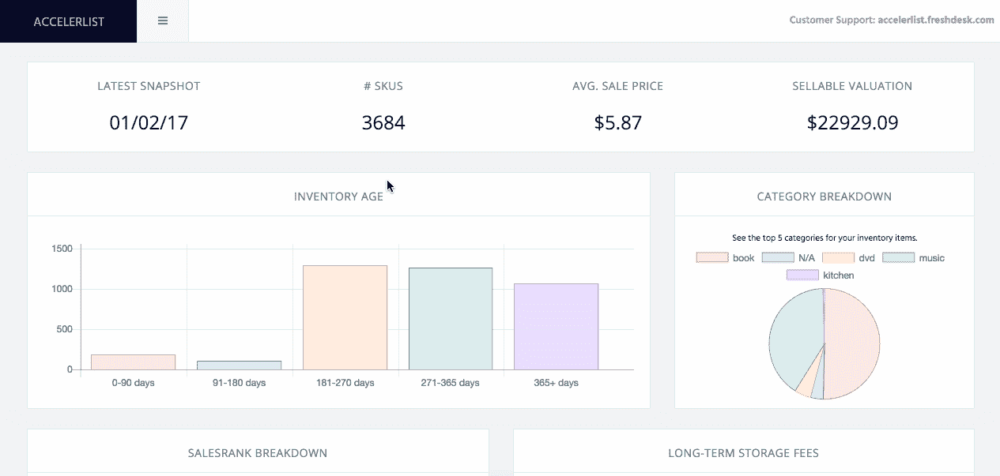

# 帮助客户在亚马逊上销售，每月赚 2.4 美元

> 原文：<https://www.indiehackers.com/interview/making-2-4-mo-helping-customers-sell-on-amazon-66619c1c4b>

## 你好！你的背景是什么，你在做什么？

你好！我叫特拉维斯，我是[accelelist](http://accelerlist.com)的联合创始人。我是一名非技术型创始人，并与我的技术型联合创始人杰夫密切合作。我的背景是销售和营销，但我自称是一个热爱所有技术和软件的极客——最重要的是，软件如何改善流程或帮助企业做出更明智的决策。Jeff 是一名全栈开发人员，目前在优步工作，他热爱编码！

[Acceleration list](http://accelerlist.com)是加速+列表组合而成的伪名。我们帮助消费者和 SMB(中小型企业)快速有效地在亚马逊上列出他们的销售产品。我们的客户用我们的软件列出了从书籍到跑步机的各种产品。

如今，AccelerList 的平均月收入为 2400 美元。

## 是什么促使你开始使用 AccelerList？

从各方面来看，我都是典型的“自寻烦恼”型创始人。6 年前，我从芝加哥搬到了洛杉矶，我开始在亚马逊上销售商品，努力每月多赚一点钱，资助我的家人外出旅行和爱好。

人们仅仅在亚马逊上卖旧书和 CD 就能获得惊人的收入，而我也想从中分一杯羹，所以我就一头扎了进去。在这样做的过程中，我很快了解了“Amosphere”(卖家给我们都生活在其中的亚马逊世界起的绰号)，以及它有多分散，以及可以帮助一个人成为成功卖家的有限或不成熟的应用程序。

[

使用 AccelerList 检查库存状况。](http://accelerlist.com) 

在“应用列表”方面，这个领域只有一个主导品牌赢家。它们大约有 6 年的历史，为卖家提供了大量的实用工具。然后还有其他一些限制更多的应用程序，远远落后于他们。

老实说，我对所有可用的应用程序都很失望。我认为一定有更好的方法，所以我开始构建自己的列表应用程序。没有编码经验。没有创业经验。什么都没有。

我知道我可以把它推销出去，我也知道从价格和功能的角度来看，我们在利基市场有空间，所以我双脚跳了进去，从那以后再也没有回头。

## 构建最初的产品需要什么？

除了 90 年代末的 HTML，我没有任何编码经验，所以我需要一个开发伙伴。我在 Craigslist 上发布了一则广告，只是简单地请人帮我构建一个基于网络的替代方案，以取代我们的一个低端竞争对手。

我已经热衷于快速推出 MVP 的想法，看看卖家是否会付钱给我们。现在我只需要有人帮我建造它，并和我一起踏上旅程。

如果你现在不开始，你会浪费宝贵的时间，而且一去不复返。

TweetShare

Craigslist 的广告向我提供了大量帮助我建立 AccelerList 的机会，但在和几个人谈过之后，杰夫是唯一一个既让我印象深刻又愿意和我一起创业的人。杰夫刚刚结束他在加州大学伯克利分校的最后一年，已经在谷歌从事一些重要而令人印象深刻的项目。他也很年轻，我知道如果我们能把这件事做好，他可以坚持到底。

Jeff 在不到一个月的时间里完成了一个工作 MVP(用 Python 编写),因为我已经在亚马逊脸书团队中有了很多人脉，所以我能够吸引一个大的测试团队来为我们测试它。有趣的是，它根本不是免费的测试版。我们提供了每月 20 美元的“创始人”价格点，并承诺在未来为测试版用户提供更好的应用程序，他们将永远享受锁定的低价位。

我们一开始有一个基本的应用程序，但就其核心功能而言，它完成了工作。它将卖家的产品列在清单上，然后交给亚马逊销售。自 2016 年 5 月开始以来，我们已经添加了大量功能，现在我们已经将价格提高到 29 美元/月，比我们最大的竞争对手便宜 10 美元。

## 你是如何吸引用户和发展 AccelerList 的？

我们没有足够的预算来像运营脸书或谷歌广告那样进行营销，但我们也知道这种方式也不会有很好的效果。我们最初的增长是通过挂出了我们的客户(脸书集团)，并在我们的博客上写内容。我给新 SaaS 创始人的最大建议是，加入你所在领域的每一个脸书团体，开始尽可能多地敲打出搜索引擎优化友好的内容。

如果你能让 10 个人每个月给你发工资，那么这是一个值得尝试的想法。

TweetShare

杰夫和我白天都有工作，所以每天晚上和周末我们要么疯狂地编码，要么疯狂地营销。我已经建立了一个[受欢迎的快餐车博客](http://foodrevolt.com)，浏览量高达 20000 次，足以让我拥有营销能力。杰夫是一个开发忍者，所以我知道我们有一个成功的组合...我们只需要继续前进，并对变化做出敏捷的反应。

但是，还是要去你的客户所在的地方，无论是脸书、Reddit 还是论坛等等。，并让您的应用成为热门话题。

## 你的商业模式是什么，你是如何增加收入的？

我们是一个可以在任何浏览器中工作的 SaaS 应用程序。基于订阅的商业模式带来了可预测的收入，这使得它能够经受住早期的风暴，如因漏洞导致的高流失率，或任何其他对软件初创公司来说正常的动荡。

在这一点上，我们只有一个定价层，但一旦我们在[加速器列表](http://accelerlist.com)中添加更多功能，我们将推出另一个更高的价格点。诀窍是真正弄清楚哪些功能会给我们带来最好的回报，并为用户增加巨大的价值。

| 月 | 维护、修理和更换 |
| --- | --- |
| 五月 | 260 |
| 六月 | 560 |
| 七月 | 940 |
| 八月 | 1379 |
| 九月 | 2742 |
| 十月 | 2683 |
| 十一月 | 2405 |
| 十二月 | 2216 |
| 一月 | 2277 |
| 二月（February 的缩写） | 2358 |
| 瑕疵 | 2733 |

我们目前有超过 115 名付费用户，每月总收入为 2733 美元。这看起来并不多，但我们才 8 个多月大，我们已经开发了一个与我们在这个领域最大的竞争对手竞争的应用程序。除了一些电子邮件、营销应用和服务器成本，我们的开销为零。

也就是说，我们真的没有从业务中拿任何钱。我们在“长期博弈”这个机会，我们知道我们的竞争对手每月的收入大约超过 20 万美元，所以这实际上只是坚持我们的原则，为我们的客户提供价值，并尽可能多地剥离市场份额的问题。

未来，我们希望成为亚马逊第三方应用列表领域的第一或第二名。我们还有很长的路要走，但我认为我们有很大的胜算。更重要的是，杰夫和我都坚持要赢。

## 如果你必须重新开始，你会做什么不同的事？

如果让我重新来过，我不会用任何其他方法。我们是一家几乎完全靠自己创业的公司，我认为每个人都应该这样起步。快速建立一个 MVP，看看人们是否会为此付钱。我认为经验法则是，如果你能让 10 个人每月给你发工资，那么这个想法值得尝试扩大 100 倍。

## 你最大的优势是什么？有什么特别有用的吗？

我认为我们早期最大的优势是吸引了天使投资者。Flipper.com 的[书中的迦勒·罗斯相信我们。他在我们的领域已经是一位受人尊敬的思想领袖，他在帮助我们决定构建什么功能方面发挥了重要作用，并且在我们的旅程中，他是一位完美的“积极”投资者。](http://www.thebookflipper.com)

他之前也曾在我们的空间里用他的 [eFlip 软件](https://eflip.co)使用过他自己的 SaaS 应用程序，所以这对我们来说完全是个意外收获。他给了我们在亚马逊领域难以置信的权威，他是一个非常聪明有趣的合作伙伴。

## 对于刚刚起步的独立黑客，你有什么建议？

停止研究你的利基或产品，并立即雇用或与开发人员合作或编写你自己的 MVP。如果你现在不开始，你会浪费宝贵的时间，而且一去不复返。如果你能让 10 个人每月为你的应用付费，那么你就拥有了扩大规模所需的所有验证。

我唯一的其他建议是去你的顾客所在的地方。这使得吸引新用户变得非常容易。不要为脸书或谷歌广告付费。

## 我们可以去哪里了解更多？

了解我们最好的地方是我们的 YouTube 频道。或者，如果您在下面发表评论，我们将予以回复。也可以发邮件到 [【邮箱受保护】](/cdn-cgi/l/email-protection#daaea8bbacb3a99abbb9b9bfb6bfa8b6b3a9aef4b9b5b7) 联系我们。

如果你想在发展和启动自己的公司时赚点外快，[accelerator list](http://accelerlist.com)是一个帮你每月赚点外快的好工具。

——[<picture id="ember5221068" class="user-avatar ember-view user-link__avatar"></picture>特拉维斯·r .](/saaspnr?id=Ol2L8a6L80OY7SI0aQA3a3PT1iq2)，AccelerList 创始人

## 想像 AccelerList 一样建立自己的企业吗？

你应该加入[独立黑客社区](/)！🤗

我们是几千名创始人，互相帮助建立有利可图的业务和副业。来分享你正在做的事情，并从你的同事那里获得反馈。

还没准备好开始使用你的产品吗？没问题。这个社区是一个认识人、学习和实践的好地方。随意[随便浏览](/)！

——[<picture id="ember5221073" class="user-avatar ember-view user-link__avatar"></picture>考特兰艾伦](/csallen?id=ibTLPyjwVebnZjMGKvz6ztarnuV2)，独立黑客创始人

11votes