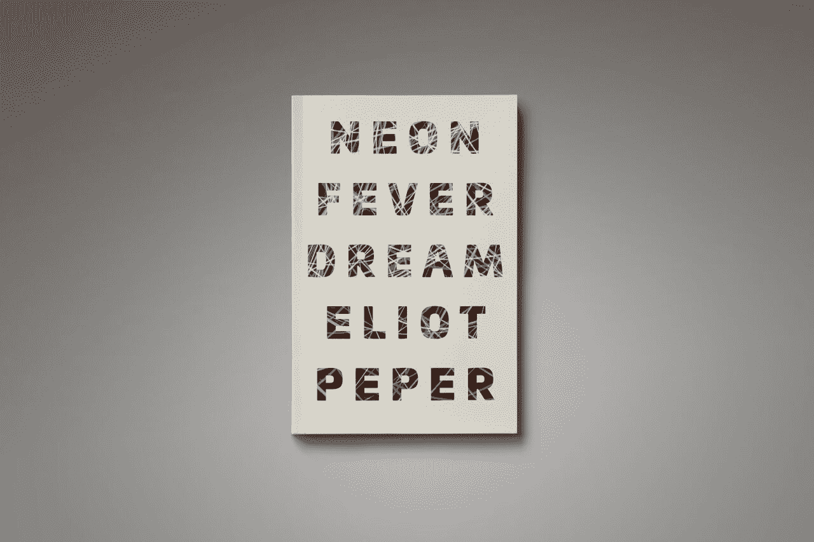
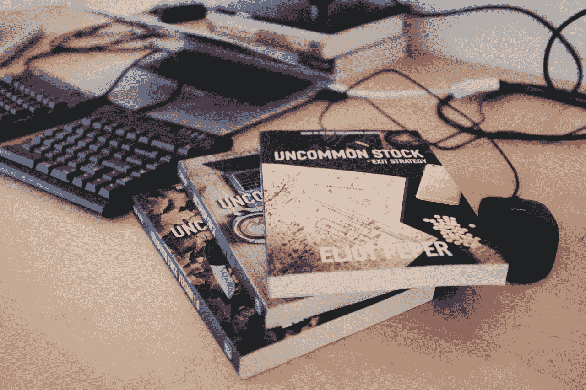
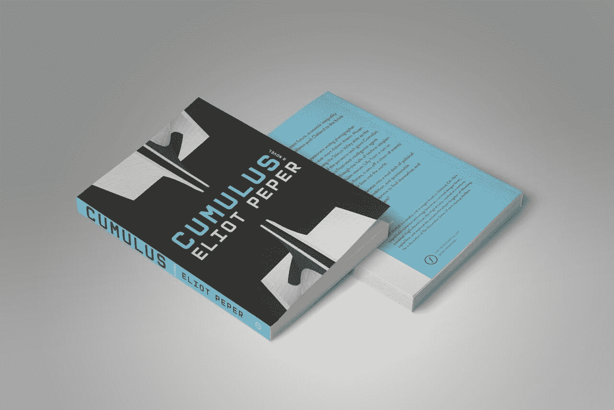

# 写科技惊悚小说每月赚 3500 美元

> 原文：<https://www.indiehackers.com/interview/making-3-500-mo-writing-tech-thriller-novels-2d76b74317>

## 告诉我们关于你自己和你正在做的事情。

你好，我是艾略特·佩普。我写小说，建立科技企业。我是五部快节奏、深入研究的惊悚小说的作者，这些小说采用了不同的演员阵容，探索了文化和技术的交集。

*   《积云》是一部科幻小说，故事发生在不久的将来，一个被经济不平等和持续监控蹂躏的海湾地区。
*   [霓虹发烧梦](http://amzn.to/2gpUh38)讲述了一个隐藏在燃烧的男人身上的黑暗秘密。
*   [不寻常系列](http://amzn.to/2gvrco7)是亚马逊上排名第一的金融惊悚片，讲述了一家科技初创公司在从车库到 IPO 的过程中陷入国际阴谋的故事。

这些书在硅谷赢得了狂热的追随者，拥有成千上万的普通读者。取决于你如何分解各种收入流，现在我每月从账面上赚 35000 美元。我还有一个[阅读推荐邮件列表](http://www.eliotpeper.com/p/inner-circle.html)，有大约 3000 名订阅者。

当我不写作的时候，我作为一个战略家为企业家、高管和投资者提供建议。我学的是国际关系，曾是多家初创公司的早期员工或创始人，并在一家风险投资公司担任常驻企业家。我的文章出现在 VentureBeat、Xconomy 和 TechCrunch 等出版物上。我在谷歌、高通和《未来回顾》等网站做过演讲。

 

## 你是如何开始写这些书的？

我从小就是一个如饥似渴的读者。我是那种在阳光明媚的夏日午后，在图书馆的一个满是灰尘的角落里闲逛，沉浸在狂野和奇妙的冒险中的孩子。在我的第一家科技创业公司，我尝到了冒险的滋味。这让人上瘾，我接着在各种初创公司工作，然后为一家风险投资公司工作。我读了成堆的商业书籍，其中一些颇有见地(许多并非如此)，但即使是最好的书籍似乎也遗漏了一些东西。

非小说可以充满有用的建议和经验教训，但不会让我们看到创业经历的高潮和低谷。创业世界是冒险的完美画布:高能量的个性，改变世界的技术，赢得和失去的财富。但是除了固有的人类戏剧，我找不到任何好的小说能把它写好。因此，一天下午，我决定如果我找不到合适的故事来读，我就试着写一写。

我刚打开一个 Word 文档，开始写第一章。我没有做任何计划，大纲或其他任何事情。相反，我只是一头扎进故事里。一旦我写了几章，我就给铸造集团的布拉德·菲尔德发了一封冷冰冰的电子邮件。我喜欢布拉德在他的个人博客上写的透明而真实的文章，他经常提到他有多爱阅读。因此，我起草了一封关于我写一部科技创业惊悚小说的梦想的电子邮件，附上相关章节，然后按下发送键。

老实说，我没想到会有回应。布拉德是一个疯狂忙碌的家伙，而我是一个陌生人，有一个奇怪的项目。但令我惊讶和永远感激的是，他在几个小时内回复说他喜欢它，并希望看到更多。这给了我勇气，让我相信自己，认真对待这个项目。第二年夏天，当我完成初稿时，他邀请我在他的新出版公司 FG 出版社出版。

## 你是怎么找到时间和资金来做这个的？

当我开始写第一本书时，我是圣地亚哥一家风险投资基金的常驻企业家。除了融资之外，我还在一家小型公司工作，帮助我们投资的公司跨越下一个增长里程碑。写作最初是一种爱好，是为了纯粹的快乐而做的事情，是为了实现一个梦想，而不是坐在未来的阴霾中。我在草稿上取得了缓慢但稳定的进展。

第二年，我和妻子计划了一次国际休假。我们花了 33 天徒步穿越喜马拉雅穷乡僻壤，在埃塞俄比亚的 injera 学习烹饪，并探索了苏门答腊的丛林。总之，我们花了九个月的时间在亚洲和东非旅行，每人花了 12k 美元，包括所有的机票(我们为这次旅行建立了一个财务模型，你可以在这里访问)。一路上，我写完了第一本书的初稿。

当 FG 出版社延长出版报价时，我欣喜若狂。他们资助了编辑和制作成本，《T2:不寻常的股票:1.0 版》于 2014 年 3 月首次亮相，在同类作品中排名第八。它刚刚在亚马逊上以 4.3 星的平均评级通过了 250 条评论。FG 出版社继续资助并出版了续集，[非同寻常的股票:权力游戏](http://amzn.to/2g16NJo)。

我们旅行回来后，我知道我想更认真地对待写作。因此，我没有去找一份全职工作，而是继续以独立顾问的身份做上门服务和咨询工作。从那以后，我花了一半时间在书上，一半时间在咨询上。咨询收入帮助支付了与写作和出版小说相关的时间和直接成本。最终，FG 出版社决定关门大吉，这些书的版权归我所有。我自己出版了它们，然后又自己出版了三本书。

一旦我心中有了一个故事，我通常会花 3-4 个月的时间来写一部新小说的初稿。

 

## 你是如何推销你的书并赢得更多读者的？

我已经推出了五部小说。一路走来，我犯了很多错误，也学到了很多。我以前帮助推出过 B2C 和 B2B 产品和服务，我发现许多相同的原则也适用于书籍(有些则不适用)。

[积云](http://amzn.to/2fimGMx)2016 年 5 月 5 日出。在发行的 24 小时内，它登上了 Reddit 的首页，成为亚马逊上第一大赛博朋克畅销书，[为电子前沿基金会和第 510 章筹集了数千美元](https://medium.com/@eliotpeper/economic-inequality-and-persistent-surveillance-push-oakland-to-the-brink-of-civil-war-a93036f5b0d3#.8a9jmdtdw)，并产生了十几个来自主要机构和制作公司的独立的文学/电影/电视版权咨询。传奇科幻作家威廉·吉布森[两天后给我打电话](https://altscifi.wordpress.com/2016/05/11/an-unexpected-call-from-william-gibson-on-eliot-pepers-cyberpunk-novel-cumulus/)，我陷入了粉丝昏迷。谷歌邀请我来做一个[演讲](https://www.youtube.com/watch?v=y1mwp0uk2cQ&feature=youtube)。像蒂姆·奥莱利、大卫·布瑞恩、拉米兹·纳姆和科利·多克托罗这样受人尊敬的人分享或说了关于它的好话。它赢得了商业周刊、大众科学和 TechCrunch 等主要出版物的评论。这是极不寻常的，尤其是对于一本自己出版的书来说。

以下是我在所有发布中遵循的基本原则。如果将 book 替换为“product ”,一切仍然适用:

1.  找出喜欢这本书的人已经去过的地方(博客，播客，活动，网站，他们在 twitter 上关注的人，等等)。)以及相关的影响者是谁。这里有非常容易获得的果实:寻找类似书籍/作者的评论/讨论/采访。
2.  研究影响者的工作，看看他们真正喜欢关注什么。向影响者及其受众清楚展示具体价值的个人信息。这个想法是向他们传递价值，激发基于共同兴趣的潜在友谊，而不仅仅是推销这本书。
3.  与每个有影响力的人建立长期关系，不管他们是否对这本书感兴趣。想办法帮助他们。粉丝和其他人也一样。
4.  随着更多的注意力从更大的受众那里获得，通过“提升”媒体食物链，将每一篇报道转化为更多的报道，这激起了看门人的兴趣。
5.  尝试新的东西。这主要是为了好玩。例如，在我的第一部小说中，我们为虚构的科技创业公司创建了一个真实的登录页面和社交媒体账户。主角还为 Tech.co 写了一篇关于网络安全的“专栏文章”。

更进一步，以下是我如何将这一理念付诸行动:

*   我有一些不错的作品。但是我向很多人推销。从字面上看，类似小说的多个谷歌评论页面。我的平均回复率为 10%,其中不到一半的人做了什么。
*   我总是研究作家。我看了他们写的关于其他主题/书籍的其他文章/评论。当我联系时，这封邮件是私人的，提到了我喜欢他们的写作/观点。邮件主题总是引用他们写的东西。
*   我有一个关于这本书的“新闻资料袋”，里面有关键事实、背景和报道，我可以复制粘贴到电子邮件中。我还有一个 Dropbox，里面有我和这本书的高清图片，任何人都可以在上面写文章。人们都很忙，作家尤其如此。他们总是有更重要的事情要做。你越能帮助他们做好自己的工作，创造出令人敬畏的东西，就越好。
*   如果除了直截了当的评论之外，我还在推销任何东西，比如一篇客座博文或一次采访，我总是会拿出一个现成的想法。我阅读出版物(或播客等。)的问题，看看哪些帖子最能引起读者的共鸣。然后我头脑风暴一些想法，我可以分享给读者，真正增加价值，而不是兜售我的书。这样，当有问题的看门人阅读我的电子邮件时，他们会看到我尊重他们的读者，并且已经找到了相关的人。再次，让他们的生活变得简单。
*   我总是，总是，总是给人一个轻松的机会。例如，“不管出于什么原因，如果这听起来不好玩，也不要担心。你可能每周都会收到几十个像这样的询问。我知道你有多忙，也非常尊重你的工作。”这给了他们真诚拒绝的情感空间，并把需求变成了慷慨的提议。如果你不尊重影响者的时间和工作，你就不应该主动联系他们。

额外收获:伸出手是长期关系的开始，而不是交易。我在社交媒体上关注每个人，分享他们引起我共鸣的作品，并继续关注他们和他们的观众，并与他们互动。我希望有一天能把他们当成朋友。

成功的发射是基于运气和努力的结合。但重要的是要记住，发布并没有看起来那么重要。在一天结束的时候，唯一重要的事情是制造能改善人们生活的东西，不管是一篇文学作品还是解决问题的产品。如果你创造了惊人的东西，你的读者或用户将成为你最大的冠军。

 

## 你的营收背后有什么故事？

我每月从账面上赚大约 35000 美元。这每月变化很大。有高峰($ 10k+/月)，也有低谷($ 500/月)。峰值通常与一个真正引起共鸣的发布或一篇媒体报道有关。自从 2014 年春天我的第一本书出版以来，这个数字一直在稳步增长。

我的大部分收入来自图书销售。我通过 Kindle Direct Publishing 和 iBooks 发行电子书。我通过 Createspace 发行平装书。我通过 ACX/Audible 发行有声读物。大约 95%的直接销售收入来自亚马逊平台。苹果的生态系统远远落后于第二，在活动中的面对面交易排在第三。

我还通过出售附属权利获得收入。对于小说来说，这意味着外语出版权、电影/电视权、视频游戏改编权、产品授权等。 [Bound](http://www.getbound.io) 已经购买了我最新两部小说的版权， [Cumulus](http://amzn.to/2fimGMx) 和 [Neon Fever Dream](http://amzn.to/2gpUh38) ，它正在将这两部小说改编成本地数字连续剧，并配有插图和临时演员。我与好莱坞 IPG 的布莱恩·利普森和乔希·鲁萨克以及纽约斯特林勋爵文学社的玛莎·米勒德一起工作。我也在为一些精选的出版物合作委托原创故事。

在尝试了各种定价模式后，我决定电子书的底价为 4.99 美元，平装本的底价为 11.99 美元。这里有很多人挥舞着手，但我不认为定价会对图书产生巨大影响，只要你保持在既定的规范内。人们根据内容决定他们想读什么，而不是商业或定价模式。

我在每本书的编辑和制作成本上花了大约 1 万美元，并且和世界级的自由职业者一起工作，比如凯文·巴雷特·凯恩。在一个无限数字媒体的世界里，书籍需要好到让读者找到你。让每个故事尽可能的精彩是我唯一的关注点。

就直接生产成本而言，我所有的书都是盈利的。然而，如果你算上我在创意过程中投入的时间，那就一点都不赚钱。另一方面，一旦一本书出版了，即使我去度假，它也会持续几年产生收入。

## 你未来的目标是什么？

我一直认为写作是一场漫长的游戏。需要多年的不懈努力来提高技艺和赢得观众。财务上的成功和创造性的成功是截然不同的两码事，但我衡量这两者的时间跨度是几十年，而不是几个月。我专注于尽可能地讲述最好的故事，并以此谋生。

## 如果你必须重新开始，你会做什么不同的事？

我会花更少的时间和精力在出版上(包括营销等)。)和更多的写作。最终，读者是你对世界其他地方的大使，读者想要一些非常具体的东西:更多、更好的故事。

但是，我们很容易陷入各种在线平台、营销策略、合作机会和巧妙的分销创意的疯狂之中。它可以吸走所有应该用来创作新书的时间。在一天结束的时候，你可以制造很多噪音，但却没有真正取得任何成就，也没有为这个世界做出任何贡献。

对我的作家生涯来说，我能做的最好的事情就是写作。

## 你认为对你帮助最大的是什么？

我没有陷入在开始之前需要大量外部“认可”的陷阱。太多有抱负的作家除了渴望什么也不做。他们认为他们需要一个艺术硕士学位或者一个写作工作室，然后他们才能认为自己是一个“作家”很简单。如果你准备食物，你就是一个厨师。如果你写代码，你就是一个程序员。如果你写作，你就是一个作家。去做吧，看看会发生什么。

到目前为止，我非常幸运。有影响力的人阅读并分享了我的书。积云以一种完全超出我控制的方式传播开来，创造了一系列全新的机会。记住运气在成功中扮演的重要角色是很重要的，尤其是在像文学这样的热门领域。没有人知道什么可行，什么不可行。我们需要专注于制作真正令人惊叹的东西，增加的价值远远超过它们捕获的价值，而不是试图制造流行。我有很多东西要学，还有很长很长的路要走。

 

## 你会和有抱负的独立黑客分享什么建议？

看书。书籍包含了人类最伟大思想家的智慧精华。他们会提高你的游戏。他们会拓展你的视野。他们将改变你的生活。独立黑客可能会喜欢这些:

[凯文·凯利的《不可避免》是我很久以来读过的关于未来的最有趣的非小说类书籍。我不断地发现自己重读段落和标记页面，以便以后再来看。几十年来，作为《连线》杂志的联合创始人，凯文一直是人类状况和技术状态的热情观察者，他的见解深刻、具有启发性且涉及广泛。用他自己的话说，“当答案变得廉价时，好问题变得更难，因此也更有价值。”这一不可避免的事件引发了许多重要问题，这些问题将影响未来几十年。我采访了凯利关于不可避免的](http://amzn.to/2fO0wOe)[这里](https://medium.com/the-mission/the-technological-trends-that-will-shape-the-next-30-years-c13c8b069094#.qrky4274f)。

埃德温·a·艾伯特的《平地》最初出版于 1884 年，证明了伟大的故事经得起时间的考验。这是一个令人难以置信的冒险，主角生活在一个二维世界中。这个故事充满了幽默、浪漫和讽刺。平地是一个迷人而令人愉快的邀请，让我们的思维从我们不断强加于其上的人为限制中解放出来。

本·霍洛维茨的《艰难的事情》是我很久以来读过的最好的商业书籍。本是一个传奇的操作员。他创建、建造并出售 Opsware。然后，他与马克·安德森合作，共同创立了近年来最成功的风险投资公司之一，投资了 Airbnb、脸书、Twitter、GitHub、Pinterest 等。这本书是一个实用的，可操作的，个人的指南，指导你如何不断努力建立一个企业。

如果你想要更多的推荐，我在这里分享给你[。但老实说，跟着你的心走。读任何让你着迷的东西。不要觉得有必要向任何人证明任何事情。阅读你喜爱的书籍是时间和金钱的单一投资，将为你带来最高的回报。](http://www.eliotpeper.com/p/inner-circle.html)

## 我们可以去哪里了解更多？

*   读我的书:【https://www.amazon.com/Eliot-Peper/e/B00IRH82N0 
*   获取我的阅读推荐:[http://www.eliotpeper.com/p/inner-circle.html](http://www.eliotpeper.com/p/inner-circle.html)
*   看看我的博客:[http://www.eliotpeper.com](http://www.eliotpeper.com)
*   与我合作:[http://www.eliotpeper.com/p/consulting.html](http://www.eliotpeper.com/p/consulting.html)
*   推特: [@eliotpeper](https://twitter.com/eliotpeper)
*   https://www.facebook.com/eliotpeper
*   好消息:[https://www.goodreads.com/author/show/7932280.Eliot_Peper](https://www.goodreads.com/author/show/7932280.Eliot_Peper)
*   中:[https://medium.com/@eliotpeper](https://medium.com/@eliotpeper)

如果你有问题、意见或建议，打电话给我。我喜欢收到读者的来信。

——[<picture id="ember5298232" class="user-avatar ember-view user-link__avatar"></picture>埃利奥特派珀](/eliotpeper?id=HrcxdPcuuFWm33j8vWxEWCz1EHT2)，《埃利奥特派珀》的创作者

## 想像艾略特·佩珀一样建立自己的事业吗？

你应该加入独立黑客社区！🤗

我们是几千名创始人，互相帮助建立有利可图的业务和副业。来分享你正在做的事情，并从你的同事那里获得反馈。

还没准备好开始使用你的产品吗？没问题。这个社区是一个认识人、学习和实践的好地方。随意[随便浏览](/)！

——[<picture id="ember5298237" class="user-avatar ember-view user-link__avatar"></picture>考特兰艾伦](/csallen?id=ibTLPyjwVebnZjMGKvz6ztarnuV2)，独立黑客创始人

8votes