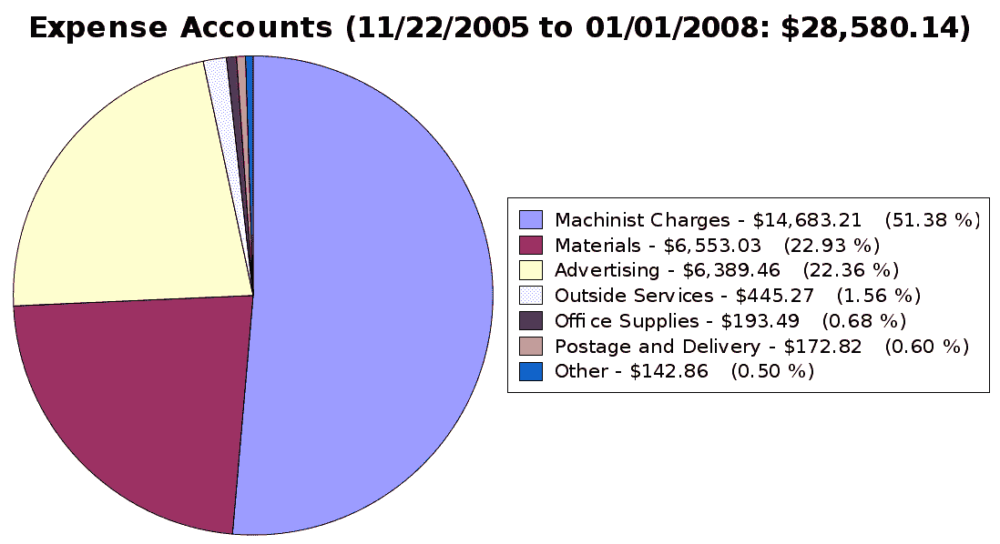
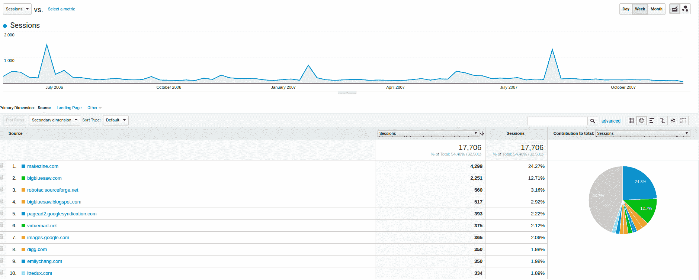
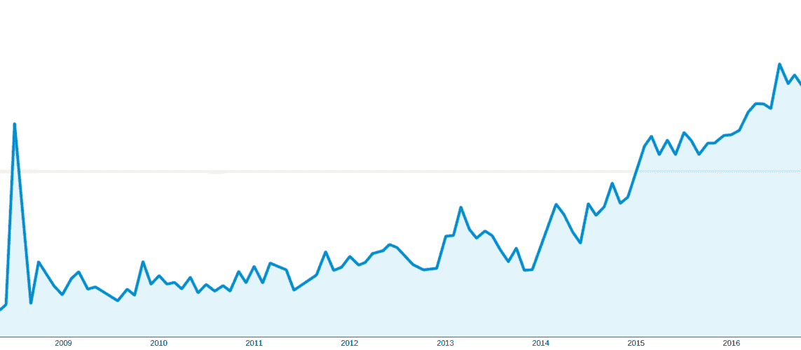
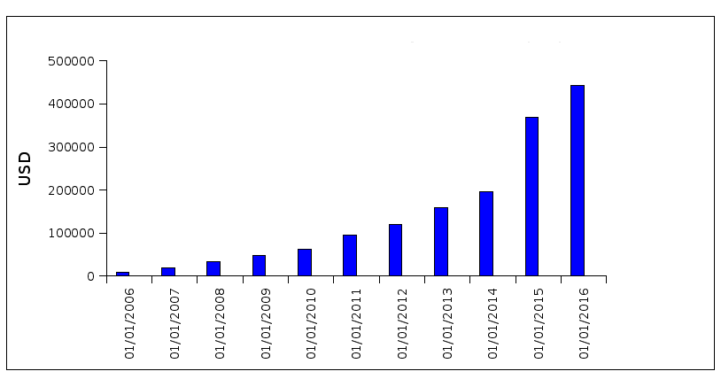

# 将创意和设计转化为硬件，每月可赚 45，000 美元

> 原文：<https://www.indiehackers.com/interview/making-45-000-mo-turning-ideas-and-designs-into-hardware-9a5053c0d3>

## 你好！告诉我们关于你自己和你正在做的事情。

我是西蒙·亚瑟。我帮助制造商把他们的想法变成真实的零件。

我的生意是[大蓝锯](http://www.bigbluesaw.com)。我们的网站会对您选择的材料制成的零件给出即时报价，然后让您像从任何其他电子商务网站订购一样订购。我们的客户包括制造商、工程师、艺术家、设计师和任何需要定制零件的人。

自从不到两年前开始全职工作以来，我已经成功地将月销售额提高了 330%,并依靠《蓝色大锯》的利润过着舒适的生活。根据查克·布莱克曼的[赚钱正在扼杀你的生意](http://amzn.to/2jDOmxn)，我正处于一个五年计划的第二年，该计划旨在将业务发展到没有我也能运转的地步。

## 你是如何想出《蓝色大锯》这个主意的？

这个生意源于 2005 年我在 Dragon*Con 科幻大会上的一次晚餐谈话。我一直在为战斗机器人和机器人战斗等比赛制造战斗机器人，很难获得我需要的定制零件。

晚宴上的许多其他建筑商也有同样的问题。与机械商店打交道以获得由我们需要的材料制成的定制零件，如钢、铝和塑料，是一件很麻烦的事情。机械商店的沟通很差，大多数都不想和只需要几个零件的客户打交道。

我意识到我可以很快建立一个网站，使订购水刀切割零件变得容易。我想，如果机器人制造商在获得定制零件方面有困难，那么肯定还有其他人处于同样的情况。

## 构建实际的网站和订购系统需要什么？

当时，我对营销、客户支持或经营电子商务业务知之甚少。我确实知道如何建立软件和网站，所以我只是建立了它，并把它放在那里，看看它是否能工作。我根据客户反馈对网站、订购流程和产品进行了修改。

最初的网站建立在 Joomla、PHP、MySQL 和 Linux 之上，由 Java 处理报价和部分渲染。以下是我们依赖的其他软件包和服务的部分列表:

*   GnuCash
*   QCad
*   自由卡片
*   Inkscape

*   翁沙佩
*   Clicky
*   红矿
*   米乔肖普

*   Stripe 和 PayPal
*   谷歌分析
*   团队项目
*   Freshdesk

我很难找到可以合作的制造商。大多数制造商只是不想处理小订单(少于 500 美元)，这是我开始试图解决的问题。其他人沟通能力差，或者周转不灵。我至少有三个制造商曾经接手过我的生意，然后又把我作为客户解雇了。这让我不得不努力寻找替代者。

有一段时间，我在家里用激光切割机自己完成了大部分制造工作。不过，这是一个巨大的时间浪费，我需要时间来发展业务。所以目前所有这些都是外包的。2017 年，我们将开始将一些制造业务带回公司，这样我们就可以更好地控制生产质量和进度，并提供新的服务。

我继续经营 [Big Blue Saw](http://www.bigbluesaw.com) 作为副业，在晚上、周末和午休时间工作，回复语音邮件，处理支持电子邮件，改进和维护网站，处理新订单。最终,“蓝色大锯”开始干扰我作为顾问的工作，所以在 2014 年 1 月 1 日，我可以开始全职工作了。

## 你是怎么找到时间和资金来启动项目的？

让事情运转起来的最初时间来自我的业余夜晚和周末，以及合同之间的休息时间。最初的想法来自 2005 年劳动节周末的一次晚餐讨论，我在 10 月 15 日注册了这个域名，网站在 12 月初上线。第一笔交易发生在 12 月 12 日。(你可以在这里看到网站[的早期版本](http://web.archive.org/web/20060203184658/http://bigbluesaw.com)。)

如果你不扣除我的时间成本，这笔生意从第一次销售就开始盈利了。这部分是由于低开销:没有钱花在营销、库存或办公室上。由于一个拥有数据中心的朋友和我的一个咨询客户捐赠的服务器，我甚至成功地让网站免费托管了几年。

咨询/承包实际上是开始副业的理想选择。你的工资是按小时或工作来的，你可以简单地告诉客户(在合理的范围内)你什么时候不能参与他们的项目，而不是向老板请假。

该网站最初托管在一个便宜的 VPS 服务器上，但我发现 VPS 不能很好地处理流量高峰。我需要超额配置容量，在这种情况下，使用专用服务器更有意义，因为我不必担心与同一台物理服务器上的其他人共享资源。我的一个咨询客户给了我一台老式的机架安装式康柏服务器，它像一辆坦克。我的朋友 PodPonics 的 Matt Liotta 当时经营着一个小型数据中心，并提出让我免费将服务器停在那里。这种情况持续了几年，直到他离开那家公司，我独自寻找一个新的地方来主持《蓝色大锯》。

创业时我非常厌恶风险，所以我没有购买任何机器，没有租用任何办公场所，也没有为任何与填写订单没有直接关系的事情付费。正如你在下面的饼状图中看到的，广告是一个例外。这是一次学习的经历，因为我发现 Google Adwords 和 Yahoo 的广告对我来说并不是很好，而且印刷广告超出了我当时的能力范围。尽管如此，我的支出从来没有超过收入。

我经历了几个制造合作伙伴，这一早期阶段相当动荡。我被很多我认为可以帮助我的公司拒绝了。这也是我作为一个机器人制造商所面临的问题:他们只是不想处理任何小订单，反应迟钝，等等。现在，我有一大群美国制造商，他们更好地理解了我的目标。他们从中受益，因为我可以给他们标准化的、简单的订单。

在早期，有一个在家的妻子真的有助于处理日常的麻烦和照顾孩子，让我有时间从事业务。后来，Denny 再次开始全职工作，这在我全职从事 Big Blue Saw 的第一年(2014 年)真的很有用，因为当时我仅从业务中获得的收入还不够。

## 你是如何在大蓝锯扩大你的客户群的？

我记得为宣传这次发布做的唯一一件事是联系几个看起来感兴趣的博主。2005 年 11 月,《制造》杂志在《蓝色大锯》上刊登了[的一篇文章。我为](http://makezine.com/2008/02/29/how-to-make-a-motorola-ra)[写了一篇文章](http://makezine.com/2008/02/29/how-to-make-a-motorola-ra)，展示了 2006 年从蓝色大锯订购的产品。我当时认为这足以吸引大量顾客，但后来我发现情况并非如此。

从那以后，这些年来我做了很多事情来引起人们对这个行业的关注。以下是部分列表:

*   平面广告
*   谷歌(有来自谷歌的顾问)
*   雅虎和必应
*   搜索结果位置
*   电子邮件列表
*   动画广告
*   静态图像广告
*   文字广告
*   再销售(通过代理)
*   促销/折扣

*   点击付费广告(这种方式通常不起作用)
*   脸书广告(通过 Power Editor 和 Boosted Post)
*   社交媒体(脸书、Twitter、LinkedIn、Google Plus)
*   其他网站上的直接付费广告
*   蜗牛邮件销售信(给现有和潜在客户)
*   内容放置(按一般兴趣和目标页面)
*   亲自参展(赞助亚特兰大 Maker Faire 并在 Dragon*Con 上演讲)
*   赞助(活动、个人和团队)
*   在线论坛(张贴到“供应商区”并参与/回答一般论坛中的问题)
*   SEO(赞助、在线论坛、Google Plus/本地业务、评论、站外链接、内容)

这些渠道中的许多被证明是无效的，或者至少投资时间的回报很低。现在我专注于脸书和内容创作，偶尔会有推广。新内容被发布到脸书、我的邮件列表(由 [MailChimp](http://eepurl.com/cb60-X) 托管)和其他社交媒体(通过 Buffer)。不太经常的是，[我会利用出现的赞助机会](https://www.bigbluesaw.com/big-blue-saw-blog/general-updates/sponsorship.html)，在相关的时候在论坛上发帖，在我感兴趣的时候亲自参加活动。这些人似乎善于把大蓝锯的信息传达给正确的人。

我喜欢脸书的一点是，它允许我将我的帖子限制在美国和已经喜欢《蓝色大锯》的人的朋友。这意味着我接触到了最相关的受众。将你的广告投放到整个脸书只会保证你从虚假账户中获得毫无价值的“赞”。通过瞄准那些已经喜欢你的生意的人的朋友，你更有可能让真实的人看到你的内容，另外你还能得到一些你的生意还不错的社会证明。

我过去遇到的一个挑战是让人们确切地理解[大蓝锯](http://www.bigbluesaw.com)能为他们做什么。他们可能不知道在谷歌上搜索什么，或者根本不知道像我们这样的服务存在。所以通过在脸书上放一些有趣的内容，我们能够吸引一些人。

谷歌认为搜索“水射流切割”、“激光切割”和类似的术语是本地化搜索，所以我必须确保尽可能多地出现在那里。这意味着优化这些搜索词，以及创建一个 Google Plus 本地商业页面或其他他们现在称之为的东西。

多年来，搜索广告耗费了数千美元，却没有给我提供可靠的结果。谷歌甚至一度联系过我，他们提供了一名顾问来帮助我以“正确的方式”建立 Adwords。(我相信我被选中参加这个项目是因为我填写了一份调查，所以你可能也想这样做。)几个月后，我们得出的结论是，我可能更适合开展一场廉价的再营销活动。这每月只需花费几美元，并提供一点流量。

有了邮件列表，每当我发出一条消息，我就能看到流量的峰值。我一周做一次或两次，以便让人们记住《蓝色大锯》。我使用邮件列表来发布销售公告、使用蓝色大锯的技巧、设计水切割和激光切割零件的建议，以及我们的客户正在进行的有趣项目。客户告诉我，他们发现邮件列表很有用，我尽量尊重他们的时间，给他们一些可以帮助他们的东西。

我做过的最没效果的事就是雇了一家广告代理公司替我运行谷歌广告。我根据他们网站上的信息联系了他们。他们似乎知道自己在做什么，至少在销售电话和初始设置中是这样。他们善于提供信息，比如广告点击率(CTR)在过去的一个月里提高了多少。但是，当我问他们“你做的这些广告里到底有什么”这样的问题时，他们并没有真正做出回应、“你针对的是哪些关键词，为什么？”，以及“你怎么知道这会带来更多销售？”几个月后，他们在谷歌收费的基础上收取了佣金，但没有产生可衡量的结果。

有一次，一个朋友给了我一些好建议:只雇佣和你自己的企业规模差不多的服务提供商。这适用于广告，会计，法律服务，或任何其他服务，他们真的需要了解你的需求。

这是我早期的流量和推荐人的图表:

最早的时候，谷歌提供了我 16%左右的流量。这一比例一直稳步上升到今天的 66%左右。我怀疑这是收入增加的一个因素。

我做过的最有效的赞助是赞助 Aptyx 设计公司的机器人咬力。他们最终赢得了 2015 年美国广播公司播出的战斗机器人比赛。当这一切发生时，我的流量出现了一个不错的小高峰，保罗·文蒂米利亚和他的团队通过社交媒体和网络推广《蓝色电锯惊魂》非常棒。

我还在 2008 年 7 月进行了一次非常受欢迎的推广活动:自由活动日。人们喜欢免费的东西。这个故事通过网络和口头传播迅速传播开来。在免费部分日之后，我的网站流量[一直高于](https://storage.googleapis.com/indie-hackers.appspot.com/content/big-blue-saw-traffic-spike.png)。但与目前的网站流量相比，这只是昙花一现:

它对收入也有类似的影响。我当时没有想到，但那一年整体经济陷入了困境。[这是美国过去 10 年的 GDP 图表。](https://storage.googleapis.com/indie-hackers.appspot.com/content/big-blue-saw-us-gdp.png)

对我来说，一个持续的挑战是将促销活动和网站流量与收入挂钩。销售额和网站访问量之间似乎没有什么直接的关联。例如，看看去年[网站访问量与销售额](https://storage.googleapis.com/indie-hackers.appspot.com/content/big-blue-saw-sales-vs-visits.png)的月度对比。网站流量的增长远快于销售额。2017 年的计划中有一个财务和营销仪表板来帮助我解决这个问题。

我们几乎所有的销售都是定制零件，要么通过网站的报价和订购系统，要么通过电子邮件和电话定制订单。开始时，2016 年的平均收入约为每月 45，000 美元，但在最后几个月，我们的收入大幅增长。:自开始以来，收入一直在缓慢但稳定地增长

起初，这是一个不错的小收入流，但几乎不值得我投入的时间。现在我在谋生，还在我完全控制的一项资产中建立股权。

## 你未来的目标是什么？

我的个人目标包括能够花更多的时间在我的家庭和机器人格斗上。我也喜欢创业，但这是为了支持我的个人目标和价值观。

为了方便起见，我按照[赚钱会扼杀你的生意](http://amzn.to/2jDOmxn)中的剧本。[重温电子神话](http://amzn.to/2k207tU)和[打造销售:创建一个没有你也能繁荣发展的企业](http://amzn.to/2l2UThA)覆盖相似的领域，但没有那么多的逐步规划。

有几件事已经为中期未来做好了准备，包括更好的内部订单跟踪、销售仪表板、改进的紧急订单以及改进的客户订单状态更新。

## 你认为你最大的优点和缺点是什么？

我很幸运，因为我知道如何使用电脑，知道它们能做什么。大多数人并没有真正想到计算机节省劳动力的潜力或互联网帮助销售的力量。

销售实体产品，而不是软件或信息，无疑是一种艰难的方式。如果我不得不重新开始，我宁愿不用担心现实世界而不是比特。

## 你会和有抱负的独立黑客分享什么建议？

弄点东西出去，看看能不能赚钱。

今年，我在 Dragon*Con 举办了一个小型研讨会，面向那些希望将自己的爱好转化为业务的制造商。他们中的许多人被与他们的成功无关的事情所困扰，比如他们的企业应该采取什么形式的所有权，如何保护他们的想法不被窃取等等。比起是否有人会买你卖的东西，这类问题对你最终成功的影响要小得多。所以出去卖吧。

通过缓慢的过程建立成功的企业是可能的。辞职时，你不必冒一切“荡秋千”的风险。只要确保你卖的东西不需要太多的支持或个人互动。

我的博客列出了我读过的稍微过时的商业书籍。我最喜欢的播客包括 [Mixergy](http://www.mixergy.com) 、[为我们其余人服务的初创公司](http://www.startupsfortherestofus.com)、 [Planet Money](http://www.npr.org/sections/money) 和 [Tim Ferriss Show](http://tim.blog/podcast) 。

## 我们可以去哪里了解更多？

我们定期在网站上公布销售情况，并为制造商提供信息。你也可以通过社交媒体或我们的邮件列表获得同样的信息。

大蓝锯在推特[@大蓝锯](https://twitter.com/bigbluesaw)和 facebook.com/bigbluesaw([)上。](https://www.facebook.com/bigbluesaw)

我的个人博客:[https://planiverse.wordpress.com](https://planiverse.wordpress.com)

—[<picture id="ember5203701" class="user-avatar ember-view user-link__avatar"></picture>Big Blue Saw](/bigbluesaw?id=mjQni6E05SRIbQRllaLDL9GnN9v2)，大蓝锯的创造者

## 想像大蓝锯一样建立自己的事业？

你应该加入[独立黑客社区](/)！🤗

我们是几千名创始人，互相帮助建立有利可图的业务和副业。来分享你正在做的事情，并从你的同事那里获得反馈。

还没准备好开始使用你的产品吗？没问题。这个社区是一个认识人、学习和实践的好地方。随意[随便浏览](/)！

——[<picture id="ember5203706" class="user-avatar ember-view user-link__avatar"></picture>考特兰艾伦](/csallen?id=ibTLPyjwVebnZjMGKvz6ztarnuV2)，独立黑客创始人

3votes