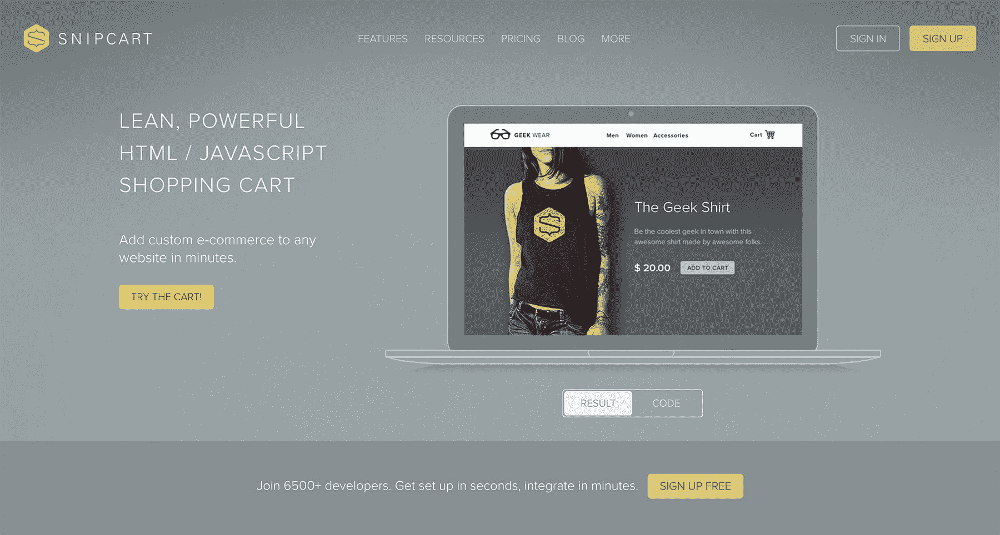
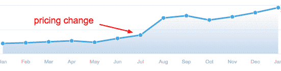

# 赚 6 位数的钱帮助开发商在他们的网站上增加电子商务

> 原文：<https://www.indiehackers.com/interview/making-6-figures-helping-developers-add-e-commerce-to-their-sites-1f900acad7>

## 你好！你的背景是什么，你在做什么？

嘿！我是来自[狙击车](https://snipcart.com/)的弗兰克。

在掉进 SaaS 创业公司的兔子洞之前，我正在成为一名传统的广告代理人——唐·德雷珀给年轻的我留下了深刻的印象。然而，在临时实习和一点运气之后，我发现营销不仅仅是巧妙的口号。尤其是在网络上！

所以我改变了职业方向，开始在网店工作(项目管理、文案、社交媒体、基础搜索引擎优化、分析、广告词等)。).

我登陆的第二家商店要求我开发他们新的“内部”产品:Snipcart，这是一个面向开发者的 HTML/JS 电子商务解决方案。对我来说是个巨大的挑战！我从未接触过 SaaS 营销，从未完全用英语操作，几乎没有接触过代码编辑器…而 TBH，我甚至不知道 Snipcart 是如何工作的。:P

长话短说，我全力支持李罗伊·詹金斯，并很快从零零开始成为创始人团队的合伙人和营销主管。

我们的产品是一个开发者优先的购物车平台，你可以集成在任何网站或 web 应用程序上。您添加两行 JS，直接在您的 HTML 中定义产品[，并获得一个整洁的仪表板来管理操作。我们产品的冰山一角是一个可定制的购物车系统(CSS/JS)，但我们提供了一整套 API 和 webhooks 来进一步推动集成，无论是通过外部系统还是 CMS 的专用电子商务插件。](https://docs.snipcart.com/configuration/product-definition)

我认为开发人员喜欢使用它，因为它不会扰乱他们喜欢的(或强加的)工作流程。我们基本上已经将电子商务与网站建设分离，使得在任何堆栈上运行商店变得容易，而不是被锁定在一个封闭的生态系统中。因为这只是一个 JS 注入，所以它非常适合于 [JAMstack](https://jamstack.org/) ，一个流行的前端为中心的范例。

我们于 2013 年末推出，目前每月收入约 3.3 万美元。我们花了整整两年时间才从母公司完全脱离，花了三年时间才实现盈利！

 

## 是什么促使你开始使用 Snipcart？

如前所述，Snipcart 最初是在魁北克市的一个网络商店中启动的。回到 2013 年，该店的第一批客户之一要求我们在他的旧网站上添加电子商务。他没有多少预算；迁移或定制电子商务是不可能的。我们的首席开发人员 Charles 不想从混乱的代码库开始。

因此，他和我们的 PM Georges 想出了一个简单的客户端解决方案来绕过一个痛苦的重构项目。那是 Snipcart 的官方 MVP！微薄的客户预算基本上支撑了我们的产品。

当时发现的问题是:**试图在现有网站上快速廉价地实现电子商务**。我们的开发人员肯定感觉到了，我们认为其他人也感觉到了。将它作为开发优先产品的决定不是市场趋势分析或深刻见解的结果。(边注:如果你感兴趣，我们会在[这期播客](https://www.heavybit.com/library/podcasts/jamstack-radio/ep-14-pitching-jamstack-to-customers/)中讨论 Snipcart 的 inception 和 JAMstack。)

我们大部分都是开发者，我们只是认为创造和销售一些东西给我们这样的人，我们理解的人会更容易，更少废话。按他们说的吃自己的狗粮！

不要放弃一切去创业。想办法通过目前的工作或者兼职来做

TweetShare

至于验证，我们从本地开始，向 Spektrum 客户和附近的网络商店推销 Snipcart。有点吸引力——没什么太激动人心的。就在那时，我和我的伙计们一起进来了，幸运的是，我从一开始就拿着 Spektrum 的薪水。他们以前曾试图在没有稳定的战略营销努力的情况下推出产品，不想再走上那条路。

首先，我需要 1)理解技术特性并将其转化为收益，2)了解我们的开发受众，3)找到一种有效的产品营销方式。那时，我在科罗拉多上完大学，所以我一头扎进了那里的科技创业领域。我参加了许多活动，与许多当地开发商店举行了会议，并收集了大量关于我们产品的反馈:

*   具有根深蒂固的工作流程的商店(例如，“我们爱 WooCommerce”)对尝试新的堆栈非常犹豫。
*   我们最好瞄准现有的社区和围绕电子商务烂的工具的个人开发者。
*   开发者喜欢我们的价值主张；非技术人员不明白。信息需要庸俗化。
*   在我们的案例中，传统的商业开发投资回报率很低，太过单调乏味，难以维持增长。我们必须尝试在我们的受众所在的地方进行营销——网上！

## 构建最初的产品需要什么？

正如我提到的，Snipcart 的 *alpha* 版本是为我们母公司的客户打造的。那是 2012 年末。他们资助了我们产品的定制 MVP，花费了他们大约 55000 美元。我们向他们承诺终身直接支持、功能优先和免费使用。这笔钱让 Charles 可以在 MVP/client 项目上投入大量的时间。

在我们能够把它打包成一个像样的 SaaS 之前，在最初的代码基础上发生了许多迭代。2013 年初，Charles 与 Spektrum 合作，并通过投资个人开发时间获得股份。他在晚上和周末捣鼓代码，在工作日为客户工作。Spektrum 还大力投入了关键资源:品牌、网站和前端开发。我们将其打包成 Snipcart 最终会偿还的“以后支付”债务(大约 20 万美元)。

顺便说一句，科特兰:最近我在《创业》的第[集](http://www.startupsfortherestofus.com/episodes/episode-357-courtland-allen-indie-hackers)上看到了你。你提到创始人通过与雇主合作，从核心的 bootstrap 启动中解脱出来。嗯，这就是查尔斯在最初的“内部创业”中所做的！

我们最初的筹码不是——现在仍然不是——*性感*。那时 Charles 已经有了八年的后端开发经验。他已经将许多客户项目投入生产[。网](https://snipcart.com/blog/why-dot-net-technologies)。

所以他坚持他所知道的尽快把东西推向市场。前端是香草 JS 和主干；我们现在正在逐步迁移到 Vue.js。

现在想来，Snipcart 的 v1.0 还是比较重的！它从一开始就是一个完整的电子商务平台。我们认为，如果没有最小的功能集，我们就无法在电子商务领域走向市场。你知道，诸如:订单/客户列表、商家后台、支付网关集成、运输方式、折扣、税收…这些都可以在 1.0 版中获得。

尽管如此，一些功能在 1.0 版中还是被故意遗漏了:库存管理、订阅、多币种、数字商品(天哪，我们有没有被投诉过)、废弃的购物车、电子邮件模板……甚至退款！这些都是后来才有的。

## 你是如何吸引用户并发展 Snipcart 的？

开始了，我最喜欢的部分。:P

我们在 2013 年 7 月试运行了 Snipcart，认为我们的新网站将是一个鬼城。八月份，Spektrum 的某个人把它提交给了 Awwwards，我们赢得了[一个今日站点](https://www.awwwards.com/sites/snipcart)！成千上万的网页设计师涌入我们的网站，我们的时事通讯订阅量激增，数百个账户被打开。

 

我花了三年时间才超过那个交通水平。-_-

我们通过向当地开发商店推销和利用 Spektrum 现有的客户群获得了第一批客户。那时，我们的总理乔治负责大部分的“商业发展”工作。当我到达时，我立即开始写博客，没有任何策略，只是因为其他创业公司都在这么做。同时，我尝试了不同的牵引通道(但都失败了):

*   在 Google AdWords 上花了几百美元:没有带来多少结果，让我意识到我们在一个竞争激烈的领域面临着巨大的预算。
*   大约 15000 美元的碳广告，一个以开发为中心的广告网络:减轻的结果；由于销售周期长和[当时没有相关的 LTV](http://tomtunguz.com/challenge-of-cac-ltv/) ，投资回报率难以衡量。
*   数百封冷冰冰的电子邮件发给了安装了超级轻量级 CRM 的开发商店:回复率极低，音频/视频演示和跟进花费了我太多时间。这样改造了一家商店。
*   几十封公关邮件:要么没有回复，要么“你的产品不足以改变世界。”
*   几十个国际创业活动:提升了我们的自我意识，但没有产生可衡量的结果。最终[在那一个上做了一个句号](https://medium.com/snipcart-stories/drop-the-mic-why-were-quitting-the-startup-events-bandwagon-3e9b64a74d33)。

随着时间的推移，我们意识到我们不可靠的、善意的博客正在带来越来越多的有机流量，甚至一些直接转化。尤其是我们平台特有的电商教程。

所以我们决定真正拥有这个频道。我开始越来越认真地对待搜索引擎优化，创造一流的内容。长话短说，我们尝试了不同的内容角度，最终得出了现在相当有效的编辑路线——jam stack tuts、专注于开发的专栏文章、对我们故事的技术见解、传统 CMS 电子商务教程、与竞争产品的深入比较等。

我们的内容战略在我们的[转化漏斗](https://d3ds0r8ijvk7u6.cloudfront.net/wp-content/uploads/sites/3/2016/09/19143501/whiteboard-friday-funnel.png)的所有步骤中都注入了接触点。我特别高兴我们现在可以制作真正的豆腐(漏斗顶端)内容，与电子商务或 Snipcart 无关，只是旨在帮助我们的潜在用户([例子](https://css-tricks.com/creating-vue-js-transitions-animations/))。

我们现在在 Medium 和 dev.to 等关键平台上重新发布表现良好或表现不佳的内容。我们有时会在权威网站上联合发布内容，并尝试定期发布客座博文。内容仍然是 Snipcart 的头号增长引擎。我们通过社交媒体和 Mailchimp 每周简讯培养我们赢得的受众。

哦，回到 2016 年，我也为网站范围的优化进行了几周的 SEO 技术分析。那有帮助！使用[这个令人敬畏的审计模板](https://www.annielytics.com/resources/annielytics-site-audit-checklist/)来做这件事。

除此之外，我们有机会让第三方为 Snipcart 创建特定于平台的插件。我们通过尽可能地提供杀手级支持，贴近我们的开发用户，并在我们的博客和网站上大力推广社区工作来培养这种努力。整合约占我们每月注册的 5-10%。

## 你的商业模式是什么，你是如何增加收入的？

我们收取月销售额的 2%。

这对于高交易量的商家来说(每月 2.5 万美元以上)不太合适，所以我们提供两种固定的月费: **Pro plan，每月 400 美元**，以及 **Corporate plan，每月 800 美元**，提供优先电子邮件/电话支持和功能优先级。

2015 年，我们的项目经理分析了一些数据，意识到我们的非付费用户(销售额约为 0 美元/月)对我们的业务和支持产生了巨大影响。他说服我们在 2%的基础上增加 10 美元，这意味着你不能以低于 10 美元/月的价格使用 [Snipcart](https://snipcart.com/) 。这一价格变化动摇了我们的客户支持船，并削减了我们的活跃用户群的一半。没有付费用户离开，因为他们没有受到影响。

不久之后，我们的月收入增加了两倍。我在 Baremetrics 的博客上对这个故事[做了一个完整的分析。很快，我们将在标准价格的基础上，以固定的月价格推出“强大功能包”。](https://baremetrics.com/blog/tiny-pricing-change-tripled-revenues)

 

我们上个月的收入达到 33.5，000 美元，是迄今为止最高的。两个因素对收入增长产生了显著影响:1)2015 年的定价变化，以及 2)内容营销和 SEO 的持续复合回报。我们的利润率仍然比我们希望的要低(5-10%的利润)。随着我们营销力度和团队的扩大，这些增长缓慢但稳定。

条带仪表板中的每月收入时间戳:

| 月 | 收入 |
| --- | --- |
| 8 月 13 日 | 135.80 |
| 2 月 14 日 | 657.14 |
| 8 月 14 日 | 1830.23 |
| 2 月 15 日 | 3873.59 |
| 8 月 15 日 | 12194.54 |
| 2 月 16 日 | 12040.03 |
| 8 月 16 日 | 16428.84 |
| 2 月 17 日 | 26948.89 |
| 8 月 17 日 | 26820.40 |
| 十月十七日 | 32784.12 |

在[这个独立黑客帖子](https://www.indiehackers.com/@thefln/our-odd-startup-3-guys-no-vc-profitability-and-patience-8f3ae206de)中，我详细讲述了我们是如何发展 Snipcart 的，我想引用一些来自其 outro 的见解:

*   你不需要*去消灭你的市场中的现有者来取得成功。通过稍微不同地解决问题，你*可以*提供内在价值。*

*   你没有*去复制*的“成熟”模型来制造它。通过利用你的限制和优势，你*可以*建立一个真实的增长模式。

*   你不需要大量的资金和疯狂的增长率来实现它。你可以通过有机增长率缓慢地建立一个可持续发展的企业。

## 你未来的目标是什么？

在火星上提供电子商务。(埃隆，打我啊！)

除了糟糕的笑话:没什么特别的！我们希望 Snipcart 能让我们保持平稳、积极的生活方式。我喜欢我们紧密团结的家庭氛围，我希望这种氛围能保持得越久越好。我们不想卖。除非，我不知道，比如说，Stripe 出价。；)

我对 Snipcart 的一些个人目标是:

营销:

*   在我们的整体战略中增加和简化视频内容——最近聘请了一位具有扎实的视频编辑技能的初级营销人员来完成这项工作，并在内容方面给我提供帮助。
*   将有机流量增加到每月 50k 次，总流量增加到每月 100k 次——通过维护和改进内容策略，以及更加认真地对待反向链接活动来实现。
*   为 SEO 检查和优化我们的主页——我已经为几乎所有的专题页面和博客内容做了这些，但是我也需要在家里投入一些时间。
*   掌握激活和保留等较低层次的漏斗步骤——我们在广泛收购方面做得很好，但我们的转化率和入职流程真的可以改进。开始与我们的新前端家伙(A/B，网页性能，用户流量分析等)在这方面的工作。).

产品:

*   如上所述，尝试新的“强大功能包”定价。有望对[收入增长](http://www.startupsfortherestofus.com/episodes/episode-365-the-real-impact-of-revenue-expansion)产生积极影响。
*   运送我们的 3.0 版手推车，对新手和专家来说，它会更性感、更灵活。
*   发布一个开发者门户，让拥有多个客户端的开发者对他们不同的账户管理任务有一种很酷的“任务控制”的感觉。也将有助于把我们的[合作伙伴计划](http://snipcart.com/partnership-program)推向前台和中心。

## 你面临的最大挑战和克服的障碍是什么？

天哪，这次采访真的让我想起了过去。也迫使自省。我喜欢！

我的第一个挑战是克服我缺乏编程和 SaaS 知识。我在《Inbound.org 邮报》原文的[中详细讨论了这个问题。](https://inbound.org/blog/confessions-of-a-noob-how-i-led-a-developer-first-startups-marketing-with-0-coding-skills)

一开始，试图同时向开发商和商家推销是一个相当大的挑战。后者过于暴露于大竞争对手的营销(想想 Shopify ),不容易转变成类似于 [Snipcart](https://snipcart.com/) 的东西。

完全放弃对商家的关注真的有助于我们的营销成形。虽然我们不在教科书上的“双边市场”中，但是关于这些的一般建议 100%适用于我们:首先关注一方。

让我看看…还有什么？早期，我们努力克服对竞争的过度担忧。我记得 Shopify 推出[他们的嵌入式购买按钮](https://snipcart.com/blog/snipcart-vs-shopify-buy-button-review)。除了我们的项目经理，我们都相信我们的创业时代已经结束，我们都将回到客户工作中。

一个空间里的大玩家！=空间不可能成为目标。

TweetShare

但是几个月过去了，指标继续上升。那时，我们意识到我们独特的开发第一的方法(包括内容、开发对开发的支持、口碑、大使)很难复制，并以保真度和“品牌资产”的形式得到回报，我猜？也教会了我，大玩家在一个空间里！=空间不可能成为目标。

应对价格变化后的客户反弹是一件艰难的事情，尤其是对我和查尔斯来说，他们当时站在支持的第一线。我确信我们犯了一个可怕的错误，失去了用户的信任，不得不撤销这个改变。我们回复了这么多愤怒的邮件…

但最终我们看到了这些数字，并意识到并没有造成真正的伤害。恰恰相反。给我上了一堂关于信号和噪声的好课。

支持仍然是一个难题。我们试图通过聊天摆脱困境，T2 也帮了点忙。除此之外，我们现在在三个主要开发人员之间轮换一周的支持周期，这也很有帮助。但是即使我们改用对讲机和聊天机器人，它仍然占用了我们很大一部分开发时间。

在更个人的层面上，我一直在与冒名顶替综合症和表演焦虑作斗争。我的意思是，一开始，我甚至不愿意在没有我母语为英语的朋友彻底校对的情况下发表一篇文章。当我的内容没有出现在谷歌的第一页时，我经常觉得自己是个彻底的失败者。

我知道今天 Snipcart 已经成长为一个相当成功的企业，我已经在 Baremetrics、Inbound、The Startup、Chatbot Magazine 和 Wishpond 等很酷的平台上发表过文章。但我仍然经常觉得自己像那个说法语的年轻人，不知道自己在做什么。和像兰德·菲什金、格雷戈里·奇奥蒂、亚历克斯·特恩布尔、贝尔·b·库珀、乔尔·加斯科因这样的人相比——仅举几个例子——我还在小联盟，你知道！

## 有没有发现什么特别有帮助或者有优势的？

我们做出的唯一最佳决定是向开发商推销。当时这是一个服务不足的市场，我们凭直觉就能理解。最重要的是，我认为意外之喜在 Snipcart 的流行中发挥了重要作用:前端工具的及时兴起、浏览器的成熟和 JAMstack 都有助于使我们的产品成为现代 web 开发人员的关键工具。

我想我的写作和讲故事的技巧，虽然没有超出这个世界，但自然地把我们推向了内容营销。事实证明，这是我们缓慢、持续、有机增长的良好途径。

我学会做的一件重要的事情是开始信任我的同龄人。我一直在为此挣扎，但一旦我学会信任他们的专业知识和意图(他们一次又一次地证明了他们关心业务和我个人)，我对我们业务本身的信心就飙升了。

如果你有时间和技能，尽快制作和推广内容，以收集早期的产品和营销反馈。

TweetShare

除此之外，在个人和职业方面，我了解到**追求满意和完美**可以让世界变得不同。我是那种过度计划和犹豫不决的人；我们的预防性维护和精益方法帮助我转变为“快速行动”的心态，这有助于我自己和 Snipcart 的发展。

为了控制焦虑和远离工作/压力，我现在每天冥想一次。我已经连续使用[顶空](https://www.headspace.com/)125 天了，它帮助很大。呼吸被低估了！我也试着在晚上和周末花更多的时间和朋友家人在一起。这几年我有点过度劳累，虽然我热爱我的工作，但我也想热爱我的整个生活。

## 对于刚刚起步的独立黑客，你有什么建议？

当有像初创公司这样的播客为我们其他人提供建议时，我觉得自己有点像一个骗子，哈哈！

但是，嗯，让我开几个小玩笑:

*   如果可能，吃你自己的狗粮。
*   开始的时候，尽可能多的和真实的人谈论你的项目。
*   如果你有时间和技能，尽快制作和推广内容，以收集早期的产品和营销反馈。
*   不要嘲笑 SEO。
*   不要放弃一切去“启动”你的创业。想办法通过目前的就业或副业做到这一点，即使增长较慢。
*   追求利润和生活方式，而不是 TechCrunch 式的风险投资。
*   如果你正在寻找与区块链相关的项目，请不要用低劣的 ico 欺骗人们。
*   买比特币。:)

一些在开始时帮助我的“启动”资源:

*   埃里克·里斯的《精益创业》
*   加布里埃尔·温伯格和贾斯汀·马雷斯牵引
*   相信我，我在赖安·哈乐黛旁边撒谎
*   Moz 的 SEO 入门指南
*   Rand Fishkin 的 Moz 白板星期五
*   敏捷开发基础(由我们的项目经理教授)
*   来自 SEO 导师的支持
*   GrooveHQ 的创业之旅博客
*   缓冲区的博客
*   Baremetrics 的博客
*   我们其他人的创业播客

## 我们可以去哪里了解更多？

*   [我们的网站](https://snipcart.com/)
*   [我们的博客](https://snipcart.com/blog)
*   [我们的简讯](http://eepurl.com/cDZnQ9)
*   [我们的推特](https://twitter.com/snipcart)
*   [我们的 GitHub](https://github.com/snipcart)

我非常乐意回答问题，并在评论中讨论你想要的任何东西！:)

谢谢科特兰。这是一个爆炸，真的。

来自魁北克的整个团队的欢呼！

——[<picture id="ember5247056" class="user-avatar ember-view user-link__avatar"></picture>Francois Lanthier Nadeau](/thefln?id=stHWjgQi83grhL3u8IUaAVnh3LP2)snip cart 的 CEO

## 想像 Snipcart 一样建立自己的事业吗？

你应该加入[独立黑客社区](/)！🤗

我们是几千名创始人，互相帮助建立有利可图的业务和副业。来分享你正在做的事情，并从你的同事那里获得反馈。

还没准备好开始使用你的产品吗？没问题。这个社区是一个认识人、学习和实践的好地方。随意[随便浏览](/)！

——[<picture id="ember5247061" class="user-avatar ember-view user-link__avatar"></picture>考特兰艾伦](/csallen?id=ibTLPyjwVebnZjMGKvz6ztarnuV2)，独立黑客创始人

20votes