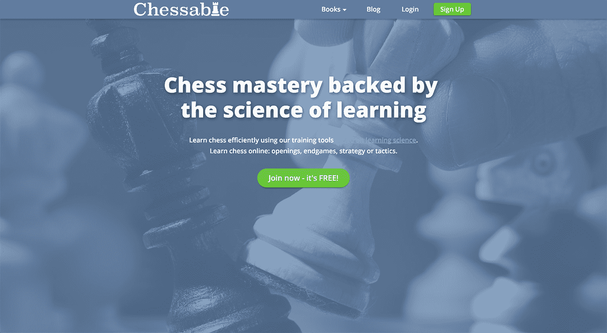
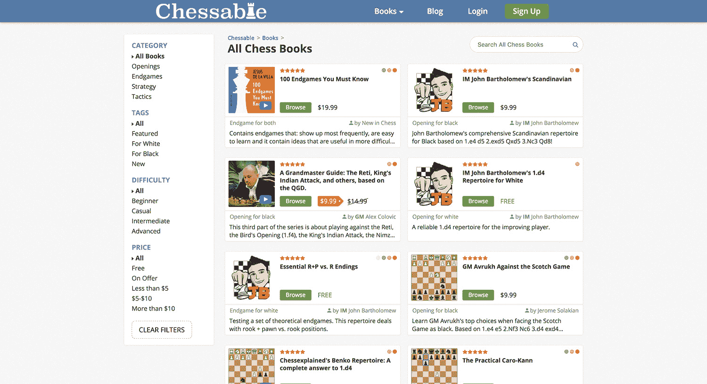
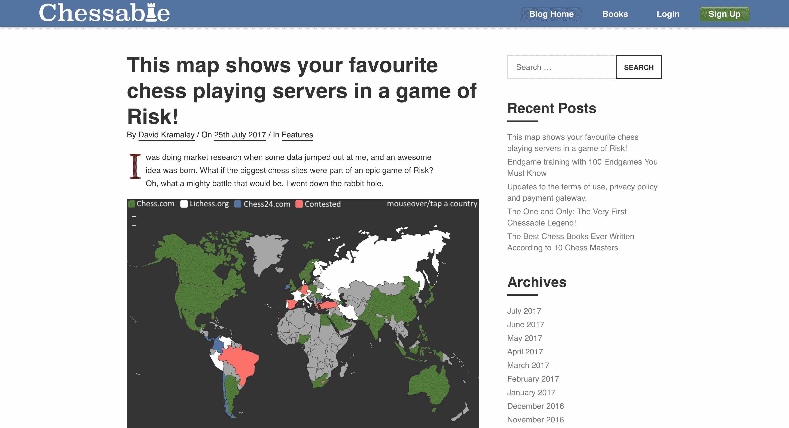

# 用科学的方法进行国际象棋教育，每月赚 6000 美元

> 原文：<https://www.indiehackers.com/interview/making-6k-mo-taking-a-scientific-approach-to-chess-education-3418ada3ff>

## 你好！你的背景是什么，你在做什么？

嗨，我叫大卫。我今年 29 岁，是 [Chessable](https://www.chessable.com/) 的联合创始人之一。

我住在英国，但我去过世界各地。我生命中的大部分时间是在纽约度过的，在那里我完成了计算机科学的本科学业。从那以后，我创办了一家社交游戏公司，之后我花了一些时间研究心理学。这一切都融合在一起很好的棋子！

Chessable 是一个改变玩家学习游戏方式的在线学习平台。传统上，你必须打开一本书，建立一个董事会。这是一项艰苦的工作。你也可以看一些视频，但是虽然这些技巧可以奏效，但是通常很难记住这些材料。

在 Chessable，我们尽可能使用所有基于科学的技术，比如间隔重复，让学习国际象棋变得更容易。目前，我们的平台有很多针对中高级棋手的内容。然而，我们希望很快也能为初学者发布内容。

该平台一直在稳步增长，去年平均每月约 6000 美元。在过去的两个月里，我们已经达到了每月 1 万美元，只有 21，000 名注册用户，我认为我们的未来非常光明。

 

## 是什么促使你开始使用 Chessable？

老实说，这是我解决问题的一个例子。当我之前的创业公司在 2012 年倒闭时，我决定休息一段时间，去旅行、阅读、学习等等。我还迷上了国际象棋，玩得一塌糊涂有点糟糕！我努力提高，买了各种订阅，看了一些书，解了战术，看了很多视频。但最终我停滞不前，无法提高。

这似乎是许多象棋学习者(尤其是成年人)的一个问题。网上的共识似乎是成年人比年轻人更努力学习国际象棋，但我拒绝相信这是真的。

为什么任何东西都要花 10000 个小时才能掌握？随着科技的进步，教育也应该进步。

TweetShare

我在 2013 年迅速黑进了这个平台，并从我购买的各种印刷书籍中手动导入了象棋内容。这让记忆变得容易多了。我的象棋水平有所提高，最终在 2015 年，当我的积蓄即将耗尽，是时候想想如何支付账单时，我认为这个象棋工具毕竟不是一个坏主意。

我喜欢[精益创业方法](http://theleanstartup.com/)，为了确保这个工具不会受到我自私偏见的影响，我联系了象棋教练和后起之秀 YouTuber，IM(国际大师)[约翰·巴塞洛缪](https://www.youtube.com/channel/UC6hOVYvNn79Sl1Fc1vx2mYA)。我看了他的 YouTube 频道，当时他有大约 3000 名订户。今天他有 4 万英镑。我通过电子邮件向他简要介绍了我的想法和背景，就像我在这次采访中所做的一样。他很喜欢，我们建立了 Skype 通话，这样他就可以了解更多。

最后，我们见了面(他刚好有去伦敦的行程),他的支持给了我额外的动力和认可，让我可以继续下去！

## 构建最初的产品需要什么？

一切都以精益创业方法为指导。这正是我们所做的:

**1)建立一个发布前邮件列表，看看是否有人感兴趣。**

不超过一天的工作。5000 人给了我们他们的电子邮件。有一段时间，它被放在了国际象棋子棋盘的顶端。我们知道我们走在正确的道路上。

2)为封闭测试版打造了一个足够好的 MVP。

这需要几个月的兼职工作。我使用了我已经精通的技术，带 JQuery 的灯栈。事后看来，我希望我已经投资了几个星期来更新我的技术堆栈。这个阶段是由我的联合创始人约翰和一些 beta 测试人员的大量反馈引导的。

让事情发生。更新你的技能不应该妨碍你更新你的产品。

TweetShare

**3)为公测做了润色。**

这又花了几周的兼职时间。我们没有做足够的抛光。我们承诺在 2016 年 2 月推出，现在已经快 3 月了，所以推出的压力很大。

比起追求完美和越来越多地拖延事情，我更乐意启动一个半途而废的项目。

看看人们是否愿意为此买单。

这并没有增加太多的额外时间。我们只是放了一些标准的贝宝按钮，从第一天开始就向我们的用户收费。

这是我想直接测试的一个关键概念。如果用户愿意放弃他们的现金，那么你就知道你做对了。这几乎就像所有验证概念中的*验证概念。*

在确认以上所有问题都解决后，倾听反馈并继续努力！

这个阶段又花了几个月。我们只是不停地听取反馈，修正，改进，写下最受欢迎的特性，等等。

寻求投资。

这是另一个重要的步骤。我们花了很长时间才完成——大约三个月的兼职工作，然后是四个月的全职工作。如果投资者愿意支持你的项目，你就达到了另一个验证阶段，可以加速你的成长，并有助于缓解一些来自创业的压力。

总而言之，开发该产品并从封闭测试阶段进入种子阶段的过程耗时一年零两个月。

如果在任何阶段，这些验证概念中的任何一个失败了，计划总是将 [Chessable](https://www.chessable.com/) 作为一个副业，并获得一份“真正的”工作。我最初的兼职承诺并不是因为我在其他地方工作，而是因为我正在完成教育心理学的硕士学位。我喜欢心理学，我也认为这种额外的教育是必要的，因为它将完美地补充我现有的知识，并有助于将学习的每一点科学都融入到棋盘中。

## 你是如何吸引用户并发展 Chessable 的？

找到合适的联合创始人是这里的关键。

我总是采取有机的增长方式，使用 SEO 和类似的技术。但这可能需要很长时间，所以我知道在寻找联合创始人时，我需要一个能帮助营销的人。

当我联系约翰时，他的 YouTube 频道已经翻了一番，从 3000 个订户增加到 6000 个，而且看起来这种情况还会继续下去。他的渠道足够小，我相信他会听我的，但也足够大，让我相信它的增长和约翰作为联合创始人的价值。我有一种很好的感觉，他是引起人们对该产品的关注并为我们争取早期用户的合适人选。

多亏了他的参与和象棋子网站的支持，我们在第一个月就有了第一批 5000 名用户。许多人不高兴，但是留下来的用户帮助我们发展和改进。我强烈建议科技公司的创始人积极主动，主动接触他们认为可能成为完美联合创始人的任何人。这是我为 [Chessable](https://www.chessable.com/) 做出的最好的决定之一，而这一切都始于一封冰冷的电子邮件。

随着我们的成长，越来越多的作者注册了我们的平台，推荐和口碑已经成为我们最大的增长来源。其他知名的 YouTubers 用户，如来自 [Chessexplained](http://www.chessexplained.com/) 的 IM Christof Sielecki 和通用汽车公司的 Alex Colovic 等大师经常提到我们。这些推荐来源对我们非常有价值，我们非常感谢所有帮助我们成长的合作伙伴。

简要回顾一下我们的增长，我们已经从发布周的大幅增长到 2016 年夏季的约 1，300 名周活跃用户，2016 年秋季的 2，000 名，2016 年冬季的 2，500 名，2017 年春季的 2300 名周活跃用户略有下降，最终在 2017 年夏季达到 3000-4000 名周活跃用户。

| 月 | 活跃用户 |
| --- | --- |
| 2016 年夏季 | 1300 |
| 2016 年秋季 | 2000 |
| 2016 年冬季 | 2500 |
| 2017 年春季 | 2300 |
| 2017 年夏天 | 3500 |

你可以看到，有机的口碑和推荐增长不是很快，但缓慢而稳定的进展对我们来说已经足够好了。我向任何有抱负的企业家强烈推荐这个策略:想想你如何能让其他人参与进来。你如何为尽可能多的人提供双赢？谷歌向你示爱可能还需要很长时间！

## 你的商业模式是什么，你是如何增加收入的？

我们的商业模式有两个部分。第一部分是第三方内容发布，我们已经向任何想使用我们的学习系统教学的人开放了我们的平台。我们通过这种渠道获得大约 30%-40%的销售佣金，但这通常只够支付我们的费用(托管、支付处理、支持、问答等)。).

随着客户开始信任我们的新平台，我们逐渐能够提高我们内容的价格，我们也吸引了越来越多值得信任和知名的出版商。例如，我们最初以 2-5 美元的价格出售数字课程，其中一些书籍的价格现在约为 15-20 美元。

我强烈建议基于订阅的企业考虑终身会员选项。

TweetShare

因为我们商业模式的第一部分旨在给出版商尽可能多的份额，我们还推出了专业订阅模式，只向订阅者提供某些功能。

我们和下一家公司一样不喜欢设置付费墙，所以我们免费提供很多服务。而那些买书的人获得了完全的使用权。然而，限制某些功能对用户的可用性一直是防止我们的业务潜在崩溃的生命线。

专业版订阅费用为每月 9.99 美元，或每年 59.99 美元。我们还提供 299.99 美元的终身套餐。

我强烈建议基于订阅的企业考虑终身会员选项。这是让我们起步的资金。它通常占到我们收入的 50%，我们用额外的钱来支付众筹活动和许多其他必需品的账单。

## 你未来的目标是什么？

我们刚刚拿到了一本很受欢迎的国际象棋书——耶稣·德拉维拉的《T2 100 个你必须知道的残局》——[在我们的平台上重新出版了它，作为一个可下棋的课程](https://www.chessable.com/endgame-book/100-endgames-you-must-know/5193/)。这意味着棋手将不再需要手动将他们喜爱的书籍内容复制到像 [Chessable](https://www.chessable.com/) 这样的学习平台上。

 

我们希望在这方面做得更多，因为已经有很多写得非常好和有用的学习材料了。我们想把它全部带走，让它更容易学习！

我们也想发布更多初学者友好的内容。我的一个终极目标是揭穿 10000 小时的神话，让它更接近 1000 小时！为什么任何东西都要花 10000 个小时才能掌握？随着科技的进步，教育也应该进步。

## 你面临的最大挑战和克服的障碍是什么？

对我来说，创业最大的挑战无疑是钱。我希望我创业时有更多的存款。我想当我开始这个项目时，我有大约 15，000 美元，其中至少一半花在了我的硕士学位上。这并不那么有趣，你经常会问自己是否应该从事其他工作。所以确保你存了一些钱，尤其是如果你像我一样有家庭要养的话。

在金融问题上，我们也低估了筹集资金的难度。我想我们最初认为我们会在 2016 年 10 月完成，但实际上我们直到 7 个月后的 2017 年 4 月才在银行里有了钱。

任何开始一个项目的人都应该认真考虑获得资金(或增加足够的收入来自我维持)的难度和时间。我们开展了两次众筹活动，并与许多私人投资者进行了交谈。最终，众筹失败了，但我们的坚持得到了回报，我们从一小群私人天使投资者那里筹集到了资金。

就技术而言，事后看来，我希望自己能多了解一些现代框架。我用了一个旧的堆栈，因为我已经很熟悉它了，用它可以很快完成工作。

然而，从长远来看，使用一个更新的框架——像 [Backbone.js](http://backbonejs.org/) 或 [AngularJS](https://angularjs.org/) 这样的东西——可能有助于招聘、代码维护和更容易地构建新功能。相反，我们完全建立在 JQuery 之上。现在我们正在慢慢适应，我正在考虑对 [Vue.js](https://vuejs.org/) 进行一些重写。

但不后悔。最重要的当然是让事情发生。对完美堆栈和技术的追求可能是一个永无止境的故事——一个不开始的借口。“更新”你的技能永远不应该妨碍你更新产品。

## 有没有发现什么特别有帮助或者有优势的？

我绝对认为精益创业方法非常有优势。不断验证你的想法是非常有用的。真正的验证发生在人们给你他们的电子邮件地址，注册你的服务，最后当他们放弃他们辛苦赚来的钱的时候。如果这种情况没有尽早发生，那么也许你应该用你的时间做些别的事情。永远倾听市场给你的反馈。

除此之外，我强烈主张对我们如何度过时间负责，并在头脑中用道德设计来构建产品，也就是鼓励建设性用户行为的设计。我们不仅要设计符合这一理念的产品。我们也应该删除不符合要求的产品。

我几乎没有在脸书或其他社交媒体上花任何时间，这帮助我更有效率地完成工作。任何新的创业都需要极大的专注和专注。

## 对于刚刚起步的独立黑客，你有什么建议？

验证你的想法，听取反馈，培养高效的习惯，剔除那些让你效率低下的东西。

最重要的是，保持某种工作与生活的平衡。我经常读到一些人多年来每天花 20 个小时做一些事情。不应该是那样的。生活中还有其他重要的事情，如果你不能在健康的时间内完成，那么也许你应该寻求一个不同的想法，一个可以让你探索其他生活领域的想法——关系、家庭、朋友、爱好等等。

有几个疯狂的星期和跑步很好，但只有在例外而不是正常的情况下。

## 我们可以去哪里了解更多？

你可以在我们的网站和博客上找到更多关于 Chessable 的信息:

*   www.chessable.com
*   【www.chessable.com/blog 

 

我也在我的个人网站[davidkramaley.com](http://davidkramaley.com)上写博客(不经常写)，偶尔在[twitter.com/simplydt](https://twitter.com/simplydt)上发微博。

乐意回答任何人的任何意见或问题。谢谢！

—[<picture id="ember7992388" class="user-avatar ember-view user-link__avatar"></picture>simply dt](/simplydt?id=tlA9IPrjEeQmJT2TnYcAkoMTNr62)，可下棋的创造者

## 想像 Chessable 一样建立自己的事业？

你应该加入[独立黑客社区](/)！🤗

我们是几千名创始人，互相帮助建立有利可图的业务和副业。来分享你正在做的事情，并从你的同事那里获得反馈。

还没准备好开始使用你的产品吗？没问题。这个社区是一个认识人、学习和实践的好地方。随意[随便浏览](/)！

——[<picture id="ember7992393" class="user-avatar ember-view user-link__avatar"></picture>考特兰艾伦](/csallen?id=ibTLPyjwVebnZjMGKvz6ztarnuV2)，独立黑客创始人

11votes