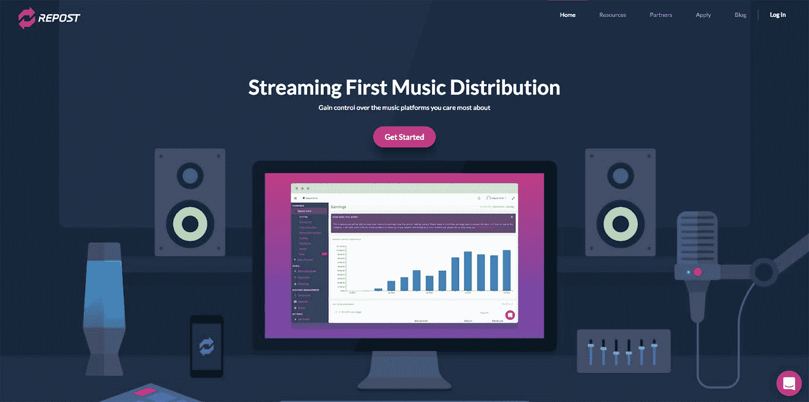
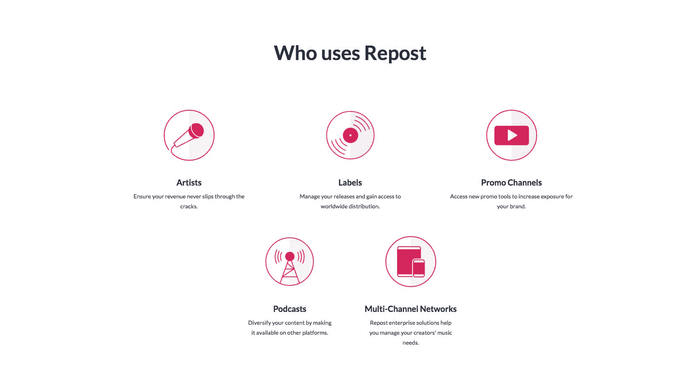
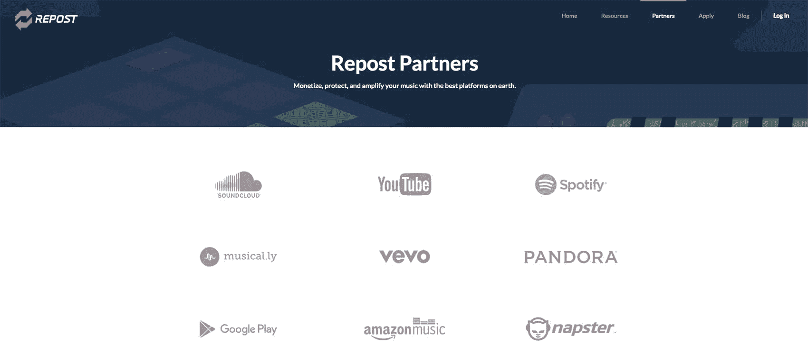

# 通过帮助独立艺术家获得报酬来赚取数百万美元的收入

> 原文：<https://www.indiehackers.com/interview/making-millions-in-revenue-by-helping-indie-artists-get-paid-8d850ac2b5>

## 你好！你的背景是什么，你在做什么？

我叫杰夫·庞奇克。我来自加利福尼亚的威尼斯。在创办转帖网之前，我最初在电视真人秀领域做视频编辑。然后我结束了在[全屏](https://fullscreenmedia.co/)的工作，这是 YouTube 最大的 mcn(多频道网络)之一，在那里我最终开始帮助他们的音乐人才工作。

2017 年，我因在 Repost Network 的工作而入选福布斯 30 岁以下音乐榜单。我们是唯一上榜的科技公司。所有其他人都是艺术家或经理。

简而言之，Repost Network 是一家流媒体优先的音乐分销商。我们帮助艺术家和唱片公司将他们的音乐发布到 Spotify、Apple Music、Tidal 等平台上。推销他们的作品，然后从他们的收入中获利并支付出去。艺术家通常希望与我们签约，获得我们的 SoundCloud 货币化和营销服务。然后我们追加销售，让他们在 YouTube 和其他平台上使用我们。所以我们与许多 SoundCloud 说唱歌手和电子音乐制作人合作。

我们是 SoundCloud 上最大的独立版权持有者，占整个平台收入的 5-10%。据我们所知，唯一拥有较大市场份额的实体是主要的品牌。

目前，我们的总收入为 600-800 万美元，成立两年多一点。在过去的两年里，我们每六个月的收入就翻了一倍多。

 

## 是什么促使你开始使用转帖网？

转帖[的想法来自我在全屏工作的时候。Fullscreen 是 YouTube 的 MCN，但本质上是 YouTube 有影响力的人的管理和广告代理，我和所有顶尖的音乐人才一起工作。当我在那里时，SoundCloud 在整个平台上推出了货币化。所以你可以在一首歌前面放一个广告，然后频道就可以产生收入。当我查看流程时，它已经完全崩溃了…](https://www.repostnetwork.com/)

人们必须清除发布，并将大量元数据传输到 SoundCloud 和第三方服务，这样一首歌才能开始产生收入。我基本上意识到，我认识 YouTube 上最有影响力的人，了解 YouTube 为更好地实现盈利所经历的障碍，并有一点产品背景。我脑子里想，“嘿！奇怪的是，我是最适合解决这个问题的人之一。”

最终，我完成了交易，并遇到了乔伊·梅森，他很快成为我的技术合伙人。我们在西好莱坞一个叫乖戾山羊的酒吧相遇。

在 Repost 1.0 产品中，如果一位艺术家与我们签署了收入分成协议，我们会让他们访问一个仪表板，我们通过 API 将他们的音乐拉进来，他们可以选择他们想赚钱的和不想赚钱的。我们会收集所有必要的权利信息，然后在后端自动完成审核。

其他公司花了几个月的时间在 SoundCloud 上赚钱，我们只用了 2-3 天。当我们破解代码时，它就爆炸了，我们开始每天收到数百名申请人！

然后我们的艺术家开始回来找我们，问我们是否可以把他们带到 Apple Music 或 Spotify。我们最终与每个平台达成交易，现在在 13 个以上的平台上在线展示内容，并使我们的业务收入多元化。虽然 SoundCloud 是我们获得艺术家合作伙伴的地方，但它绝不是我们收入最大的平台。

## 你是如何吸引用户并发展转发网络的？

在最初的六个月里，我每天都通过冰冷的电子邮件联系艺术家，我们最终达到了一个临界点。现在全靠口口相传——我们几乎没有销售团队。

此外，当我们创办公司时，我没有多少钱，但我发现 SoundCloud 制作人最常搜索的词是“我如何在 SoundCloud 上获得更多转发？”SoundCloud 上的转发就像 Twitter 上的转发，所以艺术家们想要尽可能多的转发，这样他们的音乐就会被听到。

在最初的六个月里，我每天都通过冰冷的电子邮件联系艺术家

TweetShare

我想如果我命名公司[转帖](https://www.repostnetwork.com/)并且在搜索引擎优化中占主导地位，我们可以获得一些免费的入站流量。我的假设成功了。我相信，如果你在谷歌上搜索“SoundCloud repost ”,我们是最受欢迎的公司之一，大约 25%的入境申请人来自有机来源。

我们还实现了天鹅绒绳方法(就像夜总会一样)。在转贴时，我们不接受任何人。我们已经拒绝了近 10 万人，只通过申请程序与 5000 名左右的合作伙伴合作。这使得我们的服务产品具有独特性，从而创造了需求。

最后:支持。我们痴迷于支持，我认为这也是我们主要的营销工具之一。在这个话题上我有很多话要说，但是我写了一篇[博客文章](https://medium.com/@jeffponchick/support-isnt-about-solving-problems-d47c8845d51)关于我们所做的。

 

## 你的商业模式是什么，你是如何增加收入的？

我们和我们的艺术家分享收入。如果我们能产生或创造收入，我们将从中分一杯羹。我们的总分成是艺术家 70/30，但这是完全可以商量的。我喜欢这一点，因为我们业务的成功与我们为客户创造的价值直接相关。它迫使我们把钱花在我们该花的地方，并创造真正的收入。

本质上，我们的产品一点也不性感。这是一个基于 PayPal 的内容交付渠道和支付计算器。我们选择 PayPal 是因为几乎每个人都熟悉并使用它，而且在即将到来的纳税季，他们会发布 1099。因此，虽然使用 PayPal 有相关费用，但我们不必让我们的会计师处理并发出成千上万的 1099，这不会扩展。

真正让我们的收入脱离排行榜的是去年夏天对 SoundCloud 破产的担忧。当时，我们 70-80%的客户只在 SoundCloud 上使用我们，而没有在其他平台上使用我们。我们停止了一切，并建立了一个快速备份工具，让艺术家们轻松地将他们的音云备份到硬文件中，这样他们就可以分发或“备份”到其他平台上。这改变了我们的客户对我们的看法(从 SoundCloud network 到分销商),真正实现了业务多元化。

小贴士:一开始把一件事做得很好，然后一旦你掌握了它，它就有回报了，雇佣一些人来管理这方面的业务，同时你探索 3-5 个新的收入来源。对于我们推出的每一个新平台或服务，我们都选择不去追求另外 10 个左右。

保持倾斜，并且能够旋转，旋转，旋转。

TweetShare

## 你面临的最大挑战和克服的障碍是什么？

招聘/人力资源:慢招快炒。我很难解雇员工，因为我喜欢和这些人一起工作，也因为我在乎他们会怎么看我。

财务:当我们开始创造 10 万到 100 万以上的收入时，我们遇到了一些成长的烦恼。从财务和税务规划的角度来看，结束 2017 年是一个巨大的学习曲线。不幸的是，我认为这是一个人被抛入困境后受益的事情。你要么学游泳，要么不学。

导师/顾问:总是有三个导师。

1.  可以帮助你管理日常心理健康的人
2.  一位正在经营一家公司的导师，这家公司的规模或水平符合你在 1-2 年内想要达到的水平，他可以帮助你实现这个目标
3.  “50，000 平方英尺的导师”:你所在行业的思想领袖，你可以从他那里获得高水平的想法

我经常被一些人震惊，他们厌倦了他们的行业，决定在他们不理解的领域发展科技。如果你不愿意在一个市场中使用你的知识基础或竞争优势，你还不如干脆不做。

[精益启动](https://www.amazon.com/Lean-Startup-Entrepreneurs-Continuous-Innovation/dp/0307887898)应该是强制读数。

全靠运气。你如何定位自己成为利用未来市场变化的最佳人选？这就是为什么很少有创业公司最终实现了他们当初设定的目标。保持倾斜，并且能够旋转，旋转，旋转。

 

## 我们可以去哪里了解更多？

*   http://repostnetwork.com
*   [http://twitter.com/jeffponchick](http://twitter.com/jeffponchick)
*   http://twitter.com/repostnetwork

评论:

对转帖网有什么疑问吗？或者认识一位能从我们的服务中受益的艺术家！请在下面的部分发表评论！

——[<picture id="ember5302689" class="user-avatar ember-view user-link__avatar"></picture>杰夫·庞奇克](/RPNJeff?id=mnaIYZKtfgW0mKVIW56SGttw3Z52)，转帖网创始人

## 想像转帖网一样自己创业？

你应该加入[独立黑客社区](/)！🤗

我们是几千名创始人，互相帮助建立有利可图的业务和副业。来分享你正在做的事情，并从你的同事那里获得反馈。

还没准备好开始使用你的产品吗？没问题。这个社区是一个认识人、学习和实践的好地方。随意[随便浏览](/)！

——[<picture id="ember5302694" class="user-avatar ember-view user-link__avatar"></picture>考特兰艾伦](/csallen?id=ibTLPyjwVebnZjMGKvz6ztarnuV2)，独立黑客创始人

40votes