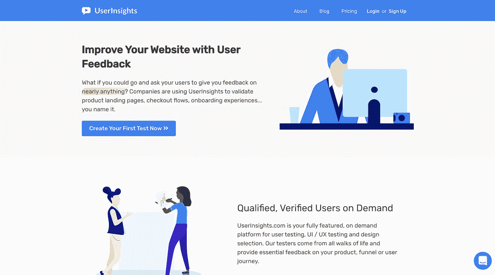
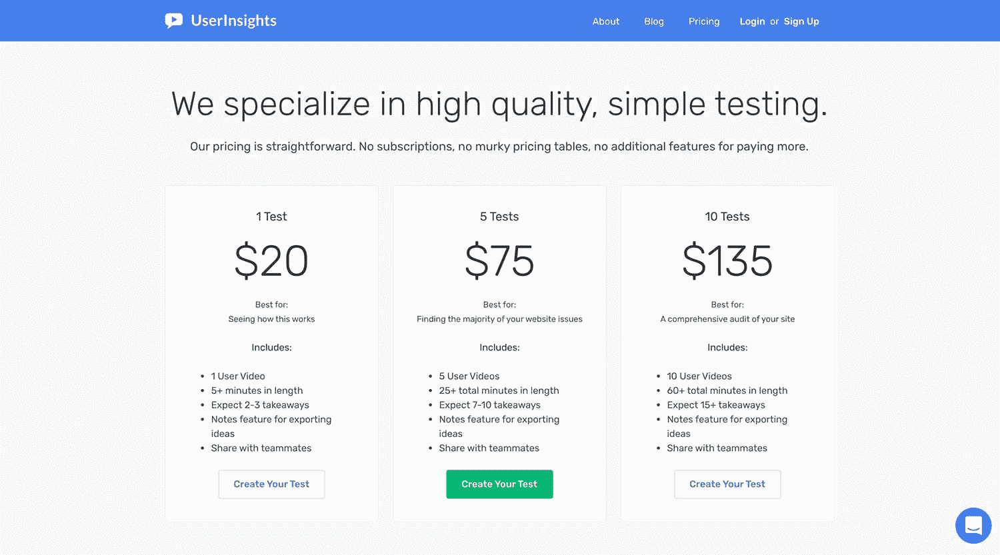
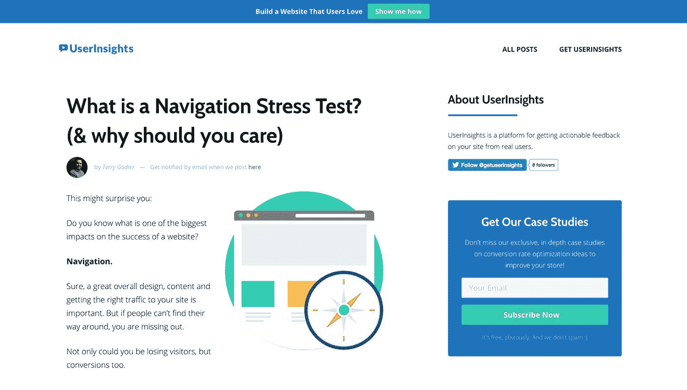

# 通过以更好的方式解决一个常见问题，在发布时实现销售

> 原文：<https://www.indiehackers.com/interview/making-sales-at-launch-by-solving-a-common-problem-in-a-better-way-61c63da922>

## 你好！你的背景是什么，你在做什么？

我叫 Terry Godier，是来自威斯康星州阿普尔顿的开发人员和营销人员。在这一点上，我已经做了大约 15 年的网络营销和建筑工作。我在做什么？用户洞察。

UserInsights 是我开发的一个平台，用来帮助其他独立黑客建立用户喜欢的网站。

现在我们专注于提供用户测试视频。我们的测试人员会到您的站点去完成特定的目标和行动，并给出您所要求的特定反馈。你会得到一个 5 分多钟的视频，里面有可操作的叙述式反馈。

许多人可能都熟悉远程用户测试...当然，有很多真正的大公司既提供服务也购买这些服务。

这个想法听起来不错，但外卖往往不是。谁想要 100 个 30 分钟的用户在网站上闲逛的视频呢？

首先，我没有 3000 分钟看这些东西。其次，如果我想知道一个用户在会话开始 25 分钟后做了什么，我可能已经获得了这个用户，可以直接问他们。

在你的网站上呆了 25 分钟的人没有给你新的视角。他们已经对这种产品有了丰富的经验。

因此，我们建立了 UserInsights，并牢记这一点:以一种简化的方式询问关于您的网站的具体问题，并获得具体的答案来改变什么。然而，我们努力的目标是将可操作的外卖带给每个人。

进展非常非常顺利。我们在 2018 年 5 月中旬推出，每个月已经进行了数百次测试。

 

## 是什么促使你开始使用 UserInsights？

这些年来，我启动了几十个项目，咨询了大量客户，我发现转化率最高的网站是那些最符合用户期望的网站。大部分我们认为的转化率优化，其实只是搭建一个更人性化的网站而已。

有几十种服务向你展示用户在你的网站上做了什么，但很少向你展示用户为什么这么做。这就是我们平台的用武之地。

如果这个问题有足够的价值，你可以打赌有人已经找到了解决这个问题的方法。因此，价值方程式实际上是以比目前更经济的方式解决有价值的问题。

TweetShare

在我发起的几十个项目中，大多数都失败了。我有一个系统，让我构建用户不想要的产品，或者以他们不理解的方式构建产品。也许如果我在这个过程的早期就开始和用户交流，我现在就可以去做别的事情了:)

## 构建最初的产品需要什么？

很多深夜，清晨和周末。我的联合创始人之一(兼产品经理)乔治·凯普尼克和我大概花了大约 200-250 个小时来完成这个东西。

这一次我们所做的与众不同的是，我们对所有屏幕都给予了超级、超级的关注，以及它们到底是如何工作的，用户将如何使用它们，以及它们的价值是什么。

我们基本上从交付品开始，因为我们知道我们希望使用我们系统的品牌获得什么样的信息和反馈，所以我们从那里开始逆向工作。

一切都被质疑，并放在桌面上进行评价。每一个决定都是为了帮助我们的品牌建立更好的网站。如果某个东西没有做到这一点，它就不会被添加。

我们还特意决定不看任何竞争产品。在我看来，如果你总是看事情是怎么做的，你会错过很多机会。

我想你会发现，许多竞争对手只是简单地和其他人做同样的事情，因为这是一贯的做法。相比之下，我们坐下来以他们应该做的方式做事情。

大约一个半月之后，我们有了我们的产品，它仍然是我们今天发布时的产品。

## 你是如何吸引用户并增加用户洞察力的？

我们不小心上了黑客新闻。我们醒来时发现自己上了头版。真是大开眼界。

当然，我们做了产品搜索(也在头版)，我们的内容营销在 reddit 上获得了一些点击。我们也很幸运地将我们的一些内容收集到了时事通讯中。

我们现在的主要努力只是向人们展示产品。我们的内容营销目前是我们的主要渠道，它专注于说明您可能从使用 [UserInsights](https://userinsights.com) 中获得的收获。

我们最近发表了一项关于 Shopify 的大规模研究，并强调了 10 个我们之前在普通的“Shopify 转换率优化”类型的文章中没有看到的重大问题。

我确实想建议对你的发射保持谨慎。这可能会令人印象深刻。我们得到了相当多的流量，当然也有一些销售额，但它很快就枯竭了。我们目前专注于非付费渠道，我们的大部分收入现在都回到了入职、产品管理和扩张上。

至于数字，我试图忽略网站的定量测量，因为那里没有大量可操作的数据。我们的大量流量仍然来自社交渠道和产品搜索，因此很难从这些峰值中得出任何有意义的趋势。

我们仍处于构建阶段，对我来说，花一个小时浏览访问分析远不如花一个小时与客户交谈或编码或写作。不过，我确实会跟踪敬业度，因为我们从一开始就把注意力放在了留住人才上。

## 你的商业模式是什么，你是如何增加收入的？

我们从第一天开始收费。我有客户在使用这项服务，所以我实际上是第一个用户。

我们使用 Stripe 来记录我们的付款。不过，我们确实需要使用很多 PayPal，因为我们的测试人员每月都会从他们的 PayPal 账户中获得他们所做工作的报酬。

我们第一个月(不完整的一个月)的收入大约是 500 美元。第二个月是这个数字的几倍，这主要归功于我们最初的客户的保留和再订购。

我们有大约 80%的再订购率。很多人没有使用过这样的服务，所以他们会先进行一些测试，然后一旦他们看到了价值，就会立即订购更多的产品。

就利润而言，它们无处不在，因为我们对数量进行了折扣。我们必须付钱给我们的测试人员。我们为每次测试支付 5 美元(实际上每小时高达 60 美元)。我们支付的薪水比业内其他任何人都高，但我们有一个非常棒的团队。这是很有价值的工作，我们对此感觉很好。

 

## 你未来的目标是什么？

我们想建立一个平台，帮助你建立用户喜欢的网站。到目前为止，我们只推出了用户反馈视频，这不是一个平台，这是一个产品。因此，我们正在努力交付下一步，下一个工具和下一次迭代，使我们进入平台模式。进展顺利，应该会在几个月内推出。

## 你面临的最大挑战和克服的障碍是什么？如果你必须重新开始，你会做什么不同的事？

我(再次)低估了发展市场的难度。我们本质上是一个市场。

我们有两个不同的角色:测试人员和购买测试的品牌。这是一个先有鸡还是先有蛋的情况，所以我们先去找测试人员。

幸运的是，正如我提到的，我们的报酬很高，所以注册并不困难。问题在于激活，所以我们要求所有测试人员通过一系列步骤来获得验证。很多人无法制作高质量的视频，这稍微抑制了合格测试人员的增长。所以我们通过一些教育来解决这个问题。

另一个痛点是与 PayPal 合作。花了将近一个月的时间才建立起大规模支付。我们必须手工向所有测试人员付款。两次。在新的贝宝界面中，每个用户只需点击十次。这要花很多时间。

## 对于刚刚起步的独立黑客，你有什么建议？

事实上，没有捷径或小技巧可以帮助你建立一个成功的软件企业。你想要的一切都在努力工作的山的另一边。对我们来说，我们选择把时间投入到产品中。我觉得这就是这里的区别。

正如我之前提到的，这不是关于你能有多大声或者你的网站有多漂亮。而是你带来的结果。我记得一句古老的格言是这样说的，“重要的不是你知道什么，而是你认识谁。”我认为这句话已经被修正为更准确的“重要的不是你认识谁，而是谁信任你去解决问题。”

不是你认识谁，而是谁信任你解决问题。

TweetShare

我建议关注一个实际的问题，并尽可能地分解它。现在，创办一家科技公司真的很酷很热，但建立一家真正的企业很无聊，而且屡试不爽。

我看到很多人建议人们专注于解决一个未解决的问题。好吧，我还没有看到一个问题，客户没有解决一些管道胶带的方法。

如果这个问题有足够的价值，你可以打赌有人已经找到了解决这个问题的方法。因此，价值方程式实际上是以比目前更经济的方式解决有价值的问题。

 

## 我们可以去哪里了解更多？

我们的地点在[https://userinsights.com](https://userinsights.com)。

我们的博客(全是案例研究)在 http://blog.userinsights.com 的。

我们公司的推特是 https://twitter.com/getuserinsights 的，我个人的推特是 https://twitter.com/terrygseo 的。

—[<picture id="ember8087972" class="user-avatar ember-view user-link__avatar"></picture>特里戈迪尔](/terrygodier?id=afZBTCd6n6dwBQtvHXSJnMHa8F23)【user insights】创始人

## 想像 UserInsights 一样建立自己的企业？

你应该加入独立黑客社区！🤗

我们是几千名创始人，互相帮助建立有利可图的业务和副业。来分享你正在做的事情，并从你的同事那里获得反馈。

还没准备好开始使用你的产品吗？没问题。这个社区是一个认识人、学习和实践的好地方。随意[随便浏览](/)！

—[<picture id="ember8087977" class="user-avatar ember-view user-link__avatar"></picture>考特兰艾伦](/csallen?id=ibTLPyjwVebnZjMGKvz6ztarnuV2)，独立黑客创始人

24votes