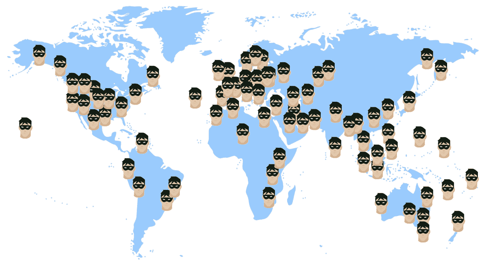
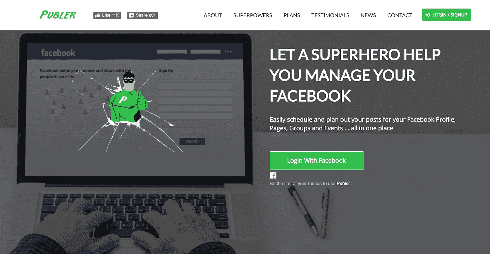
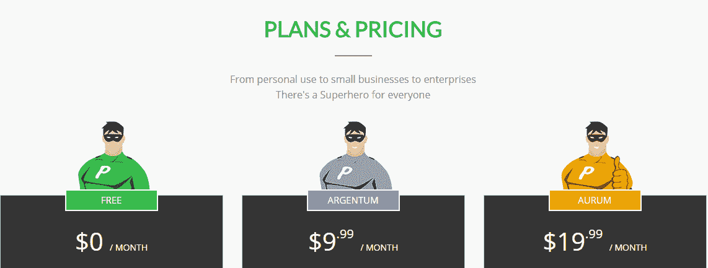
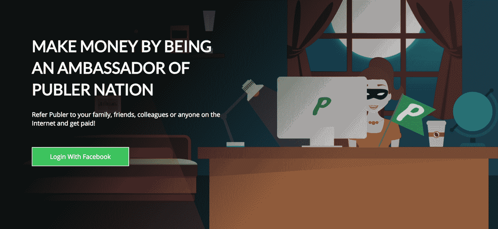

# 通过多种渠道进行营销，每月创造 3000 美元的收入

> 原文：<https://www.indiehackers.com/interview/marketing-across-many-channels-to-generate-3k-mo-in-revenue-f67617afea>

## 你好！你的背景是什么，你在做什么？

我叫欧文·卡莱米，是一名企业家和软件开发人员，目前居住在阿尔巴尼亚地拉那。我于 2012 年在奥斯汀的德克萨斯大学获得了计算机科学学士学位(Hook 'em Horns！).毕业后，我在休斯顿的一家初创公司 Onit，Inc .做了 3 年的软件开发人员，后来我决定辞职，放弃伟大的美国梦，搬回小小的阿尔巴尼亚老家，创建一个名为 [Publer](https://SuperPubler.com) 的虚拟超级英雄。

他不像其他超级英雄那样拯救生命，但他把你从花在脸书上的时间里救了出来，这可能是一回事。Publer 允许用户在一个地方轻松地为他们的脸书个人资料、群组、页面和事件安排和计划他们的帖子。除了基本的日程安排，用户还可以在[批量](https://superpubler.com/blog/bulk-scheduling)安排他们的帖子(使用 CSV 文件、RSS Feed 或内置的多媒体上传器)，甚至让 Publer 为他们做所有的日程安排([自动安排](https://superpubler.com/blog/autoschedule-because-manually-scheduling-your-posts-is-still-time-consuming))。

迄今为止最引人注目的“超能力”是能够在你的照片和视频发布到脸书之前自动添加水印。

Publer 目前正在帮助来自世界各地的 11，000 多名用户(社交媒体经理、页面管理员、独立顾问、企业主)，其中 200 人是付费用户。在过去的这个季度，用户数量增长了 150%,尤其是美国的[是拉丁裔](https://www.facebook.com/BeingLatino/)和[无聊疗法](https://www.facebook.com/BoredomTherapy)以及德国的[亲切诡计](https://www.facebook.com/genialetricks)。

我们一个月能挣 3000 到 3500 美元。

## 是什么促使你开始使用 Publer？

五年前，当我还是一名大四学生的时候，我哥哥刚刚开始自己的旅行社业务，缺乏资源和时间在他的脸书商业页面上发布内容。他基本上需要一个出版商——因此取名为[publisher](https://SuperPubler.com)——我同意建造它。

几周之后，我就有了一个原型并开始运行。它立即开始获得流量和一些付费客户。人们喜欢它，主要是因为我的竞争对手数量有限，而且刚刚起步。市场非常新鲜。

 

Publer 很有潜力，但我没有太多时间投入，因为学校和后来的全职工作。这份工作做了两年，同时在空闲时间维护 Publer，一些健康问题迫使我在两者之间做出选择。也许这是一个错误，但我选择了安全的路线(我的全职工作)，放弃了 Publer。

相信你正在建造的东西！如果你不这样做，人们的消极会比其他任何事情都更让你崩溃。

TweetShare

最终我开始想念我的副业。我不习惯没有自己的东西。几个月后我 25 岁时，我意识到如果我在 20 多岁时不采取行动，我可能永远也不会采取行动。我生日后的第二天，我在工作中考虑是否应该放下一切，搬回家，再给 Publer 一次机会。一想到要离开一份稳定、高薪的工作，一家伟大的公司，最重要的是，我已经建立起来的生活，我就害怕。我真的向宇宙寻求一个信号。(是的，我很迷信。)

在查看我的电子邮件时，我看到了伊莱·d·默瑟先生的生日祝福，他是我大学时一起上过创业课的教授。这个愿望没什么特别的，但它让我想起了 21 岁的自己，充满梦想和兴奋，刚刚写完我的第一份商业计划。这是我一直在寻找的迹象！

## 构建最初的产品需要什么？

第一个原型花了我一两个月的时间，主要是因为我只能在周末和下班后做。

Publer 是在后端用 PHP 构建的，前端是 jQuery、JavaScript、HTML 和 CSS 的组合，但我们最近开始使用更新(也更酷)的技术重写它:Ruby on Rails(后端)和 ReactJS(前端)。这会让我们付出一些代价，但从长远来看，这是为了更大的利益。这也将使我们更容易构建 iOS 和 Android 应用程序，并向公众开放我们的 API。

我不需要任何资金或其他资源(除了时间)来开始。幸运的是，我在 web 开发(包括图形设计)方面有足够多的经验，我们生活在一个你可以简单地通过互联网学习任何东西的时代。我的全职工作帮助我支付了生活费用，并存了一些钱——我用这些钱在阿尔巴尼亚建立了一个办公室和一个团队。

我只专注于支持脸书，因为那时它是最大的社交网络，因此也是最大的市场。现在依然如此。

为了了解 Publer 会提供什么，我不仅从我哥哥和早期用户那里寻求反馈，也从我的竞争对手的反馈页面中寻求反馈，我开始记录他们的用户在要求什么。如果你的竞争对手不提供，而用户想要，为什么不自己构建并提供呢？

## 你是如何吸引用户并发展 Publer 的？

我们通过在脸书上的直接联系、赞助广告(在脸书和谷歌上)以及通过电子邮件的促销活动来吸引用户。此外， [Publer](https://SuperPubler.com) 被列在每一个专门为创业公司服务的网站上，包括( [StartupRanking](http://www.startupranking.com/publer) 、 [CrunchBase](https://www.crunchbase.com/organization/publer-2) 、 [Owler](https://www.owler.com/iaApp/12101256/publer-company-profile) 、 [AngelList](https://angel.co/publer-1) )，以及我们所知道的其他所有社交网络。

除了 Publer 网站的外部链接， [SeoSiteCheckup](https://seositecheckup.com/seo-audit/superpubler.com) 还帮助我保持了良好的 SEO 评分，这对于从 Google、Yahoo、Bing 等搜索结果上带来用户非常重要。

我还支付了 50 美元的服务费，让 Publer 向 50 多个网站发布 statups，但投资回报微不足道。发布在 [ProductHunt](https://www.producthunt.com/posts/publer) 上也没有引起轰动。

吸引新用户的最有效资源之一是 Quora。我会在 Quora 上搜索我的潜在用户会问的问题。然后我会在最后提到 Publer 的时候回答他们。

下面是自去年以来我们用户增长的快速回顾。

| 月 | 用户总数 |
| --- | --- |
| 2016 年 4 月 | 1000 |
| 2016 年 9 月 | 2500 |
| 2016 年 12 月 | 4000 |
| 2017 年 3 月 | 9000 |
| 2017 年 5 月 | 11500 |

## 你的商业模式是什么，你是如何增加收入的？

Publer 有三个版本。永远免费的计划，Publer Argentum(每月 9.99 美元起)和 Publer Aurum(每月 19.99 美元起)。这两种付费计划都可以定制，只需每月支付少量额外费用。免费计划为您提供了一些有限制的基本功能，但它也允许您免费尝试付费功能多达 5-10 次。这样，感兴趣的用户可以提前看到他们将要支付的费用。

基于订阅的模式，我认为是最有效的商业模式，是使用 PayPal 的 API 自动实现的。用户可以决定购买任何付费计划，一旦付款通过，这些计划将立即升级，无需人工干预。我喜欢贝宝，但我们正在考虑其他选择，因为不是每个人都想用他们创建一个帐户。 [Paddle](https://www.paddle.com/) 是一个可以考虑的替代品，因为它们同时支持信用卡和 PayPal 支付。

就像任何其他行业一样，也有起伏，但为了有更多的起伏，我们不断创新，增加新功能，同时保持价格不变。我们每个月大约赚 3000-3500 美元，而且收入每个月都在稳步增长。

| 月 | 维护、修理和更换 |
| --- | --- |
| 2016 年 11 月 | 2500 |
| 2016 年 12 月 | 2700 |
| 2017 年 1 月 | 2500 |
| 2017 年 2 月 | 3000 |
| 2017 年 3 月 | 3200 |
| 2017 年 4 月 | 2800 |
| 2017 年 5 月 | 3600 |

## 你未来的目标是什么，你打算如何实现它们？

在功能方面，主要目标是支持所有主要的社交网络，并在年底前拥有一个 Android / iOS 应用程序。为了实现这一目标，我们已经开始扩大团队。目前只有我和另外两个开发人员，但我们仍在招聘，并希望在接下来的几个月里达到 7 人。

就业务而言，主要目标是在年底前达到 100，000 名总用户和 1，000 名付费客户。我们刚刚推出了一个[大使/附属项目](https://superpubler.com/ambassador)，我坚信它将会提高使用率。在不到 24 小时内，已经有 65 人注册成为大使，相当于 46 个新用户，其中两个现在是付费用户。当用户有这样做的动机时，他们往往会更多地谈论你。

 

我个人的目标是让阿尔巴尼亚出名。为什么不和[的出版商](https://SuperPubler.com)在一起呢？我在这里看到很多软件开发公司，但是他们中的大多数实际上都没有开发自己的产品。他们外包出去——为阿尔巴尼亚以外的客户开发产品——让阿尔巴尼亚没有什么可骄傲的，也让后代没有什么可仰望的。

## 你最大的挑战是什么？你最大的优势是什么？

我最大的障碍是人们的消极态度。当你生活在一个贫穷的国家时，人们不会理解这种企业家精神，尤其是当它涉及到科技行业的时候。日常问题是，“你为什么离开美国？你傻吗？你找到工作了吗？”

一开始，我一直把父亲的办公室作为工作场所。我父亲的一个朋友曾经问我:“我看到你一直在电脑上工作，但你实际上做什么呢？”我用几句话向他解释了[出版社](https://SuperPubler.com)是做什么的。他问我有多少付费客户。当时我只有 5 英镑。“就这样？”他问。“那是什么——一个月 50 美元？我还以为你在赚大钱呢！”

相信我，这是我最不想听到的话，但我还是不停地说，没日没夜。

不要试图让每个人都支持你的产品或想法，而是专注于获得你的第一个真正的客户。

TweetShare

几个月后，我被邀请在一群计算机系学生面前谈论 Publer 和我的故事。非正式的陈述。在演示过程中，我告诉他们付费计划和我有多少客户(那时是 26 个)。演示结束时有一个问答环节，一名学生问我挣了多少钱。我还没来得及回答，一个组织者基本上接手了(不是以一种刻薄的方式)并以不为所动的声音说，“他已经说了:20 个客户。假设他们每月平均支付 10 美元，你可以算一下。”又一次，很痛。但我继续前进，日夜不停。

目前最大的挑战是找到和招聘合适的人。阿尔巴尼亚对开发商的供应很少，好的已经被抢走了。

我最大的优势就是一开始运营成本低。以我的背景和技能，我需要的只是时间和一台电脑。最重要的是，阿尔巴尼亚的低生活成本，尤其是当你搬回和父母一起住的时候，帮助我在 Publer 不盈利的几个月里“生存”下来，并在 Publer 盈利后帮助我存钱。

我们生活在这样一个时代，你可以通过互联网了解任何事情。

TweetShare

## 对于刚刚起步的独立黑客，你有什么建议？

相信你正在建造的东西！如果你不这样做，人们的消极会比其他任何事情都更让你崩溃。罗马不是一天建成的，然而人们希望在第一次日出时看到你的“罗马”。

不要试图让每个人都支持你的产品或想法，而是专注于获得你的第一个真正的客户。这个人是交易的破坏者。如果你能得到一个，你可以得到一千个。但是一旦你做了，不要害怕冒险。你不会总是有第二次机会得到第一个顾客！

## 我们可以去哪里了解更多？

你可以让 Publer 试试 SuperPubler.com 的。你可以在[脸书](https://www.facebook.com/PublerNation/)、[推特](https://twitter.com/PublerNation)、 [LinkedIn](https://www.linkedin.com/company/publer-app) 、 [Instagram](https://www.instagram.com/PublerNation) 上关注他。或者在他的[博客](https://superpubler.com/blog/)上了解最新动态。

如果有人有问题，或者想要优惠券，请在下面的评论中提问。我也希望听到你的反馈，即使是不好的反馈！；)

——[<picture id="ember5252025" class="user-avatar ember-view user-link__avatar"></picture>欧文·卡莱米](/kalemi19?id=eFukNXb1rUhopKArahKlYtljPLh1)《Publer》的创作者

## 想像 Publer 一样建立自己的事业？

你应该加入[独立黑客社区](/)！🤗

我们是几千名创始人，互相帮助建立有利可图的业务和副业。来分享你正在做的事情，并从你的同事那里获得反馈。

还没准备好开始使用你的产品吗？没问题。这个社区是一个认识人、学习和实践的好地方。随意[随便浏览](/)！

——[<picture id="ember5252030" class="user-avatar ember-view user-link__avatar"></picture>考特兰艾伦](/csallen?id=ibTLPyjwVebnZjMGKvz6ztarnuV2)，独立黑客创始人

11votes