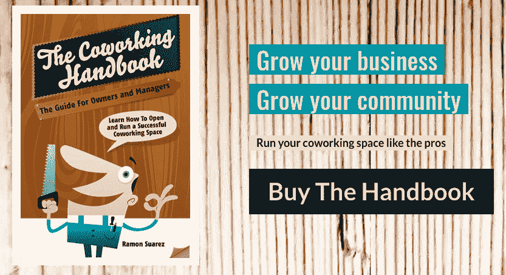
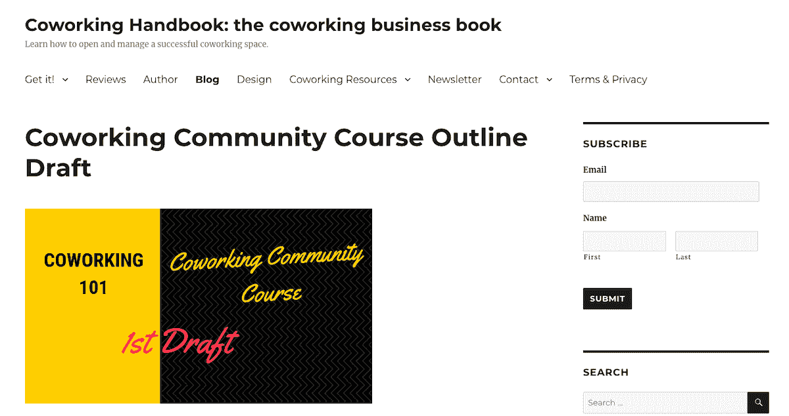
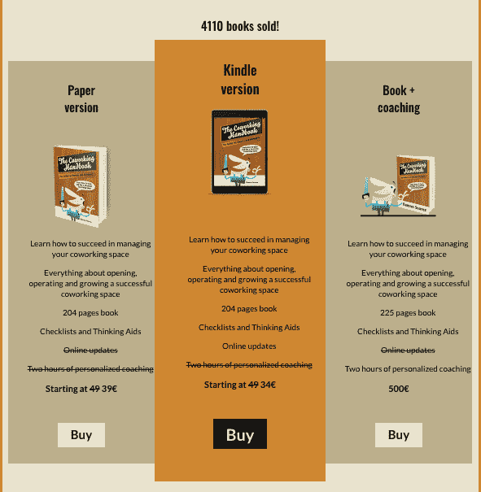

# 超越自我怀疑，写一本票房超过 5 万美元的手册

> 原文：<https://www.indiehackers.com/interview/moving-beyond-self-doubt-to-write-a-handbook-grossing-over-50k-eae5f6ebab>

## 你好！你的背景是什么，你在做什么？

我是 Ramon Suarez，企业家和《共同工作手册》的作者，目前正在寻找我的下一个生意(副业和主项目)。现在，我正在为一个[合作社区课程](https://www.coworkinghandbook.com/coworking-community-course-draft/)工作，这是我的[创业挑战](https://ramonsuarez.com/2018/10/16/launching-at-least-one-project-every-month-my-entrepreneurship-learning-challenge/)的一部分，在那里我每个月至少发起一个挑战项目。目前，我正在进行我的第四个项目。

我有一个非常折中的背景，有一个营销和沟通的骨干。作为一名记者，我曾参与电视音乐节目和时尚杂志的制作，并作为北约议会主席的助理参与公共事务。我的上一家公司是布鲁塞尔联合工作公司，这是一个联合工作空间，旨在帮助和激励布鲁塞尔的创业者。一年半前，我把[共同工作空间](https://www.coworkinghandbook.com/ive-sold-betacowork-great-coworking-future/)卖给了三位同事，他们也是企业家，以便专注于开展新业务和我的家庭(我 45 岁开始生孩子)。

[通过网站添加的联合工作手册](https://www.coworkinghandbook.com/)和[资源](https://www.coworkinghandbook.com/resources/)旨在帮助联合工作空间的经营者和所有者开始和经营他们的业务。我想帮助他们更快成功，压力更小。这是一本侧重于做什么和如何做的实用书。

自从我在 2014 年 4 月推出这本书以来，它的总收入已经超过了 5 万美元。它在一个月内的最好成绩是 1200 美元，现在平均每月超过 400 美元。我确实让€花了 2 万英镑把它翻译成法语和荷兰语，但都花在了翻译上(由我的合作空间的成员完成)。

 

## 是什么促使你开始阅读《共同工作手册》？

作为与创建我的共同工作空间相关的学习旅程的一部分，我最终参加了许多会议，并帮助人们完成他们的共同工作项目。我了解到，没有单一的资源或手册可以帮助他们启动业务或提示有关努力的深思熟虑的问题，所以我想写一本。

前往美国参加一个合作会议，我利用长途飞行的机会写了一份合作手册的提纲草稿。在[联合工作会议](https://www.gcuc.co)开始前的几天，当我正在享受 SXSW(西南偏南会议&节日)时，我与几个人分享了草稿。在会议的前一天，我决定用一个单页网站来测试一下(这项服务已经不存在了)。在考虑购买哪个域名和给产品起什么名字时，我有几个想法:

1.  明确表示这是一本手册
2.  包括“书”这个词

合作手册被拿走了，所以我去找合作手册。第二天，我卖出了第一本书，卖给了一位程序员，他是我家乡的合作空间的客户。我在会议期间卖了 10 本，这足够我继续努力。我认为这本书不会有太多的销量，但我知道它是必要的，并且可以帮助合作的太空运营商的一个新生的微型利基。我想帮忙，但想到外面并没有什么东西，我真的很困扰，所以我就去做了。这是我一生中不断重复的模式；这种帮助、建议和支持他人的冲动是我性格的一部分，它驱使我进行许多有趣的冒险(也造成了一些痛苦)。

我的专业知识来自于以前必须学习管理一个共同工作的空间，加上我所知道的营销和商业知识。在我开发共同工作空间的三年时间里，我学到了很多东西，这足以让我写一本手册。另外，这是我的第三本手册，所以我知道如何进行这个过程。我之前写了一本关于 [MacOS X Jaguar](https://www.iberlibro.com/servlet/BookDetailsPL?bi=22692483324&searchurl=sortby=20&an=mcgraw-hill%2binteramericana&cm_sp=snippet-_-srp1-_-title14) 的手册和另一本关于[欧洲宪法](https://amzn.to/2KI5YCA)的手册。你可以看到模式:帮助他人获得知识，使他们能够做出明智的决定，变得自给自足，建设和采取行动。这也是驱使我做大量志愿者工作，并最终成为布鲁塞尔科技创业生态系统的支柱之一的原因。

## 构建最初的产品需要什么？

从实际的角度思考，更容易提出草案。写作的过程本身让我们很容易看到需要的改变。当时，我联系了另一位合作的空间所有者，Jaime Aranda，我认为他正在做着伟大的事情。他最终成为了这本书的合作者，我们在他的共同工作空间花了一周时间把章节拿出来，并与[众筹活动](https://www.indiegogo.com/projects/coworking-handbook-the-practical-guide-for-coworking-space-managers#/)的支持者分享。不管怎样，这本书就要出版了，但我们决定发起众筹来预售一些书，并支付编辑校对的费用。我们本来会很高兴得到 1000 美元，但最终得到了 3111 美元，在这个过程中，我们发现我们有相当数量的社区支持。

我面临的最大障碍是自我怀疑。

TweetShare

我没有记录写这本书、网站和活动所花的所有时间，但我可以说整整三周。我写得很快，总的来说，当我处于最佳状态时，我的工作效率很高。我在一份全职工作的同时，在类似的时间框架内写了我的 MacOS book，编辑告诉我，我打破了所有以前的记录。该流程的协作部分花费了大量的精力和时间。

从技术角度来说，写书没有什么神奇的，你只需要一个平台，在这个平台上进行实际的写作。如果你像我一样合作工作，你也需要一个写作平台，使你能够轻松地分享工作。我们使用 Open Office 和 MS Word，通过 Google Drive 分享一切。痛苦在于使用不同程序和同一程序的不同版本的风格变化。我专门在 Linux (Ubuntu)上工作，和我一起工作的人混合使用 Windows 和 MacOS 电脑。最好的工作方式是在线(我最喜欢的是谷歌文档),不要把文档同步到你的电脑或者在本地工作(和 Dropbox 和 InSync 同步有太多问题)。

## 你是如何吸引用户和发展合作手册的？

那时候，我已经在美国和欧洲的联合会议上为自己树立了一个名字，我在社交媒体(主要是在[推特](https://twitter.com/ramonsuarez))上有相当多的追随者，他们比今天更加活跃。我大量使用社交媒体，在[共同工作手册博客](https://www.coworkinghandbook.com/blog/)上写作，开始[邮件列表](https://www.coworkinghandbook.com/newsletter/)，在[谷歌共同工作小组](https://groups.google.com/forum/#!forum/coworking)上分享，在会议上发言，并向人们寻求帮助。

开展众筹活动对我的工作很有帮助，因为它迫使我每天推广它，并想出新的和创造性的方法来宣传这个词。

令人惊讶的是，帮助销售更多书籍的是提高价格。最佳价位是 39.95 美元。我想当它的价格比较便宜时，人们并没有把它当回事。事实上，我经营的打折销售都没有增加销售额。有一天，当我把 [Kindle 电子书](https://amzn.to/2PbMVkD)免费发送给支持者时，我确实不小心送出了 2500 本书(这通常是做不到的)。这个错误帮助我爬上了排名，最终帮助我卖出了更多，但我不能真正量化这一点。

把书送到支持者手中是一件痛苦的事，尤其是 Kindle 书籍。我不得不为每一个人手动发送优惠券，许多人甚至没有使用它。对于买家来说，与不同的亚马逊国家商店合作是一件痛苦的事情，所以我写了一篇文章来解释如果你的 Kindle 没有在同一个国家注册,[如何申请电子书](https://www.coworkinghandbook.com/how-to-claim-your-kindle-ebook-if-your-reader-is-linked-to-a-different-amazon-store-country/)。这篇文章是博客中阅读量最大的文章之一，至今仍在带来流量。

在会议和网络上开诚布公、乐于助人有助于建立有助于提升的关系。

TweetShare

我让邮件列表中的人和我的追随者写评论，我也给可以写评论的有影响力的人发了几本书。后者并没有真正发挥作用，但它给了我一些很好的推文，我可以用它们来推销这本书。我想，尽你所能数数你的胜利吧。

我做的另一件事是建立[协同工作资源库](https://www.coworkinghandbook.com/resources/)。有一些好的信息，但它们是分散的，而且很难找到。举个例子，给网站带来最多流量的页面之一是[共同工作统计](https://www.coworkinghandbook.com/stats/)的存储库。

选择使用亚马逊作为这本书的发现和销售平台非常有帮助，我还从我用来购买大量书籍的网站中包含的推荐链接中获得了回扣。我试着在苹果和安卓市场、Barnes & Noble 和其他平台上销售这本书，但他们从来没有真正赚到钱，而且他们降低了亚马逊的排名，所以我停止了这样做。太多额外的复杂，没有真正的好处。

我现在正在实施的是入职电子邮件活动。我还在添加铅磁铁。我扫描了我的邮箱，给超过 11，000 人发了邮件，看看他们是否想收到我的消息，这让更多的人进入了邮件列表。

现在我正在考虑把这本书做成 PDF 格式，并想办法推广它，但我必须承认我有点不知所措。我可能会做一个简短的挑战项目，试图激发一些灵感。欢迎并赞赏各种想法。

我能给的最好的建议就是去做事。做一些事情会让你的大脑变得更敏锐，你会学到将来会用到的技能，最终会创造出重要的东西，并带来收入或其他回报。

 

## 你的商业模式是什么，你是如何增加收入的？

我在网上卖书，从亚马逊那里获得版税，还通过我网站上的代销商链接获得购书券。我也在会议上卖过一些书，但这更多的是营销和品牌机会，而不是销售机会。

我最大的一笔交易是做翻译的两万美元。在参加了脉动基金会的一次活动后，他们说他们想在比利时推广共同工作，我提议翻译成比利时的两种主要语言。该基金会的主席 Paul Bosmans 是 Betacowork 的成员，通过他的经历，他理解了我的手册对企业家和专业人士的影响。

这本书的收入是一个不错的惊喜，但我不指望它，因为它随时可能消失。我很高兴得到它，这是我应得的，因为我付出了所有的努力，其他人也获得了所有的价值。毕竟，我在帮助人们谋生，并为他们的同事创造更多价值。

所有的支付和运输都由亚马逊管理，这很好。把书放在身边会占据很大的空间，打包和邮寄也是一项巨大的工作。我更喜欢让亚马逊来做这项工作，这样我就可以专注于其他事情。

提高价格增加了销售额，但只是在一定程度上。当我超过 40 美元时，销售额就下降了。亚马逊支付的费用通常在 35%到 60%之间。如果你的售价低于 10 美元，它们可以达到 Kindle 电子书标价的 75%，但我的经验是，你卖出的纸质书比电子书多得多，你收取的费用更高，版税也更高。因此，我提高了 Kindle 版本的价格，以激励购买者购买支付约 60%版税的纸质书。将电子书价格降至 9.99 美元并没有对 Kindle 的销售产生积极影响。

通过亚马逊追踪你的收入是一件痛苦的事情。创建空间和 KDP (Kindle Direct Publishing)有不同的报告系统。例如，在 KDP，他们会给你展示过去 30 天的销售情况，但他们不会在任何地方展示售出的总份数。因此，跟踪销售一直是一个问题，但由于我目前没有积极做广告，所以我不想在这方面花太多时间。我用 [BookTrakr](https://www.booktrakr.com) 对网上销售有一个大概的了解，现在已经足够了。对我来说重要的是趋势和未来。

 

## 你未来的目标是什么？

我目前正在制作基于《合作手册》的在线课程，这些课程超越了那里所写的内容。主要关注点是社区和销售。

我已经有了社区课程和销售课程中的 T2 营销部分的草稿。我决定先开设社区在线课程，因为这是最短的课程。第一次做一件事很难，我不想让我的生活变得比需要的更难。

为了增加我的[邮件列表](https://www.coworkinghandbook.com/newsletter/)，我从布局编辑器中获取了主文档，这样我就可以包含和测试不同的潜在客户。

我想做的另一件事是用移动主题改造[网站](https://www.coworkinghandbook.com/)，并致力于销售线索磁铁和电子邮件自动化。我也想完成翻译成西班牙语，我正在考虑推出一个有限的从业者社区。

## 你面临的最大挑战和克服的障碍是什么？如果你必须重新开始，你会做什么不同的事？

我面临的最大障碍是自我怀疑，这导致了拖延和不必要的痛苦。

我犯的最大的错误是没有在这本书的免费预览中包括一个铅磁铁。我会得到更多的邮件和更好的销售。书中有一些订阅链接，但下一次我将在注册表单后面包含更多可下载的资源，并在文本中多次链接。

即使外面有伟大的人在做有趣的事情，我还是更喜欢在未来独自写作。它节省了大量的时间，最终产品也更好，因为你不必为了不伤害别人的感情而留下你不喜欢的文本，或者额外努力协调所有的文本。我已经协调了另一本书的版本，在匹配语言、风格和内容方面有太多额外的工作要做。

你的主要工具是你的大脑，你必须通过练习保持它的敏锐。

TweetShare

我怀疑我会再次外包设计。花哨的布局得到的评价比我自己做的基本布局还要差。大号字体和易于阅读的文字比外观更重要，可以节省你的金钱和工作。

未来最不该做的事就是翻译书籍。翻译真的很贵，而且很难收回你的投资。更好的办法是把一部分钱花在宣传一本单一语言的书上。用四种语言宣传一本书实在太难了。

## 有没有发现什么特别有帮助或者有优势的？

在会议上和网上开诚布公、乐于助人有助于建立关系，从而推动这本书的推广。例如， [Tony Bacigalupo](http://tonybacigalupo.com/) 撰写了这本书的介绍，并帮助我在纽约筹备了这本书的发布会。

这本书真的对我的自助出版之路很有帮助，我的经历是 100%积极的。在亚马逊上发布是一个伟大的决定。它提供了市场，处理了大量的工作。

重要的是，这本书在 co work 的成长过程中足够早地问世，以抓住日益增长的运营商市场。

## 对于刚刚起步的独立黑客，你有什么建议？

我最重要的建议是做项目，把事情做好。你的主要工具是你的大脑，你必须通过练习保持它的敏锐。孤立的理论思考不利于实际结果。走过场和只是做将使你在思维、技能、反应和业务方面进步。

话虽如此，阅读和听播客可以非常激励和鼓舞人心。它们是你口袋里的好工具，但是它们不应该代替练习。

我使用和推荐的最有帮助的书是 Ash Maurya 的《T2 精益跑步》。它充满了实用的建议和指导，让你更容易、更快地建立和实施想法。我在这里保存了一份[对企业和同事有帮助的书籍清单](https://www.coworkinghandbook.com/readings/)。

## 我们可以去哪里了解更多？

在评论中提问，[阅读书籍](https://amzn.to/2U9vzIU)，通过社交媒体联系，使用我的网站的联系页面，订阅[邮件列表](https://ramonsuarez.com/do-you-want-to-hear-from-me/)。

*   [在亚马逊上获得合作手册](https://amzn.to/2U9vzIU)
*   [协同工作手册网站](https://www.coworkinghandbook.com/newsletter/)和[博客](https://www.coworkinghandbook.com/blog/)。
*   我的网站[ramonsuarez.com](https://ramonsuarez.com/)，我在这里谈论更多关于企业家精神的话题，我也在这里发布我的[挑战项目](https://ramonsuarez.com/2018/10/16/launching-at-least-one-project-every-month-my-entrepreneurship-learning-challenge/)的成果。
*   [邮件列表](https://ramonsuarez.com/do-you-want-to-hear-from-me/)(选择你关心的主题)
*   [合作资源](https://www.coworkinghandbook.com/resources/)，比如[合作状态](https://www.coworkinghandbook.com/stats/)以及如何制定你的[合作空间商业计划书](https://www.coworkinghandbook.com/finance/)。
*   [商业和合作书籍](https://www.coworkinghandbook.com/readings/)
*   推特: [@cohandbook](https://twitter.com/cohandbook) 和[@ Ramon surez](https://twitter.com/ramonsuarez)
*   脸书:[@合作手册](https://www.facebook.com/CoworkingHandbook/)和[@ ramonsurezdotcom](https://www.facebook.com/ramonsuarezdotcom/)
*   [Pinterest](https://www.pinterest.com/ramonsuarez/) 和 [Instagram](https://www.instagram.com/ramonsuarez/)
*   [Linkedin](https://www.linkedin.com/in/ramonsuarez/)

——[<picture id="ember5223622" class="user-avatar ember-view user-link__avatar"></picture>拉蒙·苏亚雷斯](/ramonsuarez?id=JWjDkXRLx3XDLHxTps7ojEGha7j1)《共同工作手册》的创始人

## 想像《合作手册》一样建立自己的事业吗？

你应该加入[独立黑客社区](/)！🤗

我们是几千名创始人，互相帮助建立有利可图的业务和副业。来分享你正在做的事情，并从你的同事那里获得反馈。

还没准备好开始使用你的产品吗？没问题。这个社区是一个认识人、学习和实践的好地方。随意[随便浏览](/)！

——[<picture id="ember5223627" class="user-avatar ember-view user-link__avatar"></picture>考特兰艾伦](/csallen?id=ibTLPyjwVebnZjMGKvz6ztarnuV2)，独立黑客创始人

24votes