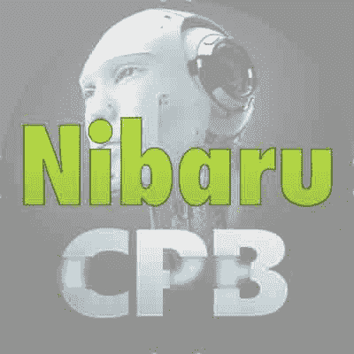
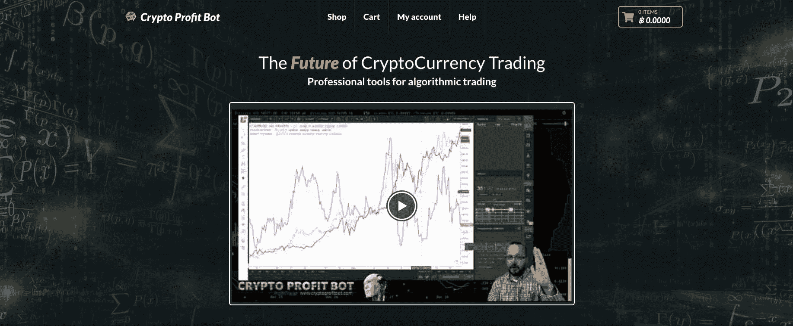
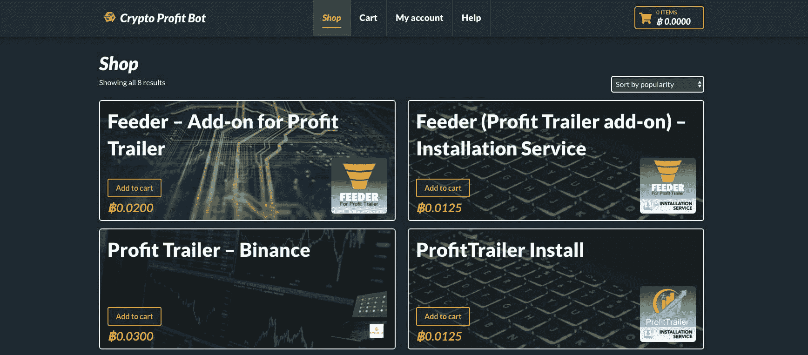

# 快速进入加密市场并看到爆炸式增长

> 原文：<https://www.indiehackers.com/interview/moving-quickly-into-the-crypto-market-and-seeing-explosive-growth-8b6064d829>

## [ 钱宁](https://twitter.com/channingallen)感谢做联合采访！介意分享一下你的背景和你在 CryptoProfitBot 的工作吗？

[ Nibaru, co-founder of CryptoProfitBot](https://www.indiehackers.com/user/Nibaru) 

我是我们船员中年龄最大的。我从小学就开始写代码，经历过太多创业公司，数都数不过来，其中一些是我自己的。大多数都失败了，但是有几个退出了，我的一个退出的时候，我真的赚了一些钱。2016 年末开始认真关注 crypto。我精通多种语言，但在 web 或移动环境中主要使用 Ruby、Swift、Bash 和 Javascript。我主要关注技术方面。

[ Collibhoy (Colin), co-founder of CryptoProfitBot](https://www.indiehackers.com/user/Collibhoy) 

我是金融服务软件开发出身。我曾在现实生活中的算法交易组织中为加密货币开发和销售各种产品。我从 2013 年初开始涉足 crypto，但直到去年我才真正开始看到它的成功和未来。我主要是一名 Python、Swift 和 Kotlin 开发人员。我主要关注销售和营销。

[ Jrod (Jared), co-founder of CryptoProfitBot](https://www.indiehackers.com/user/jroddingham) 

我有 IT 背景，但更多的是在系统和网络方面，而不是任何类型的软件开发。自从 2010 年学习比特币以来，我就一直对加密感兴趣，但真正进入 altcoins 和交易是在 2014 年。我主要关注金融、市场和支持。

我们一起扩大了 CryptoProfitBot.com 的业务，这是一个销售加密交易机器人、工具和服务的平台。我们是一个名为 ProfitTrailer 的交易机器人的经销商，它本质上是一个在最大的加密货币交易所工作的算法交易机器人。此外，我们还是一种叫做 Feeder 的产品的官方经销店。

Feeder 是一个市场分析附加工具，可以根据当前市场趋势修改您的交易策略。这是一个复杂的工具，有很多设置要配置，但其核心是该产品使您的机器人能够随着市场变化每隔几分钟动态调整买卖策略。当市场行情好的时候，它能帮你获得丰厚的利润，当市场行情不好的时候，它能保护你免于亏损。

自发布以来，我们的销售额已超过 150 万美元，3 月份的目标是 45 万美元。我们现在出售的一切都是用比特币定价和支付的，所以当我们转换成美元/加元(在加密中称为“固定货币”)时，价格的波动会影响我们的美元底线。

 

## [ 钱宁](https://twitter.com/channingallen)是什么激励你开始使用 CryptoProfitBot？

[ Nibaru](https://www.indiehackers.com/user/Nibaru) 

就我个人而言，我讨厌我的工作。我爱上了加密和区块链技术，并开始寻找开发产品的机会。我们都是由于参与各种加密社区而认识的，并且这些年来一直在与一个或另一个机器人进行交易。我们看到这些社区变得太大而不可持续，看到坏演员欺骗那些知识较少的人，并注意到一些机器人开发者似乎不知道如何制作软件。我已经发布了许多移动和网页制作应用程序，其中一些机器人开发者根本不知道如何将新功能推向市场或如何处理错误。看到这一切，我迫不及待地想在这个领域找到一份全职工作。

[ Jrod](https://www.indiehackers.com/user/jroddingham) 

我们一参与支线项目，就有了 CryptoProfitBot.com 的想法。当时存在的一代机器人只生活在客户端，而且太简单了。为了从他们那里获得最佳业绩，你需要把握市场脉搏，调整你的 bot 战略。

找到优秀的人一起工作，你信任的人，你能看到的分享你的激情和理解愿景的人。

TweetShare

我们开始与研究这个具体问题的人密切合作，并帮助推出了解决方案——Feeder。我们通过在该领域积极使用软件、帮助开发想法和 beta 测试来建立我们的专业知识，这样我们就可以作为有知识的用户立即投入运行。通过这样做，一旦产品出现，我们很快就将自己定位为销售和支持中心，开发人员很乐意让我们这样做。让我们加入可以减轻开发团队的压力，让他们专注于制造更好的产品。

我们可以在 CryptoProfitBot.com 制造或销售很多其他产品(有一两个仍在运作中)，但我们专注于看起来最快的方式来建立我们下一步行动所需的资本。在我们看来，加密空间充满了机会，而且都非常年轻，不断发展。我们过去和现在都有其他工作，但梦想是创造途径，能够从新兴和令人兴奋的金融和密码领域谋生。

[ Collibhoy](https://www.indiehackers.com/user/Collibhoy) 

就产品验证而言，当你深入社区时，很容易验证想法。我们有一个庞大的用户网络已经拨入该空间，所以我们能够提出问题和引发讨论，做笔记，并不断迭代，直到 Feeder 成为一个真正满足人们想要降低交易风险的需求的产品。我过去和现在都是全职工作，所以对我来说，这是一项紧张的工作，要确保我 100%专注，并且能够将我的时间分开，以有效地扮演这两个角色。

## [ 钱宁](https://twitter.com/channingallen)什么东西成了建筑最初的产品？

[ Nibaru](https://www.indiehackers.com/user/Nibaru) 

这完全是临时的。我们选择了 Wordpress 和 WooCommerce，因为我不用写任何代码。我不可能在同一时间内用 Rails 或 Phoenix 建立一个电子商务网站。一旦我们建立了这种机制，我们就必须找出接受比特币的最佳方式。我之前使用过一个名为 GoUrl 的支付处理器。他们可以自由设置，但要从每笔交易中提成，这是我们这次不想做的。因此，我们发现了一个名为 CryptoWoo 的插件，它不收取任何费用，你只需支付他们的年费(大约 40 美元)。一旦我们从 Feeder 的作者那里获得了开始销售的许可，我们大概花了 10 个小时，花了 3 到 4 天的时间才把一切都准备好。这是 2017 年圣诞节前的一两周。

停止关于最好的技术的愚蠢的辩论，只是在你收集某人的钱的地方得到一些工作。

TweetShare

当我们第一次与某人谈论销售时，我们只是希望将他们送到他们可以购买的地方，并最终将付款存入我们的比特币钱包。就这样。我们没有进行任何形式的定制编码——插件负责所有的范围和特性。我们使用像 Pixabay 或 Pexels 这样的网站来获取免费图片，然后用一个我们已经拥有的主题来抛弃一切。我们自己出资，只支付我们真正需要的东西。我把这些都放在每月 10 美元的 Vultr 虚拟私有云上，我们不担心内容交付网络或缓存或其他任何东西。Letsencrypt 根据我们的 SSL 需求对我们进行了分类。

如上所述，我们都有白天的工作。我知道我将在年底离开我的俱乐部，所以对我来说这是真的。因为我们也都有家庭，所有的事情都是在清晨、深夜，甚至是在工作午餐休息时间、洗手间休息时间和通勤时间完成的——几乎是我们拥有的每一秒钟。我们知道我们必须坚持不懈，与人交谈，寻找销售和任何我们能抓住的东西。加密社区是一个非常令人惊奇的地方，因为它从一开始就是关于钱的，所以人们愿意尝试各种产品和工具。你不必真的卖任何东西；如果有一种新颖的方法或很酷的东西可以尝试，人们就会加入进来。

 

## [ 钱宁 ](https://twitter.com/channingallen) 你们是如何吸引用户并壮大 CryptoProfitBot 的？

[ Collibhoy](https://www.indiehackers.com/user/Collibhoy) 

Crypto 是一个非常个人化的空间，以至于你会在 YouTubers 之间上演戏剧，用户会追随并听取他们的喜好，并根据他们的建议进行购买。我开始联系 YouTube 上的一些大玩家，请他们评论产品，看看他们的想法。这些评论获得了巨大的成功，并立即为网站带来了大量用户，他们都是付费用户。

为了应对持续增长的挑战，我们需要将这些 YouTube 分支机构多元化，以及寻找新的有趣的人，他们知道自己在谈论什么，并看到我们产品的价值。我们目前还在招聘一名顶级营销人员，帮助扩大我们信息的覆盖范围。我们希望超越与世隔绝的加密社区，进入普通公民的思想和心灵，他们想要分享加密馅饼，但不知道从哪里开始。

所有这些都是适应性的学习经历。

TweetShare[ Jrod](https://www.indiehackers.com/user/jroddingham) 

我们被迫发布，因为 Feeder 产品的开发者在圣诞节放弃了最终版本的许可！

我认为馈线是如此强大，以至于它卖掉了自己。然而，这是一个有点复杂的产品，所有告诉。如果没有强大的分支机构和展示其运作方式的 YouTube 视频，这一切就不会发生。这不是运气——我们已经预见到了这一点，并将其纳入我们的战略，定位于利用已经发生的事情。但老实说，这是很多“正确的地点，正确的时间”。

就所付出的努力而言，你必须明白这个空间或社区没有什么是传统的。这是一个不断增长的社区，人们不仅参与比特币或无数可用的替代币的交易，而且还交易所有这些东西，并且使用特定种类的自动交易软件进行交易。我敢打赌，在 2017 年的繁荣时期，大多数用户都获得了大量收益，并且毫不介意投资先进的工具来使整个工作变得更容易。我们不必发送冷冰冰的电子邮件，也不必慢慢造势。CryptoProfitBot.com 的[经历了爆炸式增长，这得益于合适的销售分支机构和完美的上市时机。](https://cryptoprofitbot.com/)

| 月 | 客户 |
| --- | --- |
| 2017 年 12 月 | 24 |
| 2018 年 1 月 | 3709 |
| 2018 年 2 月 | 2656 |
| 18 年 3 月 | 507 |

## [ 钱宁 ](https://twitter.com/channingallen) 你的商业模式是什么，你是如何增加收入的？

[ Jrod](https://www.indiehackers.com/user/jroddingham) 

目前，唯一的收入来源是商店，销售各种加密产品和服务。然而，我们认为最初的繁荣已经足以提供一些新想法实现所需的缓冲。像长期(非算法机器人)加密投资平台，税务软件，现有交易软件的更多附加和改进等。

早期的客户仅仅是通过向现有的社区成员开放产品而获得的。我们使用 Telegram，一种加密社区中许多人喜欢的安全消息服务，来联系我们认为将很快看到计划好处的成员。对于任何想投身于这类事情的人来说，成为社区的一部分和解决方案的一部分是多么重要，我怎么强调都不为过。虽然它对这个平台特别重要，但实际上对任何事情都是一样的。如果你正在发明或销售下一个伟大的浴室毛巾，有一个社区的房屋清洁工，你会想与他们联系，以了解他们的需求，确定他们的问题，并成为帮助他们使他们的生活更好，更容易的一部分。

对于任何想投身于这类事情的人来说，成为社区的一部分和解决方案的一部分是多么重要，我怎么强调都不为过。

TweetShare

至于收入的增长和下降——咻！太棒了。就像加密市场一样，由于市场情绪和趋势产品，我们也容易受到销售大幅波动的影响。关键是要能够保持竞争力，考虑到形势变化的速度，这说起来容易做起来难。所有这些都是适应性的学习经历。

由于空间的性质，我们的收入数字每周都有相当大的波动。这是一个爆炸性增长的汹涌大海，有时紧随其后的是令人反胃的衰退。它不适合胆小的人。然而，任何值得做的事情都不容易！

由于开销很小，利润非常高。

| 月 | 收入 |
| --- | --- |
| 2017 年 12 月 | 10000 |
| 2018 年 1 月 | 1000000 |
| 2018 年 2 月 | 560000 |
| 18 年 3 月 | 127000 |

注:3 月份的数据只包括该月的第一周。

## [ 钱宁](https://twitter.com/channingallen)你未来的目标是什么？

[ Nibaru](https://www.indiehackers.com/user/Nibaru) 

我认为未来是我们产品的多样化。我们不会仅仅依赖个别产品的销售；我们将推出许多订阅服务，可能还有基金管理和其他服务。我们有一个长达一英里的清单，我看到了一个巨大的力量，那就是我们有三个非常聪明的人从一些有趣的角度来看待这个领域。

我们基本上是要尝试选择一个新的领域，启动，扩大，并重复。我们希望通过让事情快速失败来控制这种情况。无抽出性出血；如果它在八周内没有得到 *N* 指标的牵引，那就关闭它，继续前进。在我创业的很多年里，我都参与了这种类型的实验，我发现这种方法效果很好。最重要的是，crypto 比我接触过的任何东西都要快。我们一直开玩笑说，这已经是一个“秘密年”(大约 3 个月)，因为市场永远不会停止——不像传统市场——你的观众真的是全球的。所以速度就是一切。

## [ 钱宁 ](https://twitter.com/channingallen) 你所面临的最大挑战和克服的障碍是什么？如果你必须重新开始，你会做什么不同的事？

[ Nibaru](https://www.indiehackers.com/user/Nibaru) 

哈哈，是的，我们在二月初遇到了一个大问题:我们被黑了。我们对插件很松，一些脚本孩子通过利用其中一个插件进入了。从那里，他们能够创建一个管理员帐户，登录，然后用他们自己的比特币和莱特币钱包替换我们的比特币和莱特币钱包。

幸运的是，我们很快发现了这个*，它只播放了大约八个小时。但是，他们最终拿走了大约 20，000 美元，这又让我们损失了 15，000 美元的停机时间。我们从备份中重建了我们的服务器，排除了所有不必要的插件，引入了更严格的安全措施，并在第二天重新启动。再说一遍，一切都在以加密的速度进行。*

 *尽快找出时间杀手，并将其自动化。

TweetShare

从这次经历中得出的一点是，我们知道我们完全信任彼此，尽管我们都很遥远，最近才见过面。这是一次严峻的考验，我们因此得到了更好的结果。大约五分钟，我以为一切都结束了。我一直在想，“我们不能从这件事中恢复过来，我们会被社区串起来，我们完了”。但是其他人不这么想。他们说，“**不！**，我们需要对此负责”。所以作为一个团队，我们挺身而出，而不是退缩。显然，如果没有损失近 4 万美元会更好，但这迫使我们更加认真地考虑和对待每一件事——就像一个真正的*企业一样。部分原因也是因为我们走得太快了，以至于我们没有穿越每一个 **T** 和点过每一个 **I** ，为此我们吃了点苦头。*

那么，我们会有什么不同的做法呢？可能不多。显而易见的是黑客部分，而不是对 Wordpress 如此粗心。我们可能还会更早地关注自动化。我们的第一个大订单周让我们每天工作 18 个多小时，手动为用户获取许可证密钥。我后来自动化了这一点，但我不能强调尽快找出那些时间杀手并自动化它们是多么重要。

## [ 钱宁 ](https://twitter.com/channingallen) 有没有发现什么特别有帮助或者有利的事情？

[ Collibhoy](https://www.indiehackers.com/user/Collibhoy) 

杰森·卡拉卡尼斯对我的生活有很大的影响。他的节目令人难以置信，嘉宾总是高质量的。我经常发现自己在想，如果我上了他的节目，他可能会问我什么样的关于我的商业想法的问题，这帮助我考虑我还没有想到的观点。

[ Nibaru](https://www.indiehackers.com/user/Nibaru) 

对我来说，这是很多因素的结合。运气和时机以及趋势起到了很大的作用。在 crypto 中，我们以前见过这些模式，我和 JRod 去年夏天和秋天进行了广泛的交谈，并分享了对未来 6-12 个月将会爆发的猜测。我们在 2017 年已经看到了这种情况，我们知道更多的人将在 2018 年赶上。除此之外，我满脑子都是加密和区块链相关的播客和书籍。我必须保持这种状态，尽量不把注意力转移到其他事情上。为了想出我的想法或我想尝试的事情，我每天早上 4 点起床，这样我就可以在我的孩子醒来之前编码和构思 2-3 个小时。我白天也有工作，所以这真的帮助我在我想做的事情上不断取得进展。

## [ 钱宁 ](https://twitter.com/channingallen) 你对刚刚起步的独立黑客有什么建议？

[ Collibhoy](https://www.indiehackers.com/user/Collibhoy) 

找到优秀的人一起工作，你信任的人，你能看到的分享你的激情和理解愿景的人。当我们第一次看到真实的流量时，我最初的想法是我们如何很好地分担工作量，一起解决问题，并完成任务。即使在黑客攻击期间，我们也只是接到一个电话，知道需要做什么，然后就继续做下去。正是在这些时期，我知道我找到了一个神奇的团队，我们将在未来的许多其他事情上合作。

[ Nibaru](https://www.indiehackers.com/user/Nibaru) 

我最大的建议:**行动**。*做点什么*。你可以过度规划和工艺，直到母牛回家，从来没有得到一个客户。找到你的客户或你想打造的产品，去那些社区或市场，在那里展示一些东西。不要想太多；行动，迭代，快杀，继续前进。

除此之外，作为一个技术人员，停止关于最佳技术的愚蠢辩论，只是在你收集别人的钱的地方找到一些工作。当然应该是好产品，但是用别人的劳动成果也是可以的。我的意思是，我们在 Wordpress 上启动，购买插件，然后在不同的服务器(一些托管，一个在我的车库)上用 Ruby 和 Python 脚本捆绑所有的自动化。我有点害怕承认这一点。但是，技术最终只对你重要——客户一点也不关心——并且应该是一个舒适而有效的完成工作的工具。

不要想太多；行动，迭代，快杀，继续前进。

TweetShare

对于书籍，我读了很多关于自助、心智和灵性的书籍，因为它们让我保持“我能行”的心态。我也读了很多关于成功人士的书，以及他们是如何养成生活习惯、经营企业、变得富有并保持富有的。我相信，财富是一种心态，金钱是提供价值的副作用。

[ Jrod](https://www.indiehackers.com/user/jroddingham) 

我给其他嗅到机会的人的建议是:这都是关于分析趋势和需求。一个成长中的市场需要很多东西。一些非常大，如功能分散的交易所，一些较小，如更好的交易工具，或密码分析引擎和服务。找到需求，构建需求，并联系空间中的现有成员。

## [ 钱宁](https://twitter.com/channingallen)哪里可以去了解更多？

[ Nibaru](https://www.indiehackers.com/user/Nibaru) 

*   我们的网站:[cryptoprofitbot.com](https://cryptoprofitbot.com)
*   推特: [@cryptoprofitbot](https://twitter.com/cryptoprofitbot)

请随意问我们任何关于密码、[CryptoProfitBot.com](https://cryptoprofitbot.com/)或者任何你能想到的东西。谢谢大家！

——[<picture id="ember8062142" class="user-avatar ember-view user-link__avatar"></picture>Nibaru Dekkar](/Nibaru?id=P8k9eoM6CPMqcA417djUGMZ337E2)，CryptoProfitBot.com 联合创始人

## 想像 CryptoProfitBot.com 一样建立自己的事业吗？

你应该加入[独立黑客社区](/)！🤗

我们是几千名创始人，互相帮助建立有利可图的业务和副业。来分享你正在做的事情，并从你的同事那里获得反馈。

还没准备好开始使用你的产品吗？没问题。这个社区是一个认识人、学习和实践的好地方。随意[随便浏览](/)！

——[<picture id="ember8062147" class="user-avatar ember-view user-link__avatar"></picture>考特兰艾伦](/csallen?id=ibTLPyjwVebnZjMGKvz6ztarnuV2)，独立黑客创始人

24votes*