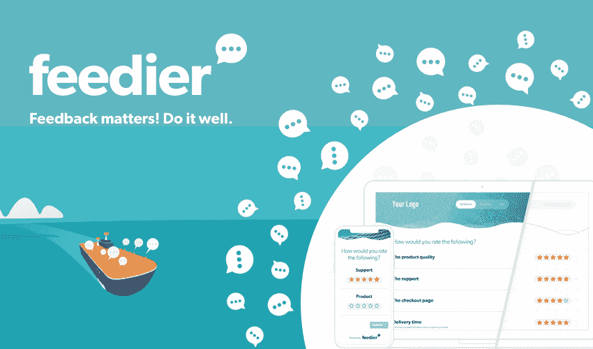
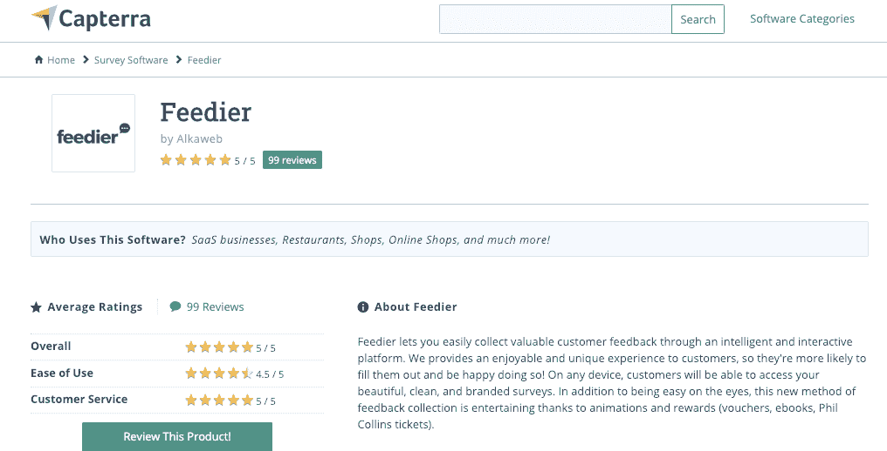

# 我希望从我的顾客身上学习，并了解这是如何带来新业务的

> 原文：<https://www.indiehackers.com/interview/my-desire-to-learn-from-my-customers-and-how-it-led-to-a-new-business-a0c56e2d96>

## 你好！你的背景是什么，你在做什么？

我叫 Baptiste Debever，是一名拥有软件工程背景的法国企业家。我对以用户为中心的产品和创新技术充满热情。

我和我的联合创始人一起创建了 [Feedier](https://feedier.com?utm_source=indiehackers&utm_medium=story_feedier) ,因为我们相信调查应该是有吸引力的，而不是无聊的，我们已经厌倦了浪费客户时间的以公司为中心的解决方案。Feedier 完全是关于游戏化、奖励、重视用户以及让提供反馈的体验更好。

Feedier 只有十个月的历史，但是已经有超过 35000 个组织和用户了！

 

## 是什么促使你开始使用 Feedier？

我们在 [Themeforest](https://themeforest.net/user/alkaweb) 上销售 WordPress 主题已经有几年了，我们遇到了一个特定的点，我们无法从我们的客户那里得到好的反馈。我们尝试了不同的方式(调查、电话等)。)，而且实际上没有一个给出可操作的数据:要么我们没有得到足够的回应，要么我们没有得到我们想要的客户的回应。我们开始寻找一种方式与我们的客户互动，自动化反馈流程，通过竞赛和奖励激励互动，同时使[反馈体验比通常的调查](https://feedier.com/blog/feedier-and-other-feedback-tools/)更好、更有吸引力。

 

鉴于 WordPress 模板市场竞争激烈，评论对你的业务至关重要。因此，在反馈过程中，我们还希望鼓励一个良好的渠道，让我们的客户给我们反馈，以改进产品，但也给我们留下一个甜蜜的 5 星评价，以提高我们的社会证明。

当我们找不到它时，我们决定创建它。

## 构建最初的产品需要什么？

我们开始将 Feedier 作为一个附带项目，因为我们的生活中还有其他项目和事情在进行。最初的研究和产品开发花了六个月。

技术栈是我们过去使用的东西:Laravel 用于 API，Vue.js 用于前端。我们没有创建标准的 Rest API，而是为数据通信添加了 GraphQL。当我们开始开发产品时，我们在这篇[中型文章中写到了它。](https://codeburst.io/up-and-running-with-graphql-laravel-and-vue-js-698000248448)

我们是完全自举的，我们主要是用我们以前的 WordPress 合资企业的钱来资助它。

## 你是如何吸引用户并发展壮大的？

都是测试，迭代，学习，对吧？我们正是这样做的。

我们首先在 WordPress 业务的一个网站上改进和测试我们的解决方案。这个网站每天都有相当大的流量，所以我们知道可以用它来测试我们的反馈组件。

我们首先把我们的小工具放在这个网站上，页脚有一个可爱的 Feedier 标志。当我们还在完善管理方面的时候，这让我们有了一些早期的采用者。

 

然后我们决定加快步伐，通过进入社区来吸引更多的用户。这可能比表面上看起来要有挑战性得多，而且我们是从惨痛的教训中学到的。我们首先深入到与我们的业务相关的独立社区和脸书团体。对于 B2B 领域的任何人，尤其是营销人员，我推荐 [B2B 营销人员&创始人](https://www.facebook.com/groups/b2bmarketersnfounders/?ref=br_rs)和[营销家庭社区](https://www.facebook.com/groups/themarketingfamily/)。

在我们努力把消息传出去并收集一些初步反馈的过程中，我们做了一些没有规模的事情。在这些社区的注册人数激增和一些初始广告活动之后，我们做了几件事来保持新用户的流入:

*   回答了 [Quora 问题](https://www.quora.com/profile/Baptiste-Debever)。有许多与客户反馈工具、客户成功等相关的问题。
*   开始做一些出站营销，主要是通过 LinkedIn。我得到了一些线索和用户，也遇到了很厉害的人，比如 [Foti Panagio](https://twitter.com/fotipanagio) (大呼到他身边项目 [Growthmentor.io](https://www.growthmentor.io) )。
*   提交 Feedier 不同的启动和 SaaS 上市网站。

这些努力为我们带来了第一批 300 名用户。

从这个过程中学到一些东西，并把这些知识运用到工作中去。

TweetShare

然后我在 lemlist 和 PixelMe 遇到了法国人。他们告诉我他们在 AppSumo 上的活动，有好有坏。尝试一下听起来并不疯狂。这是一种不用花太多钱就能获得反馈和注册的方式，所以我们决定尝试一下，我们的 AppSumo 活动于 6 月份开始。

也就是说，进入 AppSumo 是一个相当漫长的过程，拥有一款 SaaS 产品远不是唯一的要求。他们有一个相当彻底的过程来审查每个申请人，只挑选最感兴趣的产品。😉

一个月后，我们有超过 2500 名用户和大量反馈需要处理。我们的开发团队在这段紧张的时间里也一直在疯狂地发布新功能并修复所有报告的 bug。总的来说，这个过程是有益的，帮助我们成长，但不得不花这么多时间在支持和与 AppSumo 用户交谈上，在其他方面减慢了我们的速度。

我们采取了一种不同的方法，在产品发布前不做广告，或者真正使用我们自己的网络。它对我们有效，但不是对所有人都有效，如果我们有机会再做一次，可能有些事情我们会做得不一样。只要你能从这个过程中学到一些东西，并把这些知识运用到工作中去，那就很好。

 

## 你的商业模式是什么，你是如何增加收入的？

我们尝试了免费增值和免费试用模式，但它不适合我们。我们目前正在运行一种基于订阅的模式，通过不同的计划来满足不同的需求。我们真的致力于提供价值并帮助人们收集更好的反馈。

没有经验法则，这完全取决于你的使命和长期计划。无论你决定做什么，要么让它发挥作用，要么从你的错误中吸取教训。

## 你未来的目标是什么？

我们有一个大胆的目标，到今年年底达到$10K MRR，我们正在尽一切努力去实现它。

## 你面临的最大挑战和克服的障碍是什么？如果你必须重新开始，你会做什么不同的事？

做自举生意完全是为了赚钱。为此，我面临的最大障碍是缺乏时间。我仍然觉得我的时间总是不够用。我已经通过一个彻底的时间管理过程和外包那些我自己不“必须”做的事情来做得更好。

## 有没有发现什么特别有帮助或者有优势的？

对我最有帮助的事情是认识“网上”朋友，并从他们那里获得支持。

正如我在 Growthmentor.io 上分享的一篇[文章中所说，创业并不总是积极的，但你必须能够看到事物光明的一面。有起有落，你必须接受。试着总是积极的，如果事情没有按计划进行，不要惊慌或让事情让你沮丧。你最好坐下来，试着去理解什么是更好的。顺便说一句，如果你还没有检查它，请继续浏览](https://www.growthmentor.io/blog/saas-lessons-after-six-months/) [GrowthMentor.io](https://www.growthmentor.io) ，它是由一位独立黑客制作的！

创业并不总是积极的。有起有落，你必须接受...如果事情没有按计划进行，不要惊慌或让事情让你沮丧。

TweetShare

除此之外，我最近读的一本很棒的销售书籍是亚伦·罗斯写的[可预测收入](https://predictablerevenue.com/)。他的播客也很惊艳。

## 我们可以去哪里了解更多？

您可以在[feedier.com](https://feedier.com/)了解更多信息，并咨询我们的博客，了解关于客户反馈和客户整体成功的深刻内容。我也很乐意谈论这个话题——我通常活跃在 LinkedIn 上，或者通过电子邮件联系 feedier dot com 上的 baptiste。

—[<picture id="ember5221231" class="user-avatar ember-view user-link__avatar"></picture>巴蒂斯特·德贝弗](/bdebever?id=YmfLSOU6M2gxFdpWCA5j0uRGSZg1)，Feedier 创始人

## 想像 Feedier 一样建立自己的事业？

你应该加入独立黑客社区！🤗

我们是几千名创始人，互相帮助建立有利可图的业务和副业。来分享你正在做的事情，并从你的同事那里获得反馈。

还没准备好开始使用你的产品吗？没问题。这个社区是一个认识人、学习和实践的好地方。随意[随便浏览](/)！

——[<picture id="ember5221236" class="user-avatar ember-view user-link__avatar"></picture>柯特兰艾伦](/csallen?id=ibTLPyjwVebnZjMGKvz6ztarnuV2)，独立黑客创始人

21votes