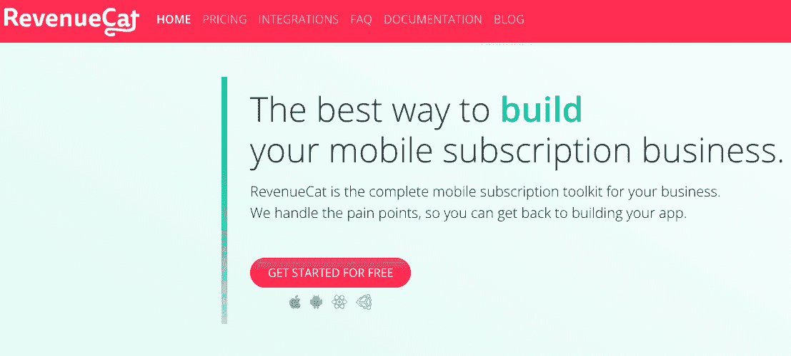
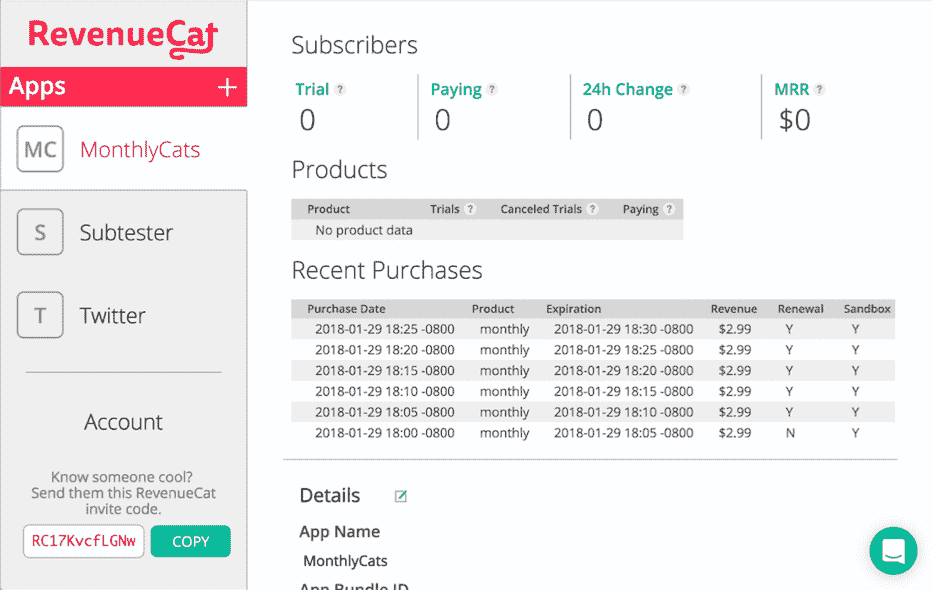
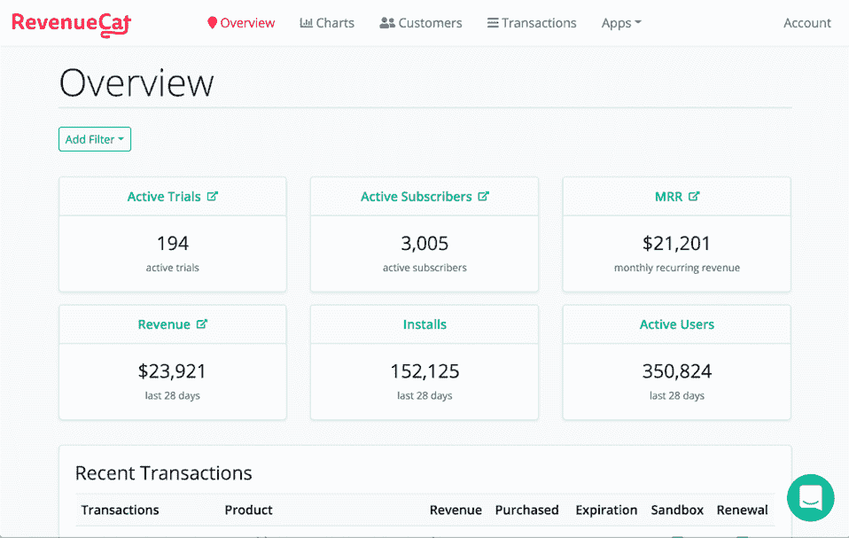
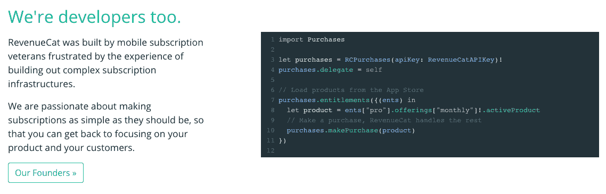

# 我从失业到企业家和 Y Combinator 校友的旅程

> 原文：<https://www.indiehackers.com/interview/my-journey-from-unemployed-to-entrepreneur-and-y-combinator-alum-f99e1b52c1>

## 你好！你的背景是什么，你在做什么？

我叫 Jacob Eiting，是加州旧金山的一名开发人员。在过去的一年里，我和我的联合创始人 Miguel 和我一直在开发 T2 revenue cat，这是一个管理应用内订阅的简单 API。

自 1 月份以来，我们的 SDK 已经发布了 135 个应用程序，我们正在跟踪 22.4 万付费用户的订阅，我们在 11 月份赚了 6811 美元。

 

## 是什么促使你开始使用 RevenueCat？

在开始 RevenueCat 之前，米格尔和我一起开发了移动大脑训练应用 Elevate，这是 2014 年苹果的年度应用。Elevate 通过 App Store 应用内订阅赚钱，在某个时候，我们意识到我们正在花费大量的工程时间来让应用内购买(IAP)订阅为我们服务。我特别记得我大声地问，“为什么没有服务来处理这件事？”

几年后，我决定离开 Elevate 去创办自己的公司。我总是渴望建造完全属于自己的东西，在一些有趣的工作之后，我决定开始工作。就在那个时候，我看到[发自尤利西斯的帖子](https://medium.com/building-ulysses/why-were-switching-ulysses-to-subscription-47f80b07a9cd)描述了他们转向订阅，以及他们如何花费了一年多的努力。我再次发现自己在想，“为什么没有一个服务来处理这个问题！?"

我在互联网上搜索任何提供 IAP 后端服务的人，一无所获之后，我给几个我认识的从事应用内订阅的人发了电子邮件。他们都建立了自己的解决方案，并且非常不满意。在看到尤利西斯的博文 12 天后，[我提交了 RevenueCat 的第一行代码](https://www.indiehackers.com/product/revenuecat/-LQv7NWQhUTcpl2TKZ57)。

我也知道我*需要*一个联合创始人。不是每个创始人都这样，但我知道我不可能独自创建一个成功的公司。此时，我联系了米格尔，他仍在 Elevate 工作。我还没来得及向他提出这个想法，他就想加入了。

## 构建最初的产品需要什么？

这项工作真正开始于 2017 年 9 月下旬，当时我们构建了一个 REST API 来跟踪和验证应用内订阅，以及一个 iOS 软件开发工具包(SDK)，使 API 易于插入并在您的应用中使用。

一个月后，也就是 10 月下旬，SDK 的第一个版本登陆了 Github 和 CocoaPods。此时，Miguel 仍在 Elevate 全职工作，并在晚上和周末疯狂地工作在 RevenueCat 的 API 上。

第一个 SDK 版本几乎没做什么；我们包装了设备上的应用内购买方法，获取收据，并将收据发送到我们的 API，在那里我们跟踪它们并保持订阅者记录更新。当时没有网站或仪表盘。然而，SDK 确实解决了应用内订阅开发者的一个基本问题，我认为它有一定的效用。

幸运的是，我们有一个朋友正在为一个新应用添加应用内订阅，并且愿意试用我们的 SDK。我提出为他的应用程序(包括 UI)做所有的订阅代码，只是为了被允许集成我们非常新的 SDK。与此同时，我们花了 11 月份构建网站和仪表板，并用 API 覆盖更多边缘案例。

2017 年 12 月 4 日，我们[推出了](https://medium.com/revenuecat-blog/introducing-revenuecat-1239f89ead8b)revenue cat 私人测试版。从开始到测试，大约三个月过去了。那时，我靠妻子的收入和积蓄生活，而 Miguel 仍然在晚上和周末写代码。正如你所看到的，仪表板的第一次迭代并不是很迷人。

 

## 你是如何吸引用户并发展 RevenueCat 的？

当我们发布测试版时，我们要求用户请求访问。RevenueCat 是关键的基础设施，我们需要建立信心。我们在 [reddit](https://www.reddit.com/r/iOSProgramming/comments/7hqv2d/app_store_subscriptions_and_you_part_duex/) 、我的 [Twitter](https://twitter.com/jeiting/status/938079607428849665) 账户和 [Medium](https://medium.com/revenuecat-blog/) 上分享了它。在头两天，我们有 13 个人请求邀请并创建了帐户！巨大的发射！

当你在制作一款应用程序的产品时，它可能需要几周或几个月才能真正发货。直到 1 月下旬，第一款使用 RevenueCat 的应用程序才登陆应用商店。这款应用叫做[设计+代码](https://designcode.io/)，是开发者和设计者学习代码和设计的绝佳资源。观看 API 日志，看到来自一个不是我们自己的应用程序的请求是非常令人兴奋的。

每天、每周、每月运送一些具体的东西来推动你前进。

TweetShare

我们决定通过制作关于我们正在解决的问题的真正好的内容来宣传 RevenueCat，这也被称为内容营销。我对这个问题有很多第一手的经验，所以我开始写它。在 1 月和 2 月，我每周都会写一篇关于[应用内订阅](https://medium.com/revenuecat-blog/ios-subscriptions-are-hard-d9b29c74e96f)、 [StoreKit](https://medium.com/revenuecat-blog/storekit-is-broken-cecd2b823ff0) 和[应用商业模式](https://medium.com/revenuecat-blog/the-case-for-app-patronage-459c261be82f)的新博文。每周我会花 6-12 个小时写作、重写和编辑，然后发布到 Medium，发布到 Twitter，并在 reddit 上分享。

一些帖子比其他的做得好，但是一些被突出的 iOS 时事通讯选中。这些博客帖子当时只提供了少量的注册用户，但这些好处已经累积了一年，并且仍然为我们的网站带来了大量的流量。我的中型博客帖子每月仍有大约 7k 的浏览量。

4 月份，由于 App Store 中只有 7 款应用在使用我们，我们参加了 Y-Combinator 的面试并被录取。在这一点上，米格尔辞职了，我们决定改造仪表板，添加 Android 支持，并在 6 月份正式推出。正如你所看到的，仪表盘的第二版更加时尚。

 

尽管发布时低调，RevenueCat SDK 还是在 5 月和 6 月推出了 11 款新应用。六月下旬，我们正式[推出产品猎](https://www.indiehackers.com/product/revenuecat/-LQvAQV7_48rSNcbhoq7)。

7 月份的大部分时间，我都在给那些提供应用内订阅的公司发邮件，我猜想这些公司可能没有正确处理应用内订阅。我们通过搜索 API 搜索应用商店，并将其与来自 Sensor Tower 的数据相结合，以找到顶级订阅应用。我发了大约 300 封电子邮件，收到了大约 30 个回复，可能还有 5 个电话。其中一些变成了顾客。在 YC 期间，我们的大部分业务来自其他 YC 公司。作为 YC 的一部分，这是一个可怕的副作用；如果你销售给其他 YC 公司，他们中的大多数会接你的电话，甚至可能会尝试你的产品，只是因为他们觉得你不好(开玩笑，不是开玩笑)。

## 你的商业模式是什么，你是如何增加收入的？

RevenueCat 通过向使用我们 API 的用户收费来赚钱。我们在定价上有过几次反复。

最初，我试图建立一个与应用程序的用户数量挂钩的定价方案。比如 0-10 名用户:每月 1.99 美元，10-100 用户:每月 4.99 美元，等等。问题是，如果不考虑每个用户的平均收入，总会有一些有收入的客户得到不公平的待遇。

我们定价的第二次迭代更简单。我们将收取跟踪收入的 3.5%。如果你赚了 100 美元，你欠我们 3.5 美元。如果你赚了 1000 美元，你欠我们 35 美元。很简单。但是这也有问题。我们的系统中有很多应用程序几乎什么都不赚，每月不到 100 美元。向这些顾客收费似乎不值得。另一方面，没有一个拥有能赚很多钱的应用程序的客户会放弃 3.5%的收入来购买基础设施 API。一个成功的订阅应用，每月赚 10 万美元，会欠我们 3.5 万美元。对于我们的首次发行来说，这似乎是一大笔钱。

为了增长，你需要把你的产品从“止痛药”变成“维生素”。

TweetShare

我们在定价方面的第三次迭代是提供一个相当标准的三层定价方案，其中我们提供免费层、中间层和“联系我们”上层。我们为月收入低于 1 万美元的应用程序免费提供了 API 的基本功能。对于我们的中间层，我们以 119 美元/月的价格提供对图表和网页挂钩的访问，其中包括每月 2 万美元的跟踪收入。但是，如果一个应用程序一个月的收入超过 2 万美元，我们就会收取超额费用。这有很多好处:我们从固定的月收入中获得一些可预测的收入，但我们仍然有突破性应用的优势。我们的顶层定价类似于我们的中间层，具有更高的限额和附加功能。

当我们完成《YC》时，我们有三个中层用户，每个月赚 400 美元。从那时起，我们已经增加了 21 个付费客户，我们的收入增长到了每月 7k 美元。我们大约一半的收入来自我们的中端客户，另一半来自少数顶级客户。自八月以来，我们已经有一个客户流失。

定价很难。我听过的最好的建议是，一定要根据你提供的价值来给你的产品定价，而不是根据你提供产品的成本。这在 SaaS 尤其重要，那里的利润率通常很高，因为你无法真正计算开发成本。如果你根据提供服务的成本来收费，那就太低了。我的另一条建议是，尝试亲自传达定价细节，至少几次。当你像我们一样向相对较少的客户销售时，很难获得好的、定量的定价数据，所以定性数据可以提供很多信息。

| 月 | 收入 |
| --- | --- |
| 2018 年 5 月 | 0 |
| 2018 年 6 月 | 0 |
| 2018 年 7 月 | 238 |
| 2018 年 8 月 | 357 |
| 18 年 9 月 | 2701 |
| 18 年 10 月 | 5811 |
| 18 年 11 月 | 6940 |

## 你未来的目标是什么？

我们正在努力争取在明年秋天之前达到 100 万美元的 ARR。这意味着我们必须大幅提高我们的销售线索速度，增加销售额。现在，我们为订阅后端提供了一个非常好的实现。我们记账做得很好。然而，大多数有能力的工程师可以复制我们所做的，如果他们真的想的话。为了增长，我们需要将产品从“止痛药”转变为“维生素”。这意味着在我们的平台上建立更多的工具，允许开发者*改善*他们的应用程序如何赚钱，包括价格测试、价格优化、减少流失等工具。

## 你面临的最大挑战和克服的障碍是什么？如果你必须重新开始，你会做什么不同的事？

我认为我最大的错误之一是在我进入 Y-Combinator 之前没有把 RevenueCat 看得那么重。从创业到被 YC 录取的这段时间是富有成效的，但我总有一部分在想，“这件事永远不会成功，我只会去找另一份工作。”这是一个愚蠢的，完全心理障碍。我在等待某人的许可来认真对待 RevenueCat。

认真对待你的事情，现在。要么全力以赴，要么全力以赴。

TweetShare

我不知道是 YC 的允许最终帮助我扫清了这个障碍，还是只是被推入了一个有一群非常聪明、有上进心的人的环境，但现在疑问已经消失了。所以我的建议是:现在就认真对待你的事情。哪怕只有一个小脚趾出门都会拖累你。要么全力以赴，要么全力以赴。

## 有没有发现什么特别有帮助或者有优势的？

我们用[条纹图册](https://stripe.com/atlas)来整合，他们提供的社区和资源都很棒。我们让 [@patio11 本人](https://twitter.com/patio11)帮忙审查我们的 YC 申请，和 Stripe 的一个人进行了一次很棒的模拟面试，当我们被录取时，他们甚至送了我们一个蛋糕。(这不是付费插 btw，只是服务真的很好。)

从工程师兼首席技术官到首席执行官的角色转变有点艰难。这意味着围绕时间和优先级管理对我的思维进行重新编程，并让我与人交谈时感到舒适。为此，拥有曾经担任过首席执行官或经历过类似转变的导师是无价之宝。

在我们上市或有投资者之前，我早期做的一件事是请几个朋友充当顾问团队，我亲切地称之为我的 A 团队。我问是否可以像投资人一样每月给他们发更新。对我来说，设定每月目标并每月反思一次我们的进展是一个很好的实践。直到今天，我仍然写每月更新，但现在他们也给我们的大，花式投资者。

我认为 RevenueCat 到目前为止的成功很大程度上来自市场趋势:移动订阅量正在增长，人们正在使用更多的 API 来构建产品，应用商店仍在增长。如果我有无限的天赋和资源，开发移动应用计费软件可能不会是我的第一选择(我会在外面过着我最好的埃隆·马斯克生活或其他什么)，但我会选择一些我有愿景(开发者应该赚更多钱)、对问题有所了解和有利的市场环境的事情来做。我想给自己尽可能多的优势。我建议也这样做。虽然你的海水水族馆爱好者的社交网络可能与你的个人兴趣一致，但你可能需要考虑让经营企业变得有趣的其他因素，如机会大小和吸引力。

 

## 对于刚刚起步的独立黑客，你有什么建议？

选择一件你可以做 10 年或更久的事情。尤其是在 SaaS，建立任何有意义的东西都需要很长时间。我已经在 RevenueCat 上工作了一年多，但我们仍然没有比我从 Elevate 拿回家的薪水赚得更多。但是，只要继续推动世界朝着你的愿景前进，使用几个重要的指标来衡量你的进步。每天、每周、每月运送一些具体的东西来推动你前进。

## 我们可以去哪里了解更多？

看看 [RevenueCat](https://www.revenuecat.com/) ！我们的使命是帮助开发者赚更多的钱。我打赌你喜欢钱。

有时候我会在我的推特 [@jeiting](https://www.twitter.com/jeiting) 上写一些有趣的东西。

我在 RevenueCat 博客上写了关于 StoreKit、应用内购买和移动商业模式的文章。

如果你有问题，请在评论中提问！

—[<picture id="ember8173502" class="user-avatar ember-view user-link__avatar"></picture>雅各布·艾廷](/jeiting?id=Z66Ctd0tRSNjp7JM1zuq0OPCLgD3)【RevenueCat】联合创始人

## 想像 RevenueCat 一样建立自己的事业？

你应该加入独立黑客社区！🤗

我们是几千名创始人，互相帮助建立有利可图的业务和副业。来分享你正在做的事情，并从你的同事那里获得反馈。

还没准备好开始使用你的产品吗？没问题。这个社区是一个认识人、学习和实践的好地方。随意[随便浏览](/)！

——[<picture id="ember8173507" class="user-avatar ember-view user-link__avatar"></picture>考特兰艾伦](/csallen?id=ibTLPyjwVebnZjMGKvz6ztarnuV2)，独立黑客创始人

50votes