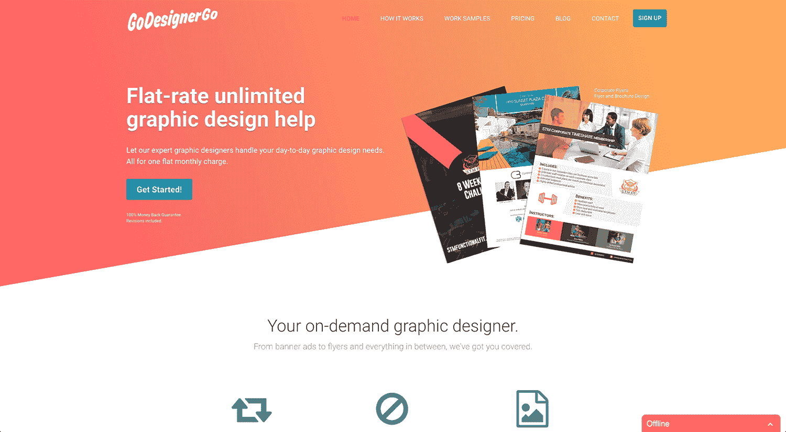
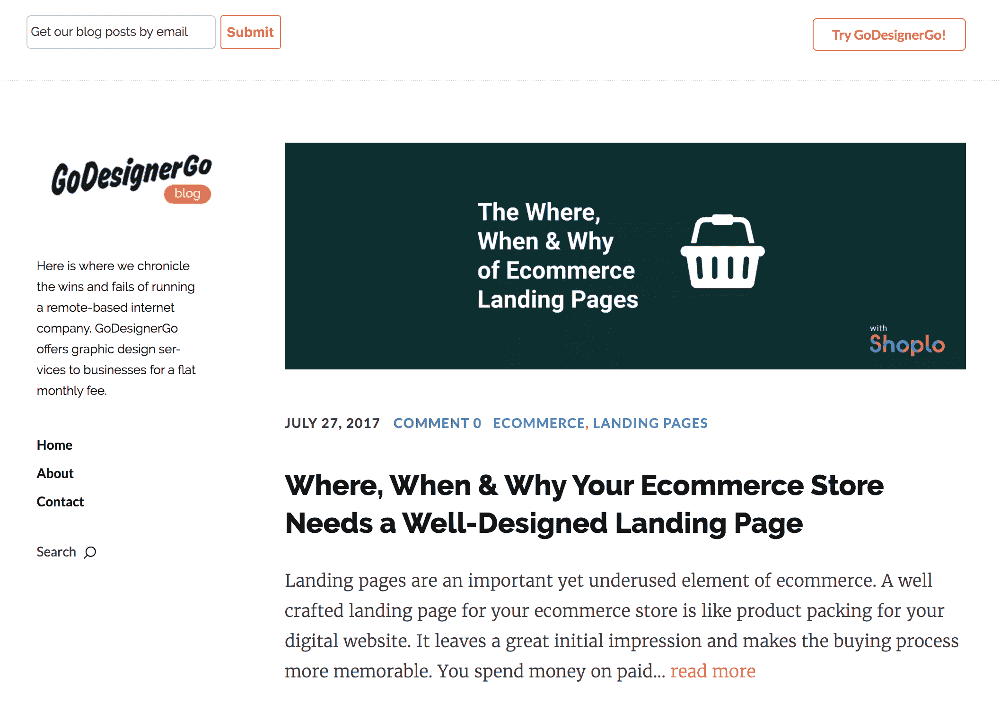
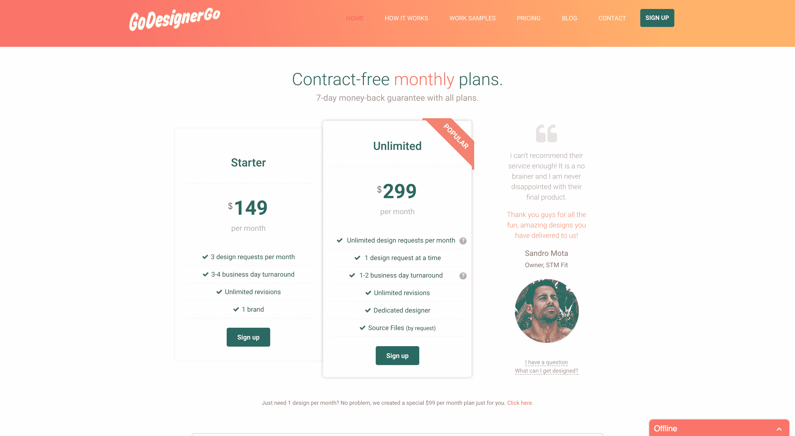

# 我从企业家到企业家的旅程

> 原文：<https://www.indiehackers.com/interview/my-journey-going-from-wantrepreneur-to-entrepreneur-1a38153cc0>

## 你好！你的背景是什么，你在做什么？

嘿！我叫安德鲁·埃利奥特，我是 GoDesignerGo 的创始人，这是一项为企业提供无限平面设计帮助的服务，每月收取固定费用。

在全职做 GoDesignerGo 之前，我是一名平面设计师和汽车记者。在那段时间里，我有机会驾驶一些令人惊叹的汽车，并为大大小小的品牌参与一些令人惊叹的项目。这两份工作都非常有价值和有趣，但建立自己的企业一直是我的激情和最终目标。

GoDesignerGo 为企业提供价格合理的平面设计服务，不需要任何 DIY 知识，比市场网站更可靠，而且简单易用。

它是为那些需要补充其当前平面设计团队的企业而构建的，或者对于较小的公司，需要按需平面设计帮助，但不需要或不想要一个在职设计师/代理。因此，我们目前的客户群包括来自世界各地的公司，从 7 位数的大公司到小型夫妻店。

我们的收入逐月增长 30%多一点，在开业的前两个月，我们实现了 1500 美元的 MRR(每月经常性收入)。

 

## 是什么促使你开始使用 GoDesignerGo？

[GoDesignerGo](https://www.godesignergo.com) 是我在这个行业工作期间看到的一种需求。我一次又一次地听到公司随口提到他们会喜欢一种服务，这种服务可以处理他们的设计任务，而没有传统选项的麻烦、费用或资源。

如果我创建了一个“未公开的平面设计”服务，人们会不会使用它，这不是一个确定的赌注。为了确定这一点，我做了一个最简单的测试:我弹出了一个快速的 HTML5 Bootstrap 登陆页面——如果我没记错的话，这是一个来自 [WrapBootstrap](https://wrapbootstrap.com/) 的 5 美元主题的修改版——并给小企业发了冷邮件。令人高兴的是，许多企业做出了回应。

唯一的问题？他们都没有购买这项服务。有很多，“是的，我完全会用它！”回应，这对自尊很好，但如果你在寻找具体的证据证明你的想法是站得住脚的，那就不好了。

不管怎样，我继续前进。我认为我们早期的问题之一，尤其是作为一个未知的设计服务，一个新的，未经证实的商业模式，是缺乏“社会证明”

幸运的是，我们赢得了一场比赛，让 GoDesignerGo 出现在自己的视频中。那段名为[The Font whisper](http://vooza.com/videos/the-font-whisperer/)的视频帮助我们获得了最初的合法性，我认为这让一些持观望态度的公司对他们的购买决定感觉更好。

让我强调一下，从视频开始到我们的第一批顾客上门，服务没有任何变化。不是登录页面或我们的产品本身，而是对我们产品的这种新的*认知*。

获得第一批顾客足以激励我继续做生意——事实上，足以说服我全职工作。我有足够的积蓄(还有一个非常善解人意的女朋友),可以比以前更早开始全职工作。

当时我有点狂热地想存钱。我想我的储蓄账户里还有一些我 8 岁生日派对的生日钱。如果你想大学一毕业就创业，这很好(如果你想找乐子，这就不太好了)。

## 构建最初的产品需要什么？

[GoDesignerGo](https://www.godesignergo.com) 的最初产品是最基本的，坦率地说，与现在的样子相比有点尴尬。(当我说“产品”时，我们没有传统的软件产品，我们大部分是服务。)例如，我们用于员工管理的后端流程在当时是不存在的。甚至我们网站的第一个版本也是，嗯，狗屎。

从我第一次有这个公司的想法到网站第一个版本上线仅仅两年时间。“两年了，你甚至还没有开一家软件公司？!"嗯，是的。老实说，我花了大约一年半的时间成为一名受欢迎的企业家。我害怕发射什么东西。如果我失败了呢？没人买怎么办？

你开始时会犯的那些错误？伟大公司的创始人已经做出了所有的选择。

TweetShare

我记得在一个周三晚上下班后，我坐下来，写下创办这家公司的利弊。事实证明，我的大部分担心都是没有根据的，令人震惊的是，如果我的公司倒闭了，世界也不会毁灭。那个简单而愚蠢的练习给了我开始的动力。

我做了一些快速的数学计算，包括我的时间、主机、资源，甚至我的第一个员工。由于公司完全是自举，我想用尽可能少的钱创造我的 MVP。这样，如果它失败了，它不会是一个巨大的财务打击，更重要的是，我可以重新站起来，掸掉身上的灰尘，去做另一件事。

我在我熟悉和熟悉的地方构建了 GoDesignerGo 的原始版本——html 5、Bootstrap 和一点 PHP(用于处理联系人表单等)。).为了尽可能快速有效地获得 MVP，我求助于许多外部提供商来处理重要的事情，如支付处理、定期支付、实时聊天等。

我总是提醒那些想开公司的朋友的一件事是，客户并不关心你是否为你的公司建立了最牛逼的支付系统，或者你是否使用了 [Stripe](https://stripe.com/) 。只要管用，没关系。重复支付也是如此。我们使用[被收费人](https://www.chargebee.com/)，他们处理得非常好。我们的实时聊天由 [Tawk.to](https://www.tawk.to/) 负责。

## 你们是如何吸引用户，让 GoDesignerGo 成长起来的？

我们的发布会，嗯，不引人注目。写这个很糟糕，但这是事实。我们没有风险投资，甚至没有天使投资，所以购买广告是不可能的。大型公关发布会永远不会发生。那么我们做了什么呢？我们只需点击网站上的“发布”即可。我知道:超级激动人心，鼓舞人心。事实上，这是许多公司默默无闻地推出的产品。

我们没有想到会有一场盛大的发布会，事实上，我们也不认为我们需要一场发布会。我们是一家 B2B 服务企业。我们从一开始就知道，我们不需要像社交应用那样疯狂的用户增长。我们的重点是实现稳定、持续的增长，这将使我们能够发现问题，并在前进的过程中修改我们的服务、流程和产品。

我记得我坐下来，写下创办这家公司的利与弊。

TweetShare

这种快速修改和适应的哲学是我们资助的产物——也就是说，没有。由于我们没有足够的资金，我们的决定必须经过深思熟虑，而且我们必须准备好快速适应。如果我们不这样做，公司就不会成功。

发布后，我们实施了一项营销计划，旨在为我们带来缓慢的用户流量。我们希望为每个用户完成三件事:向他们展示服务，向他们解释，并希望将他们转化为付费客户。总体计划如下:

**第一步:免费试用**

该计划的第一部分是向填写了我们的资格表格的任何公司提供一个免费的试用平面设计。我们让人们通过脸书和 reddit 广告填写这份表格。

第二步:博客

计划的第二部分是开一个博客，并开始将我们自己定位为企业家和企业主的有用资源——特别是那些可能不了解平面设计的人。我们在 [reddit](https://www.reddit.com/) 、[Inbound.org](https://inbound.org/)和 [GrowthHackers](https://growthhackers.com/) 上推广了我们的帖子(仅限相关帖子)。

 

**第三步:免费赠品**

第三种方式是向社区提供免费赠品。所谓免费品，我们指的是高质量的 PSD 模板，用于社交媒体帖子、信息图表等常用项目。

我们提供这些以换取电子邮件地址。然后每个人都会收到我发来的私人邮件，看看我们是否能帮上什么忙。

**第四步:视频**

第四步，也是我们刚刚开始的一步，是开始发布有帮助的视频，作为我们博客文章的伴侣。

这些视频将针对小企业主，并帮助他们更好地了解如何利用图形设计在他们的业务。例如:“ [Canva](https://www.canva.com/) 很棒，但这里有一些方法可以让你的 Instagram 帖子变得更好。”

到目前为止，这些努力为我们带来了源源不断的感兴趣的客户。

## 你的商业模式是什么，你是如何增加收入的？

我们的商业模式很简单——我们每月向客户收取平面设计服务费用。我们的无限计划是这样运作的:

*   注册并请求您的平面设计任务
*   您的任务被添加到您的队列中，我们开始逐个处理您的队列
*   您的文件会在我们完成时交付

对于小型项目，周转时间通常为一个工作日，大型项目需要更多时间。我们会在每项任务开始时提供预计的完成时间。

该模型本身被设计得尽可能简单易用。虽然这并不“酷”，但我们设计了尽可能通过电子邮件使用的服务。(我们目前在后端使用 [HelpScout](https://www.helpscout.net/) 来处理传入的请求。)

为什么是电子邮件？因为对于小企业中的大多数营销部门(或小企业的所有者)来说，向我们发送一封电子邮件并完成一个设计是极其容易的。这是我们业务模式的重要组成部分，也是我们大多数客户喜欢的部分。

我们从第一天开始收费，从第一天开始就和 [Stripe](https://stripe.com/) 在一起。我们有幸成为 Stripe 的 [Atlas 程序](https://stripe.com/atlas)的测试版客户之一，这使得一切设置变得极其容易，所以我们是它的忠实粉丝。我们所有的经常性支付都通过 [Chargebee](https://www.chargebee.com/) 处理，然后输入 Stripe。

在目前的服务迭代中，我们平均可以获得 1500 美元的 MRR。我们能制造更多吗？大概吧。我们想在这一刻吗？没有。

等等，我以为做生意的全部目的就是尽可能多赚钱！怎么回事？

我们做出了缓慢增长的决定，直到我们内部认为我们已经有了维持更高增长水平的流程和产品。我们希望服务在成长过程中保持稳定的质量水平。通过试图转化尽可能多的客户来实现过快增长，可能会对我们能够提供的服务质量产生不利影响。

现在，只有我自己和一名全职设计师，我们聘请了他们来帮助我们处理员工流程，因为我们开始增加客户获取。

 

## 你未来的目标是什么？

甚至在我开始 [GoDesignerGo](https://www.godesignergo.com) 之前，我就想为企业创建一个图形设计服务。我觉得公司目前的迭代正在解决这个问题，并将在未来许多年继续这样做。在可预见的未来，公司将继续需要平面设计服务。

该公司的目标是在未来 12 个月内拥有 100 名快乐、可持续的客户。我们希望通过继续我前面提到的营销努力来实现这一目标..我们面临的最大问题是客户流失和人力资源。

我们的利润相当可观(如果我们的预测准确，可能会稍微好一点)，但由于我们公司的性质，我们的员工数量将随着我们的发展而大幅增加。这并不是一个可怕的问题，但当我们试图吸引更多的客户时，这肯定是一个需要计划的问题。

随着我们的发展，保持员工与客户的平衡将是一个有趣的挑战，我们很高兴开始着手这项工作。

## 你面临的最大挑战和克服的障碍是什么？

我们面临的一些最大挑战是获取客户和设计有效扩展所需的内部流程。对任何初创公司来说，获取客户都很难。事实是，大多数公司在这方面运气都很差，以至于倒闭了。

到目前为止，我们很幸运，因为我们有一个相当稳固的潜在客户获取渠道，但这并不意味着它会永远持续下去。创造潜在客户和客户的关键在于，上个月奏效的方法这个月可能不奏效。整体主题(内容营销，脸书广告等。)可能是合理的，但是你的收购过程的实际设计是不断发展的。想出下一步继续改进和成长是很困难的。

创办 [GoDesignerGo](https://www.godesignergo.com) 的最大挑战是，我是以单身创始人的身份创办的。没有人真正谈论过那些你独自工作 14 个小时或者没有其他人来帮你出主意的日子。如果你做错了？那都是你。顾客疯了？那也是你。

不要误解我——我热爱我正在做的事情。但作为一名单身创始人本身就是一个挑战。

然而，单身创始人的好处是，我很快就学会了如何成为一名多面手。脸书广告？是啊，我得学着点。处理会计？商学院有所帮助，但没错，必须再次学习《T4》。诸如此类。

创业需要时间。但我是一个没有耐心的人——我喜欢优化事情，尽可能高效地完成它们。这就是拥有长期愿景和计划的原因。我有一个谷歌文档，列出了公司的所有目标，我认为如何最好地实现目标，以及为了实现目标我需要做些什么。

请记住，当你开始你的侧推时…要做好准备，事情需要时间。

TweetShare

这让我充满动力，并不断接受企业不是在一个周末建成的这一观点。

## 有没有发现什么特别有帮助或者有优势的？

我是商业书籍和博客的狂热读者。有些有帮助，有些没有。我读过的第一本帮助我形成商业理念的“创业”书是由 37Signals(现在的 T2 大本营 T3)出版的[变得真实](https://www.amazon.com/Getting-Real-Smarter-Successful-Application/dp/0578012812)。我不是程序员，但我向任何想开始理解商业运作过程的人推荐这本书。这不是一本技术性的“做这做那”的书，而是一本以新的和不同的方式激发思考的书。

在 [GoDesignerGo](https://www.godesignergo.com) 出现在我脑海里之前的一年多时间里，Mixergy 的播客是我每天通勤时收听的内容。当我觉得某个客人特别有意义时，我还是会听。

为了让自己保持动力和状态，我做过的最有帮助的事情之一就是在 Google Sheets 中创建一个每日待办事项列表。我每周五都会为接下来的一周做计划。它有助于我专注于手头的任务，并为检查一个项目提供精神奖励。作为单身创业者，保持动力和专注很重要，简单的待办事项清单真的很有帮助。

我做的第二个最有帮助的日常任务是强迫自己花时间做我喜欢的事情。疯狂工作，身心疲惫地上床睡觉，这太容易了。我尝试了几个月——糟透了。

从那以后，我强迫自己从电脑前站起来，把手机调到勿扰模式，然后去跑步、玩电子游戏或打网球。它对我的心理健康产生了奇迹般的效果，我建议任何一个与倦怠或压力作斗争的创始人采取类似的策略。

## 对于刚刚起步的独立黑客，你有什么建议？

我早些时候提到过这一点，但对任何有抱负的企业家的一条建议是，在试图扩大规模之前，确保你了解你的业务的主要枢纽是什么。一些比我聪明的人称之为产品-市场契合。

对我们来说，我们的关键点是保持标准的质量和服务水平。如果我们不能保持这一点，随着我们的发展，我们的客户会去别处。还有很多其他选择。

尽可能快地成长是令人敬畏的。但是以牺牲你的核心产品为代价的增长——这是人们最初注册的真正原因——不是做事的方式。

我希望有人在我创业时给我的最大的建议是，当你创办一家公司时，你会犯的所有恐惧、不安全感和错误？伟大公司的创始人已经做出了所有的选择。所以不要为小事烦恼，庆祝大事。

老实说，我花了大约一年半的时间成为一名受欢迎的企业家。我害怕发射什么东西。

TweetShare

记住，当你开始你的副业、公司、周末项目或你决定叫它什么的时候，要准备好事情需要时间。我保证我比你更没有耐心，如果我能设法接受商业需要时间这一观点，我想你也能。

继续推，继续黑。只要你开心地做你正在做的事情，好事就会到来。

## 我们可以去哪里了解更多？

如果你想尝试 GoDesignerGo 服务，你可以点击这里的。我总是喜欢让任何阅读我的博客帖子、采访或其他内容的人都可以找到我——所以如果你有任何问题，请不要犹豫，给我发电子邮件:[ [【电子邮件保护】](/cdn-cgi/l/email-protection) ](mailto: [【电子邮件保护】](/cdn-cgi/l/email-protection))。

你也可以关注我或者联系我的个人推特账号: [@AndrewEOfficial](http://www.twitter.com/andreweofficial)

我会在这里的评论中回答任何问题。去吧，我不会咬人的！

—[<picture id="ember8066054" class="user-avatar ember-view user-link__avatar"></picture>GoDesignerGo](/GoDesignerGo?id=lKWUWjvr7qWjrKW8WSgqwakfQBa2)，GoDesignerGo 的创建者

## 想像 GoDesignerGo 一样建立自己的事业？

你应该加入独立黑客社区！🤗

我们是几千名创始人，互相帮助建立有利可图的业务和副业。来分享你正在做的事情，并从你的同事那里获得反馈。

还没准备好开始使用你的产品吗？没问题。这个社区是一个认识人、学习和实践的好地方。随意[随便浏览](/)！

—[<picture id="ember8066059" class="user-avatar ember-view user-link__avatar"></picture>考特兰艾伦](/csallen?id=ibTLPyjwVebnZjMGKvz6ztarnuV2)，独立黑客创始人

8votes