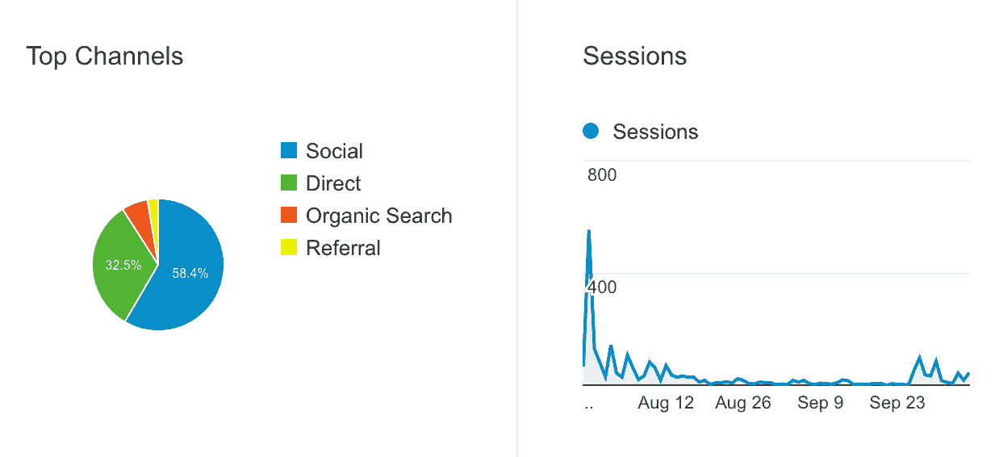

# 我销售数百件总统 t 恤的闪电行动

> 原文：<https://www.indiehackers.com/interview/my-lightning-campaign-to-sell-hundreds-of-presidential-t-shirts-30ec84b96c>

## 你是谁，你在做什么？

我是欧内斯特！在我的职业生涯中，我一直在为几家公司做“后端系统”。现在，我正在和蒂姆谢尔一起为 T2 做基础工作，为这次选举支持一场重要的政治活动。我们开发工具来帮助那些在社会影响领域的人。此外，自 2012 年以来，我一直在 Python 软件基金会做志愿者，支持像 [PyPI](https://pypi.python.org) 和其他各种 Python 网站。

最近，我开始在业余时间制作休闲 t 恤。我们向那些希望代表希拉里·克林顿的人出售 t 恤和贴纸，这些人比你的普通竞选活动更具风格和才华。

## 你是怎么开始做杀戮 t 恤的？

与 Timshel 合作大约一年后——主要是在工具和基础设施方面，以支持前面提到的重大政治活动——我们的#random 频道发生了一个随机事件。我记不清具体是什么时候了，但是有一天在我们空闲的时候，一些人在讨论将杀戮者金属乐队的标志和希拉里·克林顿的名字混搭在一起的想法。我们的一名前端团队成员 Tyler 在那天晚上晚些时候离开了，第二天在频道上张贴了“Slayary”徽标。

最终，在作为表情符号四处踢踢，并偶尔粘贴到 Slack 上之后，团队中的某个人推出了一批印有该标志的衬衫。几个星期后，我的出现了，我对它的质量有点反感。我开玩笑说，要在质量更好的面料和更适合女性的剪裁上建立自己的竞争印花。我一点也不知道，另一个团队成员会推我。我觉得自己应该对自己的话负责，于是开始研究如何在当地印刷衬衫。

当我开始计算并看到丝网印刷衬衫的规模经济绘制成一条陡峭的曲线时，转折点就来了。我想，如果我预付现金，到选举结束时，我可以轻松卖出几百件 t 恤。在和泰勒确认后，我们就开始了。泰勒为我们建立了一个非常有趣和吸引人的网站，而我则在晚上跑来跑去，与该地区的丝网印刷商交谈。杀戮 t 恤正在进行中。

## 你是怎么找到时间和资金来启动项目的？

在我配偶的祝福下，我拿出了一大笔积蓄来支付丝网印刷的初始成本，一些用于贴标和运输的各种用品，以及一些原型衬衫。

几个星期以来，我花了大部分的空闲时间去做第一批衬衫。我经常去当地的丝网印刷店，讨论我们的质量目标并获得报价。与此同时，泰勒和我一起工作到很晚，为网站做前端和后端。我们的目标是在费城 DNC 召开之前发布，大部分工作都有一个固有的截止日期。此外，我们希望保持尽可能高的利润，这促使我们直接使用 Stripe，消除了各种“设计直运”t 恤公司提供的额外削减。

最终，我离开了一家印刷店，车里装满了装着我们衬衫的纸箱。(我们总共印了 550 件 t 恤。)甚至没有在家里停留，我开车从另一家当地公司取回了一些质量极好的乙烯基贴纸。与当地的小企业合作，让我们的产品成为现实，这是令人难以置信的回报。

## 你是如何开始宣传和销售 t 恤的？

2016 年 7 月 28 日，希拉里接受美国总统提名的那一天，我们愤怒地发起了这场运动。我们让人们访问网站的主要手段是 Twitter。“slayary”这个品牌相当奇怪，所以我们很容易就获得了域名、Twitter、Instagram 等。

我们最初最大的反应是“看看这些试图从竞选中牟取暴利的骗子”。这有点令人惊讶，因为我们已经明确表示，我们计划将我们的一部分利润捐赠给竞选活动。稍微用力一点似乎可以平息这种反应，最终人们会平静下来。

随着我们最初从有机转发和分享中获得的推动开始减少，我们开始使用 Twitter 广告来推广赠品。之前从未运行过任何 Twitter 广告活动，这是一种大开眼界的体验。如果你目标明确，20 美元可以走很长一段路，或者在几秒钟内消失得无影无踪。令人惊讶的是，这与我最近从脸书“助推”开始的经历有很大不同，尽管我仍然不认为自己理解这些东西实际上是如何工作的。

最终，从 8 月份到 9 月份的前几周，我们看到了流量的大幅下降。销售稳定，通常归功于之前买家的口碑。随着 9 月下旬竞选季真正开始升温，我们在 Twitter 和脸书上加大了购买力度，并通过赠品来增加流量。

## 你的营收背后有什么故事？

我们的价格一直非常稳定。所有衬衫和一些不同“层次”的贴纸包的最初价格是 25 美元，平均每个贴纸 1.75 美元。除去运费、税和条纹费，这个价格给我们留下了可观的利润。但是最近我们已经把男式衬衫的价格降到了 20 美元，开始尝试清理库存。我们不确定这些衬衫在 11 月 9 日会有多受欢迎。

在 Stripe 上构建支付处理器轻而易举。我们试图将尽可能多的工作转移到他们的平台上。这包括处理所有信用卡数据以及与他们的产品/订单 API 集成。我们的实现只是这些 API 的一个包装，所以我们实际上最终在网站后面没有数据库！

此外，我们选择 EasyPost 作为运输标签的提供商，因为他们的 API 同样强大，并且在 USPS 运费上提供了很大的折扣。

最后，我们的履行流程非常简洁。当我晚上准备好完成订单时，我运行一个脚本，它会生成 pdf 文件，可以通过激光打印机快速打印出来。一面是运输标签，另一面是提货/包装清单。打包好，继续我的生活。

## 你未来的目标是什么？

我们的目标是尽快清空所有现有库存。我们将保留 2/3 (66.6%)的利润捐给希拉里，时间不多了！最后，我们将继续保留那部分利润，用于另一项事业，TBD。

## 如果你必须重新开始，你会做什么不同的事？

这一努力实际上进行得很顺利。我想如果我们要再做一次的话，第一批应该已经被预定了。支付数百件衬衫的现金让我倍感压力，直到我们最终达到收支平衡。

此外，如果在我们的履行过程中加入更多的逻辑，在进行捐赠的同时进行捐赠，而不是一次性捐赠，那将是不可思议的。尽管为 HFA 筹集到 666 美元的第一笔捐款很有趣。

## 你发现了哪些真正有帮助的资源和习惯？

优秀的 API 文档是最好的部分。我们正在超快速地构建网站和后端，所以当前端的事情变得模糊时，能够指向 Stripe 的优秀文档真是太好了。

此外，我在清晨或傍晚留出专门的时间做“无聊的事情”也变得至关重要。没有这些界限，我很容易忽略生活中发生的其他事情(职业上和个人上)。

## 我们可以去哪里了解更多？

我是推特上的 [@EWDurbin](https://twitter.com/EWDurbin) 。你可以给我发电子邮件到 [【电子邮件保护】](/cdn-cgi/l/email-protection#e88d9a868d9b9ca89b848991899a91c68b8785) ，如果你对我在 PyOhio 2016 上关于 Slayary 的闪电演讲感兴趣，请查看这里的。

如果你在下面留下评论，我会试着回复你:

——[<picture id="ember8086947" class="user-avatar ember-view user-link__avatar"></picture>EWDurbin](/EWDurbin?id=4dQVDcjEY4VRAmiXHNpwrb8fsCz2)，《杀戮 t 恤》的创作者

## 想像 Slayary T 恤一样建立自己的事业吗？

你应该加入独立黑客社区！🤗

我们是几千名创始人，互相帮助建立有利可图的业务和副业。来分享你正在做的事情，并从你的同事那里获得反馈。

还没准备好开始使用你的产品吗？没问题。这个社区是一个认识人、学习和实践的好地方。随意[随便浏览](/)！

——[<picture id="ember8086952" class="user-avatar ember-view user-link__avatar"></picture>柯特兰艾伦](/csallen?id=ibTLPyjwVebnZjMGKvz6ztarnuV2)，独立黑客创始人

3votes