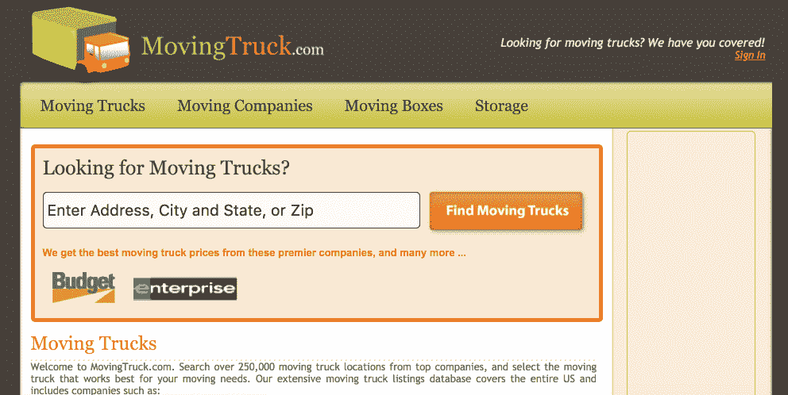
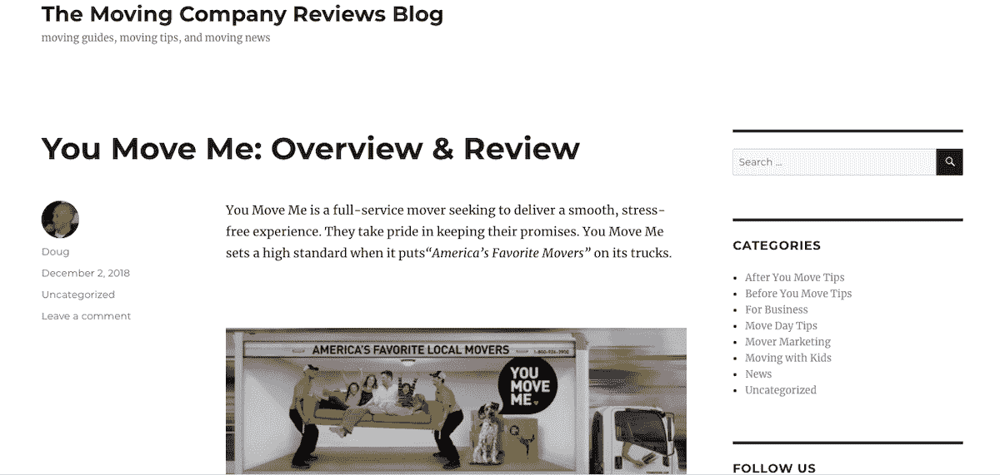

# 我的旁门左道从繁荣到萧条再到繁荣(希望如此)

> 原文：<https://www.indiehackers.com/interview/my-side-hustle-s-journey-from-boom-to-bust-to-hopefully-boom-again-0b7ba2869f>

## 你好！你的背景是什么，你在做什么？

嘿，我的名字是道格·布雷克，我拥有 MovingCompanyReviews.com。我的[了不起的妻子](https://www.movingcompanyreviews.com/about)，公司的首席执行官，实际上管理着日常业务，因为我作为[Scripted.com](https://www.scripted.com/)的首席执行官的角色让我相当忙碌。在业余时间，我尽可能地帮助解决产品和技术方面的问题。我们的目标是让 movingcompanyreviews.com 获得和过去一样多甚至更多的现金，这样它就能像一个繁荣的独立企业一样自立。

我的职业生涯始于在 Telution(现在是 CSG 的 T6 公司)从一名顾问变成了一名开发人员，这些年来，我通过自己的方式经营了几家在线企业。在 Telution 之后，我在 [Orbitz](https://www.orbitz.com/) (旅游网站，不是见不得人的搬家网站)做产品工作，然后在 [HomeFinder](https://homefinder.com/) 担任产品和营销副总裁，在那里我花了七年时间，一路晋升到首席执行官。在那之后，我在去 Scripted 之前，担任了两年地球类邮件的首席执行官。

MovingCompanyReviews.com 给人们提供了最值得信赖、最透明的方式来寻找伟大的推动者。搬家会让我们最棒的人感到沮丧和压力，我们会让它变得不那么沮丧。我们尽可能向用户展示每一个可能的搬运者的一切——许可、图片和 100%人工验证的评论(离开评论的人必须上传他们的搬运收据)。我们的使命是将人们与最好的搬家公司联系起来，并促进低压力、快乐的搬家。

我们目前的月收入约为 7，000 美元，低于四年前的 4.5 万美元。震惊吧。虽然我希望每个月仍有 4.5 万美元的收入，但 MovingCompanyReviews.com 的故事有点像过山车。我将尽最大努力规划我们的发展轨迹，并解释收入如何从 45K 美元/月下降到 7K 美元，以及我们将如何恢复增长并超过这一水平。

 

## 是什么促使你开始接触 MovingCompanyReviews.com？

三个随机事件凑在一起说服我推出 MovingCompanyReviews.com。

**随机事件# 1:MovingTruck.com**

MovingCompanyReviews.com 于 2012 年推出，但这个想法是在 2009 年出现在我脑海中的。我从 2005 年到 2009 年在 Orbitz 工作，然后加入 HomeFinder 担任产品副总裁。增长的搜索引擎优化流量被列为当年 HomeFinder 的最高产品优先级，所以当我开始时，我检查了我们拥有的域名。

也就是说，我想知道我们是否拥有成熟的搜索引擎优化驱动的流量网站。进入:[MovingTruck.com](http://movingtruck.com)。

我们编制了一个简单的目录，包括搬家卡车的位置、仓库的位置、搬运工和移动箱子的位置。用来自拥有我们的大约 130 家报纸的链接来点缀一点 SEO 之爱，很快！我们看着来自 AdSense 和代销商佣金的月收入达到 100 美元 10K，然后坐下来享受 2009 年的 SEO。:)

 

**随机事件#2:一家待售公司(以及一个被互联网遗忘的行业)**

在推出 MovingTruck.com 后不久，一项收购移动领域领先公司的潜在交易摆在了我们的面前。这家待售公司每年向约 1000 家搬家公司出售搬家线索，获利约 1000 万美元。他们的流量来自合作伙伴网站(如 MovingTruck.com)和他们自己的搜索引擎优化网站。

我分析了我们的机会，我想到了两件事:

1.  哇！1000 个搬运工每年能赚 1000 万美元？谁知道呢？
2.  天哪，消费者对搬家公司的搜索在互联网的黑暗时代仍然存在。比如 1998 年的网络黑暗时代。

没有 Orbitz、HomeFinder、[、Zillow](https://www.zillow.com/) 、Cars.com 或任何消费者友好的搜索网站来寻找搬家公司。在网上获取搬家报价意味着盲目地放弃你的信息，然后被搬家公司不停地打电话和发邮件给你(例如，见我在 Orbitz 搬家上的[案例研究](https://blog.movingcompanyreviews.com/orbitzmoving-com-what-happened-to-it-history-and-overview/))。获得报价的整个过程很糟糕，对评估搬家公司的质量或找出可疑公司毫无帮助。恶心。

**随机事件#3:猫王回到大楼**

我们的首席执行官(也是我亲爱的朋友)决定离开我作为产品副总裁的一年半任期，幸运的是，我们的董事会任命我为下一任首席执行官。我们的前首席执行官的新工作并不顺利，大约一年后，他发现自己有了一些空闲时间。与此同时，MovingTruck.com 继续泵入$ 10K/月，每次访问的收入超过 50 美分。看到在这个领域有更大发展的机会，我说服这位前首席执行官作为顾问加入我们。他开始研究推出一个消费者友好的搜索网站来寻找搬家公司是否有意义。

在你建立任何东西之前，建立一个观众群并测试*。*

TweetShare

**接下来发生了什么**

我们花了大约三个月的时间研究这个想法，并得出结论，消费者应该有一个更值得信赖、压力更小的方式来寻找搬家公司。我们想向消费者展示所有的搬家公司，向他们展示搬家公司的照片，向他们展示保险和许可信息，让消费者阅读 100%经过验证的评论，并让他们了解一个停滞在黑暗时代的过程。我们向 HomeFinder 董事会提出了这个想法，他们批准了一个由 5-8 人组成的团队去实现它。他们批准收购一家小公司来加速我们的上市。我们收购了 MoversReviewed.com，后者煞费苦心地建立了一个美国所有搬家公司的数据库，并以此为基础，我们在 2012 年春天推出了 MovingCompanyReviews.com。

## 构建最初的产品需要什么？

从董事会批准到发布，我们和两名开发人员、一名设计师和一名专注于产品的总经理一起花了大约四个月的时间。购买搬家公司的评论给了我们开始的数据(大约 12，000 家美国搬家公司的电子表格，每个公司都有大量的信息)，从那里我们开发了一个 Ruby on Rails 应用程序，加入了一些 SOLR，使搜索速度更快。第一次发布时，我们将范围限制在几件事情上:

1.  给消费者一个很好的搜索体验，并建立网站来吸引谷歌的搜索引擎优化的眼光
2.  让搬运工登录并添加信息到他们的帐户
3.  让消费者创建一个账户，并跟踪他们的行动

事实证明，在 HomeFinder 中创建一个独立的团队是快速启动和迭代的关键。如果我们把它当作一个副业项目，我怀疑我们永远不会启动。保持应用程序的简单和使用通用框架加快了开发速度，并使持续的维护和改进变得容易。具体来说，我们选择了以下内容:

*   应用框架的 Rails
*   Rails 中的用户管理设计
*   SOLR 让我们的搜索更快
*   我们数据库的 Postgres
*   Heroku 主持
*   用于文件上传和管理的文件堆栈

对我们的技术选择保持“无聊”让我们有自由专注于获得客户反馈和构建他们的价值观。

## 你是如何吸引用户和发展 MovingCompanyReviews.com 的？

我们最初的用户增长非常容易。利用我们的报纸所有者给了我们难以置信的优势。HomeFinder 的所有者——[Gannett](https://www.gannett.com/)(大约 80 家报纸) [McClatchy](https://www.mcclatchy.com/) (大约 30 家报纸)和[论坛报公司](http://www.tribunemedia.com/)(大约 15 家报纸)给了我们一个巨大的平台，从这个平台上我们可以获得流量和有价值的 SEO 链接。我们将每份报纸的房地产页面链接到 MovingCompanyReviews.com 相应的城市页面，看着我们的流量在一年多的时间里从零飙升到超过 10 万次/月。其中绝大部分是通过 SEO 获得的。我们的城市页面(例如[芝加哥搬家公司](https://www.MovingCompanyReviews.com/IL/Chicago)、[斯科茨代尔搬家公司](https://www.MovingCompanyReviews.com/AZ/Scottsdale)和[巴尔的摩搬家公司](https://www.MovingCompanyReviews.com/MD/Baltimore))在谷歌上搜索“芝加哥搬家公司”这样的词语时，在一些疯狂的事情上排名前三，比如前 50 个市场中的 20 个。啊，辉煌的日子。这就是像《芝加哥论坛报》、《洛杉矶时报》和《迈阿密先驱报》这样的网站会做的很棒的向内链接。我们也在 HomeFinder 上大力推广 MovingCompanyReviews.com，这为我们带来了一些流量，并为一些来自 Apartments.com 的流量付费。

搜索引擎优化流量非常，非常，非常好。

付费流量就没那么好用了。我们在那里挣的从来不比花的多。我们测试了 AdWords，但从未将指针移动到超过一个略微有利的位置，也从未能在每次点击的基础上出价足够多以获得重要的流量。

我们花了大量的时间和房地产经纪人谈论在他们的网站上推广 MovingCompanyReviews.com，但是没有什么结果。我们在一些网站上找到了位置，但还不足以改变现状。

我们驱动用户的最后一个方法过去是，现在也是，给他们提供一个很棒的移动体验，让他们回来再次使用我们。我们认为我们在那里做得不错，但我们还可以做得更多。

如果我不得不从头开始，我会从一个更强大、更经得起未来考验的 SEO 流量策略开始。

TweetShare

不幸的是，搜索引擎优化的乐趣和流量没有持续。为什么？我们失去了与报纸的联系。

2015 年夏天我离开 HomeFinder 后，我们的董事会决定出售公司，最终将 HomeFinder 卖给了 [Placester](https://placester.com/) 。普莱斯特接管后，我听到传言说他们想关闭 MovingCompanyReviews.com 或卖掉它。

我碰了碰运气，向他们伸出手，看看能不能买到。我们达成了一项协议，2016 年夏天，我自豪地成为了 MovingCompanyReviews.com 的主人。对我们来说不幸的是，一旦我们不再是这个家庭的一部分，所有这些来自报纸的伟大的链接都消失了。Placester 卖掉了 HomeFinder 网站，并将所有的报纸房地产页面转换到他们的平台上。随着每一页的转换，我们的链接消失了。

谷歌不会善待一个失去大量超高质量链接的网站，所以随着这些链接的消失，我们的 SEO 流量也随之消失。虽然这肯定是一个令人失望的结果，但请记住，SEO 流量来自两个关键因素:伟大的内容(我们已经得到了)和伟大的入站链接(我们需要再次建立)。

## 你的商业模式是什么，你是如何增加收入的？

我们以一种非常简单的方式赚钱——搬家公司付钱给我们，让我们向搬家的消费者“推荐”他们。我们每次这么做他们都会付钱给我们。我们确保在整个过程中将控制权掌握在消费者手中，这样他们就不会觉得自己被扔进了狼群。在任何时候，消费者都可以看到哪些搬家公司会联系他们，包括他们的星级等。，并选择哪些公司会或不会与他们联系。

建立最小可能来解决最大的问题，你的利基将支付。

TweetShare

我们尝试了几种不同的方式，目标是不通过向搬家公司收取线索费来赚钱。然而，我们最终采用了这种商业模式，主要有两个原因:我们尝试的所有其他模式都不起作用，向搬家公司收取线索费给了消费者最好的体验。

最后一点可能听起来很奇怪，但确实有效。当搬家公司预先把真金白银投入到这个过程中时，往往会培养一种有意为之的感觉。他们想要投资回报，所以他们反应更快，也更关心。我们仍然确保消费者在整个过程中获得充分的透明度和控制权，因此对每条线索收取搬家费给了我们两全其美的好处。

在采用该模型之前，我们尝试了以下方法:

*   AdSense 和横幅广告收入——我们在这里赚了一些钱，但大部分来自我们不想与之合作的可疑网站
*   网站范围内的赞助——康卡斯特在早期买了一大笔赞助，但是他们想要一堆让我们自我感觉不太好的潜在客户整合
*   来自有线电视、安全和公用事业公司的附属资金——我们在这方面从来没有多赚一点，它把我们推向了我们不想去的方向
*   将消费者介绍给房地产代理商，并分享佣金——我们对此进行了测试，但这一数量并不值得我们付出努力
*   与一个“移动保险”网站合作交叉销售移动保险——这开始很好，但后来他们倒闭了，没有其他替代方案存在

在完成所有这些工作后，我们决定让搬运工付费，让我们向消费者推荐它们。我们仔细审查签约的搬家公司，以确保我们推荐的是优质公司。这使我们能够为消费者提供良好的搬迁前体验，并建立一个忠诚的客户群，他们会推荐我们的网站，并在未来的搬迁中再次光顾。

在我们流量最大的时候，我们每个月能赚 45000 美元。随着我们从报纸上的链接消失，谷歌在首页上放了更多付费广告和本地特色，我们的流量下降了，现在我们每月的流量下降到 7K 美元。我们正在努力建立新的高质量链接，通过提供优秀的内容，如我们关于给搬运工多少小费的指南，我们对 T2 家得宝搬运箱的评论，以及通过我们的房地产经纪人“推荐搬运工”页面等有益的新功能(如 T4 的洛里·纽舍尔的推荐搬运工)。

 

## 你未来的目标是什么？

我们有两个简单的目标:

1.  增加流量和收入，这样 MovingCompanyReviews.com 就可以在需要的时候支持我们的家庭，或者至少为我们的孩子提供一些大学基金
2.  继续努力让消费者减少搬家的压力

为了增加流量，我们需要不断改善用户体验和对消费者的价值，以便他们使用和推荐网站，并不断创造内容(评论、文章、页面等)。)值得链接，并努力建立高质量的内容链接。

说起来容易做起来难，但这就是计划。

## 你面临的最大挑战和克服的障碍是什么？如果你必须重新开始，你会做什么不同的事？

很棒的问题！说服 HomeFinder 董事会为该项目提供资金是一个很高的初始障碍。我们面临的最大挑战是以可扩展的方式建立 SEO 流量。Google SEO 流量充当怪兽，掌握增长 SEO 流量的艺术不断考验我们的技能。

如果我不得不从头开始，我会从一个更强大、更经得起未来考验的 SEO 流量策略开始。我们依赖于报纸，但从来没有在不受谷歌更新或报纸链接消失影响的交通策略中烤熟过。

## 对于刚刚起步的独立黑客，你有什么建议？

我告诉刚开始创业/兼职旅程的人一些可以极大改变他们结果的事情。

在你建立任何东西之前，建立一个观众群并测试*。我怎么强调这一点都不为过。我在各种兼职中犯了大概 10 次这样的错误(比如 PickleOfTheMonth.com、AccentTraining.net 和其他一些我在需求测试前建立和发布的网站)。作为一名开发者，我的第一反应是建造、建造、建造！这是最糟糕的开始。从理解你的观众的痛苦开始，然后创造内容和解决方案。对此，我经常推荐以下资源:*

*   艾米·霍伊的作品和 300x50 的课程
*   [4 小时工作周](https://fourhourworkweek.com/)中的市场测试框架
*   我在地球课堂邮件上写的一些关于如何测试一个想法的博客文章
*   关于如何在利基市场建立 SEO 流量的[权威黑客](https://www.authorityhacker.com)课程
*   Brian Dean 所有关于 [Backlinko](https://backlinko.com/) 的文章和他的 SEOThatWorks 课程一旦你开始认真考虑在利基市场建立一个 SEO 流量怪兽

开始！阅读上面所有的免费内容，研究和测试想法只需要很少的钱，不需要很多时间。创建一个博客，创造内容和链接来吸引读者需要努力，而不是金钱。

一旦你有了听众和一些积极的需求测试，*然后*才开始构建。尽可能少地解决你的利基市场将支付的最大问题(Basecamp 的[变得真实](https://basecamp.com/books/getting-real)是关于这个主题的很好的读物)。

## 我们可以去哪里了解更多？

我们的网站是[MovingCompanyReviews.com](https://www.movingcompanyreviews.com)，我们的推特是 [@MCRforMovers](https://twitter.com/MCRforMovers) 。你可以在推特上个人关注我 [@dbreaker](https://twitter.com/dbreaker) 。我还写了一些关于我的另一个行当[SQLBot.co](https://www.sqlbot.co)的博客，这是我创建的一个小服务，让 SQL 报告变得轻松，电子邮件变得非常容易。如果你超级无聊，想看看我之前尝试推出的副业(都失败了)，你可以在我的个人博客[NancesKitchen.com](https://nanceskitchen.com)上阅读血淋淋的历史。PickleOfThemMonth.com 和 T21 的故事应该会让你发笑。

如果你很快就要搬家，一定要在 MovingCompanyReviews.com 得到一些报价。我很乐意在评论中听到任何反馈或回答任何问题。谢谢你让我面试！

——[<picture id="ember8067268" class="user-avatar ember-view user-link__avatar"></picture>道格·布雷克](/dbreaker?id=jsfbp4XP8whioWWQeJonrS04jZG2)，MovingCompanyReviews.com 的创始人

## 想像 MovingCompanyReviews.com 一样建立自己的事业吗？

你应该加入[独立黑客社区](/)！🤗

我们是几千名创始人，互相帮助建立有利可图的业务和副业。来分享你正在做的事情，并从你的同事那里获得反馈。

还没准备好开始使用你的产品吗？没问题。这个社区是一个认识人、学习和实践的好地方。随便去[随便浏览](/)！

——[<picture id="ember8067273" class="user-avatar ember-view user-link__avatar"></picture>考特兰艾伦](/csallen?id=ibTLPyjwVebnZjMGKvz6ztarnuV2)，独立黑客创始人

33votes