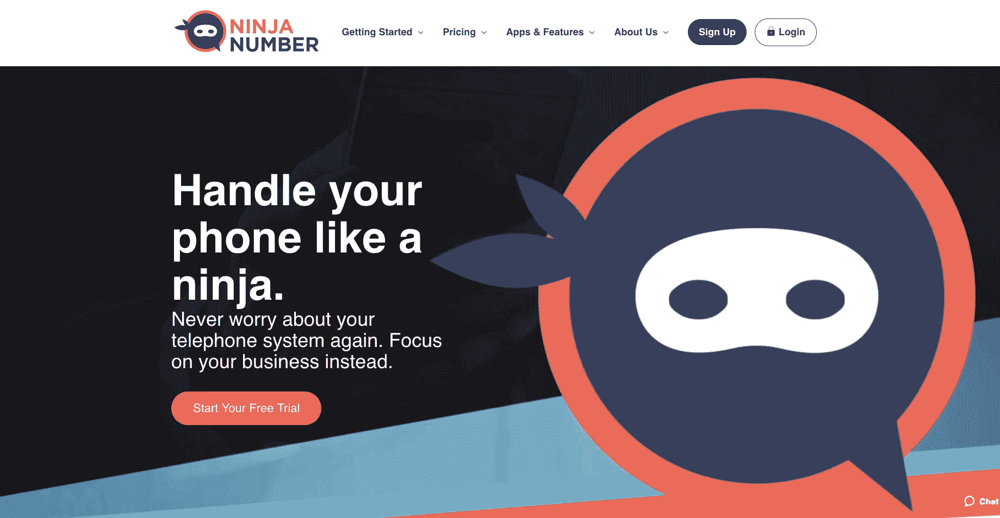
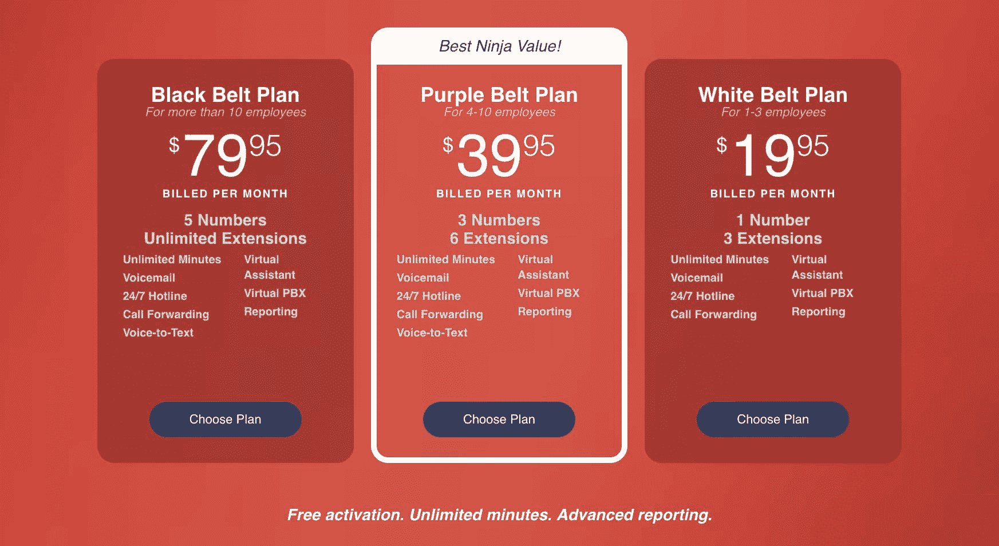

# 驾驭发展虚拟电话系统的挑战

> 原文：<https://www.indiehackers.com/interview/navigating-the-challenges-of-growing-a-virtual-phone-system-844c0f8db1>

## 你好！你的背景是什么，你在做什么？

我是 Jennifer Bailey，是 CirraVox 公司的营销经理，该公司开发了忍者号码，这是为企业家和小企业设计的最简单的虚拟电话系统。我们的电话系统有 5 个不同的应用程序供您使用:语音邮件、呼叫转移、24/7 热线消息、虚拟助理和多个分机。我们刚刚推出这款产品，但我们的技术是基于我们的母公司 VoiceNation 和传统产品 NextPBX 多年的研究。

我们设计的忍者号码易于使用，透明，可靠，所以你不必考虑你的电话系统。你可以继续发展你的业务，永远不用担心客户找不到你。

 

## 是什么激励你开始玩忍者号？

VoiceNation 自 2002 年以来一直存在，通过 VoiceNation 开发的虚拟电话系统 NextPBX 自 2017 年以来一直提供虚拟电话服务。多年来，NextPBX 收到了大量的客户反馈，我们发现人们将该产品描述为精确、可靠和一致。但是，它就像外面的许多语音系统一样，太复杂了——选项太多，需要定制的功能太多，太多人感到困惑。

我们决定打破电话系统的模式。我们将简化我们的产品，专注于做我们的客户最想要的事情，并把它做好。我们希望产品易于使用、透明可靠。

这就是忍者出现的原因。我们发现，我们寻找的所有这些特征在忍者身上都存在。我们的产品在后台工作，忠诚可靠，但功能强大，就像一个忍者。我们的产品发展如此之快，以至于我们决定将产品名称从 NextPBX 改为[忍者号](https://ninjanumber.com/)。

## 构建最初的产品需要什么？

我们花了大约 3 个月的时间来构思我们想要做的事情，然后又花了 3 个月来进行实际的编码。我们有三个开发人员同时负责后端和前端。我们用 PHP 编程，它与我们作为 NextPBX 的一部分运行的遗留语音平台交互。我们使用 jQuery 进行前端开发。

就资金而言，我们很幸运，因为我们现有的 NextPBX 客户群带来了收入。所以我们是自费的。

了解不断变化的技术趋势，并将其转化为你的优势。

TweetShare

我们必须做的部分计划是找出从我们拥有的众多产品中削减什么；例如，我们必须决定人们是否真的想控制他们的电话在语音信箱被接听前响铃的次数。你可能会认为这会使我们的工作更容易，但是我们的首席执行官 Jay Reeder 要求我们把界面做得非常简单。他提出了一个对话界面聊天机器人的想法，以指导客户完成定制过程。所以我们有一些额外的编码要做。我认为这是我们产品的独特之处。没有表单字段、下拉菜单或提交按钮。你只需回答几个问题，剩下的由我们的系统来完成。

## 你们是如何吸引用户，壮大忍者号的？

我们在 3 月 22 日进行了一次试运行，并在所有设备上进行了测试(踢了踢轮胎，检查了断开的链接，确保我们的注册表格有效)，并于 3 月 30 日正式推出。随着谷歌找到我们的网站，我们开始增加一些有机链接，流量稳步增长。我们的客户是企业家和小企业主，他们目前正在使用手机作为公司的电话。我们希望让他们做生意更容易，而不必担心错过客户的电话。

至于扩大我们的用户群，由于 VoiceNation，我们已经获得了一些流量，这对我们来说是一个很大的推介。当然，我们也在为 SEO 优化我们的网站。我们正在寻找一些在线广告机会，包括脸书和点击付费广告。我们也非常重视品牌知名度。我们对人们来说是陌生的；他们不知道我们的忍者品牌，我们需要向他们介绍这个品牌，让他们熟悉这个品牌，让他们把它等同于简单和可靠。我们希望利用影响者营销来帮助我们获得可信度和认知度。

## 你的商业模式是什么，你是如何增加收入的？

当有人注册我们的服务时，我们就赚钱了。我们是独一无二的，因为我们提供 7 天免费试用，没有义务，也不需要信用卡。我们有三种套餐，起价为每月 19.95 美元，这取决于您想要多少号码或分机。我们是 SaaS，所以人们可以随时取消，我们一直专注于客户满意度。我们建立了一个包含 100 多个问题的知识库，以及一个由两位支持专家处理的支持票证系统。

由于我们是全新的，我们仍在等待销售数字，但我们希望今年能获得 100 万美元的收入。

 

## 你未来的目标是什么？

我们计划增加更多的功能，包括文本到语音，这将允许你为你的电话信息输入问候，并将其转换成几种语言的专业声音。我们正在开发短信功能，这将允许你的语音邮件发送给你，并允许你通过短信回复客户。我们还将推出一款手机应用，让你可以在桌面版上做任何你能做的事情。

但是我们不想经历产品膨胀。我们还是希望[忍者号](https://ninjanumber.com/)简单高效。其他产品可能有更多的功能，但我们发现人们只需要基本的功能，这就是我们承诺提供的。我们将致力于让用户体验变得简单，让系统尽可能可靠。

## 你面临的最大挑战和克服的障碍是什么？如果你必须重新开始，你会做什么不同的事？

我认为所有开发团队都会遇到两个主要障碍:试图确定需要完成的任务和子任务(并以正确的顺序完成它们)，以及试图在太短的时间内做太多的事情。为了解决这个问题，我们雇佣了一个敏捷的 Scrum 大师来帮助我们保持正轨，并确保我们能够在指定的时间内交付产品、功能或 bug 修复。

另一个挑战是确保所有不同的系统可以相互通信，包括电话平台、计费系统、CRM，并且知道当对这些系统进行更改时，我们必须确保它不会中断我们正在做的任何事情。这涉及到大量的系统测试、集成测试和单元测试。

我们想做的一件事是利用开源。除了基于 LAMP 堆栈进行编程，我们还依赖于现有的开源平台，如 Kill Bill 和 SuiteCRM。

## 有没有发现什么特别有帮助或者有优势的？

品牌重塑很有趣。当杰伊提出忍者的概念时，我们知道我们有很多工作要做。忍者是敏捷的，隐形的，值得信赖的和有准备的，我们开发了一个风格指南，反映了我们的语气。我们忍者化了从内容到图像的一切。我们甚至给我们的忍者起名(Cirra)。我们认为，从长远来看，对忍者品牌和特质的认可将有助于我们。

尽可能利用开源。有一个伟大的开发人员社区为软件做出贡献，你不能击败成本。

TweetShare

我们也很幸运有一个伟大的开发团队，他们努力工作，想要创造一个高质量的产品。正如我之前提到的，我们对它进行了彻底的测试，开发人员努力修复任何错误。我们工作了几个月，以确保第一次迭代的[忍者号](https://ninjanumber.com/)尽可能稳定可靠。

## 对于刚刚起步的独立黑客，你有什么建议？

了解不断变化的技术趋势，并将其转化为你的优势。不要试图重新发明轮子。尽量做的更好更好用就行了。这就是我们试图用忍者号做的事情。

另一条建议是尽可能利用开源。有一个伟大的开发人员社区为软件做出贡献，你不能击败成本。

## 我们可以去哪里了解更多？

请访问我们的[忍者号](https://ninjanumber.com)。您也可以在评论中向我们提问，我们将很乐意回答您的问题！

——[<picture id="ember8045255" class="user-avatar ember-view user-link__avatar"></picture>詹妮弗·贝利](/Ninja_Number?id=xHeQuRPyq4OehJLLShidQludjIF2)【忍者号】市场部经理

## 想像忍者号一样自己创业？

你应该加入[独立黑客社区](/)！🤗

我们是几千名创始人，互相帮助建立有利可图的业务和副业。来分享你正在做的事情，并从你的同事那里获得反馈。

还没准备好开始使用你的产品吗？没问题。这个社区是一个认识人、学习和实践的好地方。随意[随便浏览](/)！

—[<picture id="ember8045260" class="user-avatar ember-view user-link__avatar"></picture>考特兰艾伦](/csallen?id=ibTLPyjwVebnZjMGKvz6ztarnuV2)，独立黑客创始人

6votes