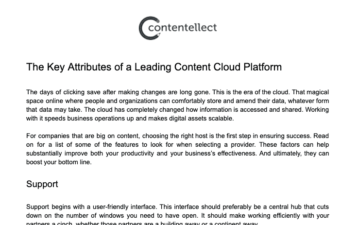

# 没有代码。很多竞争对手。以下是我如何仍然每月赚 1 万美元的方法。

> 原文：<https://www.indiehackers.com/interview/no-code-many-competitors-heres-how-i-still-make-10k-mo-42a0fba013>

## 你好！你的背景是什么，你在做什么？

我是 Marc Bromhall，我的背景是广告技术(AdTech)和营销技术(MarTech)。因为这些行业类别相对较新，所以我的大部分工作经历都是在创业公司。

我是 Contentellect 的联合创始人。我们帮助中小型企业(SMB)扩展其内容。我们通过为客户撰写高质量的博客来做到这一点。我们的客户意识到内容营销的价值，但在大多数情况下缺乏内部资源或时间来执行它。我们目前平均 10K/MRR。

我们撰写的内容在三个方面帮助了我们的客户:

*   通过搜索引擎提高他们的有机流量
*   使他们能够进行思想领导
*   为他们的销售和营销团队提供相关内容，他们可以在营销漏斗的顶部和中部使用这些内容

## 是什么促使你开始使用 Contentellect？

我和我的联合创始人都有涵盖内容营销不同方面的背景。我的 AdTech/MarTech 背景告诉我，当涉及到付费内容分发时，什么是伟大的内容。我的联合创始人有一个基于搜索引擎优化的内容网站建设的背景。因此，他知道从有机流量的角度来看，什么是伟大的内容。通过将这些经验整合在一起，我们能够在内容领域推出极具吸引力的综合服务。

当时，我们都是几个不同的脸书联盟营销集团的成员，这些集团是像我们这样的服务的忠实观众。最初，我们在这些小组中推销我们的作品，并看到了直接的兴趣。当时我在做自由职业广告技术咨询，所以随着对我们服务的需求增加，我能够相当容易地结束咨询。

## 构建最初的产品需要什么？

幸运的是，我们的 MVP 只需要很少的投资和技术专长。我们使用 [Thrive 主题](https://thrivethemes.com/)建立了一个 Wordpress 网站，然后整合了 [WooCommerce](https://woocommerce.com/) 。我们花了大约三个星期的时间才得到一种可以推向市场的精制产品。在此期间，我们仍在销售我们的内容服务，只是通过 PayPal 向客户发送发票。

我们一开始只有几个自由撰稿人，他们是从我的联合创始人的另一家公司带来的。因为他们是自由职业者，所以没有每月的经济负担。因此，我们的初始成本与我们的销售额相当。

一开始，我们提供内容写作和客座博文服务。客座博文服务包括为我们的客户在第三方网站上发布内容，从而帮助他们进行离页搜索引擎优化。这项服务最终被证明相对于利润率来说过于繁重，因此我们在 2019 年初取消了它。

在建立业务的最初阶段，我们最有价值的工具是谷歌套件和脸书，在那里我们参与小组活动，也开展小规模的、有高度针对性的广告活动。

## 你的技术是什么？

由于我和我的联合创始人都不是程序员，我们选择使用外行人容易理解的工具。我们目前使用 WordPress、WooCommerce 和 PayPal 进行网站内外的所有交易。

永远不要停止完善你的产品和价值主张。

TweetShare

我们有一个开发人员，他用 PHP 为 WooCommerce 开发了一些定制功能。我们目前正在使用 Laravel 更新我们的网站，这将包括集成 Stripe 和 PayPal，并改善整体用户界面和 UX。

## 你是如何吸引用户并发展 Contentellect 的？

我们在 2018 年 5 月推出，有三个客户和 2000 美元的 MRR。这些客户是通过脸书联盟营销集团以及电子邮件和 LinkedIn 外联获得的。我们在 2018 年 8 月保持了这一收入和客户水平。然后在 2018 年 9 月，我们通过将客户群扩大一倍，实现了收入翻番，达到 4000 美元。2018 年 10 月，我们在 MRR 将价格推至 8000 美元。有趣的是，我们的客户数量保持不变，但我们能够用新的、更高价值的客户取代流失的客户。

| 月 | 收入 |
| --- | --- |
| 2018 年 8 月 | 2000 |
| 18 年 9 月 | 4000 |
| 18 年 10 月 | 8000 |

在这个阶段，我们获取客户的主要渠道是脸书集团、脸书广告、通过 Hunter.io 的电子邮件推广和 LinkedIn 推广。我们也开始使用自由职业市场[legit](https://www.legiit.com/)，作为额外的收入渠道。

我们从早期客户获取过程中获得的主要经验如下:

*   有尽可能多的事情要做
*   倾听市场，并相应地调整和更新我们的产品
*   这是一个量的游戏。不管什么渠道，客户转换率总是很低。因此，一旦你确定了谁是你的目标客户，以及他们在网上的位置，就要大批量地追逐他们。
*   要有条不紊，坚决果断。销售推广可能是一个艰巨而重复的过程。制定一个成功的公式，每天坚持不懈地制定清晰的微观和宏观目标。

## 你的商业模式是什么，你是如何增加收入的？

我们对内容的收费是每个字 0.10 美元，所以一篇 1000 字的文章将花费 100 美元。然后，我们有两个不同的计划，一个是现收现付计划，客户可以购买特定的内容，另一个是每月博客文章计划，客户每月可以获得一定数量的博客文章。这是从基本服务开始提供的，在基本服务中，我们只编写内容，一直到完全托管的博客服务，包括内容策略、构思、内容日历创建以及通过客户内容管理软件发布博客文章。

到目前为止，我们只使用 PayPal 支付，但我们将在 2020 年 5 月底推出新网站时集成 Stripe。我们希望 Stripe 的引入能够提高用户的信任度，从而增加他们购买我们内容的倾向。我们的平均价格是 10，000 美元 MRR，每月差异很小。我们迄今为止最好的一个月是在 2019 年 5 月，当时我们达到了 16，000 美元！

我们花了大约四个月的时间从每月 8000 美元增加到这个数字，但只花了两个月就回到了 8000 美元。这是因为在更大的客户群中不够多样化。我们接触了一些核心客户。当他们在 5 月份增加了对我们的承诺时，这被证明是偶然的，但在此期间未能扩大我们的客户群意味着当这些主要客户恢复到正常订单规模时，我们的收入受到了相应的影响。

## 你未来的目标是什么？

在 2020 年 5 月底推出我们的新网站，提供更新的服务，包括更光滑、更流畅的用户界面和 UX，以及条纹支付。此外，我们所有的客户将能够在我们的网站上交易。目前，我们每月博客文章包的客户不能在我们的网站上购买该计划，而是直接从 PayPal 开具发票。

在接下来的几个月里，新冠肺炎当然会阻碍我们将新服务推向市场。我们要确保在新冠肺炎会议后正确安排我们的推广时间，以确保最大程度的兴趣。如果这意味着要推迟几个月，那就这样吧。到目前为止，随着我们品牌实力的增强，我们看到了集客销售水平的提高，这令人欣慰。

## 你面临的最大挑战和克服的障碍是什么？

一大挑战是处理客户流失。可能需要三到四个月的对话才能获得一个新客户，但他们可以在不到一个月的时间内离开。

幸运的是，我们只有三份全职的薪水要付，其余的员工都是自由职业者。这降低了由于客户流失而在任何给定月份出现亏损的风险。

## 如果你必须重新开始，你会做什么不同的事？

事后看来，如果我必须重新创业，在定义我们的服务产品、价值主张和目标客户群时，我会对自己更加苛刻。我认为尽可能缩小这些参数的范围非常重要。

当您认为您已经到达终点时，继续进一步完善，直到您有一个非常明确的服务产品，有一个明确的价值主张，准确地说出您的目标客户的需求。我也会更早开始大规模的销售推广。

## 有没有发现什么特别有帮助或者有优势的？

是的，很多事情！我发现最有用的工具是用于商业运作的谷歌套件，用于任务管理的 Trello，以及用于构建线框和电话会议的 Balsamiq。

我不喜欢使用太多的工具，因为我认为一个人可以很快达到饱和点，使用所有工具的时间超过了从单个工具中获得的生产力收益。

## 对于刚刚起步的独立黑客，你有什么建议？

永远不要停止完善你的产品和价值主张。行业、市场和社会都在发展。你的产品也必须发展，以跟上不断变化的需求模式。

制定一个成功的公式，每天坚持不懈地制定清晰的微观和宏观目标。

TweetShare

多关注业务的功能元素，少关注美观。我看到一些创始人被公司标志或品牌颜色的决策所束缚。这些东西在创业的早期阶段是无关紧要的，而且很可能在你的企业生命周期的某个时刻发生变化。更应该关注你的目标市场，花时间寻找最快的方法让他们获得 MVP。

## 我们可以去哪里了解更多？

您可以在我们的[网站](https://contentellect.com/)上找到更多关于 Contentellect 的信息。

请随时询问任何问题或在下面发表任何意见。

—[<picture id="ember5285036" class="user-avatar ember-view user-link__avatar"></picture>马克·布罗姆霍尔](/marcbrom2?id=65vKK7KIYqamBM2blWMb7oceWdi2)

## 想像 Contentellect 一样建立自己的事业？

你应该加入独立黑客社区！🤗

我们是几千名创始人，互相帮助建立有利可图的业务和副业。来分享你正在做的事情，并从你的同事那里获得反馈。

还没准备好开始使用你的产品吗？没问题。这个社区是一个认识人、学习和实践的好地方。随意[随便浏览](/)！

——[<picture id="ember5285041" class="user-avatar ember-view user-link__avatar"></picture>柯特兰艾伦](/csallen?id=ibTLPyjwVebnZjMGKvz6ztarnuV2)，独立黑客创始人

28votes